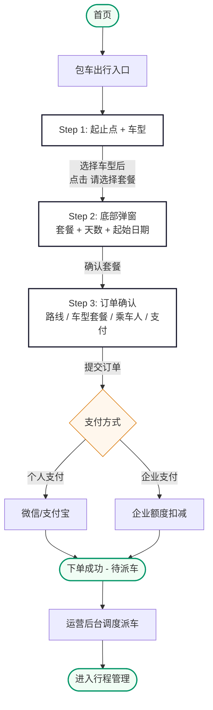
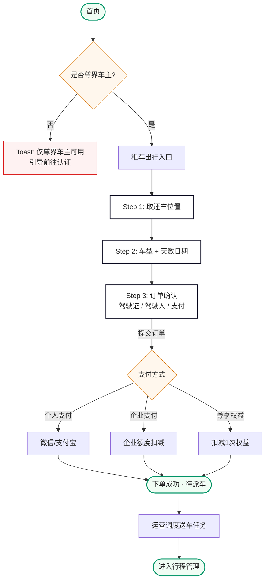
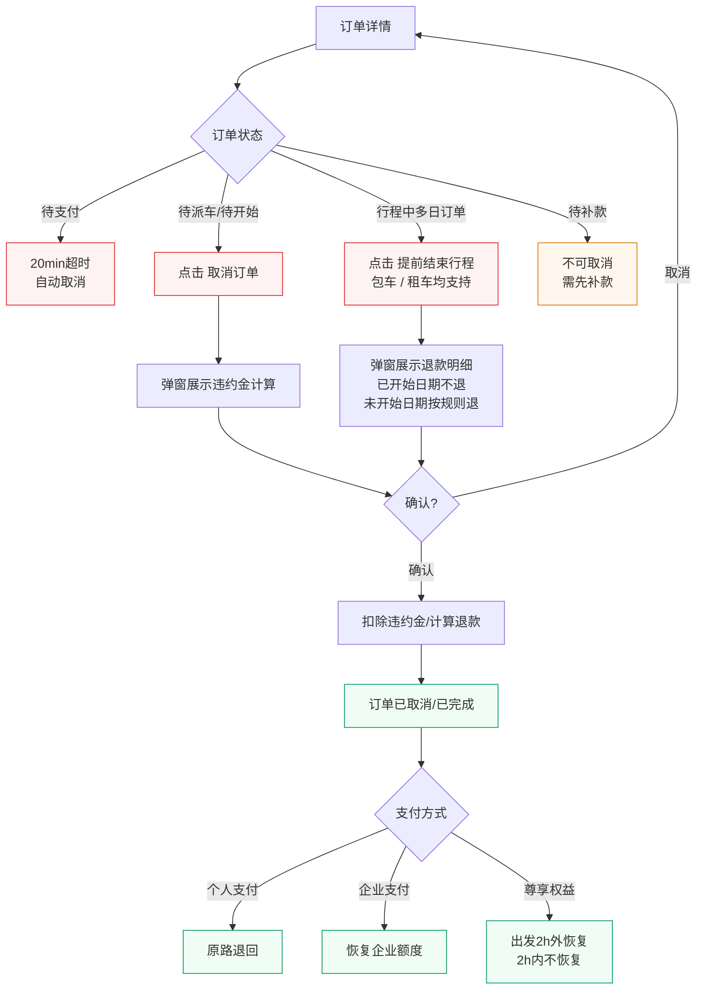

# 尊出行 · 乘客端需求规格说明（微信小程序）

> 版本：V1.0 | 日期：2026-06-03 | 状态：编写中

---

## 目录

**登录注册**

1. [注册登录](#1-注册登录)
2. [企业入驻](#2-企业入驻)

**服务 Tab**

3. [首页](#3-首页)
4. [包车出行](#4-包车出行)
5. [租车出行](#5-租车出行)

**我的 Tab**

6. [我的](#6-我的)
7. [行程管理](#7-行程管理)
8. [电子发票](#8-电子发票)
9. [企业管理](#9-企业管理)
10. [消息中心](#10-消息中心)
11. [联系客服](#11-联系客服)
12. [服务协议与隐私政策](#12-服务协议与隐私政策)


<a id="1-注册登录"></a>

## 1. 注册登录

### 业务说明

平台采用**短信验证码登录**方式，无需设置密码。用户输入手机号和短信验证码即可登录。若手机号未注册，系统自动完成注册并登录（初次登录即注册）。同时支持微信快捷登录，微信首次授权后绑定手机号即可。

验证码发送需接入**三番极验**行为验证（滑块/点选），防止机器批量请求。验证码频率限制：同一手机号 1 小时内最多 10 次，每日最多 15 次；同一 IP 每日最多 30 次。

登录时必须勾选同意《用户服务协议》和《隐私政策》，未勾选时底部弹出协议确认弹窗。

---

### 1.1 业务流程

```
┌─────────────────────────────────────────────┐
│              用户进入小程序                    │
│                  │                           │
│          ┌───────┴───────┐                   │
│          │  是否已登录？   │                   │
│          └───────┬───────┘                   │
│         是       │       否                   │
│          ▼       │        ▼                   │
│     进入首页      │   进入登录页               │
│                  │   ┌─────────────────┐     │
│                  │   │ 输入手机号        │     │
│                  │   │ 获取短信验证码    │     │
│                  │   │ → 极验行为验证    │     │
│                  │   │ 输入验证码        │     │
│                  │   │ 勾选协议          │     │
│                  │   └────────┬────────┘     │
│                  │            │              │
│                  │   ┌────────┴────────┐     │
│                  │   │ 查询手机号是否     │     │
│                  │   │   已注册？        │     │
│                  │   └───┬───────┬─────┘     │
│                  │   已注册    │  未注册       │
│                  │      │      │     │        │
│                  │      ▼      │     ▼        │
│                  │  ┌──────┐  │  ┌─────────┐ │
│                  │  │ 登录  │  │ 自动注册   │ │
│                  │  │ 成功  │  │ + 登录    │ │
│                  │  └──┬───┘  │  └────┬────┘ │
│                  │     │      │       │       │
│                  │     ▼      │       │       │
│                  │  ┌─────────┴───────┘       │
│                  │  │  存储登录态              │
│                  │  │  识别企业身份/尊界车主    │
│                  │  │  跳转首页                │
│                  │  └───────────────────────── │
└─────────────────────────────────────────────┘
```

---

### 1.2 验证码登录

#### 页面路径
`/pages/auth/login`

#### 字段定义

| 字段 | 必填 | 格式 | 长度 | 交互说明 | 提示 | 备注 |
|---|---|---|---|---|---|---|
| 手机号 | 是 | 中国大陆手机号 /^1[3-9]\d{9}$/ | 11 位 | 数字键盘输入；输入满 11 位自动失焦并校验格式；格式通过后"获取验证码"按钮变为可点击 | · 为空："请输入手机号码"<br>· 格式错误："请输入正确的手机号码" | — |
| 短信验证码 | 是 | 6 位纯数字 | 6 位 | 数字键盘输入；输入满 6 位自动失焦；获取前需通过极验行为验证 | · 为空："请输入短信验证码"<br>· 错误："验证码错误，请重新输入"<br>· 过期："验证码已失效，请重新获取" | 有效期 5 分钟，发送间隔 60 秒 |
| 协议勾选 | 是 | Boolean | — | 未勾选点击登录：底部弹出协议确认弹窗（见下方弹窗说明）；协议名称蓝色可点击，分别跳转 H5 协议页面 | 弹窗标题："请阅读并同意以下协议"<br>弹窗按钮："不同意" / "同意并继续" | — |

#### 协议确认弹窗

- 从页面**底部滑出**，半透明黑色遮罩背景覆盖整个页面
- 点击遮罩区域**可关闭弹窗**
- 《用户服务协议》和《隐私政策》蓝色可点击，分别跳转 H5 协议页面
- "同意并继续"：勾选协议框 + 执行登录请求
- "不同意"：关闭弹窗返回登录页

#### 验证码发送规则

**极验行为验证**

- 点击"获取验证码"前，弹出三番极验滑块/点选验证
- 验证通过后发送短信验证码
- 验证不通过：提示"验证未通过，请重试"，不发送短信

**频率限制**

| 限制维度 | 限制规则 | 超限提示 |
|---|---|---|
| 同一手机号 · 每小时 | 最多 10 次 | "发送过于频繁，请稍后再试" |
| 同一手机号 · 每天 | 最多 15 次 | "今日发送次数已达上限，请明天再试" |
| 同一 IP · 每天 | 最多 30 次 | "操作过于频繁，请明天再试" |

**获取验证码按钮状态**

| 状态 | 文案 | 样式 | 说明 |
|---|---|---|---|
| 手机号未填/格式错 | "获取验证码" | 灰色禁用 | 不可点击 |
| 可发送 | "获取验证码" | 主色 | 点击先触发极验 |
| 极验验证中 | 极验弹窗 | — | 滑块/点选验证 |
| 极验通过·发送中 | "发送中..." | 主色 + loading | 调短信接口 |
| 倒计时中 | "XXs 后重新获取" | 灰色 + 倒计时数字 | 60 秒倒计时 |
| 倒计时结束 | "重新获取" | 主色 | 可重新点击（仍需极验） |
| 频率超限 | "发送次数已达上限" | 灰色禁用 | — |

**验证码有效期**：5 分钟，过期后输入框下方红色提示"验证码已失效，请重新获取"。

**验证码发送间隔**：同一手机号两次获取之间至少间隔 60 秒。

#### 登录按钮

按钮文案为**"登录 / 注册"**，统一一个按钮。

| 状态 | 说明 |
|---|---|
| 禁用（默认） | 手机号为空或格式错误、验证码为空、协议未勾选 → 灰色不可点击 |
| 可点击 | 全部校验通过 → 主色高亮 |
| 提交中 | loading + "验证中..." |
| 已注册用户 | 验证码正确 → Toast "登录成功" → 跳转首页 |
| 未注册用户 | 验证码正确 → 后端自动注册 + 登录 → Toast "欢迎加入尊出行" → 跳转首页 |
| 验证码错误 | 恢复正常 + Toast "验证码错误，请重新输入" |

#### 登录成功后续

1. 存储登录态到本地（7 天有效期）
2. 调用微信 `getUserProfile` 获取头像昵称（用户可拒绝，不影响使用）
3. 后端异步检测是否为尊界车主 → 前端识别后展示"尊享权益"入口
4. 后端检测是否已被企业管理员添加为员工 → 自动关联企业身份
5. 跳转首页

---

### 1.3 微信快捷登录

#### 页面路径
登录页 `/pages/auth/login` 内嵌按钮

#### 流程

```
登录页点击"微信快捷登录"
    │
    ▼
调用 wx.login() 获取微信临时 code
    │
    ▼
后端用 code 换取微信 openid / unionid
    │
    ├── 已绑定手机号 → 直接登录成功 → 跳转首页
    │
    └── 未绑定手机号 → 跳转手机号绑定页
                        │
                        ├── 该手机号已注册 → 绑定微信 → 登录成功
                        └── 该手机号未注册 → 自动注册 + 绑定 → 登录成功
```

**微信快捷登录按钮**：绿色微信图标 + "微信快捷登录" 文字，居中显示在登录页底部。点击后调用微信授权，无需额外勾选协议（微信授权时已包含）。

---

### 1.4 登录态管理

| 项目 | 规则 |
|---|---|
| 登录态存储 | 微信小程序本地 Storage |
| 有效期 | 7 天 |
| 自动刷新 | 距过期不足 1 天时，每次进入首页主动调用刷新接口 |
| 过期处理 | token 过期后自动清除本地存储，跳转登录页，Toast "登录已过期，请重新登录" |
| 多端登录 | 支持同一账号在多台设备同时登录，互不影响 |
| 退出登录 | 我的 → 退出登录 → 清除本地 token → 跳转登录页 |

---

<a id="2-企业入驻"></a>

## 2. 企业入驻

### 业务说明

**企业入驻入口位于登录/注册页面**，由企业方自行申请，无需先注册个人账号。一个手机号同一时间仅能持有一份"审核中"或"已通过"的入驻申请。提交后由**尊出行运营后台**审核，审核通过后运营方为该企业开通账户并配置额度（额度仅在运营后台可见，不在小程序展示）。

申请人审核通过后即为该企业的管理员，可在**我的 → 企业管理**中查看企业信息、管理员工。员工被添加后，小程序自动关联企业身份。

---

### 2.1 业务流程

```
登录页 / 注册页 → 企业入驻
    │
    ▼
┌──────────────────────────┐
│  校验：手机号当前是否有     │
│  审核中/已通过的入驻？      │
└──────────┬───────────────┘
           │
   ┌───────┴────────┐
   有             无 / 仅有驳回
       │                │
       ▼                ▼
┌────────────┐  ┌──────────────┐
│ 跳转入驻状态 │  │  填写企业信息  │
│ 页查看进度   │  │ + 短信验证码  │
└────────────┘  │ + 勾选协议    │
                └──────┬───────┘
                       │
                       ▼
              ┌──────────────────┐
              │ 尊出行运营后台审核 │
              │ + 配置额度        │
              └─┬──────────┬─────┘
              通过        驳回
                │          │
                ▼          ▼
         ┌──────────┐ ┌─────────────┐
         │ 申请人    │ │ 状态显示驳回 │
         │ 自动成为  │ │ 修改后可重提 │
         │ 管理员    │ │（手机号可改）│
         │ 我的      │ └─────────────┘
         │ 企业管理  │
         │ 入口可见  │
         └──────────┘
```

---

### 2.2 入驻入口

#### 入口位置

**登录页底部**和**注册页底部**新增"企业入驻"链接：

```
┌─────────────────────────────┐
│     尊出行                   │
│     高端出行服务平台          │
│                             │
│  ┌─────────────────────┐   │
│  │ 请输入手机号         │   │
│  └─────────────────────┘   │
│                             │
│  ┌─────────────────────┐   │
│  │ 请输入密码      👁   │   │
│  └─────────────────────┘   │
│                             │
│  ☐ 我已阅读并同意            │
│    《用户服务协议》          │
│    《隐私政策》              │
│                             │
│  ┌─────────────────────┐   │
│  │      登  录          │   │
│  └─────────────────────┘   │
│                             │
│  微信快捷登录  ○            │
│                             │
│  还没有账号？去注册 >        │
│  忘记密码？                  │
│                             │
│  ───────  企业用户  ───────  │
│                             │
│  企业入驻 >                  │
└─────────────────────────────┘
```

#### 入口跳转规则

| 该手机号当前状态 | 跳转目标 |
|---|---|
| 从未申请过 | 入驻申请页 2.3 |
| 当前有审核中的申请 | 入驻状态页 2.4（审核中） |
| 当前有已通过的申请 | 入驻状态页 2.4（已通过） |
| 历史申请均为已驳回 | 入驻申请页 2.3（作为新申请） |

> 入口跳转判断需要先输入手机号 + 短信验证码完成身份核验，避免他人探测手机号是否申请过。具体核验在入驻申请页内完成（见 2.3 字段定义）。

---

### 2.3 入驻申请

#### 页面路径
`/pages/enterprise/apply`

#### 字段定义

| 字段 | 必填 | 格式 | 长度 | 交互说明 | 提示 | 备注 |
|---|---|---|---|---|---|---|
| 企业名称 | 是 | 中文/英文/数字，不含特殊符号 | 2-60 字 | 文本输入，失焦校验 | · 为空："请输入企业名称"<br>· 超长："企业名称不超过 60 个字"<br>· 含非法字符："企业名称包含不允许的字符" | 与营业执照上的企业名称保持一致 |
| 所在城市 | 是 | 从城市列表中选择 | — | 点击调起城市选择器；列表为**全国所有城市**（含直辖市/地级市），按拼音首字母分组，支持搜索；当前定位城市置顶 | · 未选："请选择所在城市" | 全国全量展示，是否可服务由后台审核环节判定 |
| 管理员姓名 | 是 | 中文，2-20 个汉字 | 2-20 字 | 文本输入 | · 为空："请输入管理员姓名"<br>· 格式错误："请输入正确的中文姓名" | — |
| 管理员手机号 | 是 | 中国大陆手机号 /^1[3-9]\d{9}$/ | 11 位 | 数字键盘输入；输入满 11 位失焦校验；满足格式后"获取验证码"按钮变为可点击 | · 为空："请输入管理员手机号"<br>· 格式错误："请输入正确的手机号码"<br>· 已申请："该手机号已申请企业入驻，请勿重复提交"（点击"查看进度"跳转 2.4 入驻状态页） | 一手机号同一时间仅可持有一份审核中/已通过的入驻；该手机号也是企业端 PC 后台登录账号 |
| 短信验证码 | 是 | 6 位纯数字 | 6 位 | 数字键盘输入；获取前需通过极验行为验证；与 1.3 注册共用频率限制配额 | · 为空："请输入短信验证码"<br>· 错误："验证码错误，请重新输入"<br>· 过期："验证码已失效，请重新获取" | 用于核验手机号本人；有效期 5 分钟，发送间隔 60 秒 |
| 管理员密码 | 是 | 6-20 位，必须包含字母和数字 | 6-20 位 | 密文显示，右侧眼睛图标切换；英文键盘输入；失焦时校验格式 | · 为空："请设置管理员密码"<br>· 格式错误："密码需 6-20 位，且包含字母和数字" | 用于企业端 PC 后台登录；可后续在企业端后台修改 |
| 协议勾选 | 是 | Boolean | — | 未勾选点击提交：底部弹出协议确认弹窗（同登录的协议弹窗交互，点击遮罩可关闭） | 弹窗标题："请阅读并同意以下协议"<br>协议名："《用户服务协议》《隐私政策》《企业用户注册协议》" | 点击协议名分别跳转 H5 协议页面 |

#### 提交按钮状态

| 状态 | 说明 |
|---|---|
| 禁用 | 任一必填项未填或格式错误、协议未勾选 → 灰色不可点击 |
| 可点击 | 全部校验通过 → 主色高亮 |
| 提交中 | loading + "提交中..." |
| 成功 | Toast "提交成功，请等待审核" + 跳转入驻状态页 2.4 |
| 失败 · 手机号已申请 | Toast "该手机号已申请企业入驻，请勿重复提交" + 提供"查看进度"按钮 |
| 失败 · 其他 | 恢复正常 + 具体错误 Toast |

---

### 2.4 入驻状态

#### 页面路径
`/pages/enterprise/apply-status`

#### 页面结构

**审核中**

```
┌─────────────────────────────┐
│         ← 返回              │
│     企业入驻                 │
│                             │
│         ⏳                  │
│      审核中                  │
│                             │
│   我们正在审核您的企业信息，  │
│   预计 1-3 个工作日内完成。  │
│                             │
│  ─────  申请信息  ─────     │
│   企业名称：安徽科技有限公司 │
│   所在城市：合肥             │
│   管理员姓名：王某某         │
│   管理员手机号：138****8888  │
│   提交时间：2026-06-01 10:30│
└─────────────────────────────┘
```

**审核通过**

```
┌─────────────────────────────┐
│         ← 返回              │
│     企业入驻                 │
│                             │
│         ✅                  │
│      审核通过                │
│                             │
│   恭喜！您的企业已成功入驻。  │
│                             │
│  ─────  申请信息  ─────     │
│   企业名称：安徽科技有限公司 │
│   所在城市：合肥             │
│   管理员姓名：王某某         │
│   管理员手机号：138****8888  │
│   通过时间：2026-06-03 14:20│
│                             │
│  ┌─────────────────────┐   │
│  │  立即登录            │   │
│  └─────────────────────┘   │
└─────────────────────────────┘
```

**审核驳回**

```
┌─────────────────────────────┐
│         ← 返回              │
│     企业入驻                 │
│                             │
│         ❌                  │
│      审核未通过              │
│                             │
│   驳回原因：                  │
│   ┌─────────────────────┐   │
│   │ 企业名称与实际不符，   │   │
│   │ 请核对后重新提交       │   │
│   └─────────────────────┘   │
│                             │
│  ─────  申请信息  ─────     │
│   企业名称：安徽科技有限公司 │
│   所在城市：合肥             │
│   管理员姓名：王某某         │
│   管理员手机号：138****8888  │
│   驳回时间：2026-06-03 09:00│
│                             │
│  ┌─────────────────────┐   │
│  │  修改后重新提交       │   │
│  └─────────────────────┘   │
└─────────────────────────────┘
```

#### 状态说明

| 状态 | 展示元素 | 用户操作 |
|---|---|---|
| 审核中 | ⏳ + 1-3 工作日提示 + 申请信息 | 仅可查看，不可编辑 |
| 已通过 | ✅ + 通过文案 + 申请信息 | 点击"立即登录"返回登录页用申请手机号登录 |
| 已驳回 | ❌ + 驳回原因 + 申请信息 | 点击"修改后重新提交"返回入驻申请页，原内容保留可编辑 |

#### 重新提交（驳回后）

- 仅"已驳回"状态可重新提交
- 跳转到入驻申请页，**保留原填写内容**全部可编辑
- **手机号可修改**（修改后需重新获取验证码核验）
- 重新提交后状态回到"审核中"，原驳回记录归档

---

### 2.5 通知

| 事件 | 通知方式 | 内容 |
|---|---|---|
| 入驻审核通过 | 短信 + 微信模板消息（如已登录小程序） | "您申请的【XX 企业】已通过入驻审核，请使用申请手机号登录小程序" |
| 入驻审核驳回 | 短信 + 微信模板消息 | "您申请的【XX 企业】未通过审核，原因：XX，请修改后重新提交" |

> 提交申请本身不发送短信通知。


<a id="3-首页"></a>

## 3. 首页

### 业务说明

首页是小程序登录后默认展示的**服务 Tab** 主页面。自上而下由三部分构成：顶部 Banner、两大用车场景入口、尊享权益区域。

运营后台可配置 Banner 活动图（暂无详细规则，后续补充）；两大入口为包车出行和租车出行，点击分别进入对应下单流程；尊享权益区域根据用户身份展示不同内容——尊界车主已认证则展示剩余次数、累计使用次数和权益标签说明，未认证则展示权益内容及"前往认证"按钮。非车主用户不展示此区域。

> 租车出行目前仅限尊界车主使用，非车主用户点击租车入口时提示"租车服务仅限尊界车主使用"并提供前往认证的引导。

---

---

### 3.2 Banner

| 项目 | 说明 |
|---|---|
| 展示形式 | 轮播图 |
| 数据来源 | 尊出行运营后台 → 系统配置 → Banner 管理，支持上传图片 + 配置跳转链接 + 排序 + 上下架 |
| 缺省行为 | 无有效 Banner 时此区域隐藏，两大入口整体上移 |
| 详细规则 | 待后续补充 |

---

### 3.3 用车场景入口

#### 布局

两大入口并列展示。

#### 入口定义

| 入口 | 标题 | 副标题 | 适用人群 |
|---|---|---|---|
| 包车出行 | 包车出行 | 4h / 8h 套餐 · 配司机 | 所有用户 |
| 租车出行 | 租车出行 | 自驾出行 · 日租 | 仅尊界车主 |

#### 入口点击行为

| 入口 | 非尊界车主点击 | 尊界车主点击 |
|---|---|---|
| 包车出行 | 进入包车出行下单流程 | 进入包车出行下单流程 |
| 租车出行 | Toast "租车服务仅限尊界车主使用"，底部提供"前往认证"链接 | 进入租车出行下单流程 |

#### 交互说明

- 四个入口始终可点，不限运营区域；区域限制在实际下单页进行校验
- 租车入口对非尊界车主弹出 Toast 提示，不移除入口（保留可见作为引导）
- 点击入口时卡片有缩放动效反馈

---

### 3.4 尊享权益

#### 业务说明

**尊享权益**，仅尊界车主可享有。系统通过对接华为接口完成车主身份认证，认证需提交姓名、身份证号、手机号。

认证通过华为接口直接调用匹配，无需人工处理。小程序端调用认证接口后实时返回结果并按认证状态展示不同内容。

#### 未认证

展示权益介绍内容，引导车主前往认证。

```
┌─────────────────────────────┐
│  ┌─────────────────────┐   │
│  │  尊享权益             │   │
│  │                      │   │
│  │  尊界车主专属权益      │   │
│  │                      │   │
│  │  · 每年免费出行次数   │   │
│  │  · 租车出行可用      │   │
│  │  · 专属车辆优先调度   │   │
│  │                      │   │
│  │  ┌─────────────────┐ │   │
│  │  │   前往认证 →     │ │   │
│  │  └─────────────────┘ │   │
│  └─────────────────────┘   │
└─────────────────────────────┘
```

点击"前往认证 →"进入车主认证页，认证需提交以下信息对接华为接口核验：

| 字段 | 必填 | 格式 | 长度 | 交互说明 | 提示 | 备注 |
|---|---|---|---|---|---|---|
| 姓名 | 是 | 中文 | 2-20 个字 | 文本输入 | · 为空："请输入姓名"<br>· 格式错误："请输入正确的中文姓名" | 需与华为车主档案姓名一致 |
| 身份证号 | 是 | 18 位公民身份证号 /^[1-9]\d{5}(18|19|20)\d{2}(0[1-9]|1[0-2])(0[1-9]|[12]\d|3[01])\d{3}[\dXx]$/ | 18 位 | 文本输入，输入满 18 位失焦校验；末位 X 自动转大写 | · 为空："请输入身份证号码"<br>· 格式错误："请输入正确的身份证号码"<br>· 核验失败："身份信息未匹配到尊界车主，请核对后重试" | 对接华为车主数据接口进行身份核验 |
| 手机号 | 是 | 中国大陆手机号 | 11 位 | 默认填充当前登录手机号，可修改 | · 为空："请输入手机号"<br>· 格式错误："请输入正确的手机号码"<br>· 核验失败："手机号未匹配到尊界车主档案" | 需与华为车主档案预留手机号一致 |

| 提交按钮状态 | 说明 |
|---|---|
| 禁用 | 任一必填项未填或格式错误 |
| 可点击 | 全部校验通过 |
| 提交中 | loading + "认证中..." |
| 成功 | Toast "认证成功，尊享权益已生效" → 返回首页刷新已认证状态 |
| 失败 | Toast 具体错误原因（信息不匹配等） |

#### 已认证

展示当前剩余次数、累计使用次数及权益标签。

```
┌─────────────────────────────┐
│  ┌─────────────────────┐   │
│  │  尊享权益             │   │
│  │                      │   │
│  │  剩余次数             │   │
│  │    3 次              │   │
│  │  累计使用 5 次        │   │
│  │                      │   │
│  │  ┌───────────────┐   │   │
│  │  │ 年度 3 次免费   │   │   │
│  │  │ 自然年自动重置  │   │   │
│  │  └───────────────┘   │   │
│  │  ┌───────────────┐   │   │
│  │  │ 租车出行可用   │   │   │
│  │  │ 尊界车主专享  │   │   │
│  │  └───────────────┘   │   │
│  │  ┌───────────────┐   │   │
│  │  │ 仅限本人使用   │   │   │
│  │  │ 不可转让他人   │   │   │
│  │  └───────────────┘   │   │
│  └─────────────────────┘   │
└─────────────────────────────┘
```

| 项目 | 说明 |
|---|---|
| 剩余次数 | 显著突出展示当前年度剩余可用次数；剩余为 0 时显示"已用完"且数字置灰 |
| 累计使用 | 位于剩余次数下方，展示当前年度累计使用次数（含已取消后恢复的） |
| 权益标签 | 2-4 个标签卡片，标题 + 简短说明；内容由运营后台"权益说明配置"维护 |
| 点击卡片 | 跳转权益详情页，展示权益说明、年度总次数、剩余使用次数、使用记录列表（订单 / 扣减时间 / 恢复记录） |


<a id="4-包车出行"></a>

## 4. 包车出行

### 业务说明

包车出行按天计费，配备司机。用户选择出发地和目的地后，横向滑动切换车型。点击"请选择套餐"底部弹出套餐、天数和起始日期的选择面板，确认后进入订单确认页。

每种车型提供三档套餐（尊享基础/尊荣高级/尊御顶级），每档套餐含半日租（4h/50km）和日租（8h/100km）两种。超时费统一 ¥100/小时，超公里费统一 ¥5/公里。最长可选择 30 天。

---

### 4.1 业务流程



---

### 4.2 Step 1：起止点 + 车型

#### 地址选择

点击出发地或目的地输入框，进入地址选择页。

地址选择页顶部为搜索框，下方展示（首次进入需微信授权位置权限，授权后可定位辅助，拒绝后仍可手动搜索）：

| 区域 | 内容 |
|---|---|
| 最近记录 | 用户最近使用的 5 条地址记录，点击即选中 |
| 搜索联想 | 输入关键词后展示地图 API 返回的地址联想列表 |

选中地址后返回 Step 1，填入对应输入框。

#### 起止点字段定义

| 字段 | 必填 | 格式 | 长度 | 交互说明 | 提示 | 备注 |
|---|---|---|---|---|---|---|
| 出发地 | 是 | 结构化地址（名称 + 经纬度 + POI ID） | 地址名称 ≤100 字 | 点击输入框进入地址选择页（最近记录 + 搜索联想） | · 为空："请选择出发地"<br>· 不在服务区："出发地不在当前服务区域，暂不支持下单" | — |
| 目的地 | 是 | 同出发地 | 同出发地 | 同出发地 | · 为空："请选择目的地"<br>· 与出发地相同："出发地和目的地不能相同" | — |

#### 车型选择

- 车型卡片横向滑动切换，当前选中车型居中高亮放大，两侧缩小半透明
- 默认选中增程星辉尊享版

| 车型 | 套餐 | 半日租（4h/50km） | 日租（8h/100km） |
|---|---|---|---|
| 增程星辉尊享版 | 尊享基础 | ¥988 | ¥1,888 |
| 增程星辉尊享版 | 尊荣高级 | ¥1,188 | ¥2,088 |
| 增程星辉尊享版 | 尊御顶级 | ¥1,588 | ¥2,688 |
| 增程星辉行政版 | 待定 | 待定 | 待定 |
| 增程星耀行政版 | 待定 | 待定 | 待定 |

> 所有车型超时费统一 ¥100/小时，超公里费统一 ¥5/公里。

下方"请选择套餐 >"按钮：起止点均已填写后变为可点击，否则置灰。

---

### 4.3 Step 2：底部弹窗 — 套餐 + 天数 + 日期

起止点选定、车型选中后，点击"请选择套餐 >" → 底部弹出选择面板。

#### 套餐选择

六张套餐卡片 3×2 布局（横向：半日/日租，纵向：基础/高级/顶级）。选中的卡片主色边框高亮。

#### 套餐权益标签

| 套餐 | 权益标签示例 |
|---|---|
| 尊享基础 | 🥤 免费饮用水 · 📱 车载 WiFi · 🧻 纸巾湿巾 |
| 尊荣高级 | 🥤 免费饮用水 · 📱 车载 WiFi · 🧻 纸巾湿巾 · 🍬 精致茶点 · 📰 报刊杂志 |
| 尊御顶级 | 🥤 免费饮用水 · 📱 车载 WiFi · 🧻 纸巾湿巾 · 🍬 精致茶点 · 📰 报刊杂志 · 🥂 香槟礼遇 · 💼 专属管家 |

切换套餐时下方权益标签区域同步更新。

#### 天数与日期

| 字段 | 必填 | 格式 | 交互说明 | 提示 | 备注 |
|---|---|---|---|---|---|
| 天数 | 是 | 整数 1-30 | 步进器（- / 数字 / +），默认 1 天 | · 最小 1<br>· 最大："最长可选择 30 天" | — |
| 起始日期 | 是 | YYYY-MM-DD | 点击调起日期选择器；默认今天；范围：今天起 30 天内 | · 过去日期置灰 | 提前 ≥2 小时（后台可配） |

#### 确认按钮

- 套餐 + 天数 + 日期均选择后，按钮变为可点击
- 点击"确认，查看订单"关闭弹窗，进入 Step 3 订单确认页

---

### 4.4 Step 3：订单确认

#### 费用明细

点击"明细 >"进入独立费用明细页。

| 费用项 | 展示规则 |
|---|---|
| 套餐价 | 单价 × 天数 |
| 夜间附加 | 出发时间在 0:00-5:00，套餐总价 ×20%，封顶 1000 元。每日子订单独立计算 |
| 远调费 | 待定 |
| 超时费 | ¥100/小时，行程结束后按实际超时结算 |
| 超公里费 | ¥5/公里，行程结束后按实际超里程结算 |
| 预估合计 | 上述各项之和（超时/超里程预估为 ¥0） |

> 每日子订单独立计算超时和超里程。套餐未用完时长/里程不退款。

#### 乘车人

默认本人，可切换为他人填写姓名和手机号。首次使用需完善本人姓名，完善后自动保存，后续下单默认带入。

#### 支付方式

个人支付（微信/支付宝 → 富友平台）、企业支付（直接扣减额度）。包车出行不支持尊享权益抵扣。

#### 提交与支付

##### 个人支付（系统内选方式 → 富友平台）

| 步骤 | 说明 |
|---|---|
| 1. 选择支付方式 | 在订单确认页选择"微信支付"或"支付宝支付" |
| 2. 确认下单 | 点击"确认下单"，根据支付方式分流处理 |
| 3. 调起富友 | 系统携带用户选择的支付方式调用富友聚合支付平台（富友），跳转对应支付界面 |
| 4. 用户付款 | 调起微信或支付宝付款界面，用户完成支付 |
| 5. 支付成功 | 资金进入富友平台托管，订单状态变更为"待调度"，进入后台调度池 |
| 6. 支付失败 | Toast 提示失败原因，可重新支付；超时 15 分钟未支付订单自动取消 |
| 7. 取消支付 | 用户关闭付款界面 → 弹出确认弹窗"返回后将生成待支付订单" → 确认返回后订单保留"待支付"状态，可在行程列表继续支付；选择"继续支付"则留在支付页 |

##### 企业支付（直接扣减额度）

| 步骤 | 说明 |
|---|---|
| 1. 确认下单 | 点击"确认下单"，系统校验企业额度 |
| 2. 额度校验 | 可用额度 ≥ 订单金额 → 通过；不足 → Toast "企业额度不足，请联系管理员"，不提交 |
| 3. 二次确认 | 弹出企业支付确认弹窗，展示支付金额和扣减说明（"将从企业剩余额度中扣除"），用户确认后扣减 |
| 4. 取消支付 | 用户点击"取消"关闭弹窗 → Toast "已生成待支付订单" → 跳转行程列表，订单保留"待支付"状态 |
| 5. 确认支付 | 扣减企业额度 → Toast "下单成功" → 订单状态为"待调度"，进入后台调度池 |

##### 补款费用凭证

行程结束后如产生额外费用（超里程、超时、其他费用），补款订单详情中"其他费用"项可点击查看费用凭证图片（如高速路桥费发票、停车费票据等）。

##### 下单成功后

| 项目 | 说明 |
|---|---|
| 页面跳转 | 跳转订单详情页，展示订单号、状态"待调度"、行程信息（调度完成后展示司机和车辆） |
| 站内推送 | 站内消息："下单成功，订单已进入调度队列" |

##### 支付超时处理

| 场景 | 处理 |
|---|---|
| 个人支付 15 分钟未完成 | 订单自动取消，释放资源 |
| 企业支付提交后 | 即时扣减，不存在超时 |
| 超时取消后 | 订单列表显示"已取消"，原因"支付超时"；用户可一键重新下单 |

> 调度逻辑见 §4.7。

---


### 4.5 下单成功 — 拆单逻辑

#### 主订单

支付成功后生成一笔**主订单**，乘客端展示整体订单信息（路线 + 车型套餐 + 总价 + 日期范围）。在调度派车之前，仅存在主订单，不拆分子订单。

#### 派车后拆单

调度员在运营后台为主订单分配车辆和司机后，系统按天拆分为子订单。所有子订单共享同一车辆和同一司机。

| 项目 | 规则 |
|---|---|
| 主订单 | 一笔，包含完整行程信息。派车前为唯一订单实体，派车后状态更新为"已派车" |
| 拆分时机 | 后台为主订单分配车辆和司机后 |
| 子订单 | 按天拆分，每天一笔子订单 |
| 子订单内容 | 日期 + 出发时间 + 起止点 + 已分配的司机 + 车辆 |
| 司机车辆 | 所有子订单同一车辆、同一司机 |
| 费用结算 | 每日子订单独立计算超时和超里程，行程结束后逐日结算 |
| 主订单状态 | 已派车（派车后）→ 行程中（任一子订单开始）→ 已完成（全部子订单完成） |

#### 示例

用户下单 3 天包车（6/10-6/12），支付成功后：

```
主订单 #P20260610001 【待调度】
路线：政务中心 → 会展中心
车型：增程星辉尊享版 · 尊荣高级 · 日租
日期：6/10 - 6/12 · 共 3 天
```

调度员分配车辆（京A12345）和司机（张三）后，系统拆分：

```
主订单 #P20260610001 【待出发】
├── 子订单 #P20260610001-1 | 6/10 09:00 | 张三 · 京A12345
├── 子订单 #P20260610001-2 | 6/11 09:00 | 张三 · 京A12345
└── 子订单 #P20260610001-3 | 6/12 09:00 | 张三 · 京A12345
```

- 乘客端订单详情直接展示每天行程信息（司机、车辆、日期、时间），无需展开子订单
- 司机端看到 3 条独立子订单，每天执行
- 调度员在后台为主订单一次性派车派司机，系统自动拆分

---

### 4.6 调度逻辑

> **待定。** 后端自动匹配逻辑后续补充。

下单成功后，主订单进入后台调度池。尊出行运营后台"待调度列表"展示所有待分配主订单（含包车主订单）。调度员手动为主订单派车和派司机，系统随后按天自动拆分为子订单。

| 项目 | 说明 |
|---|---|
| 调度对象 | 主订单（调度前不拆分） |
| 调度方式 | 手动派车派司机（当前阶段） |
| 拆分 | 派车后系统自动按天生成子订单 |
| 约束 | 所有子订单同车同司机 |
| 调度完成后 | 司机端收到所有子订单推送，乘客端订单状态更新为"待开始" |
| 自动匹配 | 后续迭代补充 |


---

<a id="5-租车出行"></a>


## 5. 租车出行

### 业务说明

租车出行面向尊界车主开放，自驾不配司机。用户选择取车位置和还车位置，选择车型后确定租用天数和起始日期（最长 30 天，起步 1 天）。三种车型对应不同日租价格。驾驶证和驾驶人信息在订单确认页填写，默认驾驶人为下单人本人。

下单成功后生成待派车订单，由运营后台调度送车和取车任务。尊界车主可使用尊享权益抵扣费用。

---

### 5.1 业务流程



---

### 5.2 Step 1：取还车位置

#### 字段定义

| 字段 | 必填 | 格式 | 长度 | 交互说明 | 提示 | 备注 |
|---|---|---|---|---|---|---|
| 取车位置 | 是 | 结构化地址（名称 + 经纬度 + POI ID） | 地址名称 ≤100 字 | 点击输入框进入地址选择页（最近记录 + 搜索联想） | · 为空："请选择取车位置"<br>· 不在服务区："取车位置不在当前服务区域" | 取车和还车位置可相同也可不同 |
| 还车位置 | 是 | 同取车位置 | 同取车位置 | 同取车位置 | · 为空："请选择还车位置" | — |

---

### 5.3 Step 2：车型 + 天数日期

起止点选定后，进入本页。车型选择和天数日期在同一页面。

#### 车型定价

| 车型 | 日租价格 | 日里程 | 超里程 |
|---|---|---|---|
| 增程星辉尊享版 | ¥1,500 | 含 200km | ¥10/公里 |
| 增程星辉行政版 | ¥1,800 | 含 200km | ¥10/公里 |
| 增程星耀行政版 | ¥2,200 | 含 200km | ¥10/公里 |

> 车型卡片横向滑动切换，默认选中增程星辉尊享版。

#### 天数与日期

| 字段 | 必填 | 格式 | 交互说明 | 提示 | 备注 |
|---|---|---|---|---|---|
| 天数 | 是 | 整数 1-30 | 步进器（- / 数字 / +），默认 1 天 | · 最小："至少租 1 天"<br>· 最大："最长可租 30 天" | 起步 1 天 |
| 起始日期 | 是 | YYYY-MM-DD | 点击调起日期选择器；默认今天；范围：今天起 30 天内 | · 过去日期置灰 | 租期 = 起始日期 + 天数 - 1 |

---

### 5.4 Step 3：订单确认

#### 驾驶人

| 字段 | 必填 | 格式 | 长度 | 交互说明 | 提示 | 备注 |
|---|---|---|---|---|---|---|
| 驾驶人 | 是 | 本人 / 他人 | — | 默认"本人"，展示下单人姓名+脱敏手机号；首次使用需完善本人姓名；右侧"切换"按钮可填写他人信息 | — | 默认本人，首次完善后自动保存 |
| 驾驶人姓名（他人） | 选择他人时必填 | 中文 | 2-20 个字 | 文本输入 | · 为空："请输入驾驶人姓名" | — |
| 驾驶人手机号（他人） | 选择他人时必填 | 中国大陆手机号 | 11 位 | 数字键盘输入 | · 为空："请输入驾驶人手机号"<br>· 格式错误："请输入正确的手机号码" | — |

#### 驾驶证

| 字段 | 必填 | 格式 | 交互说明 | 提示 | 备注 |
|---|---|---|---|---|---|
| 驾驶证照片 | 是 | JPG / PNG，≤10MB | 点击上传区域调起相册或拍照；上传后展示缩略图预览，可删除重传 | · 未上传："请上传驾驶证"<br>· 格式不符："请上传 jpg 或 png 格式的图片"<br>· 文件过大："图片大小不能超过 10MB" | 驾驶证正页和副页均需清晰可见 |

#### 费用明细

点击"明细 >"进入独立费用明细页。

| 费用项 | 展示规则 |
|---|---|
| 日租价 | 单价 × 天数 |
| 超里程费 | ¥10/公里，还车后按实际超里程结算 |
| 远调费 | 待定 |
| 预估合计 | 上述各项之和（超里程预估为 ¥0） |

> 租车无夜间附加费、无等候费。超里程按实际超出部分结算，日里程含 200km。

#### 尊享权益抵扣

租车出行**支持**尊享权益抵扣。若当前用户为已认证尊界车主且剩余次数 ＞0，展示权益抵扣卡片。点击使用后费用变为 ¥0.00，提交时扣减 1 次权益。

#### 支付方式

个人支付（微信/支付宝 → 富友平台）、企业支付（直接扣减额度）、尊享权益抵扣（仅尊界车主）。

#### 提交与支付

##### 个人支付（系统内选方式 → 富友平台）

| 步骤 | 说明 |
|---|---|
| 1. 选择支付方式 | 在订单确认页选择"微信支付"或"支付宝支付" |
| 2. 确认下单 | 点击"确认下单"，根据支付方式分流处理 |
| 3. 调起富友 | 系统携带用户选择的支付方式调用富友聚合支付平台（富友），跳转对应支付界面 |
| 4. 用户付款 | 调起微信或支付宝付款界面，用户完成支付 |
| 5. 支付成功 | 资金进入富友平台托管，订单状态变更为"待派车" |
| 6. 支付失败 | Toast 提示失败原因，可重新支付；超时 15 分钟未支付订单自动取消 |
| 7. 取消支付 | 用户关闭付款界面 → 弹出确认弹窗"返回后将生成待支付订单" → 确认返回后订单保留"待支付"状态，可在行程列表继续支付；选择"继续支付"则留在支付页 |

##### 企业支付（直接扣减额度）

| 步骤 | 说明 |
|---|---|
| 1. 确认下单 | 点击"确认下单"，系统校验企业额度 |
| 2. 额度校验 | 可用额度 ≥ 订单金额 → 通过；不足 → Toast "企业额度不足，请联系管理员"，不提交 |
| 3. 二次确认 | 弹出企业支付确认弹窗，展示支付金额和扣减说明，用户确认后扣减 |
| 4. 取消支付 | 用户点击取消关闭弹窗 → Toast "已生成待支付订单" → 跳转行程列表，订单保留待支付状态 |
| 5. 确认支付 | 扣减企业额度 → Toast "下单成功" → 订单状态为"待派车" |

##### 尊享权益抵扣

| 步骤 | 说明 |
|---|---|
| 1. 使用权益 | 在订单确认页点击"使用权益"，本次费用变为 ¥0.00 |
| 2. 确认下单 | 点击"确认下单"，系统校验权益次数 |
| 3. 扣减权益 | 校验通过后，扣减 1 次权益 |
| 4. 下单成功 | Toast "尊享权益抵扣成功"，订单状态为"待派车" |
| 5. 权益不足 | 提交时权益已被用完 → Toast "权益次数已用完"，回到订单页 |

##### 补款费用凭证

行程结束后如产生额外费用（超里程、超时、其他费用），补款订单详情中"其他费用"项可点击查看费用凭证图片（如高速路桥费发票、停车费票据等）。

##### 下单成功后

| 项目 | 说明 |
|---|---|
| 页面跳转 | 跳转订单详情页，展示订单号、状态"待派车"、行程信息 |
| 站内推送 | 站内消息："下单成功，订单已生成" |

##### 支付超时处理

| 场景 | 处理 |
|---|---|
| 个人支付 15 分钟未完成 | 订单自动取消 |
| 企业支付/权益抵扣提交后 | 即时扣减，不存在超时 |
| 超时取消后 | 订单列表显示"已取消"，原因"支付超时"；用户可一键重新下单 |

> 调度与送取车逻辑见 §6.5。

---

### 5.5 下单成功 — 待派车

支付成功后生成一笔租车订单，状态为"待派车"。系统**不自动拆分**送取车任务，由运营后台统一调度。

#### 后台调度流程

| 步骤 | 说明 |
|---|---|
| 1. 订单进入调度池 | 尊出行运营后台"待派车列表"展示该租车订单 |
| 2. 运营选车 | 运营人员在后台为该订单选择一辆可用车辆 |
| 3. 生成送取车任务 | 选车后系统自动生成送车任务和取车任务 |
| 4. 分配司机 | 运营人员为送车任务和取车任务分别或统一分配司机 |
| 5. 任务推送 | 司机端收到两条独立任务：送车任务（状态"待送车"）、取车任务（状态"待取车"） |

| 任务 | 司机端状态 | 时间 | 内容 |
|---|---|---|---|
| 送车任务 | 待送车 | 起始日期当天，约定取车时间前 | 司机将车辆送至取车位置，验车拍照留底，交付给驾驶人 |
| 取车任务 | 待取车 | 最后一天，约定还车时间后 | 司机至还车位置取回车辆，验车拍照留底 |

#### 取送车费

| 项目 | 规则 |
|---|---|
| 取送车费 | 送车和取车各计一次费用，按实际行驶里程结算 |
| 计费规则 | 具体收费标准待定 |

#### 调度方式

| 项目 | 说明 |
|---|---|
| 系统自动派单 | 待定 |
| 当前阶段 | 运营后台手动选车 + 手动派司机 |
| 调度完成后 | 司机端收到两条任务（待送车/待取车），乘客端订单状态更新 |

---


---

<a id="6-我的"></a>

## 6. 我的

### 业务说明

"我的"是底部导航第二个 Tab，聚合用户个人信息、出行记录、发票、企业管理、消息等功能入口。

页面自上而下展示：用户头像与昵称、当前身份标识（个人/企业）及切换入口、尊享权益入口（仅尊界车主可见）、行程管理入口、电子发票、企业管理、消息通知及设置。

---

---

### 6.2 个人信息

| 项目 | 说明 |
|---|---|
| 头像 | 微信授权获取的头像，默认灰色占位图 |
| 手机号 | 当前登录手机号，中间四位加密显示（138****8888） |
| 昵称 | 微信授权获取的昵称，未授权显示"尊出行用户" |
| 当前身份 | 展示当前使用的身份：个人 / XX企业（员工）/ XX企业（管理员） |
| 切换身份 | 点击"切换"弹出底部选择器，列出个人身份 + 已关联的全部企业 |

| 项目 | 规则 |
|---|---|
| 选项展示 | 个人身份 + 已关联且审核通过的企业 |
| 切换效果 | 选择后身份即时切换，下单时支付方式按当前身份展示 |
| 状态保持 | 切换后下次进入小程序保持该身份 |
| 初次登录 | 若已关联企业，默认进入企业身份 |

---

### 6.3 尊享权益

仅已认证尊界车主可见。点击进入权益详情页。认证流程见 [§3.4 尊享权益](#3-首页)。

#### 权益详情页

| 项目 | 内容 |
|---|---|
| 权益说明 | 年度免费出行次数、适用场景（租车出行可用）、使用规则（仅限本人、不可转让） |
| 剩余次数 | 大号突出展示，剩余为 0 显示"已用完" |
| 年度总次数 | 当前自然年总次数（默认 3 次，后台可配） |
| 使用记录 | 订单列表，每条记录展示：订单号 + 出行日期 + 扣减/恢复状态 + 时间 |

> 权益详情页的权益说明文案由尊出行运营后台"权益说明配置"维护。

---

### 6.4 行程管理

点击"我的行程"进入，详细内容已在前文描述。

- 订单列表按状态 Tab 筛选
- 包车订单详情平铺展示每天行程信息（司机、车辆、日期、时间）
- 租车订单展示送取车任务状态
- 订单详情含取消、评价、虚拟号码呼叫
- 历史行程支持一键重新下单

> 完整规格见 [§7 行程管理](#7-行程管理)，此处不再重复。

---

### 6.5 电子发票

> 完整规格见 [§8 电子发票](#8-电子发票)。

---

### 6.6 企业管理

仅已关联企业的用户可见此入口。点击进入企业管理页。

> 完整规格见 [§9 企业管理](#9-企业管理)。

---

### 6.7 消息中心

点击进入消息中心，查看行程通知，点击直接跳转订单详情。入口展示未读角标数量。

> 完整规格见 [§10 消息中心](#10-消息中心)。

---

### 6.8 其他

| 项目 | 说明 |
|---|---|
| 联系客服 | 电话客服 400-XXX-XXXX，7×24 小时。详见 [§11 联系客服](#11-联系客服) |
| 服务协议 | WebView 打开 H5 页面。详见 [§12 服务协议与隐私政策](#12-服务协议与隐私政策) |
| 隐私政策 | WebView 打开 H5 页面。详见 [§12 服务协议与隐私政策](#12-服务协议与隐私政策) |
| 关于尊出行 | 展示当前版本号 |
| 清除缓存 | 清除本地缓存的地址记录、搜索历史等 |

#### 退出登录

点击"退出登录"弹出确认弹窗"确定退出登录？退出后需重新登录才能使用。"。确认后清除本地 token，跳转登录页。不清除手机号缓存（下次登录自动填入）。

<a id="7-行程管理"></a>

## 7. 行程管理

### 业务说明

行程管理聚合展示用户所有订单。按状态 Tab 筛选（全部/待支付/待派车/待开始/行程中/已完成/已取消），支持查看订单详情、取消订单、评价行程。历史行程支持一键复用重新下单。

不同出行场景的订单展示结构不同：包车订单平铺展示每日行程（司机、车辆、日期），租车为订单+送取车任务状态。


---
### 7.0 订单状态流转

包车出行和租车出行的订单状态流转如下：


> 派车后细分：包车进入"待接驾"（司机前往接驾），租车进入"待取车"（车辆送达取车点）。我的行程 Tab 中两者合并为"待开始"。

#### 取消流程



---

---

### 7.1 我的行程

#### 卡片展示规则

卡片按出行场景区分展示结构：

| 场景 | 车型展示 | 路线展示 | 日期展示 |
|---|---|---|---|
| 包车出行 | 车型 + 套餐（如"增程星辉尊享版 · 尊享基础"） | 起止点（如"政务中心 → 会展中心"） | 日期范围 + 天数 |
| 租车出行 | 仅车型（如"增程星辉尊享版"），不展示套餐名 | 取车点 + 还车点 | 日期范围 + 天数 |

> 车型和套餐信息适用于所有状态的卡片。行程中卡片日期格式与其他状态一致：`06-10 至 06-12 · 3天`。

#### 状态 Tab

| Tab | 筛选规则 |
|---|---|
| 全部 | 所有订单 |
| 待支付 | 待支付（首次）/ 待补款（行程结束差额补付） |
| 待派车 | 已支付，运营尚未分配车辆/司机 |
| 待开始 | 已派车但行程尚未开始（包车：待接驾；租车：待取车） |
| 行程中 | 行程中（包车：司机确认开始；租车：乘客确认取车后） |
| 已完成 | 已完成 |
| 已取消 | 已取消（含支付超时 / 调度超时 / 主动取消） |

> - 待接驾（pending-assigned）为包车专有状态。
> - 待取车（pending-pickup）为租车专有状态。待取车分为两个子阶段：**待送车**（司机尚未将车辆送达取车点）和**已送达**（车辆已送达取车点，等待乘客确认取车）。
> - 包车订单每日独立出行；租车订单取车后即进入行程中，还车完成即已完成。
> - 待补款：行程结束后如有超里程/超时/其他费用产生，订单进入待补款状态，差额支付后转为已完成。

---

### 7.2 订单详情

详情页顶部展示状态标题（如"等待派车""待接驾"等）。页面按场景区分展示结构：

- **包车**：行程信息 → 车型套餐 → 每日安排 → 费用明细 → 订单动态
- **租车**：取还车 → 车型 → 驾驶人 → 送取车 → 费用明细 → 订单动态

#### 费用明细

费用项包含四类，无产生展示 ¥0.00，有产生展示具体金额并可点击查看明细弹窗：

| 费用项 | 包车规则 | 租车规则 |
|---|---|---|
| 套餐价/日租价 | 按所选套餐 × 天数 | 按日租价 × 天数 |
| 超里程 | 日含100km，超出 ¥5/km，弹窗展示每天开始/结束里程+超公里数 | 日含200km，超出 ¥10/km |
| 超时 | ¥100/小时，弹窗展示每天超时明细 | ¥50/小时，弹窗展示每天超时明细 |
| 其他费用 | 高速费/停车费等司机垫付费用，弹窗展示费用项+金额+凭证 | 同左 |

> 待派车状态下，费用明细仅展示套餐价/日租价一行，不展示超里程/超时/其他费用（尚未发生）。

#### 订单动态

按状态展示不同时间线节点，置于详情页最底部。最新节点在最上方，高亮；历史节点在下方，灰色。

| 状态 | 包车动态节点 | 租车动态节点 |
|---|---|---|
| 待支付 | 订单已提交 | 订单已提交 |
| 待派车 | 订单已提交，等待派车 → 支付成功 | 订单已提交，等待派车 → 支付成功 |
| 待接驾（包车） | 司机已接单 → 已派车（车型+车牌）→ 支付成功 | — |
| 待取车（租车） | — | 车辆已送达取车点 → 送车已派发 → 支付成功 |
| 行程中 | 行程开始 → 司机已接单 → 已派车 → 支付成功 | 已确认取车 → 车辆已送达 → 送车已派发 → 支付成功 |
| 已完成 | 行程结束 → 行程开始 → 司机已接单 → 已派车 → 支付成功 | 行程结束 → 已确认取车 → 车辆已送达 → 送车已派发 → 支付成功 |
| 已取消 | 订单已取消（原因）→ 支付成功 → 订单已提交 | 订单已取消（原因）→ 支付成功 → 订单已提交 |
| 待补款 | 行程结束 → 行程开始 → 司机已接单 → 已派车 → 支付成功 | 行程结束 → 已确认取车 → 车辆已送达 → 送车已派发 → 支付成功 |

#### 待补款

行程结束时如有超里程/超时/其他费用产生，订单进入待补款状态。详情页费用明细展示套餐价（已支付）+ 各项差额（红色）→ 待补款总额。底部按钮为"去补款"。差额支付完成后订单转为已完成。

> 待补款状态不可取消订单。

#### 包车订单详情

| 项目 | 内容 |
|---|---|
| 行程信息 | 路线（起止点）+ 日期范围 + 天数 |
| 车型套餐 | 车型 + 套餐名（如"增程星辉尊享版 · 尊享基础"），日租价 × 天数 |
| 每日安排 | 按天平铺展示日期 + 时间 + 司机 + 车辆 + 每日状态标签 |

**提示条文案（按状态）：**

| 状态 | 标题 | 正文 |
|---|---|---|
| 待支付 | 等待支付 | 订单已确认，请在15分钟内完成支付，超时将自动取消（琥珀色） |
| 待派车 | 等待派车，请您耐心等待 | 运营正在安排派车，请您耐心等待（琥珀色） |
| 待接驾 | 司机正在前往接驾 | 李师傅 · 京A12345，请保持手机畅通（蓝色） |
| 行程中 | 行程进行中 | 李师傅 · 京A12345，祝您出行愉快（绿色） |
| 已完成 | 行程已完成 | 感谢您的出行，欢迎再次使用尊出行（绿色） |
| 已取消 | 订单已取消 | 取消原因 + 违约金信息（红色） |
| 待补款 | 行程结束，差额待付 | 行程已完成，因超里程/超时产生额外费用，请及时补款（红色） |

**联系司机**：在待接驾和行程中状态，每日安排每行内展示"联系司机"按钮（电话图标），不放在底部 footer 单独一行。

#### 租车订单详情

| 项目 | 内容 |
|---|---|
| 取还车 | 取车地点 + 还车地点 + 日期范围 + 天数 |
| 车型 | 仅车型（如"增程星辉尊享版"），无套餐名；日租价 × 天数 |
| 驾驶人 | 姓名 + 手机号（脱敏）+ 查看驾驶证 |
| 送取车 | 送车司机信息 + 取车司机信息（姓名展示，电话不直接展示但可拨打）；送车/取车任务状态 |

**提示条文案（按状态）：**

| 状态 | 标题 | 正文 |
|---|---|---|
| 待支付 | 等待支付 | 订单已确认，请在15分钟内完成支付，超时将自动取消（琥珀色） |
| 待派车 | 等待派车，请您耐心等待 | 运营正在安排派车，请您耐心等待（琥珀色） |
| 待取车（未送达） | 待司机将车辆送至取车点 | 运营正在安排送车，车辆送达后请前往取车点确认取车（琥珀色） |
| 待取车（已送达） | 车辆已送达取车点 | 车辆已送达取车点，请前往确认取车（绿色） |
| 行程中 | 车辆使用中 | 请在约定时间内还车（绿色） |
| 已完成 | 行程已完成 | 感谢您的出行，欢迎再次使用尊出行（绿色） |
| 已取消 | 订单已取消 | 取消原因 + 违约金信息（红色） |
| 待补款 | 行程结束，差额待付 | 因超里程/其他费用产生额外费用，请及时补款（红色） |

---

### 7.3 取消订单

待补款状态不可取消，必须先完成差额支付。

#### 取消规则

| 场景 | 规则 |
|---|---|
| 包车出行 | 下单 20 分钟内或提前 4h 以上：免费取消；距出发＜4h：扣 25%；＜2h：扣 50%。多日包车可提前结束行程：已开始的日期不退，未开始日期按取消规则退款 |
| 租车出行 | 下单 20 分钟内或提前 4h 以上：免费取消；距出发＜4h：扣 25%；＜2h：扣 50%。多日租车可提前结束行程：已开始的日期不退，未开始日期按取消规则退款 |
| 支付超时 | 下单后 20 分钟内未支付，订单自动取消，不扣费 |
| 调度超时 | 出发前 2 小时仍未派车/送车，订单自动取消，全额退款（含尊享权益恢复） |

#### 取消流程

```
订单详情 → 点击"取消订单"
    │
    ▼
弹窗展示违约金计算 → 确认取消 → 扣除违约金 → 余额退回 → 订单"已取消"
```

> 自动取消（支付超时/调度超时）由系统触发，无需用户操作，订单状态自动变更为"已取消"并推送消息通知。

#### 退款

| 支付方式 | 退款 |
|---|---|
| 个人支付（富友） | 扣除违约金后余额从富友托管资金中原路退回 |
| 企业支付 | 扣除违约金后余额恢复至企业额度 |
| 尊享权益（租车） | 出发 2h 外取消恢复权益次数，2h 内不恢复。调度超时自动取消不受此限制，全额恢复 |

### 7.4 评价

| 项目 | 说明 |
|---|---|
| 触发 | 订单完成后，详情页展示"评价行程"按钮，非强制 |
| 维度 | 司机 1-5 星（仅包车） / 车辆 1-5 星 / 服务 1-5 星 |
| 文字评价 | 选填，≤200 字 |
| 评价为匿名 | 不可修改 |

---

### 7.5 历史行程

"已完成"和"已取消"订单为历史行程。已取消展示取消原因。支持"重新下单"：点击按钮跳转对应出行场景，自动填入原订单信息，用户确认后重新下单。


<a id="8-电子发票"></a>

## 8. 电子发票

### 业务说明

用户可在行程完成后申请开具电子发票。发票类型分个人发票和企业发票：个人发票需填写姓名和手机号，企业发票需填写企业名称、税号和接收邮箱。开票金额为行程实付金额，每笔订单仅可开票一次。已开具的发票可查看、下载 PDF 或重新发送至邮箱。

开票由后台人工或自动审核，开票中状态可取消。已开具发票如信息有误可申请作废重开（需后台审核）。

---

### 8.1 业务流程

```
我的 → 电子发票
    │
    ▼
┌──────────────────────────┐
│  发票列表                 │
│  · 已开具 / 开票中 / 已作废│
│  · 点击发票查看详情       │
│  · 底部"申请开票"按钮     │
└──────────┬───────────────┘
           │ 点击"申请开票"
           ▼
┌──────────────────────────┐
│  Step 1：选择订单         │
│  · 展示已完成且未开票订单 │
│  · 支持多选（合并开票）   │
│  · 展示合计金额           │
└──────────┬───────────────┘
           │
           ▼
┌──────────────────────────┐
│  Step 2：填写发票信息     │
│  · 选择发票类型           │
│    - 个人：姓名 + 手机号   │
│    - 企业：名称 + 税号 + 邮箱│
│  · 确认开票金额           │
└──────────┬───────────────┘
           │
           ▼
┌──────────────────────────┐
│  Step 3：提交成功         │
│  · 展示"开票中"状态       │
│  · 可返回列表查看进度     │
└──────────────────────────┘
```

---

### 8.2 发票列表

#### 列表项展示规则

包车出行卡片需展示所选车型和套餐（如"增程星辉尊享版 · 尊享基础"），所有状态的卡片均需展示。

#### 通用规则

| 字段 | 说明 |
|---|---|
| 发票类型标签 | 个人发票 / 企业发票 |
| 抬头 | 个人姓名 或 企业名称 |
| 金额 | 开票总金额 |
| 日期 | 开具日期 |
| 状态 | 已开具（绿色）/ 开票中（蓝色）/ 已作废（灰色） |

#### 交互行为

| 操作 | 行为 |
|---|---|
| 点击发票卡片 | 进入发票详情页 |
| 状态 Tab 切换 | 筛选对应状态发票 |
| 点击"申请开票" | 进入选择订单页 |
| 无发票 | 展示空状态提示"暂无发票记录" |

---

### 8.3 选择开票订单

#### 交互行为

| 操作 | 行为 |
|---|---|
| 勾选订单 | 多选，底部展示已选笔数和合计金额 |
| 未勾选时"下一步" | 按钮置灰不可点击 |
| 点击"下一步" | 进入填写发票信息页 |
| 合并开票 | 多选订单合并为一张发票，发票内容按订单逐笔列出 |

---

### 8.4 填写发票信息

#### 字段规则

| 字段 | 个人发票 | 企业发票 |
|---|---|---|
| 姓名/企业名称 | 必填，中文 | 必填，须与工商注册一致 |
| 手机号 | 必填，11 位 | — |
| 企业税号 | — | 必填，15 或 18 位 |
| 接收邮箱 | — | 必填，用于接收电子发票 PDF |

#### 交互行为

| 操作 | 行为 |
|---|---|
| 切换发票类型 | 下方表单区域切换显示 |
| 企业身份用户 | 企业发票自动填入当前关联企业信息 |
| 提交申请 | 校验必填字段 → "提交成功，发票正在开具中" → 跳转发票列表 |
| 格式错误 | 对应字段下方红色提示 |

---

### 8.5 发票详情

#### 交互行为

| 操作 | 行为 |
|---|---|
| 下载 PDF | 调起浏览器/微信下载 |
| 重新发送至邮箱 | Toast "已发送至 xxx@xxx.com" |
| 申请作废重开 | 弹窗确认 → 提交后台审核 |
| 取消开票申请 | 弹窗确认 → 状态变为"已取消"，可重新申请 |
| 合并发票 | 发票内容区按订单逐笔列出 |

---

### 8.6 页面跳转关系

```
我的 → 发票列表
              ├──→ 选择开票订单 → 填写发票信息 → 提交成功 → 返回列表
              └──→ 发票详情
                       ├── 下载 PDF
                       ├── 重新发送
                       ├── 申请作废重开
                       └── 取消开票申请
```


---


---


<a id="9-企业管理"></a>

## 9. 企业管理

### 业务说明

已关联企业的用户可在移动端查看企业信息、管理员工、查看额度及消费记录。企业管理员拥有员工管理权限（添加/删除），普通员工仅可查看企业基本信息和额度概览。

企业额度由尊出行运营后台为企业充值，员工下单选择"企业支付"时扣除额度。额度不足时提示联系管理员。

---

### 9.1 权限说明

| 角色 | 权限 |
|---|---|
| 企业管理员 | 查看企业信息、管理员工（添加/删除）、查看额度及消费记录 |
| 企业员工 | 查看企业基本信息、查看额度总览 |

> 企业入驻申请通过后，申请人默认为企业管理员。管理员可在移动端添加员工。

---

### 9.2 企业管理首页

> 企业管理首页仅展示剩余可用额度，总额度及已使用额度在"额度与消费记录"页查看。


### 9.3 员工管理（仅管理员）

#### 字段与校验

| 字段 | 规则 | 错误提示 |
|---|---|---|
| 员工手机号 | 11 位中国大陆手机号 | "请输入正确手机号" |
| 是否已注册 | 须为已注册用户 | "该手机号未注册尊出行，请通知对方先注册" |
| 是否已关联 | 不可重复添加 | "该用户已关联其他企业" |

#### 交互行为

| 操作 | 行为 |
|---|---|
| 点击"+ 添加员工" | 进入添加员工页 |
| 确认添加 | 校验 → 添加成功 Toast → 返回员工列表 |
| 点击员工右侧"删除" | 弹窗确认 → 删除成功 |
| 管理员不可删除自己 | 需联系运营后台处理 |


### 9.4 额度与消费记录

#### 页面说明

展示企业额度的消费和退款记录。额度充值由运营后台直接操作，乘客端不展示充值记录。顶部展示当前月份的消费总额。管理员可查看全员记录，员工仅可查看本人记录。支持按员工筛选和点击消费记录跳转订单详情。

#### 列表项展示规则

包车出行卡片需展示所选车型和套餐（如"增程星辉尊享版 · 尊享基础"），所有状态的卡片均需展示。

#### 通用规则

| 字段 | 说明 |
|---|---|
| 顶部汇总 | 当前月份消费总额（可按月切换查看历史月份） |
| 变动类型 | 消费（红色 -）/ 退款（绿色 +） |
| 金额 | 变动金额 |
| 时间 | 变动时间 |
| 来源 | 关联订单号 + 操作人姓名 |
| 筛选 | 管理员可按员工筛选，员工仅看本人 |

#### 交互行为

| 操作 | 行为 |
|---|---|
| 点击消费/退款记录 | 跳转关联订单详情 |
| 按月切换 | 切换查看不同月份的消费汇总和记录 |
| 按员工筛选 | 下拉选择员工（管理员） |
| 下拉加载更多 | 分页加载 |
<a id="10-消息中心"></a>

## 10. 消息中心

### 业务说明

消息中心展示**行程通知**和**系统通知**。消息卡片展示分类标签、标题和内容摘要。点击消息进入消息详情页查看完整内容，详情页可跳转关联订单。

新消息到达时，"我的"页面消息中心入口展示未读角标。小程序服务通知同步推送（需用户授权订阅）。

---

### 10.1 消息列表

#### 列表项展示

| 字段 | 说明 |
|---|---|
| 未读标识 | 左侧红点 ●，点击后消失 |
| 标题 | 消息标题（派车成功 / 行程开始 / 行程结束 等） |
| 时间 | 相对时间（N分钟前 / N小时前 / N天前），超 7 天显示日期 |
| 摘要 | 消息正文首行，单行截断 |

#### 消息类型与触发场景

| 类型 | 触发时机 |
|---|---|
| 派车成功 | 后台分配司机和车辆后 |
| 行程开始 | 到达约定出发时间 |
| 行程结束 | 司机确认行程完成 |
| 取车提醒 | 租车订单取车时间前 1 小时 |
| 还车提醒 | 租车订单还车时间前 1 小时 |
| 订单取消 | 支付超时 / 调度超时自动取消 |
| 还车成功 | 租车订单车辆验交完成 |
| 感谢选择 | 行程圆满结束 |

#### 交互行为

| 操作 | 行为 |
|---|---|
| 点击消息 | 标记已读 → 进入消息详情页 |
| 全部已读 | 右上角按钮，一键标记所有消息已读，红点消失、卡片变半透明 |
| 删除消息 | 详情页底部"删除"按钮，确认删除后返回列表 |
| 查看订单 | 详情页"查看订单"按钮，跳转对应订单详情 |
| 未读角标 | "我的"页面消息入口展示未读数，超 99 显示"99+" |
| 空状态 | 展示"暂无消息" |

---

### 10.2 消息详情

<a id="11-联系客服"></a>

## 11. 联系客服

### 业务说明

用户可通过电话联系客服。当前阶段以电话客服为主，二期规划接入在线客服或微信客服。

---

### 11.1 页面说明

| 项目 | 说明 |
|---|---|
| 客服方式 | 电话客服：400-XXX-XXXX（待定） |
| 服务时间 | 7×24 小时 |
| 二期规划 | 接入微信客服 / 在线客服 H5 |

#### 交互行为

| 操作 | 行为 |
|---|---|
| 从"我的"点击"联系客服" | 弹窗确认"呼叫 400-XXX-XXXX？" → 确认后拨号 |
| 取消 | 关闭弹窗，留在当前页 |


---

<a id="12-服务协议与隐私政策"></a>

## 12. 服务协议与隐私政策

### 业务说明

展示用户服务协议和隐私政策全文。两份文件均为运营后台配置的 H5 页面，小程序以 WebView 形式打开。无需登录即可查看（登录页底部也提供入口）。

---

### 12.1 页面说明

| 项目 | 说明 |
|---|---|
| 用户服务协议 | 服务条款、权利义务、免责声明等 |
| 隐私政策 | 个人信息收集范围、使用方式、存储与保护 |
| 数据来源 | 尊出行运营后台 → 系统配置 → 协议管理 |
| 页面类型 | H5 页面（小程序 WebView 打开） |

#### 交互行为

| 操作 | 行为 |
|---|---|
| 从"我的"点击"服务协议" | WebView 打开协议 H5 |
| 从"我的"点击"隐私政策" | WebView 打开政策 H5 |
| 登录页协议入口 | 同样跳转对应 H5 |


---


---

*以下章节待补充...*
