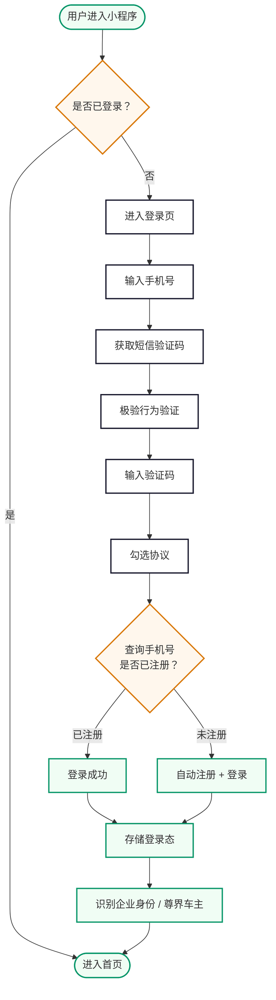
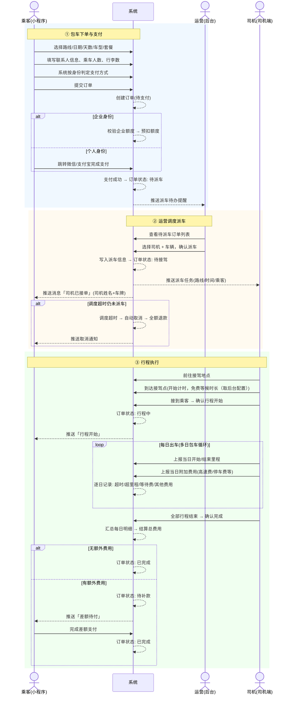
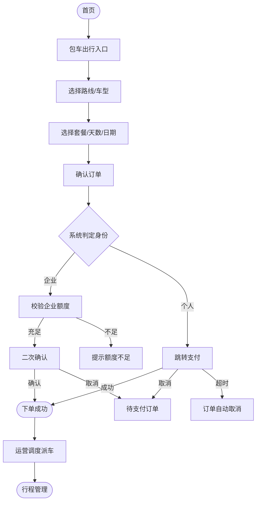
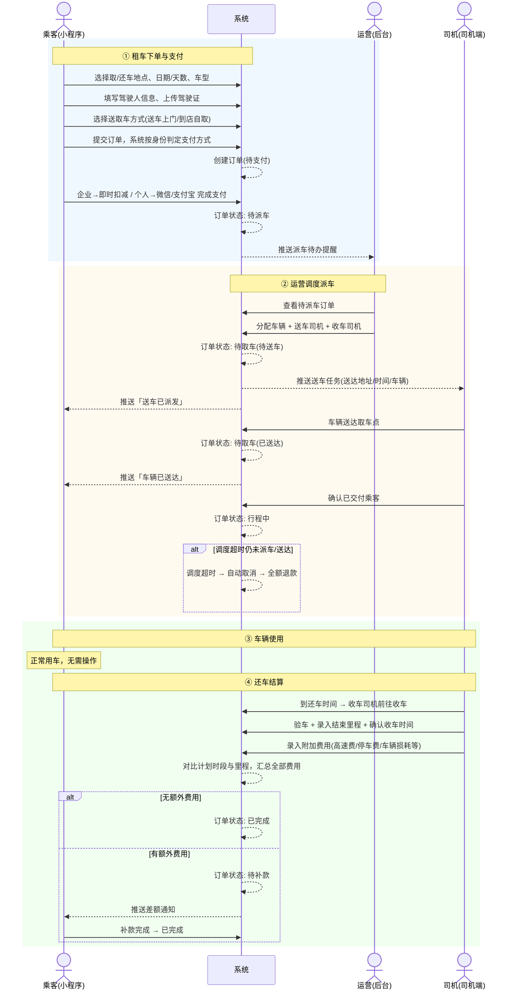
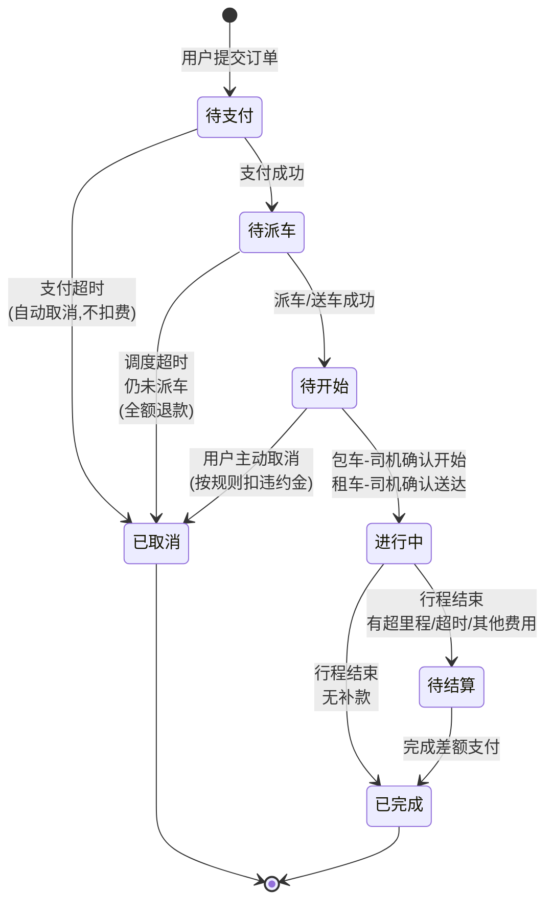
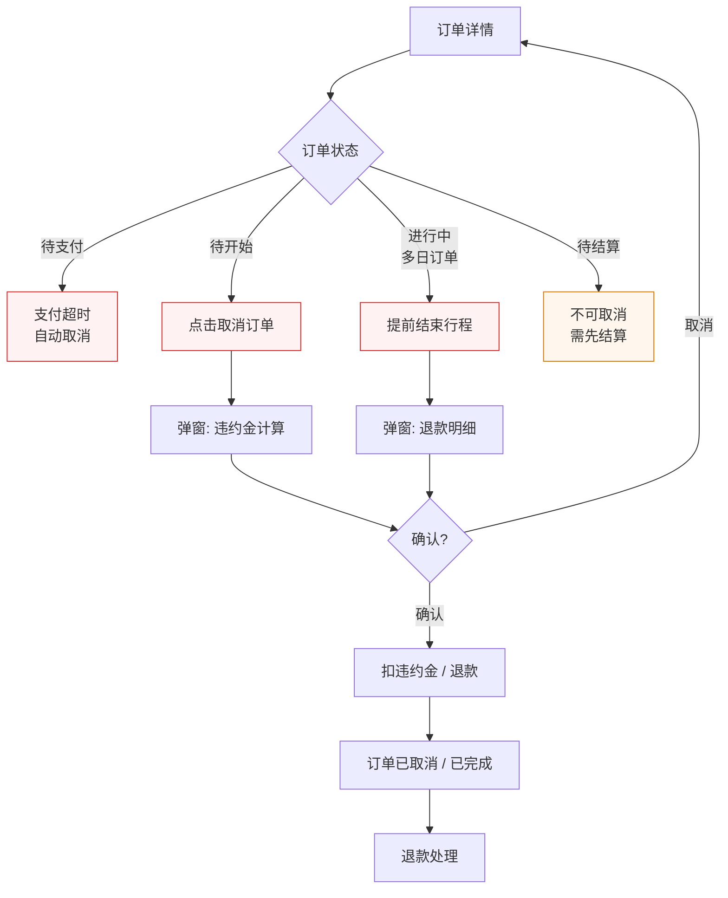
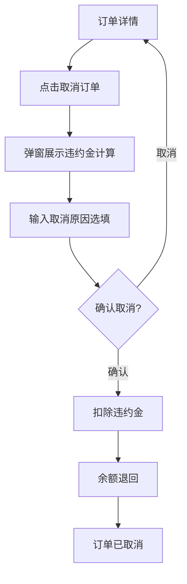
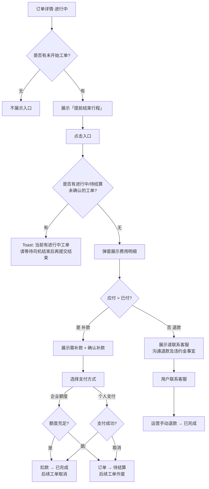
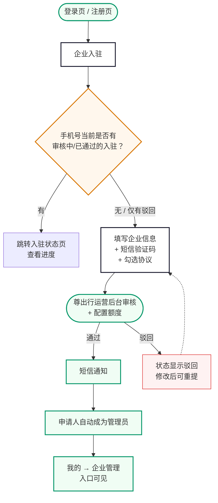

# 尊出行 · 乘客端需求规格说明（微信小程序）

## 目录

**登录注册**

1. [注册登录](#1-注册登录)

**服务 Tab**

2. [首页](#2-首页)
3. [包车出行](#3-包车出行)
4. [租车出行](#4-租车出行)

**我的 Tab**

5. [我的](#5-我的)
6. [行程管理](#6-行程管理)
7. [发票管理](#7-发票管理)
8. [企业管理](#8-企业管理)
9. [消息中心](#9-消息中心)

**企业**

10. [企业入驻](#10-企业入驻)

**其他**

11. [联系客服](#11-联系客服)
12. [服务协议与隐私政策](#12-服务协议与隐私政策)
13. [短信通知](#13-短信通知)

<a id="1-注册登录"></a>

## 1. 注册登录

### 业务说明

平台采用**短信验证码登录**方式，无需设置密码。用户输入手机号和短信验证码即可登录。若手机号未注册，系统自动完成注册并登录（初次登录即注册）。同时支持微信快捷登录，微信首次授权后绑定手机号即可。

验证码发送需接入**三番极验**行为验证（滑块/点选），防止机器批量请求。验证码频率限制：同一手机号 1 小时内最多 10 次，每日最多 15 次；同一 IP 每日最多 30 次。

登录时必须勾选同意《用户服务协议》和《隐私政策》，未勾选时底部弹出协议确认弹窗。

---

### 1.1 业务流程



---

### 1.2 验证码登录

#### 页面路径

`/pages/auth/login`

#### 字段定义

| 字段       | 必填 | 格式                           | 长度  | 交互说明                                                                                         | 提示                                                                                                            | 备注                          |
| ---------- | ---- | ------------------------------ | ----- | ------------------------------------------------------------------------------------------------ | --------------------------------------------------------------------------------------------------------------- | ----------------------------- |
| 手机号     | 是   | 中国大陆手机号 /^1[3-9]\d{9}$/ | 11 位 | 数字键盘输入；输入满 11 位自动失焦并校验格式；格式通过后"获取验证码"按钮变为可点击               | · 为空："请输入手机号码"`<br>`· 格式错误："请输入正确的手机号码"                                            | —                            |
| 短信验证码 | 是   | 6 位纯数字                     | 6 位  | 数字键盘输入；输入满 6 位自动失焦；获取前需通过极验行为验证                                      | · 为空："请输入短信验证码"`<br>`· 错误："验证码错误，请重新输入"`<br>`· 过期："验证码已失效，请重新获取" | 有效期 5 分钟，发送间隔 60 秒 |
| 协议勾选   | 是   | Boolean                        | —    | 未勾选点击登录：底部弹出协议确认弹窗（见下方弹窗说明）；协议名称蓝色可点击，分别跳转 H5 协议页面 | 弹窗标题："请阅读并同意以下协议"`<br>`弹窗按钮："不同意" / "同意并继续"                                       | —                            |

#### 协议确认弹窗

- 从页面**底部滑出**，半透明黑色遮罩背景覆盖整个页面
- 点击遮罩区域**可关闭弹窗**
- 《用户服务协议》和《隐私政策》蓝色可点击，分别跳转 H5 协议页面
- "同意并继续"：勾选协议框 + 执行登录请求
- "不同意"：关闭弹窗返回登录页

#### 验证码发送规则

**极验行为验证**

- 点击"获取验证码"前，弹出三番极验滑块/点选验证
- 验证通过后发送短信验证码
- 验证不通过：提示"验证未通过，请重试"，不发送短信

**频率限制**

| 限制维度             | 限制规则   | 超限提示                           |
| -------------------- | ---------- | ---------------------------------- |
| 同一手机号 · 每小时 | 最多 10 次 | "发送过于频繁，请稍后再试"         |
| 同一手机号 · 每天   | 最多 15 次 | "今日发送次数已达上限，请明天再试" |
| 同一 IP · 每天      | 最多 30 次 | "操作过于频繁，请明天再试"         |

**获取验证码按钮状态**

| 状态              | 文案               | 样式              | 说明                   |
| ----------------- | ------------------ | ----------------- | ---------------------- |
| 手机号未填/格式错 | "获取验证码"       | 灰色禁用          | 不可点击               |
| 可发送            | "获取验证码"       | 主色              | 点击先触发极验         |
| 极验验证中        | 极验弹窗           | —                | 滑块/点选验证          |
| 极验通过·发送中  | "发送中..."        | 主色 + loading    | 调短信接口             |
| 倒计时中          | "XXs 后重新获取"   | 灰色 + 倒计时数字 | 60 秒倒计时            |
| 倒计时结束        | "重新获取"         | 主色              | 可重新点击（仍需极验） |
| 频率超限          | "发送次数已达上限" | 灰色禁用          | —                     |

**验证码有效期**：5 分钟，过期后输入框下方红色提示"验证码已失效，请重新获取"。

**验证码发送间隔**：同一手机号两次获取之间至少间隔 60 秒。

#### 登录按钮

按钮文案为**"登录 / 注册"**，统一一个按钮。

| 状态         | 说明                                                                    |
| ------------ | ----------------------------------------------------------------------- |
| 禁用（默认） | 手机号为空或格式错误、验证码为空、协议未勾选 → 灰色不可点击            |
| 可点击       | 全部校验通过 → 主色高亮                                                |
| 提交中       | loading + "验证中..."                                                   |
| 已注册用户   | 验证码正确 → Toast "登录成功" → 跳转首页                              |
| 未注册用户   | 验证码正确 → 后端自动注册 + 登录 → Toast "欢迎加入尊出行" → 跳转首页 |
| 验证码错误   | 恢复正常 + Toast "验证码错误，请重新输入"                               |

#### 登录成功后续

1. 存储登录态到本地（7 天有效期）
2. 调用微信 `getUserProfile` 获取头像昵称（用户可拒绝，不影响使用）
3. 后端异步检测是否为尊界车主 → 前端识别后展示"积分权益"入口
4. 后端检测是否已被企业管理员添加为员工 → 自动关联企业身份
5. 跳转首页

---

### 1.3 微信快捷登录

#### 页面路径

登录页 `/pages/auth/login` 内嵌按钮

#### 流程

```

登录页点击"微信快捷登录"

    │

    ▼

调用 wx.login() 获取微信临时 code

    │

    ▼

后端用 code 换取微信 openid / unionid

    │

    ├── 已绑定手机号 → 直接登录成功 → 跳转首页

    │

    └── 未绑定手机号 → 跳转手机号绑定页

                        │

                        ├── 该手机号已注册 → 绑定微信 → 登录成功

                        └── 该手机号未注册 → 自动注册 + 绑定 → 登录成功

```

**微信快捷登录按钮**：绿色微信图标 + "微信快捷登录" 文字，居中显示在登录页底部。点击后调用微信授权，无需额外勾选协议（微信授权时已包含）。

---

### 1.4 登录态管理

| 项目       | 规则                                                                     |
| ---------- | ------------------------------------------------------------------------ |
| 登录态存储 | 微信小程序本地 Storage                                                   |
| 有效期     | 7 天                                                                     |
| 自动刷新   | 距过期不足 1 天时，每次进入首页主动调用刷新接口                          |
| 过期处理   | token 过期后自动清除本地存储，跳转登录页，Toast "登录已过期，请重新登录" |
| 多端登录   | 支持同一账号在多台设备同时登录，互不影响                                 |
| 退出登录   | 我的 → 退出登录 → 清除本地 token → 跳转登录页                         |

---

<a id="2-首页"></a>

## 2. 首页

### 业务说明

首页是小程序登录后默认展示的**服务 Tab** 主页面。展示两大用车场景入口。

两大入口为包车出行和租车出行，点击分别进入对应下单流程。

> 租车出行面向所有用户开放，积分抵扣功能仅尊界车主且为个人身份时可用。

---

### 2.1 用车场景入口

#### 布局

两大入口并列展示。

#### 入口定义

| 入口     | 标题     | 副标题                 | 适用人群 |
| -------- | -------- | ---------------------- | -------- |
| 包车出行 | 包车出行 | 4h / 8h 套餐 · 配司机 | 所有用户 |
| 租车出行 | 租车出行 | 自驾出行 · 日租       | 所有用户 |

#### 入口点击行为

| 入口     | 点击行为             |
| -------- | -------------------- |
| 包车出行 | 进入包车出行下单流程 |
| 租车出行 | 进入租车出行下单流程 |

#### 交互说明

- 两个入口始终可点，不限运营区域；区域限制在实际下单页进行校验
- 点击入口时卡片有缩放动效反馈

---

<a id="3-包车出行"></a>

## 3. 包车出行

### 业务说明

包车出行按天计费，配备司机。用户选择出发地和目的地后，横向滑动切换车型。点击"请选择套餐"底部弹出套餐、天数和起始日期的选择面板，确认后进入订单确认页。

车型、套餐及价格均取自后台配置（运营端 §8 运营配置 → 计费规则 → 包车出行）。每款车型可配置多个套餐，每档套餐含**半日租（4h/50km）**和**日租（8h/100km）**两种时长规格（时长和里程为系统固定值，不可调整）。超时费、超公里费、远调费、等待费按车型维度统一配置。套餐权益标签、取消规则按套餐独立配置。最长可选择 30 天。

---

### 业务全流程时序图

> 以下为包车出行从下单到行程结束的完整业务时序图，涵盖乘客、系统、运营、司机四方协作。



### 3.1 业务流程



---

### 3.2 Step 1：起止点 + 车型

#### 地址选择

点击出发地或目的地输入框，进入地址选择页。提供两种选址方式：

**方式一：搜索选址**

地址选择页顶部为搜索框，下方展示：

| 区域     | 内容                                        |
| -------- | ------------------------------------------- |
| 最近记录 | 用户最近使用的 10 条地址记录，点击即选中    |
| 搜索联想 | 输入关键词后展示地图 API 返回的地址联想列表 |

**方式二：地图选点**

搜索框右侧「地图选点」按钮，点击进入地图选址页。地图中心默认定位：

- 用户已授权位置权限 → 定位到当前所在位置；
- 未授权 / 拒绝 → 默认定位至**北京市**。

地图支持拖拽移动，中心固定 pin 标记即为选中地址。底部展示当前 pin 对应的结构化地址（名称 + 经纬度 + POI ID），点击「确认选址」返回地址选择页并填入。

选中地址后返回 Step 1，填入对应输入框。

#### 起止点字段定义

| 字段   | 必填 | 格式                                 | 长度              | 交互说明                                        | 提示                                                                                                                              | 备注 |
| ------ | ---- | ------------------------------------ | ----------------- | ----------------------------------------------- | --------------------------------------------------------------------------------------------------------------------------------- | ---- |
| 出发地 | 是   | 结构化地址（名称 + 经纬度 + POI ID） | 地址名称 ≤100 字 | 点击输入框进入地址选择页（最近记录 + 搜索联想） | · 为空："请选择出发地"`<br>`· 不在运营城市范围："抱歉，当前城市暂未开启服务"                                                  | —   |
| 目的地 | 是   | 同出发地                             | 同出发地          | 同出发地                                        | · 为空："请选择目的地"`<br>`· 与出发地相同："出发地和目的地不能相同"`<br>`· 不在运营城市范围："抱歉，当前城市暂未开启服务" | —   |

#### 车型选择

- 车型卡片横向滑动切换，当前选中车型居中高亮放大，两侧缩小半透明
- 车型列表取自后台车型字典（运营端 §8.2 车型管理）
- 每张车型卡片展示：车型图片、车型名称、副标题、车型标签，**不展示价格信息**
- 默认选中列表首款车型

> 车型信息（名称、图片、标签、排序）由运营端车型管理维护，乘客端仅展示，不做写死。价格信息在下方的套餐弹窗中按套餐展示。

下方"请选择套餐 >"按钮：起止点均已填写后变为可点击，否则置灰。

---

### 3.3 Step 2：底部弹窗 — 车型 + 套餐 + 天数 + 日期

起止点选定后，点击"请选择套餐 >" → 底部弹出选择面板。

**车型切换**：弹窗顶部展示当前车型（默认延续 Step 1 中选中的车型），点击可横向滑动切换。切换车型后，下方套餐列表和价格随之更新为该车型已配置的套餐。

#### 套餐选择

套餐卡片以网格布局展示（横向：半日租/日租，纵向：该车型已配置的各套餐档位）。每张卡片展示套餐名称 + ~~¥{原价}/天~~ ¥{折后价}/天（折扣系数根据总天数由后台配置自动计算）。套餐档位数量和名称由后台套餐名称库配置，半日租和日租两个时长规格为系统固定。选中的卡片主色边框高亮。

#### 套餐权益标签

每个套餐关联一组权益标签（标签名称和 icon 由运营端权益标签库配置）。切换套餐时下方权益标签区域同步更新，展示当前套餐享有的全部权益项和对应 icon。权益标签的具体内容以后台配置为准。

#### 天数与日期

| 字段     | 必填 | 格式       | 交互说明                                           | 提示                                         | 备注                      |
| -------- | ---- | ---------- | -------------------------------------------------- | -------------------------------------------- | ------------------------- |
| 天数     | 是   | 整数 1-30  | 步进器（- / 数字 / +），默认 1 天                  | · 最小 1`<br>`· 最大："最长可选择 30 天" | —                        |
| 起始日期 | 是   | YYYY-MM-DD | 点击调起日期选择器；默认今天；范围：今天起 30 天内 | · 过去日期置灰                              | 提前 ≥2 小时（后台可配） |

#### 确认按钮

- 按钮上方展示价格汇总：~~¥{原总价}~~ ¥{折后总价}（灰色横线为原价，折后价 = 套餐单价 × 天数 × 折扣系数）
- 套餐 + 天数 + 日期均选择后，按钮变为可点击
- 点击"确认，查看订单"关闭弹窗，进入 Step 3 订单确认页

---

### 3.4 Step 3：订单确认

#### 费用明细

点击"明细 >"进入独立费用明细页。费用展示规则：**有产生则展示，未产生不展示**。

下单时仅展示确认可计算的费用项，行程中才产生的费用（超时/超公里/等待）不预估：

| 费用项             | 展示规则                                                                                                           | 展示时机   |
| ------------------ | ------------------------------------------------------------------------------------------------------------------ | ---------- |
| **套餐总价** | ~~¥{原总价}~~ ¥{折后总价}，后台折扣系数 × 套餐单价 × 天数<small>套餐单价  ¥{折后单价}/天 · {天数}天</small> | 下单时     |
| 远调费             | 按下单地址到运营区域边缘距离取后台梯度配置预估，无远调则不展示。行程结束后按实际地址核算，多退少补                 | 下单时     |
| 等待费             | 司机到达后免费等候时长和超出费率取后台配置，行程中按实际产生展示                                                   | 行程结束后 |
| 超时费             | 费率取后台配置（元/小时），行程结束后按实际超时结算                                                                | 行程结束后 |
| 超公里费           | 费率取后台配置（元/公里），行程结束后按实际超里程结算                                                              | 行程结束后 |
| **预估合计** | ~~¥{原合计}~~ ¥{折后合计} = 折后套餐总价 + 远调费（下单时）；行程结束后追加超时/超里程/等待费                   | —         |

> 套餐内包含时长（半日租 4h / 日租 8h）和包含里程（半日租 50km / 日租 100km）为系统固定值。每条司机工单独立计算超时和超里程。套餐未用完时长/里程不退款。远调费下单时按预估地址预收，行程结束后按实际地址核算并多退少补。折扣系数由运营端计费规则配置，按总天数自动匹配对应档位。

#### 乘车人

默认本人，可切换为他人填写姓名和手机号。首次使用需完善本人姓名，完善后自动保存，后续下单默认带入。

#### 支付方式

支付方式由当前选择的支付主体决定。若用户同时拥有个人身份和企业身份，订单确认页顶部展示**支付主体**切换入口，用户可自行切换：

| 支付主体 | 展示规则                 | 支付方式                             |
| -------- | ------------------------ | ------------------------------------ |
| 个人身份 | 默认支付主体             | 微信/支付宝（通过富友聚合支付平台）  |
| 企业名称 | 仅关联多个企业时下拉选择 | 企业额度支付（直接扣减对应企业额度） |

> 仅单个身份时，不展示切换入口，按该身份对应的支付方式结算。

> 页面底部提交按钮上方展示应付总额：~~¥{原总价}~~ ¥{折后总价}（灰色横线为原价，折后价 = 折后日租总价 + 远调费。押金在下方独立押金信息模块展示，个人身份时展示，企业身份不展示）。

> **下单前置校验**：点击"确认下单"时，先校验用车开始时间（起始日期 00:00）距当前时间的时长是否 ≥ 调度超时时长（后台「平台级超时」配置，默认 2 小时）。若不足，Toast「当前距离用车时间不足，无法下单」，不提交订单。

#### 提交与支付

##### 企业身份 — 额度支付

| 步骤        | 说明                                                                                     |
| ----------- | ---------------------------------------------------------------------------------------- |
| 1. 前置校验 | 校验用车开始时间距当前时间 ≥ 调度超时时长（默认 2 小时），不足则阻止下单                |
| 2. 确认下单 | 点击"确认下单"，系统校验企业额度                                                         |
| 3. 额度校验 | 可用额度 ≥ 订单金额 → 通过；不足 → Toast "当前额度不足请联系管理员"，不提交           |
| 4. 二次确认 | 弹出企业支付确认弹窗，展示支付金额和扣减说明（"将从企业剩余额度中扣除"），用户确认后扣减 |
| 5. 取消支付 | 用户点击"取消"关闭弹窗 → Toast "已生成待支付订单" → 跳转行程列表，订单保留"待支付"状态 |
| 6. 确认支付 | 扣减企业额度 → Toast "下单成功" → 订单状态为"待调度"，进入后台调度池                   |

##### 个人身份 — 微信/支付宝

| 步骤        | 说明                                                                                                                                         |
| ----------- | -------------------------------------------------------------------------------------------------------------------------------------------- |
| 1. 前置校验 | 校验用车开始时间距当前时间 ≥ 调度超时时长（默认 2 小时），不足则阻止下单                                                                    |
| 2. 确认下单 | 点击"确认下单"，系统跳转富友聚合支付平台                                                                                                     |
| 3. 调起富友 | 系统调用富友聚合支付平台，跳转支付界面                                                                                                       |
| 4. 用户付款 | 在微信或支付宝付款界面完成支付                                                                                                               |
| 5. 支付成功 | 资金进入富友平台托管，订单状态变更为"待调度"，进入后台调度池                                                                                 |
| 6. 支付失败 | Toast 提示失败原因，可重新支付；支付超时后订单自动取消                                                                                       |
| 7. 取消支付 | 用户关闭付款界面 → 弹出确认弹窗"返回后将生成待支付订单" → 确认返回后订单保留"待支付"状态，可在行程列表继续支付；选择"继续支付"则留在支付页 |

##### 下单成功后

| 项目     | 说明                                                                           |
| -------- | ------------------------------------------------------------------------------ |
| 页面跳转 | 跳转订单详情页，展示订单号、状态"待调度"、行程信息（调度完成后展示司机和车辆） |
| 站内推送 | 站内消息："下单成功，订单已进入调度队列"                                       |

##### 支付超时处理

| 场景       | 处理                                                                                                               |
| ---------- | ------------------------------------------------------------------------------------------------------------------ |
| 支付超时   | 支付超时时间取自后台计费规则配置，超时后订单自动取消（企业身份在二次确认弹窗中取消则进入待支付，同样适用超时规则） |
| 超时取消后 | 订单列表显示"已取消"，原因"支付超时"；用户可一键重新下单                                                           |

> 调度逻辑见 §3.7。

---

### 3.5 下单成功 — 拆单逻辑

支付成功后生成一笔**乘客订单**，乘客端展示整体订单信息（路线 + 车型套餐 + 总价 + 日期范围）。调度员在运营后台派车后，系统将乘客订单按天拆分为**司机工单**——司机端每天看到并执行一条独立工单。

#### 拆分规则

| 场景         | 拆分结果                                                           |
| ------------ | ------------------------------------------------------------------ |
| 单日包车     | 1 个乘客订单 → 1 个司机工单                                       |
| 多日包车     | 1 个乘客订单 → N 个司机工单（按天拆分）                           |
| 项目         | 规则                                                               |
| ------------ | ------------------------------------------------------------------ |
| 乘客订单     | 一笔，包含完整行程信息。派车前为唯一订单实体                       |
| 拆分时机     | 运营后台为乘客订单分配车辆和司机后                                 |
| 司机工单     | 按天拆分，每天生成一条司机工单                                     |
| 工单内容     | 日期 + 出发时间 + 起止点 + 已分配的司机 + 车辆                     |
| 司机与车辆   | 同一乘客订单派车后，所有司机工单归属同一车辆和同一司机（包车场景） |
| 费用结算     | 每条司机工单独立计算超时和超里程，行程结束后逐日结算               |
| 乘客订单状态 | 已派车（派车后）→ 进行中（任一工单开始）→ 已完成（全部工单完成） |

#### 示例

**单日包车**（1 天）：

```

乘客订单 #ZC20260610001 【待调度】

路线：政务中心 → 会展中心 · 1 天


派车后 → 司机工单 #ZC20260610001-1 | 6/10 09:00 | 张三 · 京A12345

```

**多日包车**（3 天）：

用户下单 3 天包车（6/10-6/12），支付成功后：

```

乘客订单 #ZC20260610001 【待调度】

路线：政务中心 → 会展中心

车型：增程星辉尊享版 · 尊荣高级 · 日租

日期：6/10 - 6/12 · 共 3 天

```

调度员分配车辆（京A12345）和司机（张三）后，系统拆分：

```

乘客订单 #ZC20260610001 【已派车】

├── 司机工单 #ZC20260610001-1 | 6/10 09:00 | 张三 · 京A12345

├── 司机工单 #ZC20260610001-2 | 6/11 09:00 | 张三 · 京A12345

└── 司机工单 #ZC20260610001-3 | 6/12 09:00 | 张三 · 京A12345

```

- 乘客端订单详情展示每天行程信息（司机、车辆、日期、时间），无需展开工单
- 司机端看到对应天数的独立工单，每天执行一条
- 调度员在后台为乘客订单一次性派车派司机，系统自动按天拆分

---

### 3.6 调度逻辑

> **待定。** 后端自动匹配逻辑后续补充。

下单成功后，乘客订单进入后台调度池。尊出行运营后台"待调度列表"展示所有待分配乘客订单。调度员手动为乘客订单派车和派司机，系统随后按天自动拆分为司机工单。

| 项目       | 说明                                                     |
| ---------- | -------------------------------------------------------- |
| 调度对象   | 乘客订单（调度前不拆分）                                 |
| 调度方式   | 手动派车派司机（当前阶段）                               |
| 拆分       | 派车后系统自动按天生成司机工单                           |
| 约束       | 所有司机工单同车同司机（包车场景）                       |
| 调度完成后 | 司机端收到所有司机工单推送，乘客端订单状态更新为"待开始" |
| 自动匹配   | 后续迭代补充                                             |

---

<a id="4-租车出行"></a>

## 4. 租车出行

### 业务说明

租车出行面向所有用户开放，自驾不配司机。用户选择取车位置和还车位置，选择车型后确定租用天数和起始日期（最长 30 天，起步 1 天）。车型和日租价均取自后台配置。驾驶证和驾驶人信息在订单确认页填写，默认驾驶人为下单人本人。

下单成功后生成待派车订单，由运营后台调度送车任务。车辆送达后司机端确认交付，订单自动流转至行程中。尊界车主以个人身份下单时可使用积分抵扣费用。

### 业务全流程时序图

> 以下为租车出行从下单到还车结算的完整业务时序图，涵盖乘客、系统、运营、司机四方协作。



---

### 4.1 业务流程

---

### 4.1 Step 1：取还车位置

#### 字段定义

| 字段     | 必填 | 格式                                 | 长度              | 交互说明                                        | 提示                                                                               | 备注                         |
| -------- | ---- | ------------------------------------ | ----------------- | ----------------------------------------------- | ---------------------------------------------------------------------------------- | ---------------------------- |
| 取车位置 | 是   | 结构化地址（名称 + 经纬度 + POI ID） | 地址名称 ≤100 字 | 点击输入框进入地址选择页（最近记录 + 搜索联想） | · 为空："请选择取车位置"`<br>`· 不在运营城市范围："抱歉，当前城市暂未开启服务" | 取车和还车位置可相同也可不同 |
| 还车位置 | 是   | 同取车位置                           | 同取车位置        | 同取车位置                                      | · 为空："请选择还车位置"`<br>`· 不在运营城市范围："抱歉，当前城市暂未开启服务" | —                           |

---

### 4.3 Step 2：车型 + 天数日期

起止点选定后，进入本页。车型选择和天数日期在同一页面。

#### 车型与定价

- 车型卡片横向滑动切换，车型列表和定价均取自后台配置（运营端 §8.2 车型管理 + §8 计费规则 → 租车出行）
- 每款车型展示：车型名称、副标题、车型图片，以及 ~~¥{原日租价}~~ ¥{折后日租价}/天（灰色横线为原价，折扣系数根据租车天数由后台配置自动计算），日租价含 8h/100km，时长和里程为系统固定值
- 超里程费、超时长费、远调费、等待费按车型维度由后台统一配置
- **押金金额取后台计费配置**，在车型选择面板中同步展示；企业身份不展示押金信息（企业已通过线下签约缴纳保证金，线上不再收取），个人身份展示实际押金金额

> **租车价格全部来自后台配置**。日租价、超时/超公里/远调/等待费率、押金、取消规则均由运营端计费规则（租车出行）维护。乘客端仅展示，不做写死。

#### 押金展示

| 身份     | 展示规则                                           | 展示位置                   |
| -------- | -------------------------------------------------- | -------------------------- |
| 个人身份 | 展示押金金额，取自后台计费配置（按车型）           | 车型选择面板、押金信息模块 |
| 企业身份 | —（企业已通过线下签约缴纳保证金，线上不展示押金） | 车型选择面板、押金信息模块 |

> 押金在订单确认下单时一并支付，用车完成后 7 个工作日内退还。企业身份不展示押金信息（企业已通过线下签约缴纳保证金，线上不再收取）。

#### 天数与日期

| 字段     | 必填     | 格式         | 交互说明                                                                                  | 提示                                                    | 备注                           |
| -------- | -------- | ------------ | ----------------------------------------------------------------------------------------- | ------------------------------------------------------- | ------------------------------ |
| 取车日期 | 是       | YYYY-MM-DD   | 点击调起日期选择器；默认今天；范围：今天起 30 天内                                        | · 过去日期置灰                                         | —                             |
| 取车时间 | 是       | HH:mm        | 点击调起时间选择器；默认当前时间向上取整到整点；范围 00:00–23:59；同包车出行时间选择组件 | · 为空："请选择取车时间"                               | —                             |
| 租车天数 | 是       | 整数 1-30    | 步进器（− / 数字 / +），默认 1 天；点击 − 减 1（最小 1），点击 + 加 1（最大 30）        | · 最小："至少租 1 天"`<br>`· 最大："最长可租 30 天" | —                             |
| 还车日期 | 自动计算 | MM月DD日 周X | 根据取车日期 + 租车天数自动推算，只读展示（不参与选择）；天数变化时实时更新               | —                                                      | 展示格式如"6月18日 周三前还车" |

> **还车日期计算规则**：还车日期 = 取车日期 + 租车天数。例如取车日期 6月15日，租车 3 天，则还车日期为 6月18日（周三），展示"6月18日 周三前还车"。取车时间不影响还车日期。

> 选择租车天数后，页面底部展示价格汇总：~~¥{原总价}~~ ¥{折后总价}（灰色横线为原价，折后价 = 日租价 × 天数 × 折扣系数 + 远调费。个人身份时含押金，企业身份不含）。

---

### 4.2 Step 3：订单确认

车型、天数、日期和起止点确认后进入订单确认页。页面展示完整订单信息，包括取还车信息、租期、驾驶人、驾驶证上传、费用明细和支付方式。押金信息在页面费用汇总区域和独立押金信息模块展示：个人身份展示押金金额（取自后台计费配置），企业身份不展示押金信息。

#### 驾驶人

| 字段                 | 必填           | 格式           | 长度      | 交互说明                                                                                    | 提示                                                                     | 备注                         |
| -------------------- | -------------- | -------------- | --------- | ------------------------------------------------------------------------------------------- | ------------------------------------------------------------------------ | ---------------------------- |
| 驾驶人               | 是             | 本人 / 他人    | —        | 默认"本人"，展示下单人姓名+脱敏手机号；首次使用需完善本人姓名；右侧"切换"按钮可填写他人信息 | —                                                                       | 默认本人，首次完善后自动保存 |
| 驾驶人姓名（他人）   | 选择他人时必填 | 中文           | 2-20 个字 | 文本输入                                                                                    | · 为空："请输入驾驶人姓名"                                              | —                           |
| 驾驶人手机号（他人） | 选择他人时必填 | 中国大陆手机号 | 11 位     | 数字键盘输入                                                                                | · 为空："请输入驾驶人手机号"`<br>`· 格式错误："请输入正确的手机号码" | —                           |

#### 驾驶证

| 字段       | 必填 | 格式              | 交互说明                                                     | 提示                                                                                                                     | 备注                         |
| ---------- | ---- | ----------------- | ------------------------------------------------------------ | ------------------------------------------------------------------------------------------------------------------------ | ---------------------------- |
| 驾驶证照片 | 是   | JPG / PNG，≤10MB | 点击上传区域调起相册或拍照；上传后展示缩略图预览，可删除重传 | · 未上传："请上传驾驶证"`<br>`· 格式不符："请上传 jpg 或 png 格式的图片"`<br>`· 文件过大："图片大小不能超过 10MB" | 驾驶证正页和副页均需清晰可见 |

#### 费用明细

点击"明细 >"进入独立费用明细页。费用展示规则：**有产生则展示，未产生不展示**。

下单时仅展示确认可计算的费用项，行程中才产生的费用（超时/超里程/等待）不预估：

| 费用项             | 展示规则                                                                                                           | 展示时机 |
| ------------------ | ------------------------------------------------------------------------------------------------------------------ | -------- |
| **日租总价** | ~~¥{原总价}~~ ¥{折后总价}，后台折扣系数 × 日租单价 × 天数<small>日租单价  ¥{折后单价}/天 · {天数}天</small> | 下单时   |
| 远调费             | 按下单地址到运营区域边缘距离取后台梯度配置预估，无远调则不展示。行程结束后按实际地址核算，多退少补                 | 下单时   |

| 等待费             | 免费等候时长和超出费率取后台配置，行程中按实际产生展示                                                                                                                                                                     | 行程结束后 |
| 超时费             | 费率取后台配置（元/小时），行程结束后按实际超时结算                                                                                                                                                                        | 行程结束后 |
| 超里程费           | 费率取后台配置（元/公里），行程结束后按实际超里程结算                                                                                                                                                                      | 行程结束后 |
| **预估合计** | ~~¥{原合计}~~ ¥{折后合计} = 折后日租总价 + 远调费 + 押金（下单时，企业身份不含押金）；行程结束后追加超时/超里程/等待费                                                                                                  | —         |

> 日里程含 100km（系统固定值），超里程按实际超出部分结算。远调费下单时按预估地址预收，行程结束后按实际地址核算并多退少补。押金预计用车完成后 7 个工作日内退还，其中车辆押金 7 日内退还，违章押金 30 日内退还。企业身份不展示押金信息。个人身份与企业身份切换时，押金行即时展示/隐藏。折扣系数由运营端计费规则配置，按总天数自动匹配对应档位。

#### 积分抵扣

租车出行**支持**积分抵扣，需同时满足以下三个条件：

| 序号                                         | 条件                          | 说明                                   |
| -------------------------------------------- | ----------------------------- | -------------------------------------- |
| 1                                            | 租车出行场景                  | 仅租车出行支持积分抵扣，包车出行不支持 |
| 2                                            | 当前身份为**个人身份**  | 企业身份不展示积分抵扣入口             |
| 3                                            | 已认证尊界车主且积分余额 ＞ 0 | 未认证或无积分余额不展示               |
| 满足全部条件时，订单确认页展示积分抵扣卡片。 |                               |                                        |

用户可在卡片中输入**本次使用积分数**（积分数输入框，支持手动输入），系统按后台配置的积分兑换比例实时计算抵扣金额。单次使用有最低积分数和最高抵扣金额限制（均取自后台积分配比配置），超出范围时输入框提示。

#### 支付方式

支付方式由当前选择的支付主体决定。若用户同时拥有个人身份和企业身份，订单确认页顶部展示**支付主体**切换入口，用户可自行切换：

| 支付主体 | 展示规则                 | 支付方式                             | 押金       |
| -------- | ------------------------ | ------------------------------------ | ---------- |
| 个人身份 | 默认支付主体             | 微信/支付宝（通过富友聚合支付平台）  | 需支付押金 |
| 企业名称 | 仅关联多个企业时下拉选择 | 企业额度支付（直接扣减对应企业额度） | —         |

> 仅单个身份时，不展示切换入口，按该身份对应的支付方式结算。积分抵扣仅尊界车主且个人身份时可用（企业身份时不展示积分抵扣选项）。

> 页面底部提交按钮上方展示应付总额：~~¥{原总价}~~ ¥{折后总价}（灰色横线为原价，折后价 = 折后日租总价 + 远调费。押金在下方独立押金信息模块展示，个人身份时展示，企业身份不展示）。

#### 提交与支付

> **下单前置校验**：点击"确认下单"时，先校验取车时间距当前时间的时长是否 ≥ 调度超时时长（后台「平台级超时」配置，默认 2 小时）。若不足，Toast「当前距离用车时间不足，无法下单」，不提交订单。

##### 企业身份 — 额度支付

| 步骤        | 说明                                                                                 |
| ----------- | ------------------------------------------------------------------------------------ |
| 1. 前置校验 | 校验取车时间距当前时间 ≥ 调度超时时长（默认 2 小时），不足则阻止下单                |
| 2. 确认下单 | 点击"确认下单"，系统校验企业额度                                                     |
| 3. 额度校验 | 可用额度 ≥ 订单金额 → 通过；不足 → Toast "当前额度不足请联系管理员"，不提交       |
| 4. 二次确认 | 弹出企业支付确认弹窗，展示支付金额和扣减说明，用户确认后扣减                         |
| 5. 取消支付 | 用户点击取消关闭弹窗 → Toast "已生成待支付订单" → 跳转行程列表，订单保留待支付状态 |
| 6. 确认支付 | 扣减企业额度 → Toast "下单成功" → 订单状态为"待派车"                               |

##### 个人身份 — 微信/支付宝

| 步骤        | 说明                                                                                                                                         |
| ----------- | -------------------------------------------------------------------------------------------------------------------------------------------- |
| 1. 前置校验 | 校验取车时间距当前时间 ≥ 调度超时时长（默认 2 小时），不足则阻止下单                                                                        |
| 2. 确认下单 | 点击"确认下单"，系统展示应付总额~~¥{原总价}~~ ¥{折后总价}（原价灰色横线，折后 = 日租价 × 天数 × 折扣系数 + 远调费）。企业身份不含押金    |
| 3. 调起富友 | 系统调用富友聚合支付平台，跳转支付界面                                                                                                       |
| 4. 用户付款 | 在微信或支付宝付款界面完成支付（含押金一并支付）。企业身份不涉及押金支付                                                                     |
| 5. 支付成功 | 资金进入富友平台托管，订单状态变更为"待派车"                                                                                                 |
| 6. 支付失败 | Toast 提示失败原因，可重新支付；支付超时后订单自动取消                                                                                       |
| 7. 取消支付 | 用户关闭付款界面 → 弹出确认弹窗"返回后将生成待支付订单" → 确认返回后订单保留"待支付"状态，可在行程列表继续支付；选择"继续支付"则留在支付页 |
| 7. 押金退还 | 用车完成后 7 个工作日内，押金全额原路退还（仅个人身份）                                                                                      |

##### 积分抵扣（仅个人身份的尊界车主可用）

| 步骤          | 说明                                                                                                          |
| ------------- | ------------------------------------------------------------------------------------------------------------- |
| 1. 输入积分   | 在积分抵扣卡片中输入本次使用的积分数，系统实时展示：积分兑换比例（如 100 积分 = ¥1）、本次可抵扣金额         |
| 2. 积分校验   | 输入时前端校验：低于最低积分数 → 提示「单次最低使用 {N} 积分」；超过可抵扣上限 → 提示「单次最多抵扣 ¥{N}」 |
| 3. 确认下单   | 点击"确认下单"，提交时服务端校验积分余额是否充足                                                              |
| 4. 扣减积分   | 校验通过后，扣减对应积分，订单应付订单金额相应减少                                                            |
| 5. 下单成功   | Toast "积分抵扣成功"，订单状态为"待派车"                                                                      |
| 6. 积分不足   | 提交时积分余额不足 → Toast "积分余额不足"，回到订单页                                                        |
| 7. 不使用积分 | 输入框留空或填 0 则不使用积分抵扣                                                                             |

##### 下单成功后

| 项目     | 说明                                               |
| -------- | -------------------------------------------------- |
| 页面跳转 | 跳转订单详情页，展示订单号、状态"待派车"、行程信息 |
| 站内推送 | 站内消息："下单成功，订单已生成"                   |

##### 支付超时处理

| 场景       | 处理                                                                                                               |
| ---------- | ------------------------------------------------------------------------------------------------------------------ |
| 支付超时   | 支付超时时间取自后台计费规则配置，超时后订单自动取消（企业身份在二次确认弹窗中取消则进入待支付，同样适用超时规则） |
| 超时取消后 | 订单列表显示"已取消"，原因"支付超时"；用户可一键重新下单                                                           |

> 调度与送取车逻辑见 §5.5。

---

### 4.3 下单成功 — 待派车

支付成功后生成一笔租车订单，状态为"待派车"。由运营后台统一调度送车。车辆送达后**司机端确认交付**，订单自动流转至行程中。

#### 后台调度流程

| 步骤              | 说明                                                         |
| ----------------- | ------------------------------------------------------------ |
| 1. 订单进入调度池 | 尊出行运营后台"待派车列表"展示该租车订单                     |
| 2. 运营选车       | 运营人员在后台为该订单选择一辆可用车辆                       |
| 3. 生成送车任务   | 选车后系统自动生成送车任务和收车任务                         |
| 4. 分配司机       | 运营人员为送车任务和收车任务分别或统一分配司机               |
| 5. 任务推送       | 司机端收到送车任务（状态"待送车"）和收车任务（状态"待收车"） |
| 任务              | 司机端状态                                                   |
| --------          | ----------                                                   |
| 送车任务          | 待送车                                                       |
| 收车任务          | 待收车                                                       |

> 车辆送达后司机端点击「确认交付」，订单自动从「待取车」流转至「行程中」，乘客端无需确认取车。

#### 送车费

| 项目     | 规则                                       |
| -------- | ------------------------------------------ |
| 送车费   | 送车和收车各计一次费用，按实际行驶里程结算 |
| 计费规则 | 具体收费标准待定                           |

#### 调度方式

| 项目         | 说明                                        |
| ------------ | ------------------------------------------- |
| 系统自动派单 | 待定                                        |
| 当前阶段     | 运营后台手动选车 + 手动派司机               |
| 调度完成后   | 司机端收到送车/收车任务，乘客端订单状态更新 |

---

---

<a id="5-我的"></a>

## 5. 我的

### 业务说明

"我的"是底部导航第二个 Tab，聚合用户个人信息、出行记录、发票、企业管理、消息等功能入口。

页面自上而下展示：用户头像与昵称、当前身份标识（个人/企业）及切换入口、积分权益入口（仅尊界车主可见）、行程管理入口、发票管理、企业管理、消息通知及设置。

---

### 5.1 个人信息

| 项目     | 说明                                                        |
| -------- | ----------------------------------------------------------- |
| 头像     | 支持点击更换：拍照或从相册选择；未设置时展示默认灰色占位图  |
| 手机号   | 当前登录手机号，中间四位加密显示（138****8888）             |
| 昵称     | 微信授权获取的昵称，未授权显示"尊出行用户"                  |
| 当前身份 | 展示当前使用的身份：个人 / XX企业（员工）/ XX企业（管理员） |
| 切换身份 | 点击"切换"弹出底部选择器，列出个人身份 + 已关联的全部企业   |
| 项目     | 规则                                                        |
| -------- | ------------------------------------------------            |
| 选项展示 | 个人身份 + 已关联且审核通过的企业                           |
| 切换效果 | 选择后身份即时切换，下单时支付方式按当前身份展示            |
| 状态保持 | 切换后下次进入小程序保持该身份                              |
| 初次登录 | 若已关联企业，默认进入企业身份                              |

---

### 5.2 其他

| 项目       | 说明                                                                       |
| ---------- | -------------------------------------------------------------------------- |
| 联系客服   | 电话客服 400-XXX-XXXX，7×24 小时。详见[§11 联系客服](#11-联系客服)        |
| 服务协议   | WebView 打开 H5 页面。详见[§12 服务协议与隐私政策](#12-服务协议与隐私政策) |
| 隐私政策   | WebView 打开 H5 页面。详见[§12 服务协议与隐私政策](#12-服务协议与隐私政策) |
| 关于尊出行 | 展示当前版本号                                                             |
| 清除缓存   | 清除本地缓存的地址记录、搜索历史等                                         |

## 6. 行程管理

### 业务说明

行程管理聚合展示用户所有订单。按状态 Tab 筛选（全部/待支付/待开始/进行中/已完成/已取消），支持查看订单详情、取消订单。历史行程支持一键复用重新下单。

不同出行场景的订单展示结构不同：包车订单平铺展示每日行程（司机、车辆、日期），租车为订单+送取车任务状态。

---

### 6.0 订单状态流转

包车出行和租车出行的订单状态流转如下：



> 派车后细分：包车进入"待接驾"（司机前往接驾），租车进入"待取车"（车辆送达取车点）。我的行程 Tab 中两者合并为"待开始"。

#### 取消流程



---

### 6.1 我的行程

#### 卡片展示规则

卡片按出行场景区分展示结构：

| 场景     | 车型展示                                      | 路线展示                           | 日期展示        |
| -------- | --------------------------------------------- | ---------------------------------- | --------------- |
| 包车出行 | 车型 + 套餐（如"增程星辉尊享版 · 尊享基础"） | 起止点（如"政务中心 → 会展中心"） | 日期范围 + 天数 |
| 租车出行 | 仅车型（如"增程星辉尊享版"），不展示套餐名    | 取车点 / 还车点                   | 日期范围 + 天数 |

> 车型和套餐信息适用于所有状态的卡片。进行中卡片日期格式与其他状态一致：`06-10 至 06-12 · 3天`。

#### 状态 Tab

| Tab    | 筛选规则                                                                                                                          |
| ------ | --------------------------------------------------------------------------------------------------------------------------------- |
| 全部   | 所有订单                                                                                                                          |
| 待支付 | 待支付（首次）                                                                                                                    |
| 待开始 | 已支付但行程尚未开始，含待派车（运营未分配车辆/司机）、待接驾（包车已派车，分为等待司机出发和司机前往接驾）、待取车（租车已派车） |
| 进行中 | 进行中（包车：司机确认开始；租车：司机确认送达后自动流转）                                                                        |
| 待结算 | 待结算（行程结束差额待付）                                                                                                        |
| 已完成 | 已完成                                                                                                                            |
| 已取消 | 已取消（含支付超时 / 调度超时 / 主动取消）                                                                                        |

> - 待派车（pending-dispatch）：已支付但运营尚未派车，合并到「待开始」Tab。

> - 待接驾（pending-assigned）：包车已派车，状态均为"待接驾"但提示语不同：

> - 情况一：待司机开始行程 — 司机已接单但尚未出发，提示"已派车，等待司机出发"

> - 情况二：司机正在前往上车点 — 司机已出发，展示司机位置信息、距离及预计到达时间

> - 待取车（pending-pickup）：租车已派车但车辆尚未到达取车点，属于「待开始」。车辆送达后司机端确认交付，订单自动进入进行中。

> - 包车订单每日独立出行；租车订单司机确认送达后即进入进行中，还车完成即已完成。

> - 待结算：行程结束后如有超里程/超时/其他费用产生，订单进入待结算状态。独立 Tab，放在「进行中」之后。差额支付后转为已完成。

> - 待派车和待取车状态的卡片不展示「取消订单」按钮，取消需进入订单详情操作。

---

### 6.2 订单详情

详情页顶部展示订单号 + 状态标签（彩色 Tag）。包车订单与租车订单结构不同，分别描述。

---

#### 包车订单详情

**顶部信息：** 订单号（如 ZC20260608-0001）+ 状态标签（彩色 Tag）+ 提示条（按状态展示不同文案和颜色，见下方提示条表）。

**区块结构：**

| 区块             | 内容                                                                                        |
| ---------------- | ------------------------------------------------------------------------------------------- |
| 行程信息         | 见下方用车信息详细字段                                                                      |
| 提示条           | 按订单状态展示不同文案和颜色的提示条（见下方提示条表）                                      |
| 车型套餐         | 车型图片 + 车型名称 + 套餐名称（如「增程星辉尊享版 · 尊享基础」）；半日租或日租标识 + 单价 |
| 每日安排         | 见下方每日安排详细字段                                                                      |
| 费用明细         | 见下方费用明细（按状态区分展示）                                                            |
| 额外费用明细弹窗 | 点击费用明细中的「明细」按钮弹出，展示各费用的详细计算过程（见下方）                        |
| 订单动态         | 完整操作时间线（见下方）                                                                    |

**提示条文案（按状态）：**

| 状态               | 正文                                                                                 |
| ------------------ | ------------------------------------------------------------------------------------ |
| 待支付             | 订单已确认，请在支付超时前完成支付（琥珀色）                                         |
| 待派车             | 运营正在安排派车，请您耐心等待（琥珀色）                                             |
| 待接驾（等待出发） | 司机已接单，准备出发中（蓝色）                                                       |
| 待接驾（前往接驾） | {司机姓名} · {车牌} · 距您 X 公里 · 预计 X 分钟到达（蓝色）。展示司机实时位置地图 |
| 进行中             | {司机姓名} · {车牌}，祝您出行愉快（绿色）                                           |
| 已完成             | 感谢您的出行，欢迎再次使用尊出行（绿色）                                             |
| 已取消             | 取消原因 + 违约金信息（红色）                                                        |
| 待结算             | 行程已完成，因超里程/超时产生额外费用，请及时结算（红色）                            |

**用车信息详细字段：**

| 字段     | 内容                                              |
| -------- | ------------------------------------------------- |
| 出发地   | 详细地址（名称 + 区/街道）                        |
| 目的地   | 详细地址（名称 + 区/街道）                        |
| 日期范围 | 起始日期 ~ 结束日期（如 2026-06-10 ~ 2026-06-12） |
| 天数     | 共 N 天                                           |
| 车型     | 车型名称 + 车型图片                               |
| 套餐     | 套餐名称 + 半日租/日租标识                        |
| 乘车人   | 姓名 + 手机号（脱敏）                             |
| 乘车人数 | N 人                                              |
| 用车备注 | 用户填写的备注信息（如有）                        |

**每日安排详细字段：**

| 字段     | 内容                                        |
| -------- | ------------------------------------------- |
| 日期     | MM-dd 周X（如 06-10 周二）                  |
| 时间     | 出发时间（如 09:00）                        |
| 司机     | 姓名，点击可拨打虚拟号（待开始/进行中状态） |
| 车辆     | 车牌号 + 车型简称                           |
| 当日状态 | 待出发 / 进行中 / 已完成 标签               |

**费用明细：**

页面底部费用汇总区展示金额及明细入口。主行数字加粗，原价灰色横线。点击主行弹出对应明细弹窗。各状态展示内容如下：

---

##### ① 待支付

**页面底部主行（1行）：**

| 行                 | 展示                                                 | 操作         |
| ------------------ | ---------------------------------------------------- | ------------ |
| **订单金额** | ~~¥{原总价}~~ ¥{折后总价}（灰色横线为优惠前总价） | 点击弹出明细 |

**订单金额明细弹窗：**

| 费用项             | 展示规则                           |
| ------------------ | ---------------------------------- |
| **套餐总价** | ~~¥{原总价}~~ ¥{折后总价}       |
| **套餐单价** | ~~¥{原单价}/天~~ ¥{折后单价}/天 |
| **下单天数** | {天数}天                           |
| **远调费**   | ¥{金额}，无则不展示               |

---

##### ② 待开始 / 进行中

**页面底部主行（1行）：**

| 行                     | 展示             | 操作         |
| ---------------------- | ---------------- | ------------ |
| **已付订单金额** | ¥{实付折后总价} | 点击弹出明细 |

**已付订单金额明细弹窗：**

| 费用项             | 展示规则                           |
| ------------------ | ---------------------------------- |
| **套餐总价** | ~~¥{原总价}~~ ¥{折后总价}       |
| **套餐单价** | ~~¥{原单价}/天~~ ¥{折后单价}/天 |
| **下单天数** | {天数}天                           |
| **远调费**   | ¥{金额}，无则不展示               |

---

##### ③ 待结算

**页面底部（3行）：**

| 行               | 展示                       | 操作             |
| ---------------- | -------------------------- | ---------------- |
| 已付订单金额     | ¥{下单时实付折后总价}     | 点击弹出已付明细 |
| 应付订单金额     | ¥{合计}                   | 点击弹出应付明细 |
| **需补款** | **¥{差额}**（红色） | —               |

**已付订单金额明细弹窗：**

| 费用项             | 展示规则                           |
| ------------------ | ---------------------------------- |
| **套餐总价** | ~~¥{原总价}~~ ¥{折后总价}       |
| **套餐单价** | ~~¥{原单价}/天~~ ¥{折后单价}/天 |
| **下单天数** | {天数}天                           |
| **远调费**   | ¥{金额}，无则不展示               |

**应付订单金额明细弹窗：**

| 费用项                 | 展示规则                           | 可操作     |
| ---------------------- | ---------------------------------- | ---------- |
| **套餐单价**     | ~~¥{原单价}/天~~ ¥{折后单价}/天 | —         |
| **实际使用天数** | {实际天数}天                       | —         |
| **套餐总价**     | ¥{折后单价 × 实际天数}           | —         |
| **实际远调费**   | ¥{金额}，无则不展示               | 点明细弹窗 |
| **超时费**       | ¥{金额}，无则不展示               | 点明细弹窗 |
| **超里程费**     | ¥{金额}，无则不展示               | 点明细弹窗 |
| **等待费**       | ¥{金额}，无则不展示               | 点明细弹窗 |
| **其他费用**     | ¥{金额}，无则不展示               | 点明细弹窗 |
| **应付订单合计** | ¥{加总}                           | —         |
|                        |                                    |            |

---

##### ④ 已完成

**页面底部（3行）：**

| 行                     | 展示                        | 操作             |
| ---------------------- | --------------------------- | ---------------- |
| 已付订单金额           | ¥{累计支付}（下单 + 补款） | 点击弹出已付明细 |
| 退款金额               | ¥{累计退款}                | 点击弹出退款明细 |
| **实付订单金额** | ¥{已付 − 退款}            | —               |

**已付订单金额明细弹窗：**

| 费用项                   | 展示规则                           |
| ------------------------ | ---------------------------------- |
| **日租总价**       | ~~¥{原总价}~~ ¥{折后总价}       |
| **日租单价**       | ~~¥{原单价}/天~~ ¥{折后单价}/天 |
| **租车天数**       | {天数}天                           |
| **远调费**         | ¥{金额}，无则不展示               |
| **退款明细弹窗：** |                                    |

| 字段     | 说明                                                                                                                                     |
| -------- | ---------------------------------------------------------------------------------------------------------------------------------------- |
| 退款金额 | ¥{金额}                                                                                                                                 |
| 退款时间 | YYYY-MM-DD HH:mm                                                                                                                         |
| 退款类型 | 平台退款 / 差额退还 / 取消退款                                                                                                           |
| 类型说明 | 平台退款：后台运营手动操作退款；差额退还：提前结束行程自动退还差额 或 正常结束远调费多退少补；取消退款：支付超时 或 调度超时全额自动退款 |
| 备注     | 平台退款时展示运营填写的退款原因；差额退还和取消退款由系统自动生成说明                                                                   |

---

##### ⑤ 已取消

**支付前取消：** 不展示费用明细。订单直接关闭，无退款。

**支付后取消（3行）：**

| 行                     | 展示             | 操作             |
| ---------------------- | ---------------- | ---------------- |
| 已付订单金额           | ¥{支付时总价}   | 点击弹出已付明细 |
| 退款金额               | ¥{退款金额}     | 点击弹出退款明细 |
| **实付订单金额** | ¥{已付 − 退款} | —               |

**已付订单金额明细弹窗：**

| 费用项             | 展示规则                           |
| ------------------ | ---------------------------------- |
| **日租总价** | ~~¥{原总价}~~ ¥{折后总价}       |
| **日租单价** | ~~¥{原单价}/天~~ ¥{折后单价}/天 |
| **租车天数** | {天数}天                           |
| **远调费**   | ¥{金额}，无则不展示               |

**退款明细弹窗：**

| 字段     | 说明                                                                                                                                     |
| -------- | ---------------------------------------------------------------------------------------------------------------------------------------- |
| 退款金额 | ¥{金额}                                                                                                                                 |
| 退款时间 | YYYY-MM-DD HH:mm                                                                                                                         |
| 退款类型 | 平台退款 / 差额退还 / 取消退款                                                                                                           |
| 类型说明 | 平台退款：后台运营手动操作退款；差额退还：提前结束行程自动退还差额 或 正常结束远调费多退少补；取消退款：支付超时 或 调度超时全额自动退款 |
| 备注     | 平台退款时展示运营填写的退款原因；差额退还和取消退款由系统自动生成说明                                                                   |

---

##### 子明细弹窗（远调费/超时费/超里程费/等待费/其他费用点击「明细」时弹出）

| 费用类型           | 弹窗字段                                                                                                                           |
| ------------------ | ---------------------------------------------------------------------------------------------------------------------------------- |
| **远调费**   | 实际上车点地址 / 实际下车点地址 / 所属运营城市 / 上车点到区域边缘距离（km）/ 下车点到区域边缘距离（km）/ 适用梯度档位 / 远调费金额 |
| **超时费**   | 每日开始时间 / 每日结束时间 / 实际使用时长 / 套餐内时长 / 超时小时数 / 费率（元/小时）/ 超时费金额                                 |
| **超里程费** | 每日开始里程（km）/ 每日结束里程（km）/ 实际里程 / 套餐内里程 / 超公里数 / 费率（元/公里）/ 超里程费金额。附开始/结束里程表照片    |
| **等待费**   | 日期 / 等待时长 / 等待费                                                  |
| **其他费用** | 费用类型（高速费/停车费/路桥费/洗车费/其他）/ 金额 / 票据凭证（可点击查看大图）/ 上报时间 / 上报司机                               |

**订单动态：**

订单详情最底部展示完整操作时间线，按时间倒序排列（最新在上，高亮；历史节点灰色）。每个节点包含时间戳和事件描述。

| 节点         | 展示内容                                                      |
| ------------ | ------------------------------------------------------------- |
| 订单提交     | YYYY-MM-DD HH:mm 订单已提交                                   |
| 支付成功     | YYYY-MM-DD HH:mm 支付成功 — {支付方式} ¥{金额}              |
| 派车成功     | YYYY-MM-DD HH:mm {操作人}已派车完成                           |
| 司机出发     | YYYY-MM-DD HH:mm {姓名} 已出发                                |
| 司机到达     | YYYY-MM-DD HH:mm {姓名} 已到达上车点                          |
| 行程开始     | YYYY-MM-DD HH:mm 行程开始 {司机姓名}·{车牌}                  |
| 当日行程结束 | YYYY-MM-DD HH:mm 当日行程结束 实际用时 {Xh}，里程 {X}km       |
| 结算完成     | YYYY-MM-DD HH:mm 结算完成 — {支付方式} ¥{金额}              |
| 订单完成     | YYYY-MM-DD HH:mm 订单已完成                                   |
| 取消订单     | YYYY-MM-DD HH:mm 订单已取消 {取消原因} 退款 ¥{金额}          |
| 退款         | YYYY-MM-DD HH:mm {操作人} 发起退款 ¥{金额}，原因：{退款原因} |
| 提前结束行程 | YYYY-MM-DD HH:mm 乘客提前结束行程                             |

**各状态底部操作：**

| 状态   | 底部按钮                 | 说明                                          |
| ------ | ------------------------ | --------------------------------------------- |
| 待支付 | 「去支付」「取消订单」   | 支付按钮跳转支付；取消订单按取消规则处理      |
| 待派车 | 「取消订单」             | 取消按规则处理                                |
| 待接驾 | 「取消订单」             | 取消按规则扣违约金                            |
| 进行中 | 多日订单「提前结束行程」 | 提前结束已在行程中的日期不退，未开始按规则退  |
| 待结算 | 「去结算」               | 企业身份直接扣减额度，个人身份跳转微信/支付宝 |
| 已完成 | 「再次下单」             | 一键复用原订单信息重新下单                    |
| 已取消 | 「再次下单」             | 一键复用原订单信息重新下单                    |

**待结算说明：** 行程结束时如有超里程/超时/其他费用产生，订单进入待结算状态。详情页费用明细展示套餐价（已支付）+ 各项差额（红色）→ 待结算总额。差额支付完成后转为已完成。待结算状态不可取消。

**联系司机：** 在待接驾和进行中状态，每日安排每行内展示「联系司机」按钮（电话图标），点击调起虚拟号拨打。司机实时位置仅在「待接驾（前往接驾）」状态展示，位于提示条下方。

---

#### 租车订单详情

**顶部信息：** 订单号（如 ZC20260608-0001）+ 状态标签（彩色 Tag）+ 提示条（按状态展示不同文案和颜色，见下方提示条表）。

**区块结构：**

| 区块             | 内容                                                              |
| ---------------- | ----------------------------------------------------------------- |
| 取还车           | 见下方用车信息详细字段                                            |
| 提示条           | 按订单状态展示不同文案和颜色的提示条（见下方提示条表）            |
| 车型             | 车型图片 + 车型名称（如「增程星辉尊享版」），不展示套餐名；日租价 |
| 驾驶人           | 见下方驾驶人详细字段                                              |
| 送取车           | 见下方送取车详细字段                                              |
| 费用明细         | 见下方费用明细（按状态区分展示）                                  |
| 额外费用明细弹窗 | 见下方费用明细及子明细弹窗                                        |
| 订单动态         | 完整操作时间线（见下方）                                          |

**用车信息详细字段：**

| 字段       | 内容                       |
| ---------- | -------------------------- |
| 取车地点   | 详细地址（名称 + 区/街道） |
| 还车地点   | 详细地址（名称 + 区/街道） |
| 取车日期   | YYYY-MM-DD                 |
| 取车时间   | HH:mm                      |
| 还车日期   | YYYY-MM-DD 周X（自动推算） |
| 租车天数   | N 天                       |
| 送取车方式 | 送车上门 / 到店自取        |

**驾驶人详细字段：**

| 字段         | 内容                                            |
| ------------ | ----------------------------------------------- |
| 驾驶人姓名   | 默认下单人，可切换为他人                        |
| 驾驶人手机号 | 脱敏展示（如 138****1234）                      |
| 驾驶证       | 「查看驾驶证」按钮，点击预览驾驶证正页+副页照片 |

**送取车详细字段：**

| 字段       | 送车                       | 收车                       |
| ---------- | -------------------------- | -------------------------- |
| 司机姓名   | {姓名}                     | {姓名}                     |
| 司机手机号 | 脱敏展示，点击可拨打虚拟号 | 脱敏展示，点击可拨打虚拟号 |
| 任务状态   | 待送车 / 送车中 / 已送达   | 待收车 / 收车中 / 已收车   |
| 车牌号     | {车牌}                     | {车牌}                     |

> 送车和收车司机可为同一人。

**费用明细：**

页面底部费用汇总区展示金额及明细入口。主行数字加粗，原价灰色横线。点击主行弹出对应明细弹窗。各状态展示内容如下：

---

##### ① 待支付

**页面底部主行（1行）：**

| 行                           | 展示                                                 | 操作         |
| ---------------------------- | ---------------------------------------------------- | ------------ |
| **订单金额**           | ~~¥{原总价}~~ ¥{折后总价}（灰色横线为优惠前总价） | 点击弹出明细 |
| **订单金额明细弹窗：** |                                                      |              |

| 费用项             | 展示规则                           |
| ------------------ | ---------------------------------- |
| **日租总价** | ~~¥{原总价}~~ ¥{折后总价}       |
| **日租单价** | ~~¥{原单价}/天~~ ¥{折后单价}/天 |
| **租车天数** | {天数}天                           |
| **远调费**   | ¥{金额}，无则不展示               |

---

##### ② 待派车 / 待取车（未送达）/ 待取车（已送达）/ 进行中

**页面底部主行（1行）：**

| 行                               | 展示             | 操作         |
| -------------------------------- | ---------------- | ------------ |
| **已付订单金额**           | ¥{实付折后总价} | 点击弹出明细 |
| **已付订单金额明细弹窗：** |                  |              |

| 费用项             | 展示规则                           |
| ------------------ | ---------------------------------- |
| **套餐总价** | ~~¥{原总价}~~ ¥{折后总价}       |
| **套餐单价** | ~~¥{原单价}/天~~ ¥{折后单价}/天 |
| **下单天数** | {天数}天                           |
| **远调费**   | ¥{金额}，无则不展示               |

---

##### ③ 待结算

**页面底部（3行）：**

| 行                               | 展示                       | 操作             |
| -------------------------------- | -------------------------- | ---------------- |
| 已付订单金额                     | ¥{下单时实付折后总价}     | 点击弹出已付明细 |
| 应付订单金额                     | ¥{合计}                   | 点击弹出应付明细 |
| **需补款**                 | **¥{差额}**（红色） | —               |
| **已付订单金额明细弹窗：** |                            |                  |

| 费用项             | 展示规则                           |
| ------------------ | ---------------------------------- |
| **日租总价** | ~~¥{原总价}~~ ¥{折后总价}       |
| **日租单价** | ~~¥{原单价}/天~~ ¥{折后单价}/天 |
| **租车天数** | {天数}天                           |
| **远调费**   | ¥{金额}，无则不展示               |

| **应付订单金额明细弹窗：** |                                                                 |

| 费用项                 | 展示规则                           | 可操作     |
| ---------------------- | ---------------------------------- | ---------- |
| **套餐单价**     | ~~¥{原单价}/天~~ ¥{折后单价}/天 | —         |
| **实际使用天数** | {实际天数}天                       | —         |
| **套餐总价**     | ¥{折后单价 × 实际天数}           | —         |
| **实际远调费**   | ¥{金额}，无则不展示               | 点明细弹窗 |
| **超时费**       | ¥{金额}，无则不展示               | 点明细弹窗 |
| **超里程费**     | ¥{金额}，无则不展示               | 点明细弹窗 |
| **等待费**       | ¥{金额}，无则不展示               | 点明细弹窗 |
| **其他费用**     | ¥{金额}，无则不展示               | 点明细弹窗 |
| **应付订单合计** | ¥{加总}                           | —         |
|                        |                                    |            |

---

##### ④ 已完成

**页面底部（3行）：**

| 行                               | 展示                        | 操作             |
| -------------------------------- | --------------------------- | ---------------- |
| 已付订单金额                     | ¥{累计支付}（下单 + 补款） | 点击弹出已付明细 |
| 退款金额                         | ¥{累计退款}                | 点击弹出退款明细 |
| **实付订单金额**           | ¥{已付 − 退款}            | —               |
| **已付订单金额明细弹窗：** |                             |                  |

| 费用项                   | 展示规则                           |
| ------------------------ | ---------------------------------- |
| **套餐总价**       | ~~¥{原总价}~~ ¥{折后总价}       |
| **套餐单价**       | ~~¥{原单价}/天~~ ¥{折后单价}/天 |
| **下单天数**       | {天数}天                           |
| **远调费**         | ¥{金额}，无则不展示               |
| **退款明细弹窗：** |                                    |

| 字段     | 说明                                                                                                                                 |
| -------- | ------------------------------------------------------------------------------------------------------------------------------------ |
| 退款金额 | ¥{金额}                                                                                                                             |
| 退款时间 | YYYY-MM-DD HH:mm                                                                                                                     |
| 退款类型 | 平台退款 / 差额退还 / 取消退款                                                                                                       |
| 类型说明 | 平台退款：后台运营手动操作退款；差额退还：提前结束行程自动退还差额 或 正常结束远调费多退少补；取消退款：支付超时 或 调度超时全额自动 |
| 备注     | 平台退款时展示运营填写的退款原因；其他类型由系统自动生成说明                                                                         |

---

##### ⑤ 已取消

**支付前取消：** 不展示费用明细。订单直接关闭，无退款。

**支付后取消（3行）：**

| 行                               | 展示             | 操作             |
| -------------------------------- | ---------------- | ---------------- |
| 已付订单金额                     | ¥{支付时总价}   | 点击弹出已付明细 |
| 退款金额                         | ¥{退款金额}     | 点击弹出退款明细 |
| **实付订单金额**           | ¥{已付 − 退款} | —               |
| **已付订单金额明细弹窗：** |                  |                  |

| 费用项                   | 展示规则                           |
| ------------------------ | ---------------------------------- |
| **套餐总价**       | ~~¥{原总价}~~ ¥{折后总价}       |
| **套餐单价**       | ~~¥{原单价}/天~~ ¥{折后单价}/天 |
| **下单天数**       | {天数}天                           |
| **远调费**         | ¥{金额}，无则不展示               |
| **退款明细弹窗：** |                                    |

| 字段     | 说明                                                                                                                                       |
| -------- | ------------------------------------------------------------------------------------------------------------------------------------------ |
| 退款金额 | ¥{金额}                                                                                                                                   |
| 退款时间 | YYYY-MM-DD HH:mm                                                                                                                           |
| 退款类型 | 平台退款 / 差额退还 / 取消退款                                                                                                             |
| 类型说明 | 平台退款：后台运营手动操作退款；差额退还：提前结束行程自动退还差额 或 正常结束远调费多退少补；取消退款：支付超时 或 调度超时全额自动退款； |
| 备注     | 平台退款时展示运营填写的退款原因；其他类型由系统自动生成说明                                                                               |

---

**押金信息（独立模块，费用明细下方）：**

> **仅个人身份订单显示，企业身份不展示此模块。** 企业用户线下签订合同时已缴纳保证金，线上不再收取押金。

押金信息为独立模块，展示在费用明细下方。各状态展示规则：

| 状态                     | 合计押金 | 车辆押金 | 违章押金 | 押金状态 |
| ------------------------ | -------- | -------- | -------- | -------- |
| 待支付                   | 展示     | 展示     | 展示     | 不展示   |
| 待派车 / 待取车 / 进行中 | 展示     | 展示     | 展示     | 展示     |
| 待结算                   | 展示     | 展示     | 展示     | 展示     |
| 已完成                   | 展示     | 展示     | 展示     | 展示     |
| 已取消（支付前）         | 展示     | 展示     | 展示     | 不展示   |
| 已取消（支付后）         | 展示     | 展示     | 展示     | 展示     |

具体字段：

| 字段               | 展示内容                   | 操作         | 说明                                                                               |
| ------------------ | -------------------------- | ------------ | ---------------------------------------------------------------------------------- |
| **合计押金** | ¥{合计}                   | 点击查看明细 | 车辆押金 + 违章押金。支付时收取                                                    |
| **车辆押金** | ¥{金额}                   | 点击查看明细 | 预计7日内退还。退还后标记「已退还」及退还时间                                      |
| **违章押金** | ¥{金额}                   | 点击查看明细 | 预计30日内退还。退还后标记「已退还」及退还时间                                     |
| **押金状态** | 未退还 / 部分退还 / 已退还 | —           | 两个都未退 → 未退还；退了一个 → 部分退还（标记哪一个已退）；两个都退了 → 已退还 |

**押金查看明细弹窗（点击合计押金/车辆押金/违章押金弹出）：**

| 类型           | 押金金额               | 扣款金额               | 已退金额               | 退还时间         | 备注   |
| -------------- | ---------------------- | ---------------------- | ---------------------- | ---------------- | ------ |
| 车辆押金       | ¥{金额}               | ¥{扣款}               | ¥{已退}               | YYYY-MM-DD HH:mm | {备注} |
| 违章押金       | ¥{金额}               | ¥{扣款}               | ¥{已退}               | YYYY-MM-DD HH:mm | {备注} |
| **合计** | **¥{合计押金}** | **¥{合计扣款}** | **¥{合计退款}** | —               | —     |

---

##### 子明细弹窗（远调费/超时费/超里程费/等待费/其他费用点击「明细」时弹出）

| 费用类型           | 弹窗字段                                                                                                                           |
| ------------------ | ---------------------------------------------------------------------------------------------------------------------------------- |
| **远调费**   | 实际取车点地址 / 实际还车点地址 / 所属运营城市 / 取车点到区域边缘距离（km）/ 还车点到区域边缘距离（km）/ 适用梯度档位 / 远调费金额 |
| **超时费**   | 取车时间 / 还车时间 / 实际使用时长 / 日含 8h / 超时小时数 / 费率（元/小时）/ 超时费金额                                            |
| **超里程费** | 开始里程（km）/ 结束里程（km）/ 实际里程 / 日含里程 100km / 超公里数 / 费率（元/公里）/ 超里程费金额。附开始/结束里程表照片        |
| **等待费**   | 日期 / 等待时长 / 等待费                                                  |
| **其他费用** | 费用类型（高速费/停车费/路桥费/洗车费/其他）/ 金额 / 票据凭证（可点击查看大图）/ 上报时间 / 上报司机                               |

**订单动态：**

| 节点         | 展示内容                                                      |
| ------------ | ------------------------------------------------------------- |
| 订单提交     | YYYY-MM-DD HH:mm 订单已提交                                   |
| 支付成功     | YYYY-MM-DD HH:mm 支付成功 — {支付方式} ¥{金额}              |
| 派车成功     | YYYY-MM-DD HH:mm {操作人} 已派车完成                          |
| 司机出发     | YYYY-MM-DD HH:mm {姓名} 已出发                                |
| 司机到达     | YYYY-MM-DD HH:mm 车辆已送达取车点 {取车地点}                  |
| 行程开始     | YYYY-MM-DD HH:mm 行程开始 {车牌}                              |
| 司机出发     | YYYY-MM-DD HH:mm {姓名} 已出发前往还车点                      |
| 确认收车     | YYYY-MM-DD HH:mm 收车完成 里程 {X}km，用车 {X}天              |
| 结算完成     | YYYY-MM-DD HH:mm 结算完成 — {支付方式} ¥{金额}              |
| 订单完成     | YYYY-MM-DD HH:mm 订单已完成                                   |
| 取消订单     | YYYY-MM-DD HH:mm 订单已取消 {取消原因} 退款 ¥{金额}          |
| 退款         | YYYY-MM-DD HH:mm {操作人} 发起退款 ¥{金额}，原因：{退款原因} |
| 提前结束行程 | YYYY-MM-DD HH:mm 乘客提前结束行程                             |
| 押金退还     | YYYY-MM-DD HH:mm 押金 ¥{金额} 已退还（扣 ¥{扣除}）          |

**各状态底部操作：**

| 状态             | 底部按钮               | 说明                                               |
| ---------------- | ---------------------- | -------------------------------------------------- |
| 待支付           | 「去支付」「取消订单」 | 支付按钮跳转支付；取消订单按取消规则处理           |
| 待派车           | 「取消订单」           | 取消按规则处理                                     |
| 待取车（未送达） | 「取消订单」           | 取消按规则扣违约金                                 |
| 待取车（已送达） | 「取消订单」           | 取消按规则扣违约金                                 |
| 进行中           | 「提前结束行程」       | 多日租车可提前结束，已开始日期不退，未开始按规则退 |
| 待结算           | 「去结算」             | 企业身份直接扣减额度，个人身份跳转微信/支付宝      |
| 已完成           | 「再次下单」           | 一键复用原订单信息重新下单                         |
| 已取消           | 「再次下单」           | 一键复用原订单信息重新下单                         |

**待结算说明：** 行程结束时如有超里程/超时/其他费用产生，订单进入待结算状态。详情页费用明细展示日租价（已支付）+ 各项差额（红色）→ 待结算总额。差额支付完成后转为已完成。待结算状态不可取消。

### 6.3 取消订单

待结算状态不可取消，必须先完成差额结算。

#### 取消规则

| 场景     | 规则                                                                                                                                   |
| -------- | -------------------------------------------------------------------------------------------------------------------------------------- |
| 包车出行 | 取消规则（免费取消时段、阶梯扣费比例等）取自运营端后台计费规则配置。多日包车可提前结束行程：已开始的日期不退，未开始日期按取消规则退款 |
| 租车出行 | 取消规则（免费取消时段、阶梯扣费比例等）取自运营端后台计费规则配置。多日租车可提前结束行程：已开始的日期不退，未开始日期按取消规则退款 |
| 支付超时 | 支付超时时间取自运营端后台计费规则配置，超时后订单自动取消，不扣费                                                                     |
| 调度超时 | 调度超时时间取自运营端后台计费规则配置，超时后订单自动取消，全额退款（含积分返还）                                                     |

#### 取消流程



#### 取消弹窗

| 字段                                | 必填 | 说明                                                                                                                   |
| ----------------------------------- | ---- | ---------------------------------------------------------------------------------------------------------------------- |
| 违约金展示（待接驾 / 待取车状态下） | —   | 订单状态为「待接驾」（包车）或「待取车」（租车）时，弹窗内展示**「违约金：￥{金额}」**（红色加粗）。其他状态不展示此行 |
| 取消原因                            | 否   | 文本框，最多 200 字，placeholder「请输入取消原因（选填）」                                                             |

> 自动取消（支付超时/调度超时）由系统触发，无需用户操作，订单状态自动变更为"已取消"并推送消息通知。手动取消时，取消原因写入操作日志。

#### 退款

| 支付方式         | 退款                                                                                                                                                                                  |
| ---------------- | ------------------------------------------------------------------------------------------------------------------------------------------------------------------------------------- |
| 个人支付（富友） | 扣除违约金后余额从富友托管资金中原路退回                                                                                                                                              |
| 企业支付         | 扣除违约金后余额恢复至企业额度                                                                                                                                                        |
| 积分（租车）     | 根据退款金额 ÷ 下单时积分兑换比例（如 100积分=¥1）计算应退积分。组合支付（现金+积分）时优先退现金，剩余退款金额再按比例折为积分退还。调度超时自动取消全额返还积分，不受退款规则限制 |

### 6.4 提前结束行程（包车）

多日包车行程进行中，用户可在订单详情页操作提前结束行程。

**入口展示规则：** 判断该订单下是否存在未开始的司机工单，有则展示「提前结束行程」入口，无则不展示。

**点击后校验：** 判断该订单下是否存在进行中或待结算未确认的司机工单：

- 存在 → Toast 提示「当前有进行中工单，请等待司机结束后再提交结束」
- 不存在 → 弹出提前结束弹窗

**弹窗内容：**

| 区块         | 字段           | 展示内容                                                                                                     | 操作               |
| ------------ | -------------- | ------------------------------------------------------------------------------------------------------------ | ------------------ |
| 提示条       | —             | 本单参与优惠折扣，提前结束将按照实际使用天数重新测算折扣，点击查看计费规则（本单未参与折扣则不展示此提示条） | 点击跳转计费规则页 |
| 已付订单费用 | ¥{已付总金额} | 用户下单时支付的折后总价                                                                                     | 点击查看明细       |
| 应付订单费用 | ¥{实际总金额} | 按已开始天数重新计算的费用合计                                                                               | 点击查看明细       |

**已付订单费用明细弹窗：**

| 费用项   | 展示规则                           |
| -------- | ---------------------------------- |
| 套餐总价 | ~~¥{原总价}~~ ¥{折后总价}       |
| 套餐单价 | ~~¥{原单价}/天~~ ¥{折后单价}/天 |
| 下单天数 | {天数}天                           |
| 远调费   | ¥{金额}，无则不展示               |

**应付订单费用明细弹窗：**

| 费用项   | 展示规则                                                                                             | 可操作       |
| -------- | ---------------------------------------------------------------------------------------------------- | ------------ |
| 套餐价   | 按实际开始天数 × 折扣系数重新测算，展示~~¥{原单价}/天~~ ¥{折后单价}/天 × {实际天数}天 = ¥{金额} | —           |
| 超时长费 | ¥{金额}，有则展示                                                                                   | 点击查看明细 |
| 超公里费 | ¥{金额}，有则展示                                                                                   | 点击查看明细 |
| 远调费   | ¥{金额}，有则展示                                                                                   | 点击查看明细 |
| 其他费用 | ¥{金额}，有则展示                                                                                   | 点击查看明细 |
| 应付合计 | ¥{加总}                                                                                             | —           |

**超时长费明细弹窗：**

| 字段         | 说明                     |
| ------------ | ------------------------ |
| 每日开始时间 | HH:mm                    |
| 每日结束时间 | HH:mm                    |
| 实际使用时长 | X小时                    |
| 套餐内时长   | X小时（半日租4h/日租8h） |
| 超时小时数   | X小时                    |
| 费率         | ¥{费率}/小时            |
| 超时长费金额 | ¥{金额}                 |

**超公里费明细弹窗：**

| 字段         | 说明                         |
| ------------ | ---------------------------- |
| 每日开始里程 | X km                         |
| 每日结束里程 | X km                         |
| 实际里程     | X km                         |
| 套餐内里程   | X km（半日租50km/日租100km） |
| 超公里数     | X km                         |
| 费率         | ¥{费率}/公里                |
| 超公里费金额 | ¥{金额}                     |

**远调费明细弹窗：**

| 字段                 | 说明     |
| -------------------- | -------- |
| 实际上车点地址       | {地址}   |
| 实际下车点地址       | {地址}   |
| 所属运营城市         | {城市}   |
| 上车点到区域边缘距离 | X km     |
| 下车点到区域边缘距离 | X km     |
| 适用梯度档位         | {档位}   |
| 远调费金额           | ¥{金额} |

**其他费用明细弹窗：**

| 字段     | 说明                             |
| -------- | -------------------------------- |
| 费用类型 | 高速费/停车费/路桥费/洗车费/其他 |
| 金额     | ¥{金额}                         |
| 票据凭证 | 可点击查看大图                   |
| 上报时间 | YYYY-MM-DD HH:mm                 |
| 上报司机 | {司机姓名}                       |

**两种结果：**

| 情况   | 条件        | 页面展示                                                          | 用户操作                                                                                                                                                                                                                                                                                                                                                                                     |
| ------ | ----------- | ----------------------------------------------------------------- | -------------------------------------------------------------------------------------------------------------------------------------------------------------------------------------------------------------------------------------------------------------------------------------------------------------------------------------------------------------------------------------------- |
| 需补款 | 应付 > 已付 | 展示「需补款 ¥{差额}」+ 确认按钮「确认补款 ¥{差额}」            | 企业身份：弹出二次确认弹窗「确认提前结束行程？需补款 ¥{金额}」→ 确认则额度扣款成功，订单「已完成」，后续未开始关联工单取消；额度不足则提示「当前额度不足，请联系管理员及时补充，稍后在"待结算"订单中重新支付」→ 订单「待结算」，后续未开始关联工单作废。个人身份：调起微信/支付宝支付 → 支付成功订单「已完成」，后续未开始关联工单取消；取消支付则订单「待结算」，后续未开始关联工单作废 |
| 需退款 | 应付 < 已付 | 展示提示「请联系客服沟通退款及违约金事宜，客服电话 400-XXX-XXXX」 | 用户联系客服后，由运营在后台商定具体退还费用，手动发起退款                                                                                                                                                                                                                                                                                                                                   |

**退款路径：**

| 支付方式         | 退款                                               |
| ---------------- | -------------------------------------------------- |
| 个人支付（富友） | 差额原路退回                                       |
| 企业支付         | 差额恢复至企业额度                                 |
| 积分             | 按退款金额折为积分退还，组合支付优先退现金再退积分 |

**操作流程：**



> 提前结束后订单状态为「已完成」而非「已取消」。

---

### 6.5 提前结束行程（租车）

多日租车行程进行中，用户可在订单详情页操作提前结束行程。

**入口展示规则：** 判断该订单下是否存在未开始的天数（还车日期还未到），有则展示「提前结束行程」入口，无则不展示。

**点击后校验：** 判断该订单下是否存在进行中或待结算未确认的司机工单：

- 存在 → Toast 提示「当前有进行中工单，请等待司机结束后再提交结束」
- 不存在 → 弹出提前结束弹窗

**弹窗内容：**

| 区块         | 字段           | 展示内容                                                                                                     | 操作               |
| ------------ | -------------- | ------------------------------------------------------------------------------------------------------------ | ------------------ |
| 提示条       | —             | 本单参与优惠折扣，提前结束将按照实际使用天数重新测算折扣，点击查看计费规则（本单未参与折扣则不展示此提示条） | 点击跳转计费规则页 |
| 已付订单费用 | ¥{已付总金额} | 用户下单时支付的折后总价                                                                                     | 点击查看明细       |
| 提示         | —             | 「如需提前结束行程，请联系客服沟通，客服电话 400-XXX-XXXX」                                                  | —                 |

**已付订单费用明细弹窗：**

| 费用项   | 展示规则                                                        |
| -------- | --------------------------------------------------------------- |
| 日租总价 | ~~¥{原总价}~~ ¥{折后总价}                                    |
| 日租单价 | ~~¥{原单价}/天~~ ¥{折后单价}/天                              |
| 租车天数 | {天数}天                                                        |
| 远调费   | ¥{金额}，无则不展示                                            |
| 押金     | 车辆押金 ¥{金额}（7日内退还）+ 违章押金 ¥{金额}（30日内退还） |

**处理流程：** 用户联系客服 → 客服安排司机上门收车确认 → 订单变更为「已完成」。运营根据实际费用及商定的违约金，在后台手动发起退款。

---

## 7. 发票管理

### 业务说明

发票管理根据当前用户身份展示不同功能。个人身份用户可为个人订单申请发票，企业身份用户仅可查看本企业发票记录。

> 企业出行订单发票请管理员前往企业管理后台申请。

---

### 7.1 身份权限

| 身份       | 申请入口 | 可见数据           | 操作权限                   |
| ---------- | -------- | ------------------ | -------------------------- |
| 个人       | 展示     | 本人申请的发票记录 | 申请开票 / 取消 / 下载发票 |
| 企业员工   | 不展示   | 本人申请的发票记录 | 仅查看（已开票可下载）     |
| 企业管理员 | 不展示   | 本企业全部发票记录 | 仅查看（已开票可下载）     |

---

### 7.2 企业身份

企业身份用户不展示「申请开票」入口。页面顶部展示蓝色提示条：「企业出行订单发票请管理员前往后台申请」。

当存在已驳回状态的发票申请时，顶部额外展示红色提示条：「请前往管理后台修改后重新提交」。

列表展示发票记录：

| 身份     | 数据范围       |
| -------- | -------------- |
| 管理员   | 本企业全部申请 |
| 普通员工 | 仅本人申请     |

点击发票卡片进入详情，详情仅展示发票信息，除「下载发票」外不展示其他操作按钮。

---

### 7.3 个人身份 — 发票列表

#### 状态筛选

| 状态   | 颜色 |
| ------ | ---- |
| 开票中 | 蓝色 |
| 已开票 | 绿色 |
| 已驳回 | 红色 |
| 已取消 | 灰色 |

#### 列表字段

| 字段 | 说明        |
| ---- | ----------- |
| 类型 | 普票 / 专票 |
| 抬头 | 个人姓名    |
| 金额 | 开票总金额  |
| 日期 | 申请日期    |
| 状态 | 状态标签    |

#### 交互行为

| 操作             | 行为                           |
| ---------------- | ------------------------------ |
| 点击发票卡片     | 进入发票详情页                 |
| 点击「申请开票」 | 进入选择订单页                 |
| 无发票           | 展示空状态提示「暂无发票记录」 |

---

### 7.4 个人身份 — 选择开票订单

#### 业务规则

- 仅展示**本人**的已完成订单，且该订单**未被其他发票申请锁定**；
- 包车订单：状态 = 已完成 即可开票；
- 租车订单：状态 = 已完成 **且** 押金已全部退还（车辆押金 + 违章押金均已退还）方可开票；
- 已开票完成（状态 = 已开票）和正在开票处理中（状态 = 开票中）的订单不在此列表展示；
- 已被其他申请锁定的订单置灰不可选；
- 发票金额计算：
  - 包车：实际支付金额 − 退款金额；
  - 租车：（实际支付金额 − 退款金额）+ 押金扣款金额；
- 支持多选合并开票，合并后发票金额为已选订单金额之和。

#### 交互行为

| 操作               | 行为                             |
| ------------------ | -------------------------------- |
| 勾选订单           | 多选，底部展示已选笔数和合计金额 |
| 未勾选时「下一步」 | 按钮置灰不可点击                 |
| 点击「下一步」     | 进入填写发票信息页               |

---

### 7.5 个人身份 — 填写发票信息

个人身份申请属性固定为「个人」，前端不展示申请属性选择。

#### 第一步：选择发票类型

| 类型     | 说明               |
| -------- | ------------------ |
| 普通发票 | 填写姓名即可       |
| 专用发票 | 与企业模式一致，需填写发票抬头、纳税人识别号等信息 |

#### 第二步：填写信息

**普通发票：**

| 字段 | 必填 | 校验          |
| ---- | ---- | ------------- |
| 姓名 | 是   | 中文，2-20 字 |

**专用发票（与企业模式一致）：**

| 字段         | 必填 | 校验         |
| ------------ | ---- | ------------ |
| 发票抬头     | 是   | 个人姓名或企业名 |
| 纳税人识别号 | 是   | —           |
| 地址         | 是   | —           |
| 电话         | 是   | 11 位        |
| 开户行       | 是   | —           |
| 银行账户     | 是   | —           |

#### 交互行为

| 操作     | 行为                                                       |
| -------- | ---------------------------------------------------------- |
| 提交申请 | 校验必填字段 → 提交成功 → 跳转发票列表，状态为「开票中」 |
| 格式错误 | 对应字段下方红色提示                                       |

---

### 7.6 发票详情

个人身份与企业身份的发票详情内容一致，仅操作按钮有差异。

#### 基本信息

| 字段     | 内容                |
| -------- | ------------------- |
| 申请编号 | FP20260608-0001     |
| 开票类型 | 普通发票 / 专用发票 |
| 开票状态 | 状态标签            |
| 申请人   | 申请人姓名          |
| 申请时间 | YYYY-MM-DD HH:mm    |

#### 开票信息

| 字段         | 内容                             |
| ------------ | -------------------------------- |
| 发票抬头     | 个人姓名 / 企业全称              |
| 纳税人识别号 | 专用发票时展示（其他展示「—」） |
| 地址         | 专用发票时展示（其他展示「—」） |
| 开户行       | 专用发票时展示（其他展示「—」） |
| 银行账户     | 专用发票时展示（其他展示「—」） |
| 企业电话     | 专用发票时展示（其他展示「—」） |
| 开票金额     | ¥X,XXX.XX                       |

#### 关联订单

| 列       | 内容                    |
| -------- | ----------------------- |
| 订单号   | 点击跳转订单详情        |
| 订单类型 | 包车 / 租车（彩色 Tag） |
| 完成时间 | YYYY-MM-DD HH:mm:ss     |
| 订单金额 | ¥X,XXX.XX              |
| 支付方式 | 微信 / 支付宝           |

#### 发票附件

| 字段     | 内容                         |
| -------- | ---------------------------- |
| 发票附件 | 已开票时展示，支持预览或下载 |

#### 驳回信息（已驳回时展示）

| 字段     | 内容             |
| -------- | ---------------- |
| 驳回原因 | 驳回原因文本     |
| 驳回时间 | YYYY-MM-DD HH:mm |

#### 操作按钮

**个人身份：**

| 操作     | 适用状态      | 行为                                                           |
| -------- | ------------- | -------------------------------------------------------------- |
| 下载发票 | 已开票        | 下载电子发票                                                   |
| 取消申请 | 开票中/已驳回 | 弹窗确认 → 状态变为「已取消」，关联订单释放                   |
| 重新申请 | 已驳回        | 进入选择订单页，复用原发票类型和发票信息，重新提交后生成新申请 |

**企业身份：**

| 操作     | 适用状态 | 行为         |
| -------- | -------- | ------------ |
| 下载发票 | 已开票   | 下载电子发票 |

> 当前版本不做红冲（作废重开）功能。

---

<a id="8-企业管理"></a>

## 8. 企业管理

### 业务说明

已关联企业的用户可在移动端查看企业信息、管理员工、查看额度及消费记录。企业管理员拥有员工管理权限（添加/删除），普通员工仅可查看企业基本信息和额度概览。

企业额度由尊出行运营后台为企业充值，员工下单选择"企业支付"时扣除额度。额度不足时提示联系管理员。

---

### 8.1 权限说明

| 角色       | 权限                                                    |
| ---------- | ------------------------------------------------------- |
| 企业管理员 | 查看企业信息、管理员工（添加/删除）、查看额度及消费记录 |
| 企业员工   | 查看企业基本信息、查看额度总览                          |

> 企业入驻申请通过后，申请人默认为企业管理员。管理员可在移动端添加员工。

---

### 8.2 企业管理首页

> 企业管理首页仅展示剩余可用额度，总额度及已使用额度在"额度与消费记录"页查看。

### 8.3 员工管理（仅管理员）

#### 字段与校验

| 字段       | 规则                | 错误提示                                 |
| ---------- | ------------------- | ---------------------------------------- |
| 员工手机号 | 11 位中国大陆手机号 | "请输入正确手机号"                       |
| 是否已注册 | 须为已注册用户      | "该手机号未注册尊出行，请通知对方先注册" |
| 是否已关联 | 不可重复添加        | "该用户已关联其他企业"                   |

#### 交互行为

| 操作               | 行为                                   |
| ------------------ | -------------------------------------- |
| 点击"+ 添加员工"   | 进入添加员工页                         |
| 确认添加           | 校验 → 添加成功 Toast → 返回员工列表 |
| 点击员工右侧"删除" | 弹窗确认 → 删除成功                   |
| 管理员不可删除自己 | 需联系运营后台处理                     |

### 8.4 额度与消费记录

#### 页面说明

展示企业额度的消费和退款记录。额度充值由运营后台直接操作，乘客端不展示充值记录。顶部展示当前月份的消费总额。管理员可查看全员记录，员工仅可查看本人记录。支持按员工筛选和点击消费记录跳转订单详情。

#### 列表项展示规则

包车出行卡片需展示所选车型和套餐（如"增程星辉尊享版 · 尊享基础"），所有状态的卡片均需展示。

#### 通用规则

| 字段     | 说明                                       |
| -------- | ------------------------------------------ |
| 顶部汇总 | 当前月份消费总额（可按月切换查看历史月份） |
| 变动类型 | 消费（红色 -）/ 退款（绿色 +）             |
| 金额     | 变动金额                                   |
| 时间     | 变动时间                                   |
| 来源     | 关联订单号 + 操作人姓名                    |
| 筛选     | 管理员可按员工筛选，员工仅看本人           |

#### 交互行为

| 操作                    | 行为                             |
| ----------------------- | -------------------------------- |
| 点击消费/退款记录       | 跳转关联订单详情                 |
| 按月切换                | 切换查看不同月份的消费汇总和记录 |
| 按员工筛选              | 下拉选择员工（管理员）           |
| 下拉加载更多            | 分页加载                         |
| <a id="9-消息中心"></a> |                                  |

## 9. 消息中心

### 业务说明

消息中心展示**行程通知**和**系统通知**。消息卡片展示分类标签、标题和内容摘要。点击消息进入消息详情页查看完整内容，详情页可跳转关联订单。

新消息到达时，"我的"页面消息中心入口展示未读角标。通过站内消息和短信两种方式触达用户。

---

### 9.1 消息列表

#### 列表项展示

| 字段     | 说明                                                   |
| -------- | ------------------------------------------------------ |
| 未读标识 | 左侧红点 ●，点击后消失                                |
| 标题     | 消息标题（派车成功 / 行程开始 / 行程结束 等）          |
| 时间     | 相对时间（N分钟前 / N小时前 / N天前），超 7 天显示日期 |
| 摘要     | 消息正文首行，单行截断                                 |

#### 站内通知

| 标题         | 触发机制                                                                               | 内容格式                                                                                   | 点击交互                         | 适用场景  | 接收人     | 是否推送 |
| ------------ | -------------------------------------------------------------------------------------- | ------------------------------------------------------------------------------------------ | -------------------------------- | --------- | ---------- | -------- |
| 下单成功     | 乘客端-支付成功                                                                        | 您的{包车/租车}订单已提交成功，用车日期为{日期范围}，正在为您调度车辆，请耐心等待          | 跳转订单详情                     | 包车/租车 | 下单人     | 是       |
| 派车成功     | 运营后台-派车成功                                                                      | 您的{包车/租车}订单已派车成功，用车日期为{日期范围}，车辆和司机已就位，请留意出发通知      | 跳转订单详情                     | 包车/租车 | 下单人     | 是       |
| 司机出发     | 司机端-开始行程                                                                        | 司机已出发，即将到达约定上车地点，请保持手机畅通                                           | 跳转订单详情                     | 包车/租车 | 下单人     | 是       |
| 取车提醒     | 系统-取车时间前 1h                                                                     | 您预约的取车时间将至，取车地址为{地址}，请按时前往                                         | 跳转订单详情                     | 租车      | 下单人     | 是       |
| 行程开始     | 包车：司机端-确认乘客上车 / 租车：司机端-确认送达                                      | 您的{包车/租车}行程已开始，祝您出行愉快                                                    | 跳转订单详情                     | 包车/租车 | 下单人     | 是       |
| 还车提醒     | 系统-还车时间前 1h                                                                     | 您的还车时间将至，还车地址为{地址}，请按时归还车辆                                         | 跳转订单详情                     | 租车      | 下单人     | 是       |
| 行程结束     | 包车：司机端-确认行程完成 / 租车：司机端-确认收车完成                                  | 您的{包车/租车}行程已结束，感谢您的乘坐                                                    | 跳转订单详情                     | 包车/租车 | 下单人     | 是       |
| 补款提醒     | 司机端-包车：最后工单司机确认提交结算费用后（有费用）司机端-租车：确认收车后（有费用） | 您的{包车/租车}订单产生差额费用 ¥{金额}，请及时补款，以免影响后续用车                     | 跳转订单详情                     | 包车/租车 | 下单人     | 是       |
| 额度预警     | 系统-企业剩余额度低于阈值                                                              | 您的企业剩余额度已不足 ¥{阈值}，当前剩余 ¥{余额}，请尽快联系运营方充值，以免影响员工用车 | 无跳转                           | 企业身份  | 企业管理员 | 是       |
| 订单取消     | 系统-支付超时/系统-调度超时                                                            | 您申请的{包车/租车}订单，因{支付超时/调度超时}已自动取消，欢迎重新下单                     | 跳转订单详情                     | 包车/租车 | 下单人     | 是       |
| 入驻审核通过 | 运营后台-审核通过                                                                      | 您申请的【{企业名称}】已通过入驻审核                                                       | 无跳转                           | 企业入驻  | 申请人     | 是       |
| 入驻审核驳回 | 运营后台-审核驳回                                                                      | 您申请的【{企业名称}】未通过审核，原因：{原因}，请修改信息后重新提交                       | 跳转入驻申请页（保留原填写内容） | 企业入驻  | 申请人     | 是       |

#### 交互行为

| 操作     | 行为                                                     |
| -------- | -------------------------------------------------------- |
| 点击消息 | 标记已读 → 根据点击交互执行跳转                         |
| 全部已读 | 右上角按钮，一键标记所有消息已读，红点消失、卡片变半透明 |
| 删除消息 | 详情页底部"删除"按钮，确认删除后返回列表                 |
| 查看订单 | 详情页"查看订单"按钮，跳转对应订单详情                   |
| 未读角标 | "我的"页面消息入口展示未读数，超 99 显示"99+"            |
| 空状态   | 展示"暂无消息"                                           |

---

## 10. 企业入驻

### 业务说明

**企业入驻入口位于登录/注册页面**，由企业方自行申请，无需先注册个人账号。一个手机号同一时间仅能持有一份"审核中"或"已通过"的入驻申请。提交后由**尊出行运营后台**审核，审核通过后运营方为该企业开通账户并配置额度（额度仅在运营后台可见，不在小程序展示）。

申请人审核通过后即为该企业的管理员，可在**我的 → 企业管理**中查看企业信息、管理员工。员工被添加后，小程序自动关联企业身份。

---

### 10.1 业务流程



---

### 10.2 入驻入口

#### 入口位置

「我的」页面功能入口布局如下：

| 区域     | 入口        | 可见条件          | 说明                      |
| -------- | ----------- | ----------------- | ------------------------- |
| 顶部     | 头像 / 昵称 | 已登录            | 点击进入个人信息编辑      |
| 功能列表 | 行程管理    | 已登录            | 查看全部行程              |
| 功能列表 | 电子发票    | 已登录            | 发票开具与管理            |
| 功能列表 | 企业管理    | 已登录 + 企业身份 | 管理员/员工的企业视图     |
| 底部操作 | 企业入驻    | 已登录 + 未入驻   | 点击进入入驻申请页 §10.3 |
| 底部操作 | 客服中心    | 已登录            | 联系客服                  |
| 底部操作 | 设置        | 已登录            | 退出登录等                |

#### 入口跳转规则

| 该手机号当前状态   | 跳转目标                      |
| ------------------ | ----------------------------- |
| 从未申请过         | 入驻申请页 10.3               |
| 当前有审核中的申请 | 入驻状态页 10.4（审核中）     |
| 当前有已通过的申请 | 入驻状态页 10.4（已通过）     |
| 历史申请均为已驳回 | 入驻申请页 10.3（作为新申请） |

> 入口跳转判断需要先输入手机号 + 短信验证码完成身份核验，避免他人探测手机号是否申请过。具体核验在入驻申请页内完成（见 10.3 字段定义）。

---

### 10.3 入驻申请

#### 页面路径

`/pages/enterprise/apply`

#### 字段定义

| 字段         | 必填 | 格式                           | 长度    | 交互说明                                                                     | 提示                                                                                                                                                                   | 备注                                                                                |
| ------------ | ---- | ------------------------------ | ------- | ---------------------------------------------------------------------------- | ---------------------------------------------------------------------------------------------------------------------------------------------------------------------- | ----------------------------------------------------------------------------------- |
| 企业名称     | 是   | 中文/英文/数字，不含特殊符号   | 2-60 字 | 文本输入，失焦校验                                                           | · 为空："请输入企业名称"`<br>`· 超长："企业名称不超过 60 个字"`<br>`· 含非法字符："企业名称包含不允许的字符"                                                    | 与营业执照上的企业名称保持一致                                                      |
| 管理员姓名   | 是   | 中文，2-20 个汉字              | 2-20 字 | 文本输入                                                                     | · 为空："请输入管理员姓名"`<br>`· 格式错误："请输入正确的中文姓名"                                                                                                 | —                                                                                  |
| 管理员手机号 | 是   | 中国大陆手机号 /^1[3-9]\d{9}$/ | 11 位   | 数字键盘输入；输入满 11 位失焦校验；满足格式后"获取验证码"按钮变为可点击     | · 为空："请输入管理员手机号"`<br>`· 格式错误："请输入正确的手机号码"`<br>`· 已申请："该手机号已申请企业入驻，请勿重复提交"（点击"查看进度"跳转 2.4 入驻状态页） | 一手机号同一时间仅可持有一份审核中/已通过的入驻；该手机号也是企业端 PC 后台登录账号 |
| 短信验证码   | 是   | 6 位纯数字                     | 6 位    | 数字键盘输入；获取前需通过极验行为验证；与 1.3 注册共用频率限制配额          | · 为空："请输入短信验证码"`<br>`· 错误："验证码错误，请重新输入"`<br>`· 过期："验证码已失效，请重新获取"                                                        | 用于核验手机号本人；有效期 5 分钟，发送间隔 60 秒                                   |
| 管理员密码   | 是   | 6-20 位，必须包含字母和数字    | 6-20 位 | 密文显示，右侧眼睛图标切换；英文键盘输入；失焦时校验格式                     | · 为空："请设置管理员密码"`<br>`· 格式错误："密码需 6-20 位，且包含字母和数字"                                                                                     | 用于企业端 PC 后台登录；可后续在企业端后台修改                                      |
| 协议勾选     | 是   | Boolean                        | —      | 未勾选点击提交：底部弹出协议确认弹窗（同登录的协议弹窗交互，点击遮罩可关闭） | 弹窗标题："请阅读并同意以下协议"`<br>`协议名："《用户服务协议》《隐私政策》《企业用户注册协议》"                                                                     | 点击协议名分别跳转 H5 协议页面                                                      |

#### 提交按钮状态

| 状态                 | 说明                                                              |
| -------------------- | ----------------------------------------------------------------- |
| 禁用                 | 任一必填项未填或格式错误、协议未勾选 → 灰色不可点击              |
| 可点击               | 全部校验通过 → 主色高亮                                          |
| 提交中               | loading + "提交中..."                                             |
| 成功                 | Toast "提交成功，请等待审核" + 跳转入驻状态页 10.4                |
| 失败 · 手机号已申请 | Toast "该手机号已申请企业入驻，请勿重复提交" + 提供"查看进度"按钮 |
| 失败 · 其他         | 恢复正常 + 具体错误 Toast                                         |

---

### 10.4 入驻提交后

#### 页面路径

`/pages/enterprise/apply-status`

#### 页面结构

**审核中**

```

┌─────────────────────────────┐

│         ← 返回              │

│     企业入驻                 │

│                             │

│         ⏳                  │

│      审核中                  │

│                             │

│   我们正在审核您的企业信息，  │

│   预计 1-3 个工作日内完成。  │

│                             │

│  ─────  申请信息  ─────     │

│   企业名称：安徽科技有限公司 │

│   管理员姓名：王某某         │

│   管理员手机号：138****8888  │

│   提交时间：2026-06-01 10:30│

└─────────────────────────────┘
```

#### 说明

入驻提交后跳转至该页面展示审核中状态，用户返回后回到首页列表。审核结果（通过/驳回）通过**短信通知**申请人，不在页面内展示状态变更。

| 场景             | 行为                                          |
| ---------------- | --------------------------------------------- |
| 入驻提交成功     | 跳转至该页面 + Toast「提交成功，请等待审核」  |
| 点击「返回」     | 回到首页列表                                  |
| 后续再次进入     | 回到首页列表（不保留该状态页）                |
| 审核通过         | 短信通知申请人                                |
| 审核驳回         | 短信通知申请人（含驳回原因）                  |

## 11. 联系客服

### 业务说明

用户可通过电话联系客服。当前阶段以电话客服为主，二期规划接入在线客服或微信客服。

---

### 11.1 页面说明

| 项目     | 说明                           |
| -------- | ------------------------------ |
| 客服方式 | 电话客服：400-XXX-XXXX（待定） |
| 服务时间 | 7×24 小时                     |
| 二期规划 | 接入微信客服 / 在线客服 H5     |

#### 交互行为

| 操作                   | 行为                                        |
| ---------------------- | ------------------------------------------- |
| 从"我的"点击"联系客服" | 弹窗确认"呼叫 400-XXX-XXXX？" → 确认后拨号 |
| 取消                   | 关闭弹窗，留在当前页                        |

---

<a id="12-服务协议与隐私政策"></a>

## 12. 服务协议与隐私政策

### 业务说明

展示用户服务协议和隐私政策全文。两份文件均为运营后台配置的 H5 页面，小程序以 WebView 形式打开。无需登录即可查看（登录页底部也提供入口）。

---

### 12.1 页面说明

| 项目         | 说明                                   |
| ------------ | -------------------------------------- |
| 用户服务协议 | 服务条款、权利义务、免责声明等         |
| 隐私政策     | 个人信息收集范围、使用方式、存储与保护 |
| 数据来源     | 尊出行运营后台 → 系统配置 → 协议管理 |
| 页面类型     | H5 页面（小程序 WebView 打开）         |

#### 交互行为

| 操作                   | 行为                |
| ---------------------- | ------------------- |
| 从"我的"点击"服务协议" | WebView 打开协议 H5 |
| 从"我的"点击"隐私政策" | WebView 打开政策 H5 |
| 登录页协议入口         | 同样跳转对应 H5     |

<a id="13-短信通知"></a>

## 13. 短信通知

### 业务说明

平台通过短信向用户发送验证码及关键业务通知。短信触发时机与内容格式由系统统一定义，用户无需订阅即可接收。

---

### 13.1 短信通知列表

| 触发机制                                                                               | 内容格式                                                                                              | 接收人     |
| -------------------------------------------------------------------------------------- | ----------------------------------------------------------------------------------------------------- | ---------- |
| 乘客端-获取验证码 / 司机端-获取验证码 / 运营后台-获取验证码 / 入驻申请获取验证码       | 【合肥和行科技】您的验证码为 {code}，有效期 5 分钟，请勿将验证码泄露给他人。如非本人操作，请忽略      | 申请人     |
| 更换手机号-验证老手机号                                                                | 【合肥和行科技】验证码：[验证码]，您正在更换绑定手机号，请勿向任何人泄露。有效期5分钟                 | 申请人     |
| 更换手机号-验证新手机号                                                                | 【合肥和行科技】验证码：[验证码]，您正在绑定新手机号，请勿向任何人泄露。有效期5分钟                   | 申请人     |
| 运营后台-派车成功                                                                      | 【合肥和行科技】您的{包车/租车}订单已派车成功，用车日期为{日期范围}，车辆和司机已就位，请留意出发通知 | 下单人     |
| 司机端-确认收车                                                                        | 【合肥和行科技】车辆已成功归还，押金 ¥{金额} 预计 7 个工作日内原路退还                               | 下单人     |
| 司机端-包车：最后工单司机确认提交结算费用后（有费用）司机端-租车：确认收车后（有费用） | 【合肥和行科技】您的{包车/租车}订单需补款 ¥{金额}，请登录小程序完成支付                              | 下单人     |
| 系统-企业剩余额度低于阈值                                                              | 【合肥和行科技】您的企业剩余额度已不足 ¥{阈值}，当前剩余 ¥{余额}，请尽快联系运营方充值              | 企业管理员 |
| 系统-支付超时 / 系统-调度超时                                                          | 【合肥和行科技】您申请的{包车/租车}订单，因{支付超时/调度超时}已自动取消，欢迎重新下单                | 下单人     |
| 运营后台-入驻审核通过                                                                  | 【合肥和行科技】您申请的{企业名称}已通过入驻审核，请使用申请手机号登录小程序                          | 申请人     |
| 运营后台-入驻审核驳回                                                                  | 【合肥和行科技】您申请的{企业名称}未通过入驻审核，原因：{原因}，请修改信息后重新提交                  | 申请人     |
