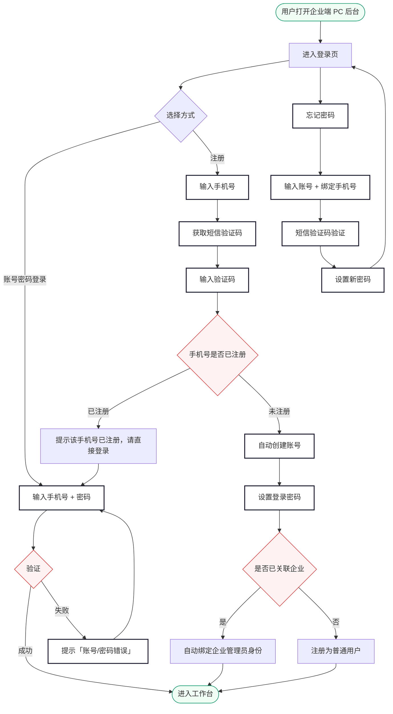
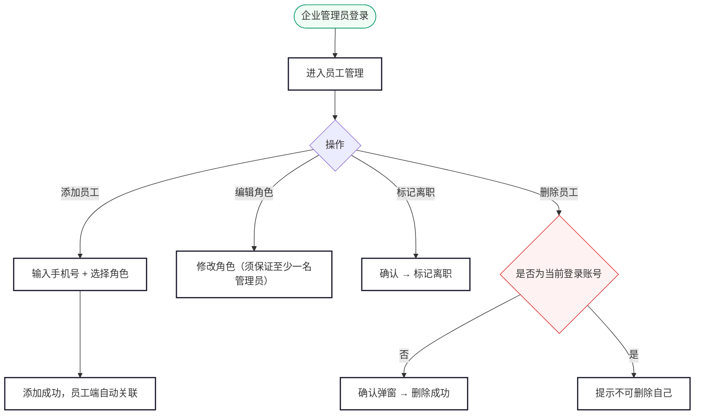
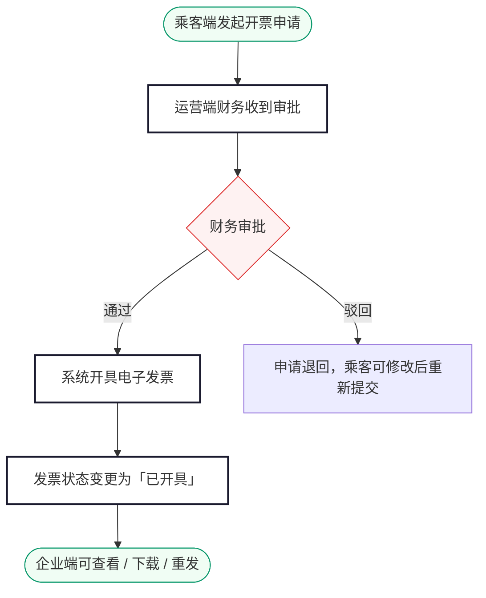

# 尊出行 · 企业端需求规格说明（PC Web 后台）

> 版本：V1.0 | 日期：2026-06-09 | 状态：编写中

---

## 目录

**登录**

1. [登录](#1-登录)

**首页**

2. [工作台](#2-工作台)

**人员管理**

3. [员工管理](#3-员工管理)

**业务管理**

4. [订单管理](#4-订单管理)

**财务**

5. [额度与消费](#5-额度与消费)
6. [账单管理](#6-账单管理)
7. [发票管理](#7-发票管理)

**设置**

8. [企业信息](#8-企业信息)

---

## 1. 登录

### 业务说明

企业端为 PC Web 后台，供企业内部管理员使用。提供**账号密码登录**和**手机号注册**两种方式。注册采用短信验证码方式，与乘客端注册流程一致：输入手机号+短信验证码，若手机号未注册则自动完成注册，注册后设置登录密码。企业管理员登录后可管理员工、查看用车订单、查阅额度与账单。

注册时系统自动校验手机号是否已在运营端企业客户中存在关联。若已关联则注册成功即绑定企业管理员身份；若未关联则注册为普通用户，需联系运营后台关联企业。

> 企业管理员账号与运营端账号体系完全隔离。同一手机号可同时绑定 C 端乘客身份和 B 端企业管理员身份，各自独立登录。

---

### 1.1 业务流程

---

### 1.2 登录

#### 页面路径

浏览器直接访问企业端 PC 后台 URL，未登录时自动跳转登录页。

#### 表单字段

| 字段 | 必填 | 输入规则 | 错误提示 |
|---|---|---|---|
| 账号 | 是 | 手机号，11 位数字 | 为空：「请输入账号」；格式错误：「请输入正确的手机号」 |
| 密码 | 是 | 6-20 位，字母+数字组合 | 为空：「请输入密码」 |
| 账号或密码错误 | — | 统一提示 **「账号/密码错误」**（不区分具体原因，避免账号枚举） | — |
| 账号被禁用 | — | 统一提示 **「账号/密码错误」** | — |

#### 按钮状态

| 状态 | 行为 |
|---|---|
| 默认 | 「登录」按钮可点击 |
| 点击后 | 按钮置灰显示「登录中…」，防止重复提交 |
| 登录失败 | 按钮恢复可点击，清空密码框 |

#### 登录态规则

| 规则 | 说明 |
|---|---|
| 有效期 | 登录成功后维持 24 小时，超时自动退出并跳回登录页 |
| 单点登录 | 同一账号仅允许一个设备在线，新登录踢掉旧会话，旧会话提示「您的账号在其他设备登录」 |
| 退出 | 点击右上角「退出登录」清除登录态，跳回登录页 |

---

### 1.3 忘记密码

#### 页面路径

登录页 → 点击「忘记密码」

#### 流程

| 步骤 | 操作 | 校验 |
|---|---|---|
| ① 输入身份信息 | 账号（手机号） | 手机号须为系统中已登记的企业管理员 |
| ② 安全验证 | 短信验证码 | 6 位数字、5 分钟有效，60 秒重发限制 |
| ③ 设置新密码 | 新密码 + 确认新密码 | 6-20 位字母+数字组合 |
| ④ 完成 | 提示重置成功 | 自动跳回登录页 |

#### 校验与提示

| 场景 | 提示 |
|---|---|
| 账号为空 | 「请输入账号」 |
| 账号格式错误 | 「请输入正确的手机号」 |
| 账号不存在 | 「账号或手机号错误」 |
| 短信验证码为空 | 「请输入验证码」 |
| 短信验证码错误 | 「验证码错误，请重新输入」 |
| 短信验证码超时 | 「验证码已失效，请重新获取」 |
| 新密码为空 | 「请输入新密码」 |
| 新密码格式错误 | 「密码为 6-20 位，需包含字母和数字」 |
| 两次密码不一致 | 「两次输入的密码不一致」 |
| 重置成功 | Toast「密码重置成功，请重新登录」，自动跳回登录页 |
| 网络异常 | Toast「网络异常，请重试」 |

---

### 1.4 注册

与乘客端注册流程一致，采用短信验证码方式。

#### 页面路径

登录页 → 点击「注册账号」

#### 表单字段

| 字段 | 必填 | 输入规则 | 错误提示 |
|---|---|---|---|
| 手机号 | 是 | 11 位数字 | 为空：「请输入手机号」；格式错误：「请输入正确的手机号」 |
| 短信验证码 | 是 | 6 位数字，5 分钟有效，60 秒重发限制 | 为空：「请输入验证码」；错误：「验证码错误」；超时：「验证码已失效」 |
| 登录密码 | 是 | 8-20 位，含字母和数字 | 为空：「请设置登录密码」；格式错误：「密码为 8-20 位，需包含字母和数字」 |
| 确认密码 | 是 | 与登录密码一致 | 不一致：「两次密码输入不一致」 |

#### 按钮状态

| 状态 | 行为 |
|---|---|
| 默认 | 「注册」按钮可点击 |
| 未填完 | 按钮置灰 |
| 点击后 | 按钮显示「注册中…」，防止重复提交 |

#### 注册后行为

| 场景 | 行为 |
|---|---|
| 手机号已关联企业 | 自动绑定企业管理员身份，进入工作台 |
| 手机号未关联企业 | 注册为普通用户，进入工作台（仅可查看额度，无管理权限）。提示「您的账号尚未关联企业，请联系运营后台绑定」 |
| 手机号已注册 | 提示「该手机号已注册，请直接登录」，自动跳回登录页 |

#### 短信验证码规则

| 规则 | 说明 |
|---|---|
| 有效期 | 6 位数字，5 分钟有效 |
| 重发限制 | 60 秒后可重新获取 |
| 频率限制 | 同一手机号 1 小时内最多 5 次，每日最多 10 次 |

---

## 2. 工作台

### 业务说明

工作台是企业管理员登录后的首页，集中展示企业核心数据概览，帮助管理员快速了解当前用车情况和额度状态。

#### 页面路径

登录成功后自动进入工作台。左侧导航栏点击「工作台」可随时返回。

---

### 2.1 页面布局

工作台上方为数据卡片区，下方为左右两栏布局：左侧最近用车列表，右侧近 7 天用车订单趋势图。

#### 核心数据卡片

| 卡片 | 内容 | 说明 |
|---|---|---|
| 剩余额度 | ¥ 金额 | 企业当前可用额度，低于阈值时红色警示 |
| 本月消费 | ¥ 金额 | 当月累计消费总额 |
| 本月订单 | 数字 | 当月已完成订单数 |
| 在职员工 | 数字 | 当前在职员工总数 |

#### 最近用车（左栏，占 50%）

展示最近 5 条用车订单，含订单号、用车人、类型、时间、金额、状态。点击「查看全部」跳转订单管理。

##### 最近用车交互

| 场景 | 行为 |
|---|---|
| 无用车记录 | 展示空状态提示「暂无用车记录」 |
| 点击「查看全部」 | 跳转订单管理页 |

#### 用车订单趋势图（右栏，占 50%）

展示近 7 天企业用车订单量趋势，折线图形式。

| 图表 | 说明 |
|---|---|
| 类型 | 折线图 |
| X 轴 | 日期（近 7 天，含今日） |
| Y 轴 | 订单数 |
| 数据点 | 每天完成的订单数量 |
| 悬停 | 鼠标悬停显示当日订单数 |
| 无数据 | 展示空状态「暂无数据」 |

#### 数据刷新

| 规则 | 说明 |
|---|---|
| 自动刷新 | 页面打开时加载最新数据，停留期间每 5 分钟自动刷新 |
| 手动刷新 | 右上角刷新按钮，点击立即刷新，按钮旋转动画 |
| 额度低于阈值 | 剩余额度卡片红色高亮闪烁提示 |

> 工作台数据每日自动刷新，也可手动点击右上角刷新按钮更新。

---

## 3. 员工管理

### 业务说明

员工管理维护企业内可使用企业支付的员工名单。企业管理员可添加、删除员工。员工被添加后，乘客端自动关联企业身份，可使用企业支付方式下单。

#### 页面路径

左侧导航栏 → 员工管理

---

### 3.1 业务流程

#### 角色说明

| 角色 | 说明 |
|---|---|
| 员工 | 可使用企业支付下单，无管理权限 |
| 财务 | 可使用企业支付下单，可查看企业额度和账单 |
| 企业管理员 | 拥有企业端全部权限（员工管理、用车管理、额度账单、发票管理、企业信息） |

#### 管理员约束

| 规则 | 说明 |
|---|---|
| 不可删除自己 | 当前登录的管理员不可删除自己的员工记录 |
| 至少一名管理员 | 修改管理员角色为其他角色时，须保证企业下至少还有一名管理员，否则阻止操作 |

> 员工即使尚未注册乘客端，也可被添加。乘客端初次登录时自动注册，系统匹配手机号关联企业。

---

### 3.2 员工列表

#### 顶部筛选

| 筛选项 | 类型 | 说明 |
|---|---|---|
| 角色 | 下拉 | 员工 / 财务 / 企业管理员 |
| 状态 | 多选 | 在职 / 已离职 |
| 关键字 | 文本 | 姓名 / 手机号 模糊匹配 |

#### 列表字段

| 列 | 内容 |
|---|---|
| 姓名 | 员工在乘客端的姓名（可能为空展示「—」） |
| 手机号 | 11 位手机号 |
| 角色 | 员工 / 财务 / 企业管理员（彩色 Tag） |
| 状态 | 在职（绿色 Tag）/ 已离职（灰色 Tag） |
| 加入时间 | YYYY-MM-DD |
| 操作 | 编辑角色 / 标记离职 / 删除 |

##### 按钮状态

| 按钮 | 默认状态 | 禁用条件 |
|---|---|---|
| 添加员工 | 可点击 | — |
| 批量导入 | 可点击 | — |
| 编辑角色 | 可点击 | 已离职员工置灰 |
| 标记离职 | 可点击 | 已离职员工置灰 |
| 删除 | 可点击 | 当前登录账号置灰（Tooltip「不可删除自己」）；已离职员工可删除 |

##### 列表操作交互

| 操作 | 适用状态 | 行为 | 提示 |
|---|---|---|---|
| 编辑角色 | 在职 | 弹出角色选择下拉，修改后保存。若将管理员改为其他角色，须保证企业下至少还有一名管理员 | Toast「角色已更新」 |
| 编辑角色（唯一管理员改角色） | — | 阻止提交 | Toast「企业至少需要一名管理员」 |
| 标记离职 | 在职 | 弹出确认「确认将 XXX 标记为离职？」 | Toast「已标记为离职」 |
| 删除 | 在职 / 已离职 | 弹出确认「确认删除员工 XXX？」 | Toast「员工已删除」 |
| 删除自己 | — | 按钮置灰 | Tooltip「不可删除自己」 |

---

### 3.3 添加员工

#### 弹窗字段

| 字段 | 必填 | 校验 / 说明 |
|---|---|---|
| 手机号 | 是 | 11 位手机号，不可重复添加 |
| 角色 | 是 | 下拉单选：员工 / 财务 / 企业管理员 |

#### 校验规则

| 场景 | 提示 |
|---|---|
| 手机号已关联本企业 | 「该用户已在本企业员工列表中」 |
| 添加成功 | Toast「员工添加成功」 |

##### 添加员工交互

| 场景 | 行为 | 提示 |
|---|---|---|
| 点击「添加员工」 | 弹出添加弹窗 | — |
| 手机号为空 | 提交按钮置灰 | Toast「请输入手机号」 |
| 手机号格式错误 | 阻止提交 | Toast「请输入正确的手机号」 |
| 手机号已在本企业 | 阻止提交 | Toast「该用户已在本企业员工列表中」 |
| 添加成功 | 弹窗关闭，列表刷新 | Toast「员工添加成功」 |
| 网络异常 | — | Toast「添加失败，请重试」 |

---

### 3.4 批量导入

支持通过 Excel 模板批量导入员工。

| 操作 | 行为 |
|---|---|
| 下载模板 | 下载标准 Excel 模板文件 |
| 上传文件 | 选择填写完成的 Excel 文件上传 |
| 导入校验 | 逐行校验手机号格式、是否已注册、是否重复 |
| 导入结果 | 展示成功数 / 失败数，失败行标注原因 |
| 全部成功 | Toast「导入成功，共 N 人」 |

##### 批量导入交互

| 场景 | 行为 | 提示 |
|---|---|---|
| 点击「批量导入」 | 弹出导入弹窗，含下载模板和上传文件按钮 | — |
| 上传非 Excel 文件 | 阻止上传 | Toast「请上传 .xlsx 格式文件」 |
| 导入成功 | 弹窗关闭，列表刷新 | Toast「导入成功，共 N 人」 |
| 导入成功（含失败） | 弹窗展示导入结果（成功 N 人 / 失败 M 人），失败行标注原因 | — |
| 网络异常 | — | Toast「导入失败，请重试」 |

---

## 4. 订单管理

### 业务说明

订单管理供企业管理员查看本企业所有员工使用企业支付的用车订单。页面顶部按订单类型分为两个 Tab，各 Tab 下按状态筛选。企业端仅有查看权限，不可派车、改派、取消订单或修改订单信息。

#### 页面路径

左侧导航栏 → 订单管理

---

### 4.1 订单类型 Tab

| Tab | 说明 |
|---|---|
| 包车订单 | 包车出行类型的订单 |
| 租车订单 | 租车出行类型的订单 |

> 包车订单与租车订单的列表字段不同（详见 §4.1.3 / §4.1.4），切换 Tab 时列表字段联动变化。

---

### 4.2 状态 Tab

在订单类型 Tab 下，进一步按状态筛选：

| Tab | 含义 |
|---|---|
| 全部 | 所有订单（默认） |
| 待支付 | 已下单未支付 + 待补款 |
| 待派车 | 已支付未派车 |
| 待开始 | 已派车未到出发时间 |
| 行程中 | 已开始未结束 |
| 已完成 | 行程正常结束、款项结清 |
| 已取消 | 乘客取消的订单 |

---

### 4.3 顶部筛选

| 筛选项 | 类型 | 说明 |
|---|---|---|
| 员工 | 下拉 + 搜索 | 按员工姓名或手机号筛选 |
| 用车时间 | 日期范围 | 包车按用车时段筛选；租车按租期起始筛选 |
| 下单时间 | 日期范围 | — |
| 关键字 | 文本 | 订单号模糊匹配 |

---

### 4.4 包车订单 — 列表字段

| 列 | 内容 |
|---|---|
| 订单号 | ZC20260608-0001（点击进入详情） |
| 订单类型 | 「包车」彩色 Tag |
| 用车人 | 员工姓名 + 手机号 |
| 用车时间 | 起始日期时间 ~ 结束日期时间（多日展示天数） |
| 上车地点 | 简略地址 |
| 下车地点 | 简略地址 |
| 司机 | 姓名（未派车显示「待派车」） |
| 车辆 | 车牌号 + 车型 |
| 金额 | 实付金额 |
| 状态 | 状态标签 |
| 下单时间 | YYYY-MM-DD HH:mm |

---

### 4.5 租车订单 — 列表字段

| 列 | 内容 |
|---|---|
| 订单号 | ZC20260608-0001（点击进入详情） |
| 订单类型 | 「租车」彩色 Tag |
| 用车人 | 员工姓名 + 手机号 |
| 租期 | 起始日期 ~ 结束日期 + 共 N 天 |
| 取车地点 | 简略地址 |
| 还车地点 | 简略地址 |
| 送车司机 | 姓名（未派车显示「待派车」） |
| 收车司机 | 姓名 |
| 车辆 | 车牌号 + 车型 |
| 金额 | 实付金额 |
| 状态 | 状态标签 |
| 下单时间 | YYYY-MM-DD HH:mm |

---

### 4.6 订单详情

订单详情以侧抽屉形式打开（宽度约 60%），仅展示企业管理员可见的订单信息。详情为只读视图，不可修改。包车订单和租车订单详情结构不同，分别在下方描述。

---

#### 4.6.1 包车订单详情

##### 提示条

详情顶部按状态展示提示条：

| 状态 | 类型 | 标题 | 正文 |
|---|---|---|---|
| 待支付 | 琥珀色 | 等待支付 | 订单已提交，等待员工完成支付 |
| 待派车 | 琥珀色 | 等待派车 | 运营正在安排车辆与司机，请您耐心等待 |
| 待开始 | 蓝色 | 行程待开始 | 车辆和司机已确认：李师傅 · 京A12345 |
| 行程中 | 绿色 | 行程进行中 | 李师傅 · 京A12345，当前行程进行中 |
| 已完成 | 绿色 | 行程已完成 | 感谢使用尊出行，欢迎再次出行 |
| 已取消 | 红色 | 订单已取消 | 显示取消原因 |
| 待补款 | 红色 | 差额待付 | 行程结束产生额外费用，等待员工完成补款 |

##### 区块结构

| 区块 | 内容 |
|---|---|
| 基本信息 | 订单号（如 ZC20260608-0001）/ 类型（「包车」彩色 Tag）/ 状态 / 子状态（待补款时展示）/ 下单时间 |
| 用车人信息 | 姓名（可能为空展示「—」）/ 手机号 / 角色 |
| 用车信息 | 用车时段（如 2026-06-08 08:00 ~ 2026-06-09 18:00）/ 天数（2天）/ 上车地点（简略地址）/ 下车地点（简略地址）/ 人数 / 行李 |
| 日程与派车 | 按日展示（见下方表格）；未派车时展示「待派车」红色标签 |
| 费用明细 | 基础费 ¥X / 超时费 ¥X（红色）/ 超里程费 ¥X（红色）/ 实付金额 ¥X（加粗）。未产生费用展示 ¥0.00 |
| 订单动态 | 按状态展示时间线（见下方） |

##### 日程与派车展示

每个出行日对应一行：

| 日期 | 时段 | 车辆 | 司机 | 状态 |
|---|---|---|---|---|
| 06-08 | 08:00-18:00 | 京A12345 · 奔驰V260L | 李师傅 138xxxx | 进行中 |
| 06-09 | 08:00-18:00 | 京A12345 · 奔驰V260L | 李师傅 138xxxx | 未开始 |

> 未派车时，车辆和司机列展示「—」。

##### 订单动态

| 状态 | 动态节点（最新在上） |
|---|---|
| 待支付 | 订单已提交 |
| 待派车 | 支付成功 → 订单已提交 |
| 待开始 | 已派车（车型+车牌+司机）→ 支付成功 → 订单已提交 |
| 行程中 | 行程开始 → 已派车 → 支付成功 → 订单已提交 |
| 已完成 | 行程结束 → 行程开始 → 已派车 → 支付成功 → 订单已提交 |
| 已取消 | 订单已取消（取消原因）→ 支付成功 → 订单已提交 |
| 待补款 | 行程结束（有待补款）→ 行程开始 → 已派车 → 支付成功 → 订单已提交 |

---

#### 4.6.2 租车订单详情

##### 提示条

| 状态 | 类型 | 标题 | 正文 |
|---|---|---|---|
| 待支付 | 琥珀色 | 等待支付 | 订单已提交，等待员工完成支付 |
| 待派车 | 琥珀色 | 等待派车 | 运营正在安排送车司机与车辆 |
| 待开始 | 蓝色 | 等待取车 | 送车司机正在将车辆送达取车点 |
| 行程中 | 绿色 | 行程进行中 | 车辆使用中 |
| 已完成 | 绿色 | 行程已完成 | 感谢使用尊出行 |
| 已取消 | 红色 | 订单已取消 | 显示取消原因 |
| 待补款 | 红色 | 差额待付 | 等待员工完成补款 |

##### 区块结构

| 区块 | 内容 |
|---|---|
| 基本信息 | 订单号 / 类型（「租车」彩色 Tag）/ 状态 / 子状态（待补款时展示）/ 下单时间 |
| 用车人信息 | 姓名 / 手机号 / 角色 |
| 用车信息 | 租期（如 2026-06-08 ~ 2026-06-10）/ 天数（3天）/ 取车地点 / 还车地点 |
| 派车信息 | 车辆（车牌+车型）/ 送车司机（姓名+手机号）/ 收车司机（姓名+手机号）。未派车时展示「待派车」红色标签 |
| 驾驶人信息 | 驾驶人姓名 / 手机号 / 驾驶证类型 |
| 费用明细 | 日租价 × 天数 = ¥X / 超时费 ¥X / 超里程费 ¥X / 实付金额 ¥X（加粗） |
| 订单动态 | 按状态展示时间线（见下方） |

##### 派车信息展示

| 项目 | 内容（示例） |
|---|---|
| 车辆 | 京A34567 · 奥迪A6L |
| 送车司机 | 赵师傅 138xxxx1111 |
| 收车司机 | 钱师傅 138xxxx2222 |

> 送车司机和收车司机可为同一人。

##### 订单动态

| 状态 | 动态节点（最新在上） |
|---|---|
| 待支付 | 订单已提交 |
| 待派车 | 支付成功 → 订单已提交 |
| 待开始 | 送车已派发（司机+车辆）→ 支付成功 → 订单已提交 |
| 行程中 | 已确认取车 → 车辆已送达 → 送车已派发 → 支付成功 → 订单已提交 |
| 已完成 | 已还车 → 已确认取车 → 车辆已送达 → 送车已派发 → 支付成功 → 订单已提交 |
| 已取消 | 订单已取消（取消原因）→ 支付成功 → 订单已提交 |
| 待补款 | 已还车（有待补款）→ 已确认取车 → 车辆已送达 → 送车已派发 → 支付成功 → 订单已提交 |

---

##### 订单列表交互

| 场景 | 行为 | 提示 |
|---|---|---|
| 无订单记录 | 展示空状态提示「暂无订单记录」 |
| 点击订单号 | 侧抽屉打开订单详情 | — |
| 关键字搜索 | 支持订单号模糊匹配 | — |

> 企业端订单详情为只读视图，不可修改。取消订单由乘客端发起。

---

### 4.7 状态流转规则

企业端订单状态与运营端同步，状态由系统自动流转：

| 当前状态 | 触发事件 | 下一状态 |
|---|---|---|
| 待支付 | 乘客完成支付 | 待派车 |
| 待支付 | 支付超时（20 分钟） | 已取消 |
| 待派车 | 运营派车 | 待开始 |
| 待派车 | 调度超时（出发前 2h 未派车） | 已取消 |
| 待开始 | 司机出发 / 乘客取车 | 行程中 |
| 行程中 | 正常结束（无额外费用） | 已完成 |
| 行程中 | 正常结束（有额外费用） | 待补款 |
| 行程中 | 乘客取消 | 已取消 |
| 待补款 | 乘客完成补款 | 已完成 |

> 企业端不可修改任何订单状态。

---

## 5. 额度与消费

### 业务说明

额度与消费模块展示企业当前额度状态及历史消费/退款明细。额度由运营后台调整，企业端仅可查看。

#### 页面路径

左侧导航栏 → 额度与消费

---

### 5.1 额度总览

页面顶部展示额度概览：

| 指标 | 内容 |
|---|---|
| 总额度 | 运营后台累计调增的额度总额 |
| 已使用 | 累计消费金额 |
| 剩余额度 | 总额度 - 已使用（低于阈值时红色警示） |

---

### 5.2 消费明细

#### 顶部筛选

| 筛选项 | 类型 | 说明 |
|---|---|---|
| 时间范围 | 月份选择 | 默认当月，可切换历史月份 |
| 员工 | 下拉 + 搜索 | 按员工筛选 |
| 类型 | 多选 | 消费 / 退款 |

#### 列表字段

| 列 | 内容 |
|---|---|
| 时间 | YYYY-MM-DD HH:mm |
| 类型 | 消费（红色 -）/ 退款（绿色 +） |
| 金额 | ¥ 金额 |
| 关联订单 | 订单号（点击跳转订单详情） |
| 用车人 | 员工姓名 |
| 说明 | 消费来源或退款原因 |

#### 顶部汇总

| 汇总项 | 内容 |
|---|---|
| 当月消费总额 | ¥ 金额 |
| 当月退款总额 | ¥ 金额 |

##### 消费明细交互

| 场景 | 行为 |
|---|---|
| 无记录 | 展示空状态提示「暂无消费记录」 |
| 点击关联订单号 | 跳转该订单详情 |
| 月份切换 | 切换查看历史月份数据 |
| 按员工筛选 | 下拉选择员工（默认展示全员） |

---

### 5.3 额度变动记录

展示运营后台调整额度的历史记录（只读）。

#### 列表字段

| 列 | 内容 |
|---|---|
| 时间 | YYYY-MM-DD HH:mm |
| 类型 | 调增（绿色 +¥）/ 调减（红色 -¥） |
| 金额 | ¥ 金额（带千分位，如 ¥12,350） |
| 操作员 | 运营人员姓名 |
| 原因 | 调整原因 |

#### 交互

| 场景 | 行为 |
|---|---|
| 无记录 | 展示空状态提示「暂无额度变动记录」 |
| 分页 | 每页 20 条，支持翻页 |

---

## 6. 账单管理

### 业务说明

账单管理展示企业月度账单，数据与运营端一致。

#### 页面路径

左侧导航栏 → 账单管理，数据与运营端账单一致。每月 1 日系统自动生成上月账单。MVP 阶段企业结算为线下方式：企业根据账单金额线下打款，运营端确认结算后账单状态同步更新。企业端不设在线支付入口。

---

### 6.1 账单列表

#### 顶部筛选

| 筛选项 | 类型 | 说明 |
|---|---|---|
| 账单月份 | 月份选择 | 默认上月（当月账单未生成不展示） |
| 结算状态 | 多选 | 待结算 / 部分结算 / 已结算 |

#### 列表字段

| 列 | 内容 |
|---|---|
| 账单编号 | BILL202606-0001 |
| 账单月份 | YYYY-MM |
| 当期消费 | 当月消费总额 |
| 当期退款 | 当月退款总额 |
| 待结算总额 | 当期消费 - 当期退款 |
| 已结算金额 | 企业已结算金额 |
| 结算状态 | 待结算（琥珀色）/ 部分结算（蓝色）/ 已结算（绿色） |
| 操作 | 查看详情 |

---

### 6.2 账单详情

#### 区块结构

| 区块 | 内容 |
|---|---|
| 账单概要 | 账单编号 / 账单月份 / 当期消费 / 当期退款 / 待结算总额 / 已结算金额 / 结算状态 |
| 账单明细 | 分为消费明细和退款明细两部分，与运营端数据一致 |
| 消费明细 | 日期 / 订单号 / 类型 / 用车人 / 金额 |
| 退款明细 | 日期 / 退款单号 / 关联订单 / 金额 / 原因 |
| 结算记录 | 仅已结算和部分结算状态的账单展示。历次结算记录：操作人 / 结算时间 / 结算金额 / 客户支付凭证（点击预览） |

##### 账单操作交互

| 场景 | 行为 | 提示 |
|---|---|---|
| 无账单 | 展示空状态提示「暂无账单」 |
| 点击「查看详情」 | 侧抽屉打开账单详情 | — |
| 导出明细 | 将账单明细导出为 Excel 文件 | Toast「导出成功」 |
| 导出失败 | — | Toast「导出失败，请重试」 |

> 账单明细支持导出 Excel。账单数据为只读，企业端不可修改。

---

## 7. 发票管理

### 业务说明

发票由乘客端发起申请，运营端财务审批后开具。企业端仅可查看本企业的发票记录。

#### 页面路径

左侧导航栏 → 发票管理

企业端不直接发起开票申请。本企业的发票记录，下载或重发已开具的发票。企业端不直接发起开票申请。

#### 发票流程

---

### 7.1 发票列表

#### 顶部筛选

| 筛选项 | 类型 | 说明 |
|---|---|---|
| 发票状态 | 多选 | 待审批 / 已驳回 / 已开具 / 已作废 |
| 时间范围 | 日期范围 | 申请时间 |

#### 列表字段

| 列 | 内容 |
|---|---|
| 发票编号 | INV202606-0001 |
| 发票类型 | 企业发票 |
| 关联订单 | 单笔订单号或「合并开票（N 笔）」 |
| 开票金额 | ¥ 金额 |
| 申请人 | 乘客端发起申请的员工姓名 |
| 申请时间 | YYYY-MM-DD HH:mm |
| 开具时间 | YYYY-MM-DD HH:mm（未开具展示「—」） |
| 状态 | 状态标签 |
| 操作 | 查看详情 / 下载（已开具）/ 重发邮箱（已开具） |

#### 状态颜色

| 状态 | 颜色 | 说明 |
|---|---|---|
| 待审批 | 琥珀色 | 乘客已提交，等待财务审批 |
| 已驳回 | 红色 | 财务驳回，乘客可修改后重新提交 |
| 已开具 | 绿色 | 审批通过并已开具 |
| 已作废 | 灰色 | 已作废（需运营端操作） |

---

### 7.2 发票详情

| 区块 | 内容 |
|---|---|
| 发票信息 | 发票编号 / 发票类型 / 开票金额 / 申请时间 / 开具时间 / 状态 |
| 关联订单 | 订单列表（点击跳转订单详情） |
| 发票抬头 | 企业名称 / 税号 |
| 接收邮箱 | 发票接收邮箱 |
| 审批记录 | 审批人 / 审批时间 / 审批结果 / 驳回原因（已驳回时展示） |

##### 发票列表交互

| 场景 | 行为 | 提示 |
|---|---|---|
| 无发票记录 | 展示空状态提示「暂无发票记录」 |
| 点击发票编号 | 进入发票详情页 | — |

#### 操作

| 操作 | 适用状态 | 行为 | 提示 |
|---|---|---|---|
| 下载 | 已开具 | 下载 PDF 格式电子发票 | — |
| 重发邮箱 | 已开具 | 重新发送至接收邮箱 | Toast「发票已重新发送」 |

> 企业端发票为只读视图，不可发起开票申请、不可修改发票信息。开票申请由乘客端发起。

---

## 8. 企业信息

### 业务说明

企业信息模块展示和维护企业基本资料，企业管理员可自行修改。

#### 页面路径

左侧导航栏 → 企业信息

---

### 8.1 基本信息

| 字段 | 可编辑 | 校验 / 说明 |
|---|---|---|
| 企业名称 | 是 | ≤50 字 |
| 统一社会信用代码 | 是 | 18 位 |
| 联系人姓名 | 是 | ≤20 字 |
| 联系人手机号 | 是 | 11 位手机号 |

##### 编辑交互

页面初始为只读展示，右上角「编辑」按钮。

| 场景 | 行为 | 提示 |
|---|---|---|
| 点击「编辑」 | 表单切换为可编辑状态，按钮变为「保存」「取消」 | — |
| 修改并保存 | 校验通过后保存 | Toast「企业信息已更新」 |
| 取消编辑 | 恢复只读状态，输入值丢弃 | — |
| 企业名称为空 | 阻止保存 | Toast「企业名称不能为空」 |
| 统一社会信用代码格式错误 | 阻止保存 | Toast「请输入 18 位统一社会信用代码」 |
| 手机号格式错误 | 阻止保存 | Toast「请输入正确的手机号」 |
| 保存失败（网络异常） | — | Toast「保存失败，请重试」 |

