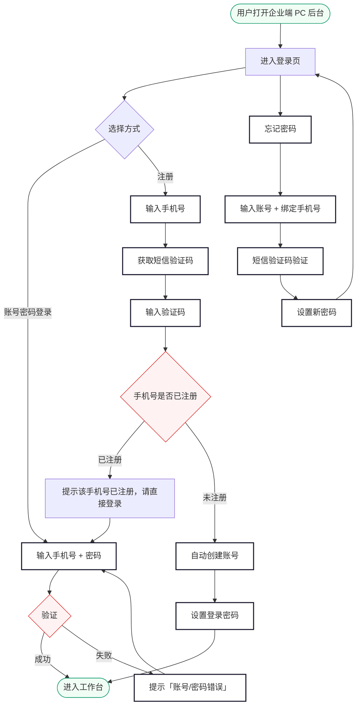
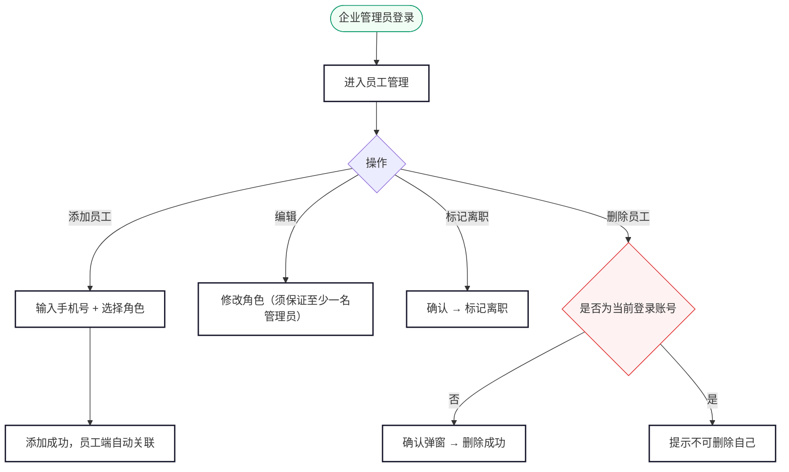
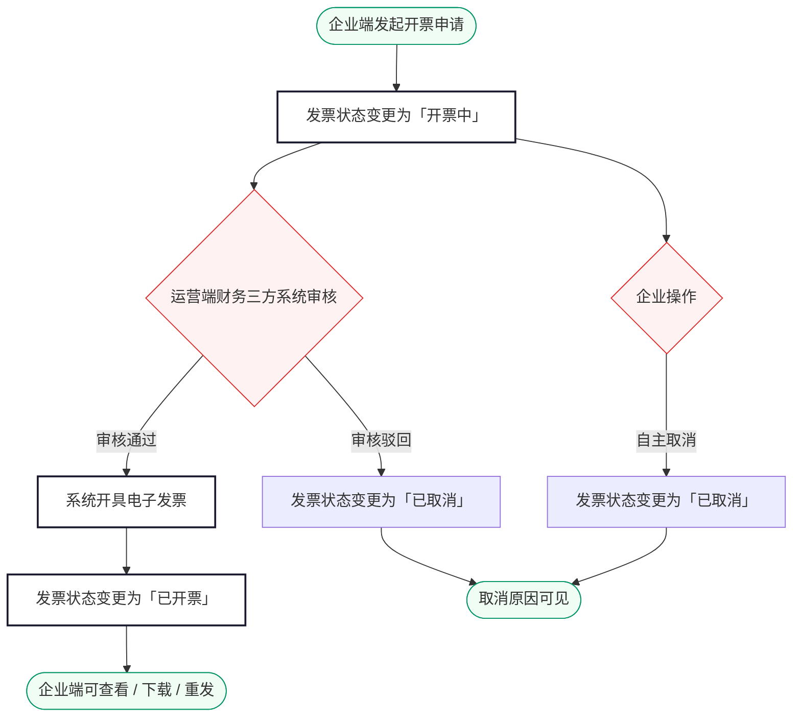

# 尊出行 · 企业端需求规格说明（PC Web 后台）

> 版本：V1.0 | 日期：2026-06-09 | 状态：编写中

---

## 目录

**登录**

1. [登录](#1-登录)

**首页**

2. [工作台](#2-工作台)

**人员管理**

3. [员工管理](#3-员工管理)

**业务管理**

4. [订单管理](#4-订单管理)

**财务**

5. [额度与消费](#5-额度与消费)
6. [账单管理](#6-账单管理)
7. [发票管理](#7-发票管理)

**设置**

8. [企业信息](#8-企业信息)

---

<a id="1-登录"></a>

## 1. 登录

### 业务说明

企业端为 PC Web 后台，供企业内部管理员使用。提供**账号密码登录**和**手机号注册**两种方式。注册为企业账号注册，仅需手机号 + 短信验证码 + 设置密码。若手机号尚未注册过企业账号，则自动创建企业管理员账号；若已注册过，则提示直接登录。企业管理员登录后可管理员工、查看用车订单、查阅额度与账单。

> 企业端注册与乘客端注册完全独立。同一手机号可分别在乘客端（C 端）和企业端（B 端）各自注册，互不影响。企业管理员账号与运营端账号体系也完全隔离。同一手机号可同时绑定 C 端乘客身份和 B 端企业管理员身份，各自独立登录。

---

### 1.1 业务流程



---

### 1.2 登录

#### 页面路径

浏览器直接访问企业端 PC 后台 URL，未登录时自动跳转登录页。

#### 表单字段

| 字段 | 必填 | 输入规则 | 错误提示 |
|---|---|---|---|
| 账号 | 是 | 手机号，11 位数字 | 为空：「请输入账号」；格式错误：「请输入正确的手机号」 |
| 密码 | 是 | 6-20 位，字母+数字组合 | 为空：「请输入密码」 |
| 账号或密码错误 | — | 统一提示 **「账号/密码错误」**（不区分具体原因，避免账号枚举） | — |
| 账号被禁用 | — | 统一提示 **「账号/密码错误」** | — |

#### 按钮状态

| 状态 | 行为 |
|---|---|
| 默认 | 「登录」按钮可点击 |
| 点击后 | 按钮置灰显示「登录中…」，防止重复提交 |
| 登录失败 | 按钮恢复可点击，清空密码框 |

#### 登录态规则

| 规则 | 说明 |
|---|---|
| 有效期 | 登录成功后维持 24 小时，超时自动退出并跳回登录页 |
| 单点登录 | 同一账号仅允许一个设备在线，新登录踢掉旧会话，旧会话提示「您的账号在其他设备登录」 |
| 退出 | 点击右上角「退出登录」清除登录态，跳回登录页 |

---

### 1.3 忘记密码

#### 页面路径

登录页 → 点击「忘记密码」

#### 流程

| 步骤 | 操作 | 校验 |
|---|---|---|
| ① 输入身份信息 | 账号（手机号） | 手机号须为系统中已登记的企业管理员 |
| ② 安全验证 | 短信验证码 | 6 位数字、5 分钟有效，60 秒重发限制 |
| ③ 设置新密码 | 新密码 + 确认新密码 | 6-20 位字母+数字组合 |
| ④ 完成 | 提示重置成功 | 自动跳回登录页 |

#### 校验与提示

| 场景 | 提示 |
|---|---|
| 账号为空 | 「请输入账号」 |
| 账号格式错误 | 「请输入正确的手机号」 |
| 账号不存在 | 「账号或手机号错误」 |
| 短信验证码为空 | 「请输入验证码」 |
| 短信验证码错误 | 「验证码错误，请重新输入」 |
| 短信验证码超时 | 「验证码已失效，请重新获取」 |
| 新密码为空 | 「请输入新密码」 |
| 新密码格式错误 | 「密码为 6-20 位，需包含字母和数字」 |
| 两次密码不一致 | 「两次输入的密码不一致」 |
| 重置成功 | Toast「密码重置成功，请重新登录」，自动跳回登录页 |
| 网络异常 | Toast「网络异常，请重试」 |

---

### 1.4 注册

企业账号注册，注册成功后即为企业管理员。注册时仅校验手机号是否已注册过企业账号，不校验关联企业。

#### 页面路径

登录页 → 点击「注册账号」

#### 表单字段

| 字段 | 必填 | 输入规则 | 错误提示 |
|---|---|---|---|
| 手机号 | 是 | 11 位数字 | 为空：「请输入手机号」；格式错误：「请输入正确的手机号」 |
| 短信验证码 | 是 | 6 位数字，5 分钟有效，60 秒重发限制 | 为空：「请输入验证码」；错误：「验证码错误」；超时：「验证码已失效」 |
| 登录密码 | 是 | 8-20 位，含字母和数字 | 为空：「请设置登录密码」；格式错误：「密码为 8-20 位，需包含字母和数字」 |
| 确认密码 | 是 | 与登录密码一致 | 不一致：「两次密码输入不一致」 |

#### 按钮状态

| 状态 | 行为 |
|---|---|
| 默认 | 「注册」按钮可点击 |
| 未填完 | 按钮置灰 |
| 点击后 | 按钮显示「注册中…」，防止重复提交 |

#### 注册后行为

| 场景 | 行为 |
|---|---|
| 手机号未注册过企业账号 | 创建企业管理员账号 → Toast「注册成功」 → 进入工作台 |
| 手机号已注册过企业账号 | 提示「该手机号已注册企业账号，请直接登录」，自动跳回登录页 |
| 短信验证码错误/过期 | 提示对应错误信息，留在注册页 |

#### 短信验证码规则

| 规则 | 说明 |
|---|---|
| 有效期 | 6 位数字，5 分钟有效 |
| 重发限制 | 60 秒后可重新获取 |
| 频率限制 | 同一手机号 1 小时内最多 5 次，每日最多 10 次 |

---

<a id="2-工作台"></a>

## 2. 工作台

### 业务说明

工作台是企业管理员登录后的首页，集中展示企业核心数据概览，帮助管理员快速了解当前用车情况和额度状态。

#### 页面路径

登录成功后自动进入工作台。左侧导航栏点击「工作台」可随时返回。

---

### 2.1 页面布局

工作台上方为数据卡片区，下方依次为：近 30 天用车订单趋势图（上）和进行中订单列表（下）。趋势图为全宽折线图，进行中订单为全宽列表，仅展示未完成订单（排除已完成、已取消）。

#### 核心数据卡片

| 卡片 | 内容 | 说明 |
|---|---|---|
| 剩余额度 | ¥ 金额 | 企业当前可用额度，低于阈值时红色警示 |
| 本月消费 | ¥ 金额 | 当月累计消费总额 |
| 本月订单 | 数字 | 当月已完成订单数 |
| 在职员工 | 数字 | 当前在职员工总数 |

#### 进行中订单（下方全宽）

展示进行中的订单（排除已完成和已取消），含订单号、用车人、类型、时间、金额、状态。点击「查看全部」跳转订单管理。

##### 最近用车交互

| 场景 | 行为 |
|---|---|
| 无进行中订单 | 展示空状态提示「暂无进行中订单」 |
| 点击「查看全部」 | 跳转订单管理页 |

#### 用车订单趋势图（右栏，占 50%）

展示近 30 天企业用车订单量趋势，折线图形式。

| 图表 | 说明 |
|---|---|
| 类型 | 折线图 |
| X 轴 | 日期（近 30 天，含今日） |
| Y 轴 | 订单数 |
| 数据点 | 每天完成的订单数量 |
| 悬停 | 鼠标悬停显示当日订单数 |
| 无数据 | 展示空状态「暂无数据」 |

#### 数据刷新

| 规则 | 说明 |
|---|---|
| 自动刷新 | 页面打开时加载最新数据，停留期间每 5 分钟自动刷新 |
| 手动刷新 | 右上角刷新按钮，点击立即刷新，按钮旋转动画 |
| 额度低于阈值 | 剩余额度卡片红色高亮闪烁提示 |

> 工作台数据每日自动刷新，也可手动点击右上角刷新按钮更新。

---

<a id="3-员工管理"></a>

## 3. 员工管理

### 业务说明

员工管理维护企业内可使用企业支付的员工名单。企业管理员可添加、删除员工。员工被添加后，乘客端自动关联企业身份，可使用企业支付方式下单。

#### 页面路径

左侧导航栏 → 员工管理

---

### 3.1 业务流程



#### 角色说明

| 角色 | 说明 |
|---|---|
| 员工 | 可使用企业支付下单，无管理权限 |
| 财务 | 可使用企业支付下单，可查看企业额度和账单 |
| 企业管理员 | 拥有企业端全部权限（员工管理、用车管理、额度账单、发票管理、企业信息） |

#### 管理员约束

| 规则 | 说明 |
|---|---|
| 不可删除自己 | 当前登录的管理员不可删除自己的员工记录 |
| 至少一名管理员 | 修改管理员角色为其他角色时，须保证企业下至少还有一名管理员，否则阻止操作 |

> 员工即使尚未注册乘客端，也可被添加。乘客端初次登录时自动注册，系统匹配手机号关联企业。

---

### 3.2 员工列表

#### 顶部筛选

| 筛选项 | 类型 | 说明 |
|---|---|---|
| 角色 | 下拉 | 员工 / 财务 / 企业管理员 |
| 状态 | 多选 | 在职 / 已离职 |
| 关键字 | 文本 | 姓名 / 手机号 模糊匹配 |

#### 列表字段

| 列 | 内容 |
|---|---|
| 姓名 | 员工在乘客端的姓名（可能为空展示「—」） |
| 手机号 | 11 位手机号 |
| 角色 | 员工 / 财务 / 企业管理员（彩色 Tag） |
| 状态 | 在职（绿色 Tag）/ 已离职（灰色 Tag） |
| 加入时间 | YYYY-MM-DD |
| 操作 | 编辑 / 标记离职 / 删除 |

##### 按钮状态

| 按钮 | 默认状态 | 禁用条件 |
|---|---|---|
| 添加员工 | 可点击 | — |
| 批量导入 | 可点击 | — |
| 编辑 | 可点击 | 已离职员工置灰 |
| 标记离职 | 可点击 | 已离职员工置灰 |
| 删除 | 可点击 | 当前登录账号置灰（Tooltip「不可删除自己」）；已离职员工可删除 |

##### 列表操作交互

| 操作 | 适用状态 | 行为 | 提示 |
|---|---|---|---|
| 编辑 | 在职 | 弹出角色选择下拉，修改后保存。若将管理员改为其他角色，须保证企业下至少还有一名管理员 | Toast「角色已更新」 |
| 编辑（唯一管理员改角色） | — | 阻止提交 | Toast「企业至少需要一名管理员」 |
| 标记离职 | 在职 | 弹出确认「确认将 XXX 标记为离职？」 | Toast「已标记为离职」 |
| 删除 | 在职 / 已离职 | 弹出确认「确认删除员工 XXX？」 | Toast「员工已删除」 |
| 删除自己 | — | 按钮置灰 | Tooltip「不可删除自己」 |

---

### 3.3 添加员工

#### 弹窗字段

| 字段 | 必填 | 校验 / 说明 |
|---|---|---|
| 手机号 | 是 | 11 位手机号，不可重复添加 |
| 角色 | 是 | 下拉单选：员工 / 财务 / 企业管理员 |

#### 校验规则

| 场景 | 提示 |
|---|---|
| 手机号已关联本企业 | 「该用户已在本企业员工列表中」 |
| 添加成功 | Toast「员工添加成功」 |

##### 添加员工交互

| 场景 | 行为 | 提示 |
|---|---|---|
| 点击「添加员工」 | 弹出添加弹窗 | — |
| 手机号为空 | 提交按钮置灰 | Toast「请输入手机号」 |
| 手机号格式错误 | 阻止提交 | Toast「请输入正确的手机号」 |
| 手机号已在本企业 | 阻止提交 | Toast「该用户已在本企业员工列表中」 |
| 添加成功 | 弹窗关闭，列表刷新 | Toast「员工添加成功」 |
| 网络异常 | — | Toast「添加失败，请重试」 |

---

### 3.4 批量导入

支持通过 Excel 模板批量导入员工。

| 操作 | 行为 |
|---|---|
| 下载模板 | 下载标准 Excel 模板文件 |
| 上传文件 | 选择填写完成的 Excel 文件上传 |
| 导入校验 | 逐行校验手机号格式、是否已注册、是否重复 |
| 导入结果 | 展示成功数 / 失败数，失败行标注原因 |
| 全部成功 | Toast「导入成功，共 N 人」 |

##### 批量导入交互

| 场景 | 行为 | 提示 |
|---|---|---|
| 点击「批量导入」 | 弹出导入弹窗，含下载模板和上传文件按钮 | — |
| 上传非 Excel 文件 | 阻止上传 | Toast「请上传 .xlsx 格式文件」 |
| 导入成功 | 弹窗关闭，列表刷新 | Toast「导入成功，共 N 人」 |
| 导入成功（含失败） | 弹窗展示导入结果（成功 N 人 / 失败 M 人），失败行标注原因 | — |
| 网络异常 | — | Toast「导入失败，请重试」 |

---

<a id="4-订单管理"></a>

## 4. 订单管理

### 业务说明

订单管理供企业管理员查看本企业所有员工使用企业支付的用车订单。页面顶部按订单类型分为两个 Tab，各 Tab 下按状态筛选。企业端仅有查看权限，不可派车、改派、取消订单或修改订单信息。

#### 页面路径

左侧导航栏 → 订单管理

---

### 4.1 订单类型 Tab

| Tab | 说明 |
|---|---|
| 包车订单 | 包车出行类型的订单 |
| 租车订单 | 租车出行类型的订单 |

> 包车订单与租车订单的列表字段不同（详见 §4.1.3 / §4.1.4），切换 Tab 时列表字段联动变化。

---

### 4.2 状态 Tab

在订单类型 Tab 下，进一步按状态筛选：

| Tab | 含义 |
|---|---|
| 全部 | 所有订单（默认） |
| 待支付 | 已下单未支付 + 待补款 |
| 待开始 | 已支付未到出发时间（含待派车：运营未分配车辆/司机；待接驾：包车已派车；待取车：租车已派车） |
| 进行中 | 已开始未结束 |
| 已完成 | 行程正常结束、款项结清 |
| 已取消 | 乘客取消的订单 |

---

### 4.3 顶部筛选

| 筛选项 | 类型 | 说明 |
|---|---|---|
| 员工 | 下拉 + 搜索 | 按员工姓名或手机号筛选 |
| 用车时间 | 日期范围 | 包车按用车时段筛选；租车按租期起始筛选 |
| 下单时间 | 日期范围 | — |
| 关键字 | 文本 | 订单号模糊匹配 |

---

### 4.4 包车订单 — 列表字段

| 列 | 内容 |
|---|---|
| 订单号 | ZC20260608-0001（点击进入详情） |
| 订单类型 | 「包车」彩色 Tag |
| 用车人 | 员工姓名 + 手机号 |
| 用车时间 | 起始日期时间 ~ 结束日期时间（多日展示天数） |
| 上车地点 | 简略地址 |
| 下车地点 | 简略地址 |
| 司机 | 姓名（未派车显示「-」） |
| 车辆 | 车牌号 + 车型 |
| 金额 | 实付金额 |
| 状态 | 状态标签 |
| 下单时间 | YYYY-MM-DD HH:mm |
| 操作 | 「详情」按钮，点击打开订单详情抽屉 |

---

### 4.5 租车订单 — 列表字段

| 列 | 内容 |
|---|---|
| 订单号 | ZC20260608-0001（点击进入详情） |
| 订单类型 | 「租车」彩色 Tag |
| 用车人 | 员工姓名 + 手机号 |
| 租期 | 起始日期 ~ 结束日期 + 共 N 天 |
| 取车地点 | 简略地址 |
| 还车地点 | 简略地址 |
| 送车司机 | 姓名（未派车显示「-」） |
| 收车司机 | 姓名（未派车显示「-」） |
| 车辆 | 车牌号 + 车型 |
| 金额 | 实付金额 |
| 状态 | 状态标签 |
| 下单时间 | YYYY-MM-DD HH:mm |
| 操作 | 「详情」按钮，点击打开订单详情抽屉 |

---

### 4.6 订单详情

订单详情以侧抽屉形式打开（宽度约 60%），仅展示企业管理员可见的订单信息。详情为只读视图，不可修改。包车订单和租车订单详情结构不同，分别在下方描述。

---

#### 4.6.1 包车订单详情

##### 提示条

详情顶部按状态展示提示条：

| 状态 | 类型 | 标题 | 正文 |
|---|---|---|---|
| 待支付 | 琥珀色 | 等待支付 | 订单已提交，等待员工完成支付 |
| 待开始 | 蓝色 | 行程待开始 | 车辆和司机已确认：李师傅 · 京A12345 |
| 进行中 | 绿色 | 行程进行中 | 李师傅 · 京A12345，当前行程进行中 |
| 已完成 | 绿色 | 行程已完成 | 感谢使用尊出行，欢迎再次出行 |
| 已取消 | 红色 | 订单已取消 | 显示取消原因 |
| 待补款 | 红色 | 差额待付 | 行程结束产生额外费用 ¥X，等待员工完成补款 |

##### 区块结构

| 区块 | 内容 |
|---|---|
| 基本信息 | 订单号（如 ZC20260608-0001）/ 类型（「包车」彩色 Tag）/ 状态 / 子状态（待补款时展示）/ 下单时间 |
| 乘车人 | 姓名（可能为空展示「—」）/ 手机号 / 角色 |
| 用车信息 | 用车时段（如 2026-06-08 08:00 ~ 2026-06-09 18:00）/ 天数（2天）/ 上车地点（简略地址）/ 下车地点（简略地址） |
| 车型套餐 | 车型名称 + 套餐名称 + 套餐类型（如「增程星辉尊享版 · 尊享基础套餐（半日租/4小时/50km）」），套餐价直接展示单价 |
| 日程与派车 | 按日展示（见下方表格）；未派车时展示「—」 |
| 费用明细 | 套餐价 ¥X / 超时费 ¥X / 超里程费 ¥X / 其他费用 ¥X / 实付金额 ¥X（加粗）。每项可点击查看明细弹窗 |
| 订单动态 | 按状态展示时间线（见下方） |

##### 日程与派车展示

每个出行日对应一行，每行标注当天状态标签：

| 日期 | 时段 | 车辆 | 司机 | 状态 |
|---|---|---|---|---|
| 06-08 | 08:00-18:00 | 京A12345 · 奔驰V260L | 李师傅 138xxxx | 进行中 |
| 06-09 | 08:00-18:00 | 京A12345 · 奔驰V260L | 李师傅 138xxxx | 未开始 |

> 每日状态标签：未开始（灰色）/ 进行中（蓝色）/ 已完成（绿色）。未派车时，车辆和司机列展示「—」，状态列不展示。


##### 费用明细

费用明细展示本订单的全部费用构成，对齐乘客端展示格式。超过套餐的费用项在金额后显示「›」箭头，点击弹出明细弹窗。

**费用项展示：**

| 费用项 | 计算规则 | 展示规则 |
|---|---|---|
| 基础费 | 日租价单价 | 始终展示单价，已支付状态标记绿色 |
| 等待费 | 超 15 分钟后 ¥1/分钟 | 有产生时红色展示金额 + 「›」箭头；无产生展示 ¥0 |
| 超时费 | ¥100/小时 | 有产生时红色展示金额 + 「›」箭头；无产生展示 ¥0 |
| 超公里费 | ¥5/公里 | 有产生时红色展示金额 + 「›」箭头；无产生展示 ¥0 |
| 其他费用 | 高速费/停车费等 | 有产生时红色展示总计金额 + 「›」箭头 |

**按状态展示规则：**

| 状态 | 费用明细展示 |
|---|---|
| 待开始（待派车） | 仅展示基础费一行，不展示等待费/超时/超公里/其他费用（尚未发生） |
| 进行中 | 展示基础费（已支付绿色） + 各项累计费用（若有，红色 + ›箭头） |
| 已完成 | 全部费用最终金额，红色标记超出的项目 |
| 待补款 | 基础费标记「已支付」绿色 + 各项差额红色 + 底部待补款总额红色 |
| 已取消 | 展示基础费 + 退款金额（绿色） |

**实付金额汇总：** 费用明细底部展示实付金额（加粗大字号），已完成标记「已支付」绿色，待补款标记「待补款 ¥X」红色。

**明细弹窗内容：**

| 费用类型 | 弹窗内容 |
|---|---|
| 等待费明细 | 司机到达时间 + 地址定位 + 乘客上车时间 → 免费等候分钟 → 实际等候分钟 → 超时等候分钟 → 等待费金额 |
| 超时费明细 | 逐日：日期 → 行程时间（开始至结束） → 总时长 → 套餐内时长 → 超时时长 → 超时费金额 |
| 超公里费明细 | 逐日：日期 → 开始里程 + 结束里程 + 开始/结束图片展示 → 当日里程 → 套餐内里程 → 超里程 → 超里程费金额 |
| 其他费用明细 | 逐项list：费用类型 → 金额 → 凭证（可点击查看） → 时间 |

##### 费用明细交互

| 操作 | 行为 |
|---|---|
| 点击有「›」箭头的费用项 | 底部弹出明细弹窗，展示该费用的逐日/逐项明细 |
| 点击 ¥0 的费用项 | 不弹出（无明细可展示） |
| 明细弹窗关闭 | 点击遮罩或关闭按钮关闭弹窗 |
| 凭证查看 | 其他费用的明细弹窗中，点击「查看凭证」预览凭证图片 |
| 里程开始/结束图片 | 超公里费明细中展示开始里程和结束里程的缩略图 |


##### 订单动态

| 状态 | 动态节点（最新在上） |
|---|---|
| 待支付 | 订单已提交 |
| 待开始 | 已派车（车型+车牌+司机）→ 支付成功（支付方式）→ 订单已提交 |
| 进行中 | 行程开始 → 已派车 → 支付成功（支付方式）→ 订单已提交 |
| 已完成 | 行程结束 → 行程开始 → 已派车 → 支付成功（支付方式）→ 订单已提交 |
| 已取消 | 订单已取消（取消原因）→ 支付成功（支付方式）→ 订单已提交 |
| 待补款 | 行程结束（有待补款 ¥X）→ 行程开始 → 已派车 → 支付成功（支付方式）→ 订单已提交 |

---

#### 4.6.2 租车订单详情

##### 提示条

| 状态 | 类型 | 标题 | 正文 |
|---|---|---|---|
| 待支付 | 琥珀色 | 等待支付 | 订单已提交，等待员工完成支付 |
| 待开始（未送达） | 琥珀色 | 待司机将车辆送至取车点 | 运营正在安排送车，车辆送达后请前往取车点确认取车 |
| 待开始（已送达） | 蓝色 | 车辆已送达取车点 | 车辆已送达取车点：京A34567 · 奥迪A6L |
| 进行中 | 绿色 | 行程进行中 | 车辆使用中，请在约定时间内还车 |
| 已完成 | 绿色 | 行程已完成 | 感谢使用尊出行 |
| 已取消 | 红色 | 订单已取消 | 显示取消原因 |
| 待补款 | 红色 | 差额待付 | 行程结束产生额外费用 ¥X，等待员工完成补款 |

##### 区块结构

| 区块 | 内容 |
|---|---|
| 基本信息 | 订单号 / 类型（「租车」彩色 Tag）/ 状态 / 子状态（待补款时展示）/ 下单时间 |
| 乘车人 | 姓名 / 手机号 / 角色 |
| 用车信息 | 租期（如 2026-06-08 ~ 2026-06-10）/ 天数（3天）/ 取车地点 / 还车地点 |
| 车型信息 | 车型名称（如「增程星辉尊享版」），日租价直接展示单价 |
| 驾驶人信息 | 驾驶人姓名 / 手机号（脱敏展示，如 138****1234）/ 驾驶证类型 / 「查看驾驶证」按钮（点击预览驾驶证照片） |
| 派车信息 | 车辆（车牌+车型）/ 送车司机（姓名+手机号）+ 送车状态 / 收车司机（姓名+手机号）+ 收车状态。未派车时展示「待派车」红色标签 |
| 费用明细 | 日租价 × 天数 = ¥X / 超时费 ¥X / 超里程费 ¥X / 其他费用 ¥X / 实付金额 ¥X（加粗）。每项可点击查看明细弹窗 |
| 订单动态 | 按状态展示时间线（见下方） |

##### 派车信息展示

| 项目 | 内容（示例） | 任务状态 |
|---|---|---|
| 车辆 | 京A34567 · 奥迪A6L | — |
| 送车司机 | 赵师傅 138xxxx1111 | 待送车 / 送车中 / 已送达 |
| 收车司机 | 钱师傅 138xxxx2222 | 待收车 / 收车中 / 已收车 |

> 送车司机和收车司机可为同一人。任务状态随司机端操作实时更新。


##### 费用明细

费用明细展示本订单的全部费用构成。每项费用均可点击弹出明细弹窗，展示该费用的每日/逐项明细。底部汇总实付金额（加粗），按状态区分展示逻辑：

| 费用项 | 计算规则 | 展示规则 | 明细弹窗内容 |
|---|---|---|---|
| 日租价 | 日租价 × 天数 | 始终展示，金额为「¥X × N天 = ¥XX」 | — |
| 超里程 | 日含 200km，超出 ¥10/km | 未产生展示 ¥0.00；有产生时红色展示「+¥X」 | 逐日明细：日期 → 开始里程 → 结束里程 → 当日里程 → 超公里数 → 超里程费用 |
| 超时 | ¥50/小时 | 未产生展示 ¥0.00；有产生时红色展示「+¥X」 | 逐日明细：日期 → 计划时段 → 实际时段 → 超时小时数 → 超时费用 |
| 其他费用 | 高速费/停车费等实际产生费用 | 未产生展示 ¥0.00；有产生时红色展示「+¥X」 | 逐项明细：费用项名称 → 金额 → 凭证图片（可点击放大） |

**按状态展示规则：**

| 状态 | 费用明细展示 |
|---|---|
| 待开始（待派车） | 仅展示日租价一行，不展示超里程/超时/其他费用（尚未发生） |
| 进行中 | 展示日租价（已付）+ 实时累计的超里程/超时/其他费用（若有） |
| 已完成 | 全部费用最终金额，无补款时实付 = 日租价 |
| 待补款 | 日租价标记「已支付」绿色 + 各项差额红色「待付」+ 待补款总额红色加粗 |
| 已取消 | 若产生违约金：展示日租价 + 违约金（红色）+ 实际退款金额（绿色） |

**实付金额汇总：** 费用明细底部展示实付金额 = 日租价 + 超里程 + 超时 + 其他费用 − 退款（若有），加粗显示。

##### 费用明细交互

| 操作 | 行为 |
|---|---|
| 点击有「›」箭头的费用项 | 底部弹出明细弹窗，展示该费用的逐日/逐项明细 |
| 点击 ¥0 的费用项 | 不弹出（无明细可展示） |
| 明细弹窗关闭 | 点击遮罩或关闭按钮关闭弹窗 |
| 凭证查看 | 其他费用的明细弹窗中，点击「查看凭证」预览凭证图片 |
| 里程开始/结束图片 | 超公里费明细中展示开始里程和结束里程的缩略图 |


##### 订单动态

| 状态 | 动态节点（最新在上） |
|---|---|
| 待支付 | 订单已提交 |
| 待开始（未送达） | 送车已派发（司机+车辆）→ 支付成功（支付方式）→ 订单已提交 |
| 待开始（已送达） | 车辆已送达取车点 → 送车已派发 → 支付成功（支付方式）→ 订单已提交 |
| 进行中 | 已确认取车 → 车辆已送达 → 送车已派发 → 支付成功（支付方式）→ 订单已提交 |
| 已完成 | 已还车 → 已确认取车 → 车辆已送达 → 送车已派发 → 支付成功（支付方式）→ 订单已提交 |
| 已取消 | 订单已取消（取消原因）→ 支付成功（支付方式）→ 订单已提交 |
| 待补款 | 已还车（有待补款 ¥X）→ 已确认取车 → 车辆已送达 → 送车已派发 → 支付成功（支付方式）→ 订单已提交 |

---
---

#### 4.6.3 取消规则

> 企业端不可取消订单（取消由乘客端发起），以下规则供企业管理员了解取消逻辑。

##### 取消规则表

| 场景 | 规则 |
|---|---|
| 包车出行 | 下单 20 分钟内或提前 4h 以上：免费取消；距出发 ＜4h：扣 25%；＜2h：扣 50%。多日包车可提前结束行程：已开始的日期不退，未开始日期按取消规则退款 |
| 租车出行 | 下单 20 分钟内或提前 4h 以上：免费取消；距出发 ＜4h：扣 25%；＜2h：扣 50%。多日租车可提前结束行程：已开始的日期不退，未开始日期按取消规则退款 |
| 支付超时 | 下单后 20 分钟内未支付，订单自动取消，不扣费 |
| 调度超时 | 出发前 2 小时仍未派车/送车，订单自动取消，全额退款（含尊享权益恢复） |

##### 取消流程

```
乘客端订单详情 → 点击"取消订单"
    │
    ▼
弹窗展示违约金计算 → 确认取消 → 扣除违约金 → 余额退回 → 订单"已取消"
```

> 自动取消（支付超时/调度超时）由系统触发，订单状态自动变更为"已取消"并推送消息通知。

##### 退款路径

| 支付方式 | 退款方式 |
|---|---|
| 企业支付 | 扣除违约金后余额恢复至企业额度 |
| 个人支付（富友） | 扣除违约金后余额从富友托管资金中原路退回 |
| 尊享权益（租车） | 出发 2h 外取消恢复权益次数，2h 内不恢复。调度超时自动取消不受此限制，全额恢复 |

---

#### 4.6.4 评价

行程完成后，乘客可在乘客端对行程进行评价。企业端详情页展示评价结果（只读）。

##### 评价规则

| 项目 | 说明 |
|---|---|
| 触发 | 订单完成后，乘客端详情页展示"评价行程"按钮，非强制 |
| 维度 | 司机 1-5 星（仅包车）/ 车辆 1-5 星 / 服务 1-5 星 |
| 文字评价 | 选填，≤200 字 |
| 评价为匿名 | 不可修改 |
| 企业端展示 | 已评价订单在详情页底部展示星级和文字评价内容；未评价订单不展示评价区块 |

---

#### 4.6.5 待补款

行程结束时如产生超里程/超时/其他费用，订单进入待补款状态。企业端详情页展示差额明细和补款状态。

##### 待补款规则

| 项目 | 说明 |
|---|---|
| 触发条件 | 行程结束后系统计算超里程/超时/其他费用，有差额时订单进入「待补款」 |
| 费用明细展示 | 套餐价/日租价标记「已支付」绿色 + 各项差额红色「待付」+ 待补款总额红色加粗 |
| 不可取消 | 待补款状态不可取消订单，必须先完成差额支付 |
| 补款完成 | 乘客完成差额支付后，订单自动转为「已完成」 |
| 支付超时 | 待补款无支付超时限制，乘客可在任意时间补款 |
| 企业端行为 | 仅展示补款状态和金额，不参与补款操作（补款由乘客端完成） |

---

##### 订单列表交互

| 场景 | 行为 | 提示 |
|---|---|---|
| 无订单记录 | 展示空状态提示「暂无订单记录」 |
| 点击订单号 | 侧抽屉打开订单详情 | — |
| 关键字搜索 | 支持订单号模糊匹配 | — |

> 企业端订单详情为只读视图，不可修改。取消订单由乘客端发起。

---

### 4.7 状态流转规则

企业端订单状态与运营端同步，状态由系统自动流转：

| 当前状态 | 触发事件 | 下一状态 |
|---|---|---|
| 待支付 | 乘客完成支付 | 待开始 |
| 待支付 | 支付超时（20 分钟） | 已取消 |
| 待开始 | 运营派车 | 待开始 |
| 待开始 | 调度超时（出发前 2h 未派车） | 已取消 |
| 待开始 | 司机出发 / 乘客取车 | 进行中 |
| 进行中 | 正常结束（无额外费用） | 已完成 |
| 进行中 | 正常结束（有额外费用） | 待补款 |
| 进行中 | 乘客取消 | 已取消 |
| 待补款 | 乘客完成补款 | 已完成 |

> 企业端不可修改任何订单状态。

---

<a id="5-额度与消费"></a>

## 5. 额度与消费

### 业务说明

额度与消费模块展示企业当前额度状态及历史消费/退款明细。额度由运营后台调整，企业端仅可查看。

#### 页面路径

左侧导航栏 → 额度与消费

---

### 5.1 额度总览

页面顶部展示额度概览：

| 指标 | 内容 |
|---|---|
| 总额度 | 运营后台累计调增的额度总额 |
| 已使用 | 累计消费金额 |
| 剩余额度 | 总额度 - 已使用（低于阈值时红色警示） |

---

### 5.2 消费明细

#### 顶部筛选

| 筛选项 | 类型 | 说明 |
|---|---|---|
| 时间范围 | 月份选择 | 默认当月，可切换历史月份 |
| 员工 | 下拉 + 搜索 | 按员工筛选 |
| 类型 | 多选 | 消费 / 退款 |

#### 列表字段

| 列 | 内容 |
|---|---|
| 时间 | YYYY-MM-DD HH:mm |
| 类型 | 消费（红色 -）/ 退款（绿色 +） |
| 金额 | ¥ 金额 |
| 关联订单 | 订单号（点击跳转订单详情） |
| 用车人 | 员工姓名 |
| 说明 | 消费来源或退款原因 |

#### 顶部汇总

| 汇总项 | 内容 |
|---|---|
| 当月消费总额 | ¥ 金额 |
| 当月退款总额 | ¥ 金额 |
| 实际消费额 | ¥ 金额（消费总额 − 退款总额） |

##### 消费明细交互

| 场景 | 行为 |
|---|---|
| 无记录 | 展示空状态提示「暂无消费记录」 |
| 点击关联订单号 | 跳转该订单详情 |
| 月份切换 | 切换查看历史月份数据 |
| 按员工筛选 | 下拉选择员工（默认展示全员） |

---

### 5.3 额度变动记录

展示运营后台调整额度的历史记录（只读）。

#### 列表字段

| 列 | 内容 |
|---|---|
| 时间 | YYYY-MM-DD HH:mm |
| 类型 | 调增（绿色 +¥）/ 调减（红色 -¥） |
| 金额 | ¥ 金额（带千分位，如 ¥12,350） |
| 操作员 | 运营人员姓名 |
| 原因 | 调整原因 |

#### 交互

| 场景 | 行为 |
|---|---|
| 无记录 | 展示空状态提示「暂无额度变动记录」 |
| 分页 | 每页 20 条，支持翻页 |

---

<a id="6-账单管理"></a>

## 6. 账单管理

### 业务说明

账单管理展示企业月度账单，数据与运营端一致。

#### 页面路径

左侧导航栏 → 账单管理，数据与运营端账单一致。每月 1 日系统自动生成上月账单。MVP 阶段企业结算为线下方式：企业根据账单金额线下打款，运营端确认结算后账单状态同步更新。企业端不设在线支付入口。

---

### 6.1 账单列表

#### 顶部筛选

| 筛选项 | 类型 | 说明 |
|---|---|---|
| 账单月份 | 月份选择 | 默认上月（当月账单未生成不展示） |
| 结算状态 | 多选 | 待结算 / 部分结算 / 已结算 |

#### 列表字段

| 列 | 内容 |
|---|---|
| 账单编号 | BILL202606-0001 |
| 账单月份 | YYYY-MM |
| 当期消费 | 当月消费总额 |
| 当期退款 | 当月退款总额 |
| 待结算总额 | 当期消费 - 当期退款 |
| 已结算金额 | 企业已结算金额 |
| 结算状态 | 待结算（琥珀色）/ 部分结算（蓝色）/ 已结算（绿色） |
| 操作 | 查看详情 |

---

### 6.2 账单详情

#### 区块结构

| 区块 | 内容 |
|---|---|
| 账单概要 | 账单编号 / 账单月份 / 当期消费 / 当期退款 / 待结算总额 / 已结算金额 / 结算状态 |
| 账单明细 | 分为消费明细和退款明细两部分，与运营端数据一致 |
| 消费明细 | 日期 / 订单号 / 类型 / 用车人 / 金额 |
| 退款明细 | 日期 / 退款单号 / 关联订单 / 金额 / 原因 |
| 结算记录 | 仅已结算和部分结算状态的账单展示。历次结算记录：操作人 / 结算时间 / 结算金额 / 客户支付凭证（点击预览） |

##### 账单操作交互

| 场景 | 行为 | 提示 |
|---|---|---|
| 无账单 | 展示空状态提示「暂无账单」 |
| 点击「查看详情」 | 侧抽屉打开账单详情 | — |
| 导出明细 | 将账单明细导出为 Excel 文件 | Toast「导出成功」 |
| 导出失败 | — | Toast「导出失败，请重试」 |

> 账单明细支持导出 Excel。账单数据为只读，企业端不可修改。

---

<a id="7-发票管理"></a>

## 7. 发票管理

### 业务说明

企业管理员可为企业订单申请开具电子发票。申请提交后状态为「开票中」，由运营端财务在三方开票系统进行审核处理。审核通过后状态变更为「已开票」，审核驳回后状态变更为「已取消」。开票中状态支持企业自主取消。当前版本不做红冲（作废重开）功能。

#### 页面路径

左侧导航栏 → 发票管理

企业管理员可为本企业订单申请开票、查看发票记录，已开具的发票可下载或重发。

#### 发票流程



> 当前版本不做红冲（作废重开）功能。运营端财务审核在三方开票系统中操作，企业端仅展示审核结果。
---

### 7.1 发票列表

#### 顶部筛选

| 筛选项 | 类型 | 说明 |
|---|---|---|
| 发票状态 | 多选 | 开票中 / 已开票 / 已取消 |
| 时间范围 | 日期范围 | 申请时间 |

#### 列表字段

| 列 | 内容 |
|---|---|
| 发票编号 | INV202606-0001 |
| 发票类型 | 企业发票 |
| 关联订单 | 单笔订单号或「合并开票（N 笔）」 |
| 开票金额 | ¥ 金额 |
| 申请人 | 发起申请的企业管理员姓名 |
| 申请时间 | YYYY-MM-DD HH:mm |
| 开具时间 | YYYY-MM-DD HH:mm（未开具展示「—」） |
| 状态 | 状态标签 |
| 操作 | 查看详情 / 取消申请（开票中）/ 下载 PDF（已开票） |

#### 状态颜色

| 状态 | 颜色 | 说明 |
|---|---|---|
| 开票中 | 蓝色 | 已提交申请，等待运营端财务审核 |
| 已开票 | 绿色 | 运营端财务审核通过并已开具 |
| 已取消 | 灰色 | 企业自主取消或运营端财务驳回，含取消原因 |

---

### 7.2 发票详情

| 区块 | 内容 |
|---|---|
| 发票信息 | 发票编号 / 发票类型 / 开票金额 / 申请时间 / 开具时间 / 状态 |
| 关联订单 | 订单列表（点击跳转订单详情） |
| 发票抬头 | 企业名称 / 税号 |
| 接收邮箱 | 发票接收邮箱 |
| 取消原因 | 已取消时展示：取消来源（企业自主取消 / 财务驳回）/ 操作人 / 操作时间 / 原因 |

##### 发票列表交互

| 场景 | 行为 | 提示 |
|---|---|---|
| 无发票记录 | 展示空状态提示「暂无发票记录」 |
| 点击发票编号 | 打开发票详情抽屉 | — |
| 点击「申请发票」 | 弹出两步骤申请弹窗（详见 §7.3） | — |
| 点击「取消申请」 | 弹出取消确认弹窗（仅开票中状态） | — |

---

### 7.3 申请发票

企业管理员可为企业订单申请电子发票。申请流程分两步：

#### 第一步：选择订单

展示所有已完成和待补款状态的订单，支持多选。已选订单底部汇总金额。

| 字段 | 内容 |
|---|---|
| 可选订单 | 状态为「已完成」或「待补款」的包车/租车订单 |
| 选择方式 | 点击订单卡片切换选中/取消，已选标记黑色对勾 |
| 底部汇总 | 已选 N 笔 + 合计金额 |

#### 第二步：填写发票信息

填写企业发票信息后提交。

**企业发票：**

| 字段 | 必填 | 校验 |
|---|---|---|
| 企业名称 | 是 | 非空 |
| 纳税人识别号 | 是 | 15-18 位 |
| 接收邮箱 | 是 | 非空 |

**底部展示：** 已选 N 笔 · 合计金额 + 开票须知

**提交：** 校验通过后提交申请，状态变更为「开票中」，显示 Toast「开票申请已提交，预计 1-2 个工作日内完成」。

#### 取消申请（开票中状态）

开票中状态的发票，企业管理员可自主取消申请：

| 字段 | 必填 | 说明 |
|---|---|---|
| 取消原因 | 是 | 文本输入，最多 200 字 |

确认取消后状态变更为「已取消」，乘客端和企业端均可查看取消原因。

#### 操作

| 操作 | 适用状态 | 行为 | 提示 |
|---|---|---|---|
| 下载 | 已开票 | 下载 PDF 格式电子发票 | Toast「PDF 已下载」 |
| 重发 | 已开票 | 重新发送发票至接收邮箱 | Toast「已重新发送」 |
| 取消申请 | 开票中 | 弹出取消原因弹窗 → 确认 → 状态变更为「已取消」 | Toast「开票申请已取消」 |


<a id="8-企业信息"></a>

## 8. 企业信息

### 业务说明

企业信息模块展示和维护企业基本资料，企业管理员可自行修改。

#### 页面路径

左侧导航栏 → 企业信息

---

### 8.1 基本信息

| 字段 | 可编辑 | 校验 / 说明 |
|---|---|---|
| 企业名称 | 是 | ≤50 字 |
| 统一社会信用代码 | 是 | 18 位 |
| 联系人姓名 | 是 | ≤20 字 |
| 联系人手机号 | 是 | 11 位手机号 |

##### 编辑交互

页面初始为只读展示，右上角「编辑」按钮。

| 场景 | 行为 | 提示 |
|---|---|---|
| 点击「编辑」 | 表单切换为可编辑状态，按钮变为「保存」「取消」 | — |
| 修改并保存 | 校验通过后保存 | Toast「企业信息已更新」 |
| 取消编辑 | 恢复只读状态，输入值丢弃 | — |
| 企业名称为空 | 阻止保存 | Toast「企业名称不能为空」 |
| 统一社会信用代码格式错误 | 阻止保存 | Toast「请输入 18 位统一社会信用代码」 |
| 手机号格式错误 | 阻止保存 | Toast「请输入正确的手机号」 |
| 保存失败（网络异常） | — | Toast「保存失败，请重试」 |


