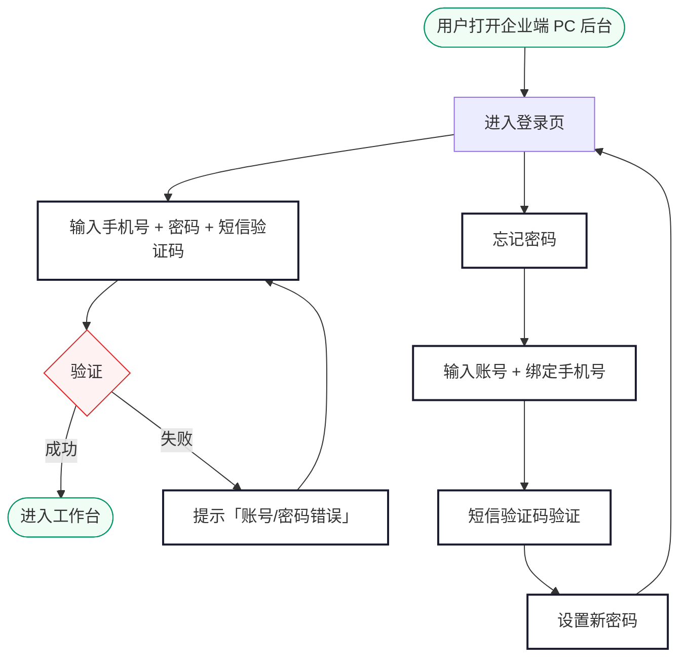
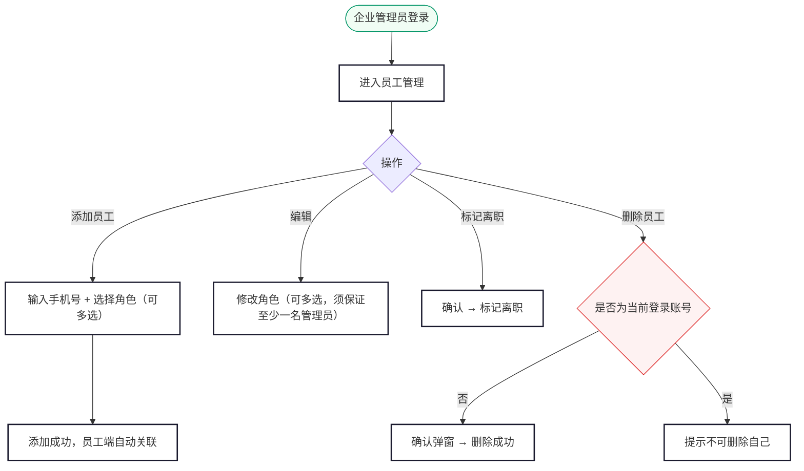

# 尊出行 · 企业端需求规格说明（PC Web 后台）

> 版本：V1.0 | 日期：2026-06-09 | 状态：编写中

---

## 目录

**登录**

1. [登录](#1-登录)

**首页**

2. [工作台](#2-工作台)

**人员管理**

3. [员工管理](#3-员工管理)

**业务管理**

4. [订单管理](#4-订单管理)

**财务**

5. [财务管理](#5-财务管理)

**设置**

6. [企业信息](#6-企业信息)

---

`<a id="1-登录"></a>`

## 1. 登录

### 业务说明

企业端为 PC Web 后台，供企业内部管理员使用。企业管理员账号由运营端在「企业客户管理」中创建企业时自动生成，管理员通过**手机号 + 密码 + 短信验证码**方式登录。登录后可管理员工、查看用车订单、查阅额度与账单。

---

### 1.1 业务流程



---

### 1.2 登录

#### 页面路径

浏览器直接访问企业端 PC 后台 URL，未登录时自动跳转登录页。

#### 表单字段

| 字段           | 必填 | 输入规则                                                      | 错误提示                                               |
| -------------- | ---- | ------------------------------------------------------------- | ------------------------------------------------------ |
| 账号           | 是   | 手机号，11 位数字                                             | 为空：「请输入账号」；格式错误：「请输入正确的手机号」 |
| 密码           | 是   | 6-20 位，字母+数字组合                                        | 为空：「请输入密码」                                   |
| 账号或密码错误 | —   | 统一提示**「账号/密码错误」**（不区分具体原因，避免账号枚举） | —                                                     |
| 账号被禁用     | —   | 统一提示**「账号/密码错误」**                                 | —                                                     |

#### 按钮状态

| 状态     | 行为                                   |
| -------- | -------------------------------------- |
| 默认     | 「登录」按钮可点击                     |
| 点击后   | 按钮置灰显示「登录中…」，防止重复提交 |
| 登录失败 | 按钮恢复可点击                         |

#### 登录态规则

| 规则     | 说明                                                                               |
| -------- | ---------------------------------------------------------------------------------- |
| 有效期   | 登录成功后维持 24 小时，超时自动退出并跳回登录页                                   |
| 单点登录 | 同一账号仅允许一个设备在线，新登录踢掉旧会话，旧会话提示「您的账号在其他设备登录」 |
| 退出     | 点击右上角「退出登录」清除登录态，跳回登录页                                       |

`<a id="2-工作台"></a>`

## 2. 工作台

### 业务说明

工作台是企业管理员登录后的首页，集中展示企业核心数据概览，帮助管理员快速了解当前用车情况和额度状态。

#### 页面路径

登录成功后自动进入工作台。左侧导航栏点击「工作台」可随时返回。

---

### 2.1 页面布局

工作台上方为数据卡片区，下方依次为：近 30 天用车订单趋势图（上）和进行中订单列表（下）。趋势图为全宽折线图，进行中订单为全宽列表，仅展示未完成订单（排除已完成、已取消）。

#### 核心数据卡片

| 卡片     | 内容    | 说明                                 |
| -------- | ------- | ------------------------------------ |
| 剩余额度 | ¥ 金额 | 企业当前可用额度，低于阈值时红色警示 |
| 本月消费 | ¥ 金额 | 当月累计消费总额                     |
| 本月订单 | 数字    | 当月已完成订单数                     |
| 在职员工 | 数字    | 当前在职员工总数                     |

#### 进行中订单（下方全宽）

展示进行中的订单（排除已完成和已取消），含订单号、用车人、类型、时间、金额、状态。点击「查看全部」跳转订单管理。

##### 最近用车交互

| 场景             | 行为                             |
| ---------------- | -------------------------------- |
| 无进行中订单     | 展示空状态提示「暂无进行中订单」 |
| 点击「查看全部」 | 跳转订单管理页                   |

#### 用车订单趋势图（右栏，占 50%）

展示近 30 天企业用车订单量趋势，折线图形式。

| 图表   | 说明                     |
| ------ | ------------------------ |
| 类型   | 折线图                   |
| X 轴   | 日期（近 30 天，含今日） |
| Y 轴   | 订单数                   |
| 数据点 | 每天完成的订单数量       |
| 悬停   | 鼠标悬停显示当日订单数   |
| 无数据 | 展示空状态「暂无数据」   |

#### 数据刷新

| 规则         | 说明                                              |
| ------------ | ------------------------------------------------- |
| 自动刷新     | 页面打开时加载最新数据，停留期间每 5 分钟自动刷新 |
| 手动刷新     | 右上角刷新按钮，点击立即刷新，按钮旋转动画        |
| 额度低于阈值 | 剩余额度卡片红色高亮闪烁提示                      |

> 工作台数据每日自动刷新，也可手动点击右上角刷新按钮更新。

---

`<a id="3-员工管理"></a>`

## 3. 员工管理

### 业务说明

员工管理维护企业内可使用企业支付的员工名单。企业管理员可添加、删除员工。员工被添加后，乘客端自动关联企业身份，可使用企业支付方式下单。

#### 页面路径

左侧导航栏 → 员工管理

---

### 3.1 业务流程



#### 角色说明

| 角色       | 说明                                                         |
| ---------- | ------------------------------------------------------------ |
| 员工       | 可使用企业支付下单，无管理权限                               |
| 财务       | 可使用企业支付下单，可查看企业额度和账单                     |
| 企业管理员 | 拥有企业端全部权限（员工管理、订单管理、财务管理、企业信息） |

#### 管理员约束

| 规则           | 说明                                                                     |
| -------------- | ------------------------------------------------------------------------ |
| 不可删除自己   | 当前登录的管理员不可删除自己的员工记录                                   |
| 至少一名管理员 | 修改管理员角色为其他角色时，须保证企业下至少还有一名管理员，否则阻止操作 |

> 员工即使尚未注册乘客端，也可被添加。乘客端初次登录时自动注册，系统匹配手机号关联企业。

---

### 3.2 员工列表

#### 顶部筛选

| 筛选项 | 类型 | 说明                     |
| ------ | ---- | ------------------------ |
| 角色   | 下拉 | 员工 / 财务 / 企业管理员 |
| 状态   | 多选 | 在职 / 已离职            |
| 关键字 | 文本 | 姓名 / 手机号 模糊匹配   |

#### 列表字段

| 列       | 内容                                     |
| -------- | ---------------------------------------- |
| 姓名     | 员工在乘客端的姓名（可能为空展示「—」） |
| 手机号   | 11 位手机号                              |
| 角色     | 所选角色（多选时展示多个彩色 Tag）       |
| 状态     | 在职（绿色 Tag）/ 已离职（灰色 Tag）     |
| 加入时间 | YYYY-MM-DD                               |
| 操作     | 编辑 / 标记离职 / 删除                   |

##### 按钮状态

| 按钮     | 默认状态 | 禁用条件                                                      |
| -------- | -------- | ------------------------------------------------------------- |
| 添加员工 | 可点击   | —                                                            |
| 批量导入 | 可点击   | —                                                            |
| 编辑     | 可点击   | 已离职员工置灰                                                |
| 标记离职 | 可点击   | 已离职员工置灰                                                |
| 删除     | 可点击   | 当前登录账号置灰（Tooltip「不可删除自己」）；已离职员工可删除 |

##### 列表操作交互

| 操作                     | 适用状态      | 行为                                                                           | 提示                            |
| ------------------------ | ------------- | ------------------------------------------------------------------------------ | ------------------------------- |
| 编辑                     | 在职          | 弹出角色多选下拉，修改后保存。若取消管理员角色，须保证企业下至少还有一名管理员 | Toast「角色已更新」             |
| 编辑（唯一管理员改角色） | —            | 阻止提交                                                                       | Toast「企业至少需要一名管理员」 |
| 标记离职                 | 在职          | 弹出确认「确认将 XXX 标记为离职？」                                            | Toast「已标记为离职」           |
| 删除                     | 在职 / 已离职 | 弹出确认「确认删除员工 XXX？」                                                 | Toast「员工已删除」             |
| 删除自己                 | —            | 按钮置灰                                                                       | Tooltip「不可删除自己」         |

---

### 3.3 添加员工

#### 弹窗字段

| 字段   | 必填 | 校验 / 说明                        |
| ------ | ---- | ---------------------------------- |
| 姓名   | 是   | ≤20 字                            |
| 手机号 | 是   | 11 位手机号，不可重复添加          |
| 角色   | 是   | 下拉多选：员工 / 财务 / 企业管理员 |

#### 校验规则

| 场景               | 提示                           |
| ------------------ | ------------------------------ |
| 手机号已关联本企业 | 「该用户已在本企业员工列表中」 |
| 添加成功           | Toast「员工添加成功」          |

##### 添加员工交互

| 场景             | 行为               | 提示                                |
| ---------------- | ------------------ | ----------------------------------- |
| 点击「添加员工」 | 弹出添加弹窗       | —                                  |
| 姓名为空         | 提交按钮置灰       | Toast「请输入姓名」                 |
| 手机号为空       | 提交按钮置灰       | Toast「请输入手机号」               |
| 手机号格式错误   | 阻止提交           | Toast「请输入正确的手机号」         |
| 手机号已在本企业 | 阻止提交           | Toast「该用户已在本企业员工列表中」 |
| 添加成功         | 弹窗关闭，列表刷新 | Toast「员工添加成功」               |
| 网络异常         | —                 | Toast「添加失败，请重试」           |

---

### 3.4 批量导入

支持通过 Excel 模板批量导入员工。

| 操作     | 行为                                     |
| -------- | ---------------------------------------- |
| 下载模板 | 下载标准 Excel 模板文件                  |
| 上传文件 | 选择填写完成的 Excel 文件上传            |
| 导入校验 | 逐行校验手机号格式、是否已注册、是否重复 |
| 导入结果 | 展示成功数 / 失败数，失败行标注原因      |
| 全部成功 | Toast「导入成功，共 N 人」               |

##### 批量导入交互

| 场景               | 行为                                                      | 提示                           |
| ------------------ | --------------------------------------------------------- | ------------------------------ |
| 点击「批量导入」   | 弹出导入弹窗，含下载模板和上传文件按钮                    | —                             |
| 上传非 Excel 文件  | 阻止上传                                                  | Toast「请上传 .xlsx 格式文件」 |
| 导入成功           | 弹窗关闭，列表刷新                                        | Toast「导入成功，共 N 人」     |
| 导入成功（含失败） | 弹窗展示导入结果（成功 N 人 / 失败 M 人），失败行标注原因 | —                             |
| 网络异常           | —                                                        | Toast「导入失败，请重试」      |

---

`<a id="4-订单管理"></a>`

## 4. 订单管理

### 业务说明

订单管理供企业管理员查看本企业所有员工使用企业支付的用车订单。页面顶部按订单类型分为两个 Tab，各 Tab 下按状态筛选。企业端仅有查看权限，不可派车、改派、取消订单或修改订单信息。

> **数据权限**：企业管理员可查看本企业全部员工的用车订单；员工及财务角色仅可查看自己下单的用车订单。其他菜单（财务管理、企业信息等）不区分权限，登录用户均可查看本企业数据。

#### 页面路径

左侧导航栏 → 订单管理

---

### 4.1 订单类型 Tab

| Tab      | 说明               |
| -------- | ------------------ |
| 包车订单 | 包车出行类型的订单 |
| 租车订单 | 租车出行类型的订单 |

> 包车订单与租车订单的列表字段不同（详见 §4.1.3 / §4.1.4），切换 Tab 时列表字段联动变化。所有订单数据仅限本企业范围。

---

### 4.2 状态 Tab

在订单类型 Tab 下，进一步按状态筛选：

| Tab    | 含义                                                                                        |
| ------ | ------------------------------------------------------------------------------------------- |
| 全部   | 所有订单（默认）                                                                            |
| 待支付 | 已下单未支付                                                                                |
| 待开始 | 已支付未到出发时间（含待派车：运营未分配车辆/司机；待接驾：包车已派车；待取车：租车已派车） |
| 进行中 | 已开始未结束                                                                                |
| 待结算 | 行程结束产生额外费用，等待补款                                                              |
| 已完成 | 行程正常结束、款项结清                                                                      |
| 已取消 | 乘客取消的订单                                                                              |

---

### 4.3 顶部筛选

| 筛选项   | 类型        | 说明                                   |
| -------- | ----------- | -------------------------------------- |
| 员工     | 下拉 + 搜索 | 按员工姓名或手机号筛选                 |
| 用车时间 | 日期范围    | 包车按用车时段筛选；租车按租期起始筛选 |
| 下单时间 | 日期范围    | —                                     |
| 关键字   | 文本        | 订单号模糊匹配                         |

---

### 4.4 包车订单 — 列表字段

| 列       | 内容                                                                                                                                                                                                                                                            |
| -------- | --------------------------------------------------------------------------------------------------------------------------------------------------------------------------------------------------------------------------------------------------------------- |
| 订单号   | ZC20260608-0001（点击进入详情）                                                                                                                                                                                                                                 |
| 订单类型 | 「包车」彩色 Tag                                                                                                                                                                                                                                                |
| 用车人   | 员工姓名 + 手机号                                                                                                                                                                                                                                               |
| 用车时间 | 起始日期时间 ~ 结束日期时间（多日展示天数）                                                                                                                                                                                                                     |
| 上车地点 | 简略地址                                                                                                                                                                                                                                                        |
| 下车地点 | 简略地址                                                                                                                                                                                                                                                        |
| 司机     | 姓名（未派车显示「-」）                                                                                                                                                                                                                                         |
| 车辆     | 车牌号                                                                                                                                                                                                                                                          |
| 订单金额 | 按订单状态动态展示：待支付 → ¥{优惠后待付总额}；待派车/待开始/进行中 → ¥{已付订单金额}；待结算 → ¥{应付订单金额}；已完成 → ¥{实付订单金额}；已取消（无违约金）→ ¥{优惠后待付总额}；已取消（有违约金）→ ¥{已付订单金额}（下方展示违约金 ¥{违约金}） |
| 订单状态 | 状态标签                                                                                                                                                                                                                                                        |
| 下单时间 | YYYY-MM-DD HH:mm                                                                                                                                                                                                                                                |
| 操作     | 「详情」按钮，点击打开订单详情抽屉                                                                                                                                                                                                                              |

---

### 4.5 租车订单 — 列表字段

| 列       | 内容                                                                                                                                                                                                                                                            |
| -------- | --------------------------------------------------------------------------------------------------------------------------------------------------------------------------------------------------------------------------------------------------------------- |
| 订单号   | ZC20260608-0001（点击进入详情）                                                                                                                                                                                                                                 |
| 订单类型 | 「租车」彩色 Tag                                                                                                                                                                                                                                                |
| 用车人   | 员工姓名 + 手机号                                                                                                                                                                                                                                               |
| 租期     | 起始日期时间 ~ 结束日期时间 + 共 N 天                                                                                                                                                                                                                           |
| 取车地点 | 简略地址                                                                                                                                                                                                                                                        |
| 还车地点 | 简略地址                                                                                                                                                                                                                                                        |
| 车辆     | 车牌号                                                                                                                                                                                                                                                          |
| 送车司机 | 姓名（未派车显示「-」）                                                                                                                                                                                                                                         |
| 收车司机 | 姓名（未派车显示「-」）                                                                                                                                                                                                                                         |
| 已收押金 | 押金金额                                                                                                                                                                                                                                                        |
| 已退押金 | 已退金额（未退展示「—」）                                                                                                                                                                                                                                      |
| 押金状态 | 未收取 / 未退还 / 部分退还 / 已退还                                                                                                                                                                                                                             |
| 订单金额 | 按订单状态动态展示：待支付 → ¥{优惠后待付总额}；待派车/待开始/进行中 → ¥{已付订单金额}；待结算 → ¥{应付订单金额}；已完成 → ¥{实付订单金额}；已取消（无违约金）→ ¥{优惠后待付总额}；已取消（有违约金）→ ¥{已付订单金额}（下方展示违约金 ¥{违约金}） |
| 订单状态 | 状态标签                                                                                                                                                                                                                                                        |
| 下单时间 | YYYY-MM-DD HH:mm                                                                                                                                                                                                                                                |
| 操作     | 「详情」按钮，点击打开订单详情抽屉                                                                                                                                                                                                                              |

---

### 4.6 订单详情

订单详情以侧抽屉形式打开（宽度约 60%），仅展示企业管理员可见的订单信息。详情为只读视图，不可修改。包车订单和租车订单详情结构不同，分别在下方描述。

---

#### 4.6.1 包车订单详情

##### 提示条

详情顶部按状态展示提示条：

| 状态               | 正文                                                                                 |
| ------------------ | ------------------------------------------------------------------------------------ |
| 待支付             | 订单已确认，请在支付超时前完成支付（琥珀色）                                         |
| 待派车             | 运营正在安排派车，请您耐心等待（琥珀色）                                             |
| 待接驾（等待出发） | 司机已接单，准备出发中（蓝色）                                                       |
| 待接驾（前往接驾） | {司机姓名} · {车牌} · 距离 X 公里 · 预计 X 分钟到达（蓝色），展示司机实时位置地图 |
| 进行中             | {司机姓名} · {车牌}，祝您出行愉快（绿色）                                           |
| 已完成             | 感谢您的出行，欢迎再次使用尊出行（绿色）                                             |
| 已取消             | 取消原因 + 违约金信息（红色）                                                        |
| 待结算             | 行程已完成，因超里程/超时产生额外费用，请及时结算（红色）                            |

##### 区块结构

| 区块       | 内容                                                                                                            |
| ---------- | --------------------------------------------------------------------------------------------------------------- |
| 基本信息   | 订单号（如 ZC20260608-0001）/ 类型（「包车」彩色 Tag）/ 状态/ 下单时间                                          |
| 乘车人     | 姓名（可能为空展示「—」）/ 手机号 / 角色                                                                       |
| 用车信息   | 用车时段（如 2026-06-08 08:00 ~ 2026-06-09 18:00）/ 天数（2天）/ 上车地点（简略地址）/ 下车地点（简略地址）     |
| 车型套餐   | 车型名称 + 套餐名称 + 套餐类型（如「增程星辉尊享版 · 尊享基础套餐（半日租/4小时/50km）」），套餐价直接展示单价 |
| 日程与派车 | 按日展示（见下方表格）；未派车时展示「—」                                                                      |
| 费用明细   | 见下方费用明细（按状态区分展示）                                                                                |
| 订单动态   | 按状态展示时间线（见下方）                                                                                      |

##### 日程与派车展示

每个出行日对应一行，每行标注当天状态标签：

| 日期  | 时段        | 车辆                  | 司机           | 状态   |
| ----- | ----------- | --------------------- | -------------- | ------ |
| 06-08 | 08:00-18:00 | 京A12345 · 奔驰V260L | 李师傅 138xxxx | 进行中 |
| 06-09 | 08:00-18:00 | 京A12345 · 奔驰V260L | 李师傅 138xxxx | 未开始 |

> 每日状态标签：未开始（灰色）/ 进行中（蓝色）/ 已完成（绿色）。未派车时，车辆和司机列展示「—」，状态列不展示。

##### 费用明细

费用明细按订单状态区分展示内容。页面底部费用汇总区展示金额及明细入口，主行数字加粗，原价灰色横线。点击主行弹出对应明细弹窗。各状态展示内容如下：

###### ① 待支付

**页面底部主行（1行）：**

| 行                 | 展示                                                 | 操作         |
| ------------------ | ---------------------------------------------------- | ------------ |
| **订单金额** | ~~¥{原总价}~~ ¥{折后总价}（灰色横线为优惠前总价） | 点击弹出明细 |

**订单金额明细弹窗：**

| 费用项             | 展示规则                           |
| ------------------ | ---------------------------------- |
| **套餐总价** | ~~¥{原总价}~~ ¥{折后总价}       |
| **套餐单价** | ~~¥{原单价}/天~~ ¥{折后单价}/天 |
| **下单天数** | {天数}天                           |
| **远调费**   | ¥{金额}，无则不展示               |

###### ② 待开始 / 进行中

**页面底部主行（1行）：**

| 行                     | 展示             | 操作         |
| ---------------------- | ---------------- | ------------ |
| **已付订单金额** | ¥{实付折后总价} | 点击弹出明细 |

**已付订单金额明细弹窗：**

| 费用项             | 展示规则                           |
| ------------------ | ---------------------------------- |
| **套餐总价** | ~~¥{原总价}~~ ¥{折后总价}       |
| **套餐单价** | ~~¥{原单价}/天~~ ¥{折后单价}/天 |
| **下单天数** | {天数}天                           |
| **远调费**   | ¥{金额}，无则不展示               |

###### ③ 待结算

**页面底部（3行）：**

| 行               | 展示                       | 操作             |
| ---------------- | -------------------------- | ---------------- |
| 已付订单金额     | ¥{下单时实付折后总价}     | 点击弹出已付明细 |
| 应付订单金额     | ¥{合计}                   | 点击弹出应付明细 |
| **需补款** | **¥{差额}**（红色） | —               |

**已付订单金额明细弹窗：**

| 费用项             | 展示规则                           |
| ------------------ | ---------------------------------- |
| **套餐总价** | ~~¥{原总价}~~ ¥{折后总价}       |
| **套餐单价** | ~~¥{原单价}/天~~ ¥{折后单价}/天 |
| **下单天数** | {天数}天                           |
| **远调费**   | ¥{金额}，无则不展示               |

**应付订单金额明细弹窗：**

| 费用项                 | 展示规则                           | 可操作     |
| ---------------------- | ---------------------------------- | ---------- |
| **套餐单价**     | ~~¥{原单价}/天~~ ¥{折后单价}/天 | —         |
| **实际使用天数** | {实际天数}天                       | —         |
| **套餐费合计**   | ¥{折后单价 × 实际天数}           | —         |
| **实际远调费**   | ¥{金额}，无则不展示               | 点明细弹窗 |
| **超时费**       | ¥{金额}，无则不展示               | 点明细弹窗 |
| **超里程费**     | ¥{金额}，无则不展示               | 点明细弹窗 |
| **等待费**       | ¥{金额}，无则不展示               | 点明细弹窗 |
| **其他费用**     | ¥{金额}，无则不展示               | 点明细弹窗 |
| **应付合计**     | ¥{加总}                           | —         |
| **已付订单金额** | ¥{下单时实付}                     | —         |
| **需补款**       | ¥{差额}（红色）                   | —         |

###### ④ 已完成

**页面底部（3行）：**

| 行                     | 展示                        | 操作             |
| ---------------------- | --------------------------- | ---------------- |
| 已付订单金额           | ¥{累计支付}（下单 + 补款） | 点击弹出已付明细 |
| 退款金额               | ¥{累计退款}                | 点击弹出退款明细 |
| **实付订单金额** | ¥{已付 − 退款}            | —               |

**已付订单金额明细弹窗：** 同 ③ 已付明细

**退款明细弹窗：**

| 字段     | 说明                                                                                                                                     |
| -------- | ---------------------------------------------------------------------------------------------------------------------------------------- |
| 退款金额 | ¥{金额}                                                                                                                                 |
| 退款时间 | YYYY-MM-DD HH:mm                                                                                                                         |
| 退款类型 | 平台退款 / 差额退还 / 取消退款                                                                                                           |
| 类型说明 | 平台退款：后台运营手动操作退款；差额退还：提前结束行程自动退还差额 或 正常结束远调费多退少补；取消退款：支付超时 或 调度超时全额自动退款 |
| 备注     | 平台退款时展示运营填写的退款原因；差额退还和取消退款由系统自动生成说明                                                                   |

###### ⑤ 已取消

**支付前取消：** 不展示费用明细。订单直接关闭，无退款。

**支付后取消（3行）：**

| 行                     | 展示             | 操作             |
| ---------------------- | ---------------- | ---------------- |
| 已付订单金额           | ¥{支付时总价}   | 点击弹出已付明细 |
| 退款金额               | ¥{退款金额}     | 点击弹出退款明细 |
| **实付订单金额** | ¥{已付 − 退款} | —               |

**已付订单金额明细弹窗：** 同 ①

**退款明细弹窗：** 同 ④

###### 子明细弹窗（远调费/超时费/超里程费/等待费/其他费用点击「明细」时弹出）

| 费用类型           | 弹窗字段                                                                                                                           |
| ------------------ | ---------------------------------------------------------------------------------------------------------------------------------- |
| **远调费**   | 实际上车点地址 / 实际下车点地址 / 所属运营城市 / 上车点到区域边缘距离（km）/ 下车点到区域边缘距离（km）/ 适用梯度档位 / 远调费金额 |
| **超时费**   | 每日开始时间 / 每日结束时间 / 实际使用时长 / 套餐内时长 / 超时小时数 / 费率（元/小时）/ 超时费金额                                 |
| **超里程费** | 每日开始里程（km）/ 每日结束里程（km）/ 实际里程 / 套餐内里程 / 超公里数 / 费率（元/公里）/ 超里程费金额。附开始/结束里程表照片    |
| **等待费**   | 日期 / 等待时长 / 等待费                                                  |
| **其他费用** | 费用类型（高速费/停车费/路桥费/洗车费/其他）/ 金额 / 票据凭证（可点击查看大图）/ 上报时间 / 上报司机                               |

> 费用明细弹窗按日期逐行展开。多日订单各日独立计算等待费/超时长费/超里程费/其他费用，明细弹窗展示每日明细及汇总。

##### 订单动态

订单详情最底部展示完整操作时间线，按时间倒序排列（最新在上，高亮；历史节点灰色）。每个节点包含时间、事件描述。企业端仅展示与企业相关的关键节点。

**包车出行时间线节点：**

| 节点         | 展示内容                                                      |
| ------------ | ------------------------------------------------------------- |
| 订单提交     | YYYY-MM-DD HH:mm 订单已提交                                   |
| 支付成功     | YYYY-MM-DD HH:mm 支付成功 — {支付方式} ¥{金额}              |
| 派车成功     | YYYY-MM-DD HH:mm {操作人}已派车完成                           |
| 司机出发     | YYYY-MM-DD HH:mm {姓名} 已出发                                |
| 司机到达     | YYYY-MM-DD HH:mm {姓名} 已到达上车点                          |
| 行程开始     | YYYY-MM-DD HH:mm 行程开始 {司机姓名}·{车牌}                  |
| 当日行程结束 | YYYY-MM-DD HH:mm 当日行程结束 实际用时 {Xh}，里程 {X}km       |
| 结算完成     | YYYY-MM-DD HH:mm 结算完成 — {支付方式} ¥{金额}              |
| 订单完成     | YYYY-MM-DD HH:mm 订单已完成                                   |
| 取消订单     | YYYY-MM-DD HH:mm 订单已取消 {取消原因} 退款 ¥{金额}          |
| 退款         | YYYY-MM-DD HH:mm {操作人} 发起退款 ¥{金额}，原因：{退款原因} |
| 提前结束行程 | YYYY-MM-DD HH:mm 乘客提前结束行程                             |

---

#### 4.6.2 租车订单详情

##### 提示条

| 状态               | 正文                                                                                                         |
| ------------------ | ------------------------------------------------------------------------------------------------------------ |
| 待支付             | 订单已确认，请在支付超时前完成支付（琥珀色）                                                                 |
| 待派车             | 运营正在安排派车，请您耐心等待（琥珀色）                                                                     |
| 待取车（未开始送） | 等待司机将车辆送往取车点（蓝色）                                                                             |
| 待取车（已开始送） | {司机姓名} · {车牌}，司机正在将车辆送往取车点，距离 X 公里 · 预计 X 分钟到达（蓝色），展示司机实时位置地图 |
| 进行中             | {车牌}，祝您用车愉快（绿色）                                                                                 |
| 已完成             | 感谢您的用车，欢迎再次使用尊出行（绿色）                                                                     |
| 已取消             | 取消原因 + 违约金信息（红色）                                                                                |
| 待结算             | 行程已结束，因超里程/超时产生额外费用，请及时结算（红色）                                                    |

##### 区块结构

| 区块       | 内容                                                                                                                     |
| ---------- | ------------------------------------------------------------------------------------------------------------------------ |
| 基本信息   | 订单号 / 类型（「租车」彩色 Tag）/ 状态/ 下单时间                                                                        |
| 乘车人     | 姓名 / 手机号 / 角色                                                                                                     |
| 用车信息   | 租期（如 2026-06-08 ~ 2026-06-10）/ 天数（3天）/ 取车地点 / 还车地点                                                     |
| 车型信息   | 车型名称（如「增程星辉尊享版」），日租价直接展示单价                                                                     |
| 驾驶人信息 | 驾驶人姓名 / 手机号（脱敏展示，如 138****1234）/ 驾驶证类型 / 「查看驾驶证」按钮（点击预览驾驶证照片）                   |
| 派车信息   | 车辆（车牌+车型）/ 送车司机（姓名+手机号）+ 送车状态 / 收车司机（姓名+手机号）+ 收车状态。未派车时展示「待派车」红色标签 |
| 费用明细   | 见下方费用明细（按状态区分展示）                                                                                         |
| 订单动态   | 按状态展示时间线（见下方）                                                                                               |

##### 派车信息展示

| 项目     | 内容（示例）        | 任务状态                 |
| -------- | ------------------- | ------------------------ |
| 车辆     | 京A34567 · 奥迪A6L | —                       |
| 送车司机 | 赵师傅 138xxxx1111  | 待送车 / 送车中 / 已送达 |
| 收车司机 | 钱师傅 138xxxx2222  | 待收车 / 收车中 / 已收车 |

> 送车司机和收车司机可为同一人。任务状态随司机端操作实时更新。

##### 费用明细

费用明细按订单状态区分展示内容。页面底部费用汇总区展示金额及明细入口，主行数字加粗，原价灰色横线。点击主行弹出对应明细弹窗。各状态展示内容如下：

###### ① 待支付

**页面底部主行（1行）：**

| 行                 | 展示                                                 | 操作         |
| ------------------ | ---------------------------------------------------- | ------------ |
| **订单金额** | ~~¥{原总价}~~ ¥{折后总价}（灰色横线为优惠前总价） | 点击弹出明细 |

**订单金额明细弹窗：**

| 费用项             | 展示规则                           |
| ------------------ | ---------------------------------- |
| **日租总价** | ~~¥{原总价}~~ ¥{折后总价}       |
| **日租单价** | ~~¥{原单价}/天~~ ¥{折后单价}/天 |
| **租车天数** | {天数}天                           |
| **远调费**   | ¥{金额}，无则不展示               |

###### ② 待派车 / 待取车（未送达）/ 待取车（已送达）/ 进行中

**页面底部主行（1行）：**

| 行                     | 展示             | 操作         |
| ---------------------- | ---------------- | ------------ |
| **已付订单金额** | ¥{实付折后总价} | 点击弹出明细 |

**已付订单金额明细弹窗：**

| 费用项             | 展示规则                           |
| ------------------ | ---------------------------------- |
| **日租总价** | ~~¥{原总价}~~ ¥{折后总价}       |
| **日租单价** | ~~¥{原单价}/天~~ ¥{折后单价}/天 |
| **租车天数** | {天数}天                           |
| **远调费**   | ¥{金额}，无则不展示               |

###### ③ 待结算

**页面底部（3行）：**

| 行               | 展示                       | 操作             |
| ---------------- | -------------------------- | ---------------- |
| 已付订单金额     | ¥{下单时实付折后总价}     | 点击弹出已付明细 |
| 应付订单金额     | ¥{合计}                   | 点击弹出应付明细 |
| **需补款** | **¥{差额}**（红色） | —               |

**已付订单金额明细弹窗：**

| 费用项             | 展示规则                           |
| ------------------ | ---------------------------------- |
| **日租总价** | ~~¥{原总价}~~ ¥{折后总价}       |
| **日租单价** | ~~¥{原单价}/天~~ ¥{折后单价}/天 |
| **租车天数** | {天数}天                           |
| **远调费**   | ¥{金额}，无则不展示               |

**应付订单金额明细弹窗：**

| 费用项                 | 展示规则                           | 可操作     |
| ---------------------- | ---------------------------------- | ---------- |
| **日租单价**     | ~~¥{原单价}/天~~ ¥{折后单价}/天 | —         |
| **实际使用天数** | {实际天数}天                       | —         |
| **日租费合计**   | ¥{折后单价 × 实际天数}           | —         |
| **实际远调费**   | ¥{金额}，无则不展示               | 点明细弹窗 |
| **超时费**       | ¥{金额}，无则不展示               | 点明细弹窗 |
| **超里程费**     | ¥{金额}，无则不展示               | 点明细弹窗 |
| **等待费**       | ¥{金额}，无则不展示               | 点明细弹窗 |
| **其他费用**     | ¥{金额}，无则不展示               | 点明细弹窗 |
| **应付合计**     | ¥{加总}                           | —         |
| **已付订单金额** | ¥{下单时实付}                     | —         |
| **需补款**       | ¥{差额}（红色）                   | —         |

###### ④ 已完成

**页面底部（3行）：**

| 行                     | 展示                        | 操作             |
| ---------------------- | --------------------------- | ---------------- |
| 已付订单金额           | ¥{累计支付}（下单 + 补款） | 点击弹出已付明细 |
| 退款金额               | ¥{累计退款}                | 点击弹出退款明细 |
| **实付订单金额** | ¥{已付 − 退款}            | —               |

**已付订单金额明细弹窗：** 同 ③ 已付明细

**退款明细弹窗：**

| 字段     | 说明                                                                                                                                     |
| -------- | ---------------------------------------------------------------------------------------------------------------------------------------- |
| 退款金额 | ¥{金额}                                                                                                                                 |
| 退款时间 | YYYY-MM-DD HH:mm                                                                                                                         |
| 退款类型 | 平台退款 / 差额退还 / 取消退款                                                                                                           |
| 类型说明 | 平台退款：后台运营手动操作退款；差额退还：提前结束行程自动退还差额 或 正常结束远调费多退少补；取消退款：支付超时 或 调度超时全额自动退款 |
| 备注     | 平台退款时展示运营填写的退款原因；其他类型由系统自动生成说明                                                                             |

###### ⑤ 已取消

**支付前取消：** 不展示费用明细。订单直接关闭，无退款。

**支付后取消（3行）：**

| 行                     | 展示             | 操作             |
| ---------------------- | ---------------- | ---------------- |
| 已付订单金额           | ¥{支付时总价}   | 点击弹出已付明细 |
| 退款金额               | ¥{退款金额}     | 点击弹出退款明细 |
| **实付订单金额** | ¥{已付 − 退款} | —               |

**已付订单金额明细弹窗：** 同 ①

**退款明细弹窗：** 同 ④

###### 子明细弹窗（远调费/超时费/超里程费/等待费/其他费用点击「明细」时弹出）

| 费用类型           | 弹窗字段                                                                                                                           |
| ------------------ | ---------------------------------------------------------------------------------------------------------------------------------- |
| **远调费**   | 实际取车点地址 / 实际还车点地址 / 所属运营城市 / 取车点到区域边缘距离（km）/ 还车点到区域边缘距离（km）/ 适用梯度档位 / 远调费金额 |
| **超时费**   | 取车时间 / 还车时间 / 实际使用时长 / 日含 8h / 超时小时数 / 费率（元/小时）/ 超时费金额                                            |
| **超里程费** | 开始里程（km）/ 结束里程（km）/ 实际里程 / 日含里程 100km / 超公里数 / 费率（元/公里）/ 超里程费金额。附开始/结束里程表照片        |
| **等待费**   | 日期 / 等待时长 / 等待费                                                  |
| **其他费用** | 费用类型（高速费/停车费/路桥费/洗车费/其他）/ 金额 / 票据凭证（可点击查看大图）/ 上报时间 / 上报司机                               |

##### 押金信息（独立模块，费用明细下方）

> **仅个人身份订单显示，企业身份不展示此模块。** 企业用户线下签订合同时已缴纳保证金，线上不再收取押金。

押金信息为独立模块，展示在费用明细下方。各状态展示规则：

| 状态                     | 合计押金 | 车辆押金 | 违章押金 | 押金状态 |
| ------------------------ | -------- | -------- | -------- | -------- |
| 待支付                   | 展示     | 展示     | 展示     | 不展示   |
| 待派车 / 待取车 / 进行中 | 展示     | 展示     | 展示     | 展示     |
| 待结算                   | 展示     | 展示     | 展示     | 展示     |
| 已完成                   | 展示     | 展示     | 展示     | 展示     |
| 已取消（支付前）         | 不展示   | 不展示   | 不展示   | 不展示   |
| 已取消（支付后）         | 展示     | 展示     | 展示     | 展示     |

具体字段：

| 字段               | 展示内容                   | 操作         | 说明                                                                               |
| ------------------ | -------------------------- | ------------ | ---------------------------------------------------------------------------------- |
| **合计押金** | ¥{合计}                   | 点击查看明细 | 车辆押金 + 违章押金。支付时收取                                                    |
| **车辆押金** | ¥{金额}                   | 点击查看明细 | 预计7日内退还。退还后标记「已退还」及退还时间                                      |
| **违章押金** | ¥{金额}                   | 点击查看明细 | 预计30日内退还。退还后标记「已退还」及退还时间                                     |
| **押金状态** | 未退还 / 部分退还 / 已退还 | —           | 两个都未退 → 未退还；退了一个 → 部分退还（标记哪一个已退）；两个都退了 → 已退还 |

**押金查看明细弹窗（点击合计押金/车辆押金/违章押金弹出）：**

| 类型           | 押金金额               | 扣款金额               | 已退金额               | 退还时间         | 备注   |
| -------------- | ---------------------- | ---------------------- | ---------------------- | ---------------- | ------ |
| 车辆押金       | ¥{金额}               | ¥{扣款}               | ¥{已退}               | YYYY-MM-DD HH:mm | {备注} |
| 违章押金       | ¥{金额}               | ¥{扣款}               | ¥{已退}               | YYYY-MM-DD HH:mm | {备注} |
| **合计** | **¥{合计押金}** | **¥{合计扣款}** | **¥{合计退款}** | —               | —     |

退押金操作由运营端执行，企业端仅查看押金状态与退还进度。

##### 订单动态

与包车出行时间线结构一致，租车差异节点如下（代替包车的「司机出发」「司机到达」「当日行程结束」）：

| 节点         | 展示内容                                                      |
| ------------ | ------------------------------------------------------------- |
| 订单提交     | YYYY-MM-DD HH:mm 订单已提交                                   |
| 支付成功     | YYYY-MM-DD HH:mm 支付成功 — {支付方式} ¥{金额}              |
| 派车成功     | YYYY-MM-DD HH:mm {操作人} 已派车完成                          |
| 司机出发     | YYYY-MM-DD HH:mm {姓名} 已出发                                |
| 司机到达     | YYYY-MM-DD HH:mm 车辆已送达取车点 {取车地点}                  |
| 行程开始     | YYYY-MM-DD HH:mm 行程开始 {车牌}                              |
| 司机出发     | YYYY-MM-DD HH:mm {姓名} 已出发前往还车点                      |
| 确认收车     | YYYY-MM-DD HH:mm 收车完成 里程 {X}km，用车 {X}天              |
| 结算完成     | YYYY-MM-DD HH:mm 结算完成 — {支付方式} ¥{金额}              |
| 订单完成     | YYYY-MM-DD HH:mm 订单已完成                                   |
| 取消订单     | YYYY-MM-DD HH:mm 订单已取消 {取消原因} 退款 ¥{金额}          |
| 退款         | YYYY-MM-DD HH:mm {操作人} 发起退款 ¥{金额}，原因：{退款原因} |
| 提前结束行程 | YYYY-MM-DD HH:mm 乘客提前结束行程                             |
| 押金退还     | YYYY-MM-DD HH:mm 押金 ¥{金额} 已退还（扣 ¥{扣除}）          |

---

---

#### 4.6.3 取消规则

> 企业端不可取消订单（取消由乘客端发起），以下规则供企业管理员了解取消逻辑。

##### 取消规则表

| 场景     | 规则                                                                                                                                          |
| -------- | --------------------------------------------------------------------------------------------------------------------------------------------- |
| 包车出行 | 下单 20 分钟内或提前 4h 以上：免费取消；距出发 ＜4h：扣 25%；＜2h：扣 50%。多日包车可提前结束行程：已开始的日期不退，未开始日期按取消规则退款 |
| 租车出行 | 下单 20 分钟内或提前 4h 以上：免费取消；距出发 ＜4h：扣 25%；＜2h：扣 50%。多日租车可提前结束行程：已开始的日期不退，未开始日期按取消规则退款 |
| 支付超时 | 下单后 20 分钟内未支付，订单自动取消，不扣费                                                                                                  |
| 调度超时 | 出发前 2 小时仍未派车/送车，订单自动取消，全额退款（含积分退还）                                                                              |

##### 取消流程

```
乘客端订单详情 → 点击"取消订单"
    │
    ▼
弹窗展示违约金计算 → 确认取消 → 扣除违约金 → 余额退回 → 订单"已取消"
```

> 自动取消（支付超时/调度超时）由系统触发，订单状态自动变更为"已取消"并推送消息通知。

##### 退款路径

| 支付方式         | 退款方式                                                                              |
| ---------------- | ------------------------------------------------------------------------------------- |
| 企业支付         | 扣除违约金后余额恢复至企业额度                                                        |
| 个人支付（富友） | 扣除违约金后余额从富友托管资金中原路退回                                              |
| 积分抵扣（租车） | 取消订单时优先退还实付金额/额度，之后按积分兑换比例退还积分。调度超时自动取消全额退还 |

---

---

#### 4.6.5 待结算

行程结束时如产生超里程/超时/其他费用，订单进入待结算状态。企业端详情页展示差额明细和补款状态。

##### 待结算规则

| 项目         | 说明                                                                       |
| ------------ | -------------------------------------------------------------------------- |
| 触发条件     | 行程结束后系统计算超里程/超时/其他费用，有差额时订单进入「待结算」         |
| 费用明细展示 | 套餐价/日租价标记「已支付」绿色 + 各项差额红色「待付」+ 待结算总额红色加粗 |
| 不可取消     | 待结算状态不可取消订单，必须先完成差额支付                                 |
| 补款完成     | 乘客完成差额支付后，订单自动转为「已完成」                                 |
| 支付超时     | 待结算无支付超时限制，乘客可在任意时间补款                                 |
| 企业端行为   | 仅展示补款状态和金额，不参与补款操作（补款由乘客端完成）                   |

---

##### 订单列表交互

| 场景       | 行为                           | 提示 |
| ---------- | ------------------------------ | ---- |
| 无订单记录 | 展示空状态提示「暂无订单记录」 |      |
| 点击订单号 | 侧抽屉打开订单详情             | —   |
| 关键字搜索 | 支持订单号模糊匹配             | —   |

> 企业端订单详情为只读视图，不可修改。取消订单由乘客端发起。

---

### 4.7 状态流转规则

企业端订单状态与运营端同步，状态由系统自动流转：

| 当前状态 | 触发事件                     | 下一状态 |
| -------- | ---------------------------- | -------- |
| 待支付   | 乘客完成支付                 | 待开始   |
| 待支付   | 支付超时（20 分钟）          | 已取消   |
| 待开始   | 运营派车                     | 待开始   |
| 待开始   | 调度超时（出发前 2h 未派车） | 已取消   |
| 待开始   | 司机出发 / 乘客取车          | 进行中   |
| 进行中   | 正常结束（无额外费用）       | 已完成   |
| 进行中   | 正常结束（有额外费用）       | 待结算   |
| 进行中   | 乘客取消                     | 已取消   |
| 待结算   | 乘客完成补款                 | 已完成   |

> 企业端不可修改任何订单状态。

---

`<a id="5-财务管理"></a>`

## 5. 财务管理

### 业务说明

财务管理供企业管理员查看本企业的额度消费、账单、发票及付款情况。所有数据均仅展示本企业范围。

#### 页面路径

左侧导航栏 → 财务管理

财务管理包含四个子模块：

- **额度消费**：查看企业额度状态、消费明细及额度变动记录；
- **企业账单**：按时间维度查询本企业消费明细，汇总消费、开票与付款金额；
- **发票管理**：为本企业订单申请开票，查看发票记录与详情；
- **付款管理**：查看本企业付款任务状态与详情。

---

### 5.1 额度消费

#### 业务说明

展示企业当前额度状态及历史消费/退款明细。额度由运营后台调整，企业端仅可查看。

#### 5.1.1 额度总览

页面顶部展示额度概览：

| 指标     | 内容                                  |
| -------- | ------------------------------------- |
| 总额度   | 运营后台累计调增的额度总额            |
| 已使用   | 累计消费金额                          |
| 剩余额度 | 总额度 - 已使用（低于阈值时红色警示） |

#### 5.1.2 消费明细

##### 顶部筛选

| 筛选项   | 类型        | 说明                     |
| -------- | ----------- | ------------------------ |
| 时间范围 | 月份选择    | 默认当月，可切换历史月份 |
| 员工     | 下拉 + 搜索 | 按员工筛选               |
| 类型     | 多选        | 消费 / 退款              |

##### 列表字段

| 列       | 内容                           |
| -------- | ------------------------------ |
| 时间     | YYYY-MM-DD HH:mm               |
| 类型     | 消费（红色 -）/ 退款（绿色 +） |
| 金额     | ¥ 金额                        |
| 关联订单 | 订单号（点击跳转订单详情）     |
| 用车人   | 员工姓名                       |
| 说明     | 消费来源或退款原因             |

##### 顶部汇总

| 汇总项       | 内容                            |
| ------------ | ------------------------------- |
| 当月消费总额 | ¥ 金额                         |
| 当月退款总额 | ¥ 金额                         |
| 实际消费额   | ¥ 金额（消费总额 − 退款总额） |

##### 交互

| 场景           | 行为                           |
| -------------- | ------------------------------ |
| 无记录         | 展示空状态提示「暂无消费记录」 |
| 点击关联订单号 | 跳转该订单详情                 |
| 按员工筛选     | 下拉选择员工（默认展示全员）   |

#### 5.1.3 额度变动记录

展示运营后台调整额度的历史记录（只读）。

| 列     | 内容                               |
| ------ | ---------------------------------- |
| 时间   | YYYY-MM-DD HH:mm                   |
| 类型   | 调增（绿色 +¥）/ 调减（红色 -¥） |
| 金额   | ¥ 金额                            |
| 操作员 | 运营人员姓名                       |
| 原因   | 调整原因                           |

##### 交互

| 场景   | 行为                               |
| ------ | ---------------------------------- |
| 无记录 | 展示空状态提示「暂无额度变动记录」 |

---

### 5.2 企业账单

按时间范围汇总本企业消费与付款情况，展示订单明细及状态。

#### 5.2.1 筛选区

| 筛选项   | 类型     | 说明     |
| -------- | -------- | -------- |
| 时间范围 | 日期范围 | 默认本月 |

#### 5.2.2 汇总卡片

| 卡片       | 计算方式                                     |
| ---------- | -------------------------------------------- |
| 消费总额   | 筛选范围内已完成的订单总金额（企业支付部分） |
| 待开票金额 | 筛选范围内已完成但未申请开票的订单金额合计   |
| 开票中金额 | 筛选范围内已申请开票但发票尚未开具的金额合计 |
| 待付款金额 | 筛选范围内已开票但未完成付款的金额合计       |
| 已付款金额 | 筛选范围内已完成付款的金额合计               |

#### 5.2.3 订单明细列表

| 列       | 内容                                               |
| -------- | -------------------------------------------------- |
| 订单号   | 点击跳转订单详情                                   |
| 下单人   | 下单人姓名                                         |
| 订单类型 | 包车 / 租车（彩色 Tag）                            |
| 完成时间 | YYYY-MM-DD HH:mm:ss                                |
| 订单金额 | ¥X,XXX.XX                                         |
| 付款状态 | 状态标签                                           |
| 关联发票 | 发票申请编号（点击跳转发票详情，未开票展示「—」） |
| 关联付款 | 付款单号（点击跳转付款详情，未付款展示「—」）     |

##### 付款状态

| 状态   | 颜色   | 说明                     |
| ------ | ------ | ------------------------ |
| 待开票 | 灰色   | 订单已完成，尚未申请开票 |
| 开票中 | 蓝色   | 已申请开票，发票尚未开具 |
| 付款中 | 琥珀色 | 发票已开具 / 付款核实中  |
| 已付款 | 绿色   | 付款已完成               |

##### 空状态

| 场景       | 展示                   |
| ---------- | ---------------------- |
| 无订单数据 | 「暂无符合条件的订单」 |

---

### 5.3 发票管理

企业管理员可为本企业订单申请开票，查看发票记录与详情。企业端仅可申请开票、查看和取消开票中的申请，发票上传由运营端完成。

> 企业端发票管理数据仅展示本企业范围。发票上传及已开票状态的取消操作由运营端处理。

#### 5.3.1 申请开票

**第一步：选择订单**

业务规则：
- 仅展示本企业员工的已完成订单，且该订单**未被其他发票申请锁定**；
- 包车订单：状态 = 已完成 即可开票；
- 租车订单：状态 = 已完成 **且** 押金已全部退还（车辆押金 + 违章押金均已退还）方可开票；
- 已开票完成（状态 = 已开票）和正在开票处理中（状态 = 开票中）的订单不在此列表展示；
- 已被其他申请锁定的订单置灰不可选；
- 发票金额计算：
  - 包车：实际支付金额 − 退款金额；
  - 租车：（实际支付金额 − 退款金额）+ 押金扣款金额；
- 支持多选合并开票，合并后发票金额为已选订单金额之和。

| 字段     | 内容                    |
| -------- | ----------------------- |
| 复选框   | 勾选需要合并开票的订单  |
| 订单号   | 点击跳转订单详情        |
| 订单类型 | 包车 / 租车（彩色 Tag） |
| 完成时间 | YYYY-MM-DD HH:mm:ss     |
| 订单金额 | ¥X,XXX.XX              |

> 已开票完成和正在开票处理中的订单不在此列表展示。已被其他申请锁定的订单置灰不可选。

底部汇总：已选订单数 + 开票金额合计。

**第二步：选择开票类型**

| 开票类型 | 说明                               |
| -------- | ---------------------------------- |
| 普通发票 | 增值税普通发票，需填写企业抬头     |
| 专用发票 | 增值税专用发票，需填写完整企业信息 |

**第三步：填写发票信息**

**普通发票：**

| 字段     | 必填 | 说明     |
| -------- | ---- | -------- |
| 发票抬头 | 是   | 企业全称 |
| 备注     | 否   | ≤200字  |

**专用发票：**

| 字段         | 必填 | 说明         |
| ------------ | ---- | ------------ |
| 发票抬头     | 是   | 企业全称     |
| 纳税人识别号 | 是   | 企业税号     |
| 地址         | 是   | 企业注册地址 |
| 开户行       | 是   | 企业开户银行 |
| 银行账户     | 是   | 企业银行账号 |
| 企业电话     | 是   | 企业联系电话 |
| 备注         | 否   | ≤200字      |

**第四步：确认提交**

展示汇总信息供确认后提交，申请直接进入「开票中」状态。关联订单被锁定不可重复申请。

#### 5.3.2 发票列表

##### 筛选

| 筛选项   | 类型     | 说明                              |
| -------- | -------- | --------------------------------- |
| 开票类型 | 多选     | 普通发票 / 专用发票               |
| 开票状态 | 多选     | 开票中 / 已开票 / 已驳回 / 已取消 |
| 时间范围 | 日期范围 | 申请时间                          |

##### 列表字段

| 列       | 内容                            |
| -------- | ------------------------------- |
| 申请编号 | FP20260608-0001                 |
| 开票类型 | 普通发票 / 专用发票（彩色 Tag） |
| 发票抬头 | 企业全称                        |
| 开票金额 | ¥X,XXX.XX                      |
| 申请人   | 企业管理员姓名                  |
| 申请时间 | YYYY-MM-DD HH:mm                |
| 开票状态 | 状态标签                        |
| 操作     | 详情 / 取消申请（开票中时）     |

##### 状态颜色

| 状态   | 颜色 |
| ------ | ---- |
| 开票中 | 蓝色 |
| 已开票 | 绿色 |
| 已驳回 | 红色 |
| 已取消 | 灰色 |

#### 5.3.3 发票详情

| 区块     | 内容                                                                     |
| -------- | ------------------------------------------------------------------------ |
| 基本信息 | 申请编号 / 开票类型 / 开票状态 / 申请人 / 申请时间                       |
| 开票信息 | 发票抬头 / 纳税人识别号 / 地址 / 开户行 / 银行账户 / 企业电话 / 开票金额 |
| 关联订单 | 订单列表（订单号点击跳转订单详情）                                       |
| 发票附件 | 已开票时展示，支持预览或下载                                             |

##### 驳回信息（已驳回时展示）

| 字段     | 内容             |
| -------- | ---------------- |
| 驳回原因 | 驳回原因文本     |
| 驳回时间 | YYYY-MM-DD HH:mm |

##### 取消规则

| 操作     | 适用状态 | 说明                           |
| -------- | -------- | ------------------------------ |
| 取消申请 | 开票中   | 企业管理员可取消，关联订单释放 |

#### 5.3.4 空状态

| 场景       | 展示                   |
| ---------- | ---------------------- |
| 无发票记录 | 「暂无发票记录」       |
| 筛选无结果 | 「暂无符合条件的发票」 |

---

### 5.4 付款管理

企业管理员查看本企业付款任务状态与详情。企业端仅可查看和上传支付凭证，付款核实由运营端完成。

> 企业端付款管理仅展示本企业付款数据，仅支持上传凭证和查看详情，不支持核实操作。

#### 5.4.1 付款列表

##### 筛选

| 筛选项   | 类型     | 说明                                |
| -------- | -------- | ----------------------------------- |
| 付款状态 | 多选     | 待付款 / 付款核实 / 已付款 / 已驳回 |
| 时间范围 | 日期范围 | 创建时间                            |

##### 列表字段

| 列       | 内容                             |
| -------- | -------------------------------- |
| 付款单号 | HK20260608-0001                  |
| 关联发票 | 发票申请编号（点击跳转发票详情） |
| 付款金额 | ¥X,XXX.XX                       |
| 付款状态 | 状态标签                         |
| 创建时间 | YYYY-MM-DD HH:mm                 |
| 操作     | 详情 / 上传凭证（待付款时）      |

##### 状态颜色

| 状态     | 颜色   |
| -------- | ------ |
| 待付款   | 琥珀色 |
| 付款核实 | 蓝色   |
| 已付款   | 绿色   |
| 已驳回   | 红色   |

#### 5.4.2 付款详情

| 区块     | 内容                                                        |
| -------- | ----------------------------------------------------------- |
| 基本信息 | 付款单号 / 关联发票 / 付款金额 / 付款状态 / 创建时间        |
| 支付凭证 | 上传的凭证附件，点击预览或下载                              |
| 核实记录 | 核实结果 / 核实备注 / 核实人 / 核实时间（已付款或已驳回时） |

##### 驳回信息（已驳回时展示）

| 字段     | 内容             |
| -------- | ---------------- |
| 驳回原因 | 驳回原因文本     |
| 驳回时间 | YYYY-MM-DD HH:mm |

#### 5.4.3 上传凭证

待付款状态时，企业管理员可上传支付凭证：

| 字段     | 必填 | 说明                      |
| -------- | ---- | ------------------------- |
| 支付凭证 | 是   | 附件，jpg/png/pdf，≤10MB |
| 备注     | 否   | ≤200字                   |

上传后付款状态变更为「付款核实」，等待运营端确认。

#### 5.4.4 空状态

| 场景       | 展示                   |
| ---------- | ---------------------- |
| 无付款任务 | 「暂无付款任务」       |
| 筛选无结果 | 「暂无符合条件的付款」 |

---

`<a id="6-企业信息"></a>`

## 6. 企业信息

### 业务说明

企业信息模块展示和维护企业基本资料，企业管理员可自行修改。

#### 页面路径

左侧导航栏 → 企业信息

---

### 8.1 基本信息

| 字段             | 可编辑 | 校验 / 说明 |
| ---------------- | ------ | ----------- |
| 企业名称         | 是     | ≤50 字     |
| 统一社会信用代码 | 是     | 18 位       |
| 联系人姓名       | 是     | ≤20 字     |
| 联系人手机号     | 是     | 11 位手机号 |

##### 编辑交互

页面初始为只读展示，右上角「编辑」按钮。

| 场景                     | 行为                                           | 提示                                  |
| ------------------------ | ---------------------------------------------- | ------------------------------------- |
| 点击「编辑」             | 表单切换为可编辑状态，按钮变为「保存」「取消」 | —                                    |
| 修改并保存               | 校验通过后保存                                 | Toast「企业信息已更新」               |
| 取消编辑                 | 恢复只读状态，输入值丢弃                       | —                                    |
| 企业名称为空             | 阻止保存                                       | Toast「企业名称不能为空」             |
| 统一社会信用代码格式错误 | 阻止保存                                       | Toast「请输入 18 位统一社会信用代码」 |
| 手机号格式错误           | 阻止保存                                       | Toast「请输入正确的手机号」           |
| 保存失败（网络异常）     | —                                             | Toast「保存失败，请重试」             |

运营端和企业端-发票管理

tab少了已开票
