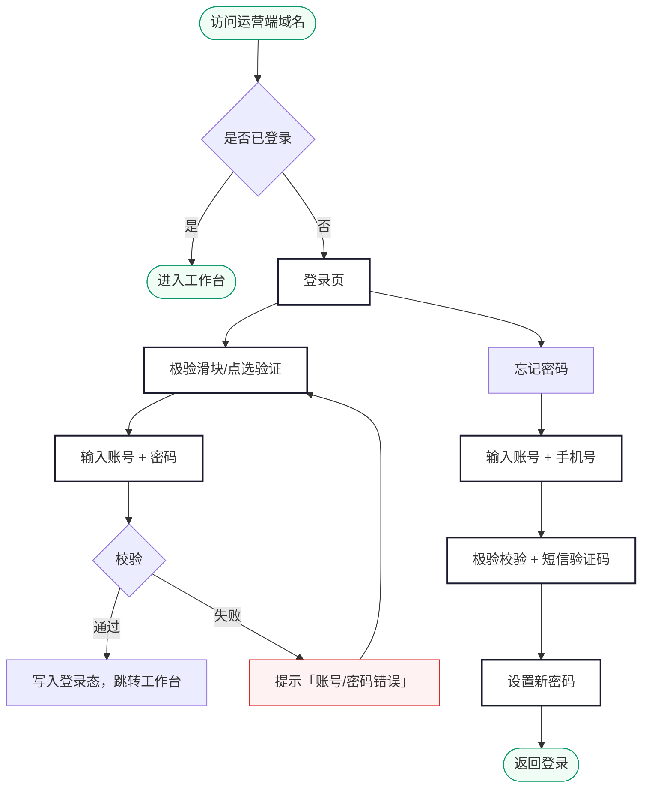
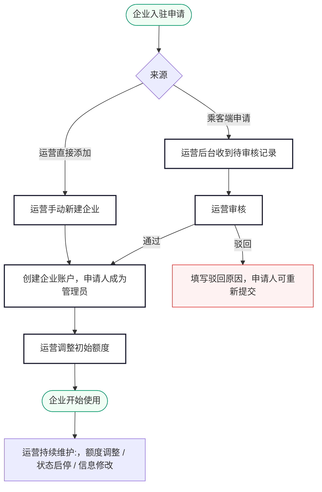
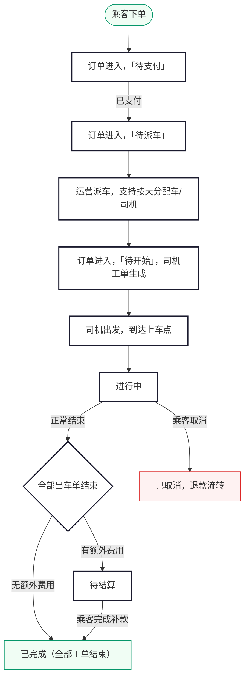
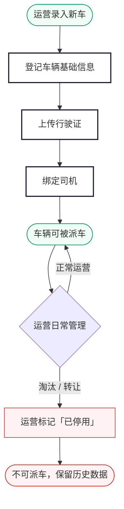
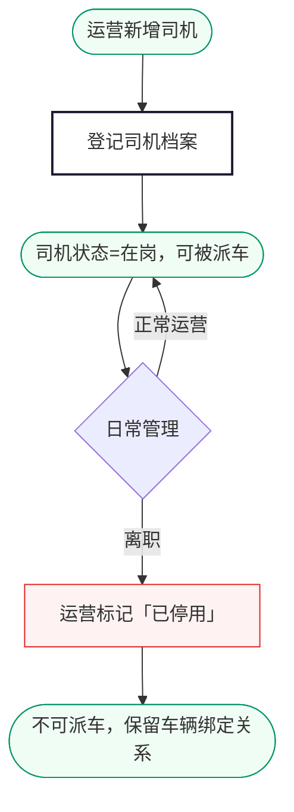
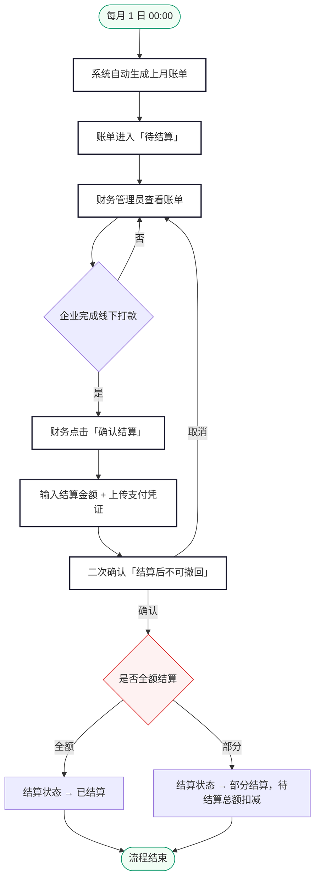

# 尊出行 · 运营端需求规格说明（PC Web 后台）

> 版本：V1.1 | 日期：2026-06-11 | 状态：编写中

---

## 目录

**登录**

1. [登录](#1-注册登录)

**首页**

2. [工作台](#2-工作台)

**业务管理**

3. [企业客户管理](#3-企业客户管理)
4. [订单管理](#4-订单管理)
5. [车辆管理] ✅(#5-车辆管理)
6. [司机管理] ✅(#6-司机管理)

**财务**

7. [财务管理] ✅(#7-财务管理)

**配置**

8. [运营配置] ✅(#8-运营配置)

**数据**

9. [数据报表](#9-数据报表)

**系统**

10. [系统管理](#10-系统管理)

---

## 1. 登录

### 业务说明

运营端为 PC Web 后台，仅供尊出行内部运营人员使用，**不开放注册**。所有账号由超级管理员在「系统管理」中创建并分配角色。运营人员通过账号 + 密码登录，登录态以 cookie 维持。

> 企业管理员账号属于另一个 Web 后台（企业端），与运营端账号体系完全隔离。

#### 页面路径

浏览器直接访问运营端 PC 后台 URL，未登录时自动跳转登录页。

---

### 1.1 业务流程

---

### 1.2 登录

#### 表单字段

| 字段 | 必填 | 校验 |
|---|---|---|
| 账号 | 是 | 4-20 位字母/数字/下划线 |
| 密码 | 是 | 6-20 位，字母+数字组合 |
| 极验验证 | 是 | 接入第三方极验（GeeTest），**每次登录均需通过**，含滑块/点选等行为校验 |

#### 错误提示

| 场景 | 提示文案 |
|---|---|
| 账号为空 | "请输入账号" |
| 密码为空 | "请输入密码" |
| 极验未通过 | "请完成安全验证" |
| 账号不存在 / 密码错误 / 账号被禁用 | 统一提示 **"账号或密码错误"**（不区分具体原因，避免账号枚举） |
| 账号被锁定 | "账号已锁定，请联系超级管理员" |

#### 登录态规则

| 项目 | 说明 |
|---|---|
| Token 时长 | 8 小时 |
| 续期 | 操作活跃时自动续期；连续 30 分钟无操作自动失效 |
| 强制下线 | 超级管理员可在「系统管理」中强制下线指定账号 |
| 账号锁定 | 连续登录失败 10 次锁定账号，需超级管理员解锁 |
| 多端登录 | 同一账号仅允许一处登录，新登录会踢掉已登录会话 |

#### 安全规则

- 密码不允许在请求中明文传输，须经过哈希处理
- 服务端记录登录日志（账号、IP、时间、是否成功、失败原因）

---

#### 登录交互

| 场景 | 行为 | 提示 |
|---|---|---|
| 点击「登录」 | 按钮置灰显示「登录中…」，防止重复提交 | — |
| 登录成功 | 写入登录态，跳转工作台 | Toast「登录成功」 |
| 登录失败（账号/密码错误） | 保持在登录页，极验刷新 | Toast「账号或密码错误」 |
| 登录失败（账号已锁定） | 保持在登录页 | Toast「账号已锁定，请联系超级管理员」 |
| 网络异常 | 保持表单数据不变 | Toast「网络异常，请重试」 |

### 1.3 忘记密码

#### 忘记密码交互

| 场景 | 行为 | 提示 |
|---|---|---|
| 点击「获取验证码」 | 按钮倒计时 60 秒，发送短信 | Toast「验证码已发送」 |
| 短信发送失败 | 按钮恢复可点击 | Toast「发送失败，请重试」 |
| 点击「重置密码」 | 按钮置灰显示「提交中…」 | — |
| 重置成功 | 自动跳回登录页 | Toast「密码重置成功，请重新登录」 |
| 重置失败（网络异常） | 保持在当前页 | Toast「重置失败，请重试」 |

运营人员遗忘密码时通过登录页「忘记密码」自助找回，**不再需要联系超级管理员**。

#### 流程

| 步骤 | 操作 | 校验 |
|---|---|---|
| ① 输入身份信息 | 账号 + 已绑定手机号 | 两者必须匹配系统中已登记的账号信息 |
| ② 安全验证 | 极验校验 + 发送短信验证码 | 短信验证码 6 位、5 分钟有效，60 秒重发限制 |
| ③ 设置新密码 | 新密码 + 确认新密码 | 6-20 位字母+数字组合 |
| ④ 完成 | 提示重置成功 | 自动跳回登录页，需用新密码重新登录 |

#### 异常处理

| 场景 | 提示 |
|---|---|
| 账号不存在或与手机号不匹配 | 「账号或手机号错误」 |
| 短信验证码错误 | 「验证码错误，请重新输入」 |
| 短信验证码超时 | 「验证码已失效，请重新获取」 |
| 新密码为空 | 「请输入新密码」 |
| 新密码格式错误 | 「密码为 6-20 位，需包含字母和数字」 |
| 两次密码不一致 | 「两次输入的密码不一致」 |
| 网络异常 | Toast「网络异常，请重试」 |

> 重置过程不展示账号是否存在，统一以"账号或手机号错误"反馈，避免账号枚举。

---

## 2. 工作台

### 业务说明

工作台是运营端登录后的默认首页，集中展示当日核心运营数据、待处理事项快捷入口和近期消息。所有运营人员都可访问，但展示的数据范围按角色权限过滤（如客服仅看分配给自己的工单提醒，财务看到的是结算相关数据）。

工作台不承载具体业务操作，所有操作均通过卡片入口跳转到对应模块。

#### 页面路径

登录成功后自动进入工作台。左侧导航栏点击「工作台」可随时返回。

---

### 2.1 页面布局

工作台为单页布局，自上而下分为四个区域：

| 区域 | 内容 |
|---|---|
| 顶部欢迎条 | 头像 + 昵称 + 角色标签 + 当前时间 |
| 核心数据卡片区 | 4-5 个数据卡片，展示今日核心运营指标 |
| 待办事项区 | 按优先级排列的待处理事项卡片，点击跳转对应列表 |
| 数据趋势区 | 近 7 天订单量 / 交易额折线图 |

---

### 2.2 核心数据卡片

| 卡片 | 数据 | 角色可见 |
|---|---|---|
| 今日订单 | 总订单量 / 较昨日 +X% | 全部 |
| 今日交易额 | 实付总金额 / 较昨日 +X% | 全部 |
| 待派车 | 当前待派车订单数 | 运营管理员、超级管理员、调度员 |
| 待结算 | 当前待结算订单数 | 财务管理员、运营管理员 |
| 在线司机 | 当前在线司机数 / 总司机数 | 运营管理员、超级管理员、调度员 |

#### 卡片交互

| 操作 | 行为 |
|---|---|
| 卡片点击 | 跳转对应模块的筛选视图（如「待派车」卡片跳转订单管理 → 待派车 Tab） |
| 数字下方对比 | 展示与昨日同时段对比，绿色 ↑ / 红色 ↓ |
| 数据刷新 | 默认 60 秒自动刷新一次，右上角「刷新」按钮可手动刷新，点击后按钮旋转动画 |

#### 按钮状态

| 按钮 | 状态 |
|---|---|
| 刷新 | 默认可点击；点击后按钮旋转动画，请求完成后恢复 |
| 卡片点击 | 所有数据卡片可点击，跳转对应模块 |

---

### 2.3 待办事项

集中展示需要运营干预的事项，按优先级排序。

| 事项类型 | 展示 | 跳转 |
|---|---|---|
| 待派车订单 | 直接展示订单列表（订单号 / 出发时间 / 路线），超出区域可滚动 | 点击卡片跳转订单详情 |

#### 事项交互

| 操作 | 行为 |
|---|---|
| 点击事项 | 跳转对应列表，自动应用筛选条件 |
| 空状态 | 当无任何待办时，显示「今日无待办事项」 |

---

### 2.4 数据趋势

近 7 天订单量与交易额双折线图：

| 项目 | 说明 |
|---|---|
| 横轴 | 近 7 天日期（今日靠右） |
| 左纵轴 | 订单量 |
| 右纵轴 | 交易额（万元） |
| 切换 | 顶部按钮切换「近 7 天」/「近 30 天」 |

---

### 2.5 角色与可见性

> **全局数据权限规则**：超级管理员可查看平台全部数据；其他角色成员仅能查看自己关联运营范围内的数据（如分配的客户、指定的区域等），超出范围的数据不可见。

| 角色 | 可见区域 |
|---|---|
| 超级管理员 | 全部数据，含所有运营指标（无范围限制） |
| 运营管理员 | 订单、派车、司机、企业相关数据（限关联范围） |
| 财务管理员 | 交易额、退款、对账相关数据；不展示派车/司机详情（限关联范围） |
| 客服管理员 | 投诉、客服工单相关数据；不展示财务数据（限关联范围） |
| 调度员 | 待调度订单、派车操作、司机车辆信息（限关联运营区域） |

---

## 3. 企业客户管理

### 业务说明

企业客户管理用于维护尊出行平台的所有企业客户信息。企业来源有两种：**乘客端小程序申请入驻** + **运营后台直接添加**。运营人员负责审核申请、维护企业基本信息、调整企业额度、查看消费记录。

#### 页面路径

左侧导航栏 → 企业客户管理

企业内部的员工管理（添加/删除员工）由企业管理员在企业端 PC 后台自行维护，运营端不参与员工管理。

> MVP 阶段乘客端 / 企业端均**未开放充值入口**，企业额度由运营人员通过「调整额度」直接增减并备注说明，不区分「充值」与「调整」两个动作。

---

### 3.1 业务流程

---

### 3.2 企业列表

#### 顶部筛选

| 筛选项 | 类型 | 说明 |
|---|---|---|
| 企业状态 | 多选 | 待审核 / 已通过 / 已驳回 / 已禁用 |
| 创建来源 | 多选 | 小程序申请 / 后台添加 |
| 关键字 | 文本 | 企业名称 / 联系人姓名 / 联系人手机号 模糊匹配 |
| 注册时间 | 日期范围 | 起止日期 |
| 剩余额度 | 数值条件 | 下拉选择「大于 / 小于 / 等于」+ 输入金额，用于筛选额度高/低的企业 |

#### 列表字段

| 列 | 内容 |
|---|---|
| 企业名称 | 全称（点击进入详情） |
| 企业编号 | ENT20260001 |
| 联系人 | 姓名 + 手机号 |
| 员工数 | 当前在岗员工数 |
| 总额度 | 累计调整后的总额度 |
| 已使用 | 累计消费金额 |
| 剩余额度 | 实时可用余额 |
| 状态 | 状态标签 |
| 创建来源 | 小程序申请 / 后台添加 |
| 注册时间 | YYYY-MM-DD HH:mm |
| 操作 | 详情 / 审核 / 调整额度 / 启用-禁用 |

#### 状态颜色

| 状态 | 颜色 |
|---|---|
| 待审核 | 琥珀色 |
| 已通过 | 绿色 |

##### 列表行操作交互

| 操作 | 触发 | 行为 | 提示 |
|---|---|---|---|
| 详情 | 点击企业名称 | 侧抽屉打开企业详情（§3.5） | — |
| 审核 | 点击「审核」 | 进入审核视图（§3.4），仅「待审核」状态可见 | — |
| 调整额度 | 点击「调整额度」 | 唤起调整额度弹窗（§3.6），仅「已通过」状态可见 | — |
| 启用 | 点击「启用」 | 直接恢复（§3.8），仅「已禁用」状态可见 | Toast「企业已启用」 |
| 禁用 | 点击「禁用」 | 弹出确认弹窗 → 填写原因（§3.8），仅「已通过」状态可见 | Toast「企业已禁用」 |
| 导出 | 成功 | 当前筛选结果导出 Excel 并下载 | Toast「导出成功」 |
| 导出 | 失败 | — | Toast「导出失败，请重试」 |

| 已驳回 | 灰色 |
| 已禁用 | 红色 |

#### 列表操作

| 操作 | 行为 |
|---|---|
| 新增企业 | 右上角按钮，弹窗填写企业信息直接创建（详见 §3.3） |
| 批量导出 | 当前筛选结果导出 Excel |

---

### 3.3 新增企业（运营手动添加）

适用于线下签约或电话沟通后由运营直接录入的企业，**跳过审核流程**，创建后即为「已通过」状态。

#### 弹窗字段

| 字段 | 必填 | 校验 |
|---|---|---|
| 企业名称 | 是 | 与营业执照一致，≤50 字 |
| 统一社会信用代码 | 否 | 18 位 |
| 联系人姓名 | 是 | ≤20 字 |
| 联系人手机号 | 是 | 11 位手机号，系统中不可重复 |
| 初始密码 | 是 | 8-20 位，含字母和数字；为该企业管理员账号的初始登录密码 |
| 备注 | 否 | ≤200 字，记录新增原因 |

#### 校验错误提示

| 场景 | 提示 |
|---|---|
| 必填字段为空 | 「请填写 XXX」 |
| 企业名称超过 50 字 | 「企业名称不能超过 50 字」 |
| 联系人手机号格式错误 | 「请输入正确的手机号」 |
| 联系人手机号已存在 | 「该手机号已被其他企业使用」 |

#### 提交后

| 行为 | 说明 |
|---|---|
| 状态 | 直接置为「已通过」 |
| 管理员账号 | 系统以联系人手机号为初始账号自动创建企业管理员，首次登录企业端需修改密码 |
| 初始额度 | 默认 0，需通过「调整额度」开通后企业方可使用 |
| 通知 | 短信通知联系人：企业账户已创建 + 登录方式 |
| 提示 | Toast「企业添加成功」 |
| 列表 | 弹窗关闭，列表自动刷新，新企业出现在列表顶部 |
| 失败 | 网络异常 / 服务端错误 | Toast「添加失败，请重试」 |

---

### 3.4 企业审核（小程序入驻申请）

#### 待审核详情

待审核企业的详情页右上角展示「通过 / 驳回」两个按钮。

#### 通过

| 操作 | 行为 | 提示 |
|---|---|---|
| 点击「通过」 | 弹出确认弹窗 | 「确定通过该企业的入驻申请吗？」 |
| 确认 | 企业状态变更为「已通过」，申请人自动绑定为管理员，可登录企业端 PC 后台 | Toast「审核已通过」 |
| 通知 | 短信 + 站内消息推送至申请人 | — |
| 网络异常 | — | Toast「操作失败，请重试」 |

#### 驳回

| 字段 | 说明 |
|---|---|
| 驳回原因 | 必填，≤200 字 |

| 场景 | 行为 | 提示 |
|---|---|---|
| 点击「驳回」 | 弹出填写驳回原因弹窗 | — |
| 原因为空 | 确认按钮置灰 | Toast「请填写驳回原因」 |
| 确认 | 企业状态变更为「已驳回」 | Toast「已驳回」 |
| 通知 | 短信 + 站内消息推送至申请人，可在乘客端重新提交 | — |
| 网络异常 | — | Toast「操作失败，请重试」 |

驳回后企业状态变更为「已驳回」，申请人修改后再次提交则进入新一轮「待审核」。

---

### 3.5 企业详情

#### 区块结构

| 区块 | 内容 |
|---|---|
| 基本信息 | **企业名称 / 统一社会信用代码 / 联系人姓名 / 联系人手机号 / 员工数 / 创建来源 / 注册时间 / 备注** |
| 额度概览 | 总额度 / 已使用 / 剩余额度 / 最近调整时间 |
| 消费记录 | 默认展示当月，支持日期范围筛选；含消费 + 退款 |
| 额度变动记录 | 历次调整记录：调增/调减金额 / 操作员 / 时间 / 备注 |

#### 详情页操作（按状态）

| 状态 | 可操作 |
|---|---|
| 待审核 | 通过 / 驳回 |
| 已通过 | —（企业信息不可编辑，额度调整和禁用操作移至列表行按钮） |
| 已驳回 | 重新审核 |
| 已禁用 | 启用（解禁后保留历史数据） |

> 已禁用的企业，员工乘客端不可使用企业支付方式，但既有订单不受影响（行程中订单照常进行）。编辑基本信息 / 调整额度 / 禁用等操作通过列表行按钮完成。

##### 详情页操作交互

**启用**

| 场景 | 行为 | 提示 |
|---|---|---|
| 点击「启用」 | 直接恢复，无需重新审核 | Toast「企业已启用」 |
| 确认 | 历史数据全部保留，企业支付方式恢复可用 | — |

**重新审核**（已驳回企业）

| 场景 | 行为 | 提示 |
|---|---|---|
| 点击「重新审核」 | 进入审核视图，可查看修改后的资料 | — |
| 通过 | 企业状态变更为「已通过」 | Toast「审核已通过」 |
| 驳回 | 填写新驳回原因 | Toast「已驳回」 |

---

### 3.6 额度管理

企业额度的所有变更**仅通过运营后台「调整额度」操作**，乘客端 / 企业端均无充值入口。

#### 调整额度弹窗

| 字段 | 说明 |
|---|---|
| 调整类型 | 调增 / 调减（单选） |
| 调整金额 | 必填，正整数（元）；调减不可使剩余额度低于 0 |
| 调整原因 | 必填，≤200 字（如「线下打款 ¥50,000」「记账纠错」「赠送试用额度」） |
| 操作员 | 自动记录当前登录账号 |

提交后：

- 立即生效，企业管理员在企业端可看到额度变化
- 写入「额度变动记录」，可按时间筛选导出
- 调增 ≥ ¥10,000 时短信通知企业管理员

##### 调整额度交互

| 场景 | 行为 | 提示 |
|---|---|---|
| 调减金额大于剩余额度 | 阻止提交 | Toast「调减金额不能超过剩余额度」 |
| 提交（成功） | 额度立即生效，写入「额度变动记录」 | Toast「额度已调整」 |
| 调增 ≥ ¥10,000 | 短信通知企业管理员 | — |
| 网络异常 | — | Toast「调整失败，请重试」 |

---

### 3.7 消费记录查询

企业详情中「消费记录」区块以表格形式展示：

| 列 | 内容 |
|---|---|
| 时间 | YYYY-MM-DD HH:mm |
| 类型 | 消费（红色 -）/ 退款（绿色 +） |
| 金额 | 变动金额 |
| 关联订单 | 订单号（点击跳转订单详情） |
| 操作员工 | 下单/取消的员工姓名 |
| 出行场景 | 包车出行 / 租车出行 |

#### 顶部汇总

页面顶部展示三项汇总数据，格式示例：
- **消费总额**：¥21,008
- **退款总额**：¥2,088
- **实际消费**：¥18,920（消费总额 − 退款总额）

支持按月切换。

#### 操作

| 操作 | 行为 |
|---|---|
| 时间筛选 | 按月 / 按日期范围 |
| 员工筛选 | 下拉选择员工，默认全部 |
| 导出 | 导出当前筛选结果为 Excel |
| 点击订单号 | 跳转订单详情页（侧抽屉打开，不离开当前页） |

---

### 3.8 启用与禁用

#### 禁用

| 操作 | 行为 | 提示 |
|---|---|---|
| 点击「禁用」 | 弹出确认弹窗，填写禁用原因（必填） | 「确定禁用企业 [企业名称] 吗？禁用后该企业员工将不可使用企业支付。」 |
| 原因为空 | 确认按钮置灰 | Toast「请填写禁用原因」 |
| 确认 | 企业状态变更为「已禁用」，写入状态记录 | Toast「企业已禁用」 |
| 通知 | 短信通知企业管理员 | — |
| 取消 | 关闭弹窗 | — |

#### 启用

| 操作 | 行为 | 提示 |
|---|---|---|
| 点击「启用」 | 直接恢复，无需重新审核 | Toast「企业已启用」 |
| 确认 | 历史额度、订单数据全部保留，企业支付方式恢复可用 | — |

> 已禁用企业可重新启用，原企业管理员/员工的企业支付方式恢复可用。

---

## 4. 订单管理

### 业务说明

订单管理是运营人员日常使用频率最高的模块，承担订单查询、派车、改单等操作。派车操作由「调度员」角色执行，下单后系统短信通知对应运营区域的调度员进行派车。退款和补款由系统自动触发。MVP 阶段订单类型仅包括**包车出行**和**租车出行**两类，预约/机场用车迭代后接入。

#### 页面路径

左侧导航栏 → 订单管理

订单管理顶部提供两个一级 Tab：

- **乘客订单**：以「乘客订单」为单位查看，运营对订单本身的全生命周期操作（详见 §4.2-§4.4）
- **司机工单**：以「司机执行任务」为单位查看，运营关注司机维度的执行进度与时长（详见 §4.5）

> 运营后台**没有「主动取消订单」**操作，取消由乘客端发起。退款和补款由系统自动执行。

---

### 4.1 业务流程

---

### 4.2 乘客订单

#### 4.2.1 订单类型 Tab（三级）

乘客订单下首先按订单类型分为两个子 Tab：

| Tab | 说明 |
|---|---|
| 包车订单 | 包车出行类型的订单 |
| 租车订单 | 租车出行类型的订单 |

> 包车订单与租车订单的列表字段不同（详见 §4.2.4 / §4.2.5），切换子 Tab 时列表字段联动变化。

#### 4.2.2 状态 Tab（三级）

在订单类型 Tab 下，进一步按状态筛选：

| Tab | 含义 | 备注 |
|---|---|---|
| 全部 | 所有订单 | 默认 |
| 待支付 | 已下单未支付 | — |
| 待开始 | 已支付未出发（含待派车 / 已派车）| — |
| 进行中 | 已开始未结束 | — |
| 待结算 | 行程结束产生额外费用，等待补款 | — |
| 已完成 | 行程正常结束、款项结清 | — |
| 已取消 | 乘客取消的订单 | 含未派车取消 / 已派车取消 / 提前结束部分 |

#### 4.2.3 顶部筛选

| 筛选项 | 类型 | 说明 |
|---|---|---|
| 支付方式 | 多选 | 企业额度支付 / 支付宝 / 微信 |
| 关键字 | 文本 | 订单号 / 下单人姓名 / 下单人手机号 / 企业名称 / 司机姓名 模糊匹配 |
| 出发时间 | 日期范围 | 包车订单按用车时段筛选；租车订单按租期起始筛选 |
| 下单时间 | 日期范围 | — |
| 企业 | 关键字 | 企业名称模糊匹配 |
| 司机 | 关键字 | 司机姓名/手机号模糊匹配 |
| 子状态 | 多选 | 在「待支付」Tab 下可筛选「待支付」；在「待结算」Tab 下无需子状态 |

> 下单人姓名：乘客端未设置昵称/姓名时该字段为空，列表展示「—」。

#### 4.2.4 包车订单 — 列表字段

| 列 | 内容 |
|---|---|
| 订单号 | ZC20260608-0001（点击进入详情） |
| 订单类型 | 「包车」彩色 Tag |
| 下单人 | 姓名 + 手机号（姓名可能为空，展示「—」+ 手机号） |
| 用车时间 | 起始日期时间 ~ 结束日期时间（多日订单展示天数） |
| 上车地点 | 简略地址 |
| 下车地点 | 简略地址 |
| 司机 | 姓名（未派车显示「—」） |
| 车辆 | 车牌号 |
| 订单金额 | 总金额（含所有费用） |
| 状态 | 状态标签 |
| 下单时间 | YYYY-MM-DD HH:mm |
| 操作 | 详情 / 派车 / 改派 |

#### 4.2.5 租车订单 — 列表字段

| 列 | 内容 |
|---|---|
| 订单号 | ZC20260608-0001（点击进入详情） |
| 订单类型 | 「租车」彩色 Tag |
| 下单人 | 姓名 + 手机号（姓名可能为空，展示「—」+ 手机号） |
| 租期 | 起始日期 ~ 结束日期 + 共 N 天 |
| 取车地点 | 简略地址 |
| 还车地点 | 简略地址 |
| 送车司机 | 姓名（未派车显示「—」） |
| 收车司机 | 姓名（未派车显示「—」） |
| 车辆 | 车牌号 |
| 订单金额 | 总金额（含所有费用） |
| 状态 | 状态标签 |
| 下单时间 | YYYY-MM-DD HH:mm |
| 操作 | 详情 / 派车 / 改派 |

#### 4.2.6 列表操作

| 操作 | 适用状态 | 行为 | 提示 |
|---|---|---|---|
| 详情 | 全部 | 侧抽屉打开订单详情（§4.4） | — |
| 派车 | 待派车 | 弹出派车窗口（详见 §4.3） | — |
| 改派 | 待开始 / 进行中 | 弹出派车窗口，可重新选择车辆/司机（详见 §4.4） | — |

##### 按钮状态

| 按钮 | 适用状态 | 禁用条件 |
|---|---|---|
| 详情 | 全部 | — |
| 派车 | 待派车 | 非待派车状态隐藏 |
| 改派 | 待开始 / 进行中 | 非待开始/进行中状态隐藏 |

##### 空状态

| 场景 | 展示 |
|---|---|
| 筛选无结果 | 「暂无符合条件的订单」 |
| 当前 Tab 无订单 | 「暂无订单记录」 |

> 订单状态由系统根据业务事件**自动流转**，运营**不可手动修改**状态。

---

### 4.3 派车

派车是运营端最高频的操作，列表「派车」按钮和详情页「派车」按钮触发同一个弹窗。该按钮在不同状态下含义不同：

| 状态 | 按钮文案 | 行为 |
|---|---|---|
| 待派车 | 派车 | 首次为订单分配车辆/司机 |
| 待开始 / 进行中 | 改派 | 重新分配车辆/司机 |

> 系统对外**统一称为「派车」**，内部根据订单状态执行不同分支。包车订单按天分配车辆和司机。租车订单分配车辆、选择司机并指定送车人和收车人，送车人和收车人可为同一人。

##### 改派规则

| 场景 | 可否改派 | 说明 |
|---|---|---|
| 订单状态 = 待开始 | ✅ 可改派 | 所有司机工单尚未开始，作废原出车单后按新分配重新生成 |
| 订单状态 = 进行中，部分出车单未开始 | ✅ 可改派 | 仅作废未开始的出车单并重新生成；已开始/已完成的出车单保留不变 |
| 订单状态 = 进行中，全部出车单已开始 | ❌ 不可改派 | 所有出车单已在进行中，无法重新分配 |
| 订单状态 = 已完成/已取消/待结算 | ❌ 不可改派 | 订单已进入终态或待结算 |

**改派数据流转：**
- 触发的改派弹窗与派车弹窗共用同一控件，预填当前分配信息，仅可编辑被作废的日程行；
- 提交后：作废原司机工单 → 按新分配重新生成出车单 → 通知原司机（取消任务）+ 新司机（新任务）+ 乘客（更新车辆/司机信息）；
- 已开始的出车单不受影响，继续执行至结束。

#### 4.3.1 派车弹窗

弹窗左右两栏布局：

| 栏目 | 内容 |
|---|---|
| 左：订单概览 | 订单号 / 类型 / 用车时段 / 上车点 / 下车点 / 乘客信息 |
| 右：日程分配 | 日程列表 + 每日车辆/司机选择 |

##### 日程分配列表

包车订单的每一个出行日作为一行展示，租车订单展示送车日和收车日两行：

| 列 | 内容 |
|---|---|
| 日期 | 出车日期 |
| 时段 | 当天的用车时段 |
| 车辆 | 下拉选择（仅展示「在用」状态车辆），默认全部行统一 |
| 司机 | 包车订单：下拉选择司机；租车订单：选择司机 + 指定送车人和收车人（可为同一人） |
| 冲突提示 | 若所选车辆/司机当日已有其他派车，该行标注红色冲突标记 |

##### 统一分配

默认选中一辆车和一位司机，所有日程行自动填充相同的车辆和司机。

##### 按天分配

运营人员可逐行切换车辆或司机，实现同一订单的不同日期由不同车辆/司机执行：

| 操作 | 行为 |
|---|---|
| 选择车辆 | 下拉筛选，选中的车辆自动填入当前行 |
| 选择司机 | 下拉筛选，默认带出该车辆绑定司机，可切换 |

##### 冲突处理

| 场景 | 行为 |
|---|---|
| 所选车辆/司机当日已有派车 | 该行以红色标记冲突，底部提示「部分日期存在冲突，确认仍要派车吗？」 |
| 用户确认 | **允许继续派车**，仅作提示，不强制阻断 |
| 用户取消 | 关闭弹窗或重新选择 |

> 车辆位置信息暂未接入，列表不展示距离/位置字段。

##### 派车备注

| 字段 | 说明 |
|---|---|
| 备注 | 选填，≤200 字，记录派车说明（如「客户指定王师傅」「送车人李师傅、收车人张师傅」） |

#### 4.3.2 提交派车

| 行为 | 说明 |
|---|---|
| 校验 | 每个日程行必选车辆和司机 |
| 提交 | 按日程逐行生成司机工单（一天一条），订单状态从「待派车」流转到「待开始」 |
| 通知 | 每位司机端推送派车消息；乘客端推送「已派车」通知（含各日车牌+司机姓名/电话） |
| 改派 | 仅作废未开始的司机工单并重新生成；已开始/已完成的出车单保留不变。原司机（被替换日程）收到取消通知，新司机收到派车通知 |

##### 提交派车交互

| 场景 | 行为 | 提示 |
|---|---|---|
| 某日程行未选车辆 | 提交按钮置灰，该行标红 | Toast「请为所有日程选择车辆」 |
| 某日程行未选司机 | 提交按钮置灰，该行标红 | Toast「请为所有日程选择司机」 |
| 提交（成功-首派） | 按日程生成司机工单，弹窗关闭，列表刷新 | Toast「派车成功」 |
| 提交（成功-改派） | 作废未开始的原出车单，重新生成，通知原司机+新司机+乘客 | Toast「改派成功」 |
| 网络异常 | — | Toast「派车失败，请重试」 |

---

### 4.4 订单详情

订单详情以**侧抽屉**形式打开，宽度占屏幕约 60%。

#### 4.4.1 乘客订单详情 — 包车出行

##### 区块结构

| 区块 | 内容 |
|---|---|
| 基本信息 | 订单号（如 ZC20260608-0001）/ 类型（彩色 Tag）/ 状态/ 下单时间 / 下单人 / 手机号 / 用户身份（个人/企业员工 Tag）/ 下单企业（企业员工时展示） |
| 用车信息 | 用车时段 / 上车点 / 下车点 |
| 车型套餐 | 车型名称 + 套餐名称 + 套餐类型（如「尊界 S800 · 尊享基础套餐（半日租/4 小时/50km）」），套餐价直接展示单价 |
| 日程与派车 | 按日展示：日期 + 时段 + 车辆 + 司机 + 司机工单号 + 出车单状态；未派车时展示「待派车」红色标签 |
| 费用明细 | 见下方详细说明 |
| 订单动态 | 按状态展示时间线（见下方） |
| 备注 | 乘客备注（**只读**） / 内部备注（运营可写） |
| 操作日志 | 谁在什么时间做了什么操作 |

##### 费用明细

费用明细按费用类型逐行展示。已支付的费用正常展示，**待支付项的金额红色突出显示**。

| 费用项 | 展示规则 |
|---|---|
| 套餐费 | 套餐单价 × 天数。示例：¥800 × 3 天 = ¥2,400 |
| 等待费 | 免费 15 分钟，超出 ¥1/分钟。无等待费展示「¥0」；有等待费展示金额，右侧「明细」按钮 → 弹窗 |
| 超时长费 | ¥100/小时。无超时展示「¥0」；有超时展示金额，右侧「明细」按钮 → 弹窗 |
| 超里程费 | ¥5/km。无超里程展示「¥0」；有超里程展示金额，右侧「明细」按钮 → 弹窗 |
| 远调费 | 根据上车点到运营区域边缘的直线距离按梯度计费。无远调费展示「¥0」；有远调费展示金额，右侧「明细」按钮 → 弹窗 |
| 其他费用 | 无上报展示「¥0」；有上报展示金额，右侧「明细」按钮 → 弹窗 |
| 合计费用 | 上述六项加总 = X 元 |
| 待支付费用 | 若有补款金额则展示（红色），已支付完则不展示此行 |

**等待费明细弹窗：**

| 列 | 内容 |
|---|---|
| 日期 | 出车日期 |
| 司机到达时间 | 司机点击「到达上车点」的时间 |
| 司机到达地点 | GPS 定位简略地址 |
| 等待时长 | X 分钟（实际等待 − 免费 15 分钟） |
| 等待费 | ¥X（等待时长 × ¥1/分钟，不足 1 分钟不计） |

**超时长费明细弹窗：**

| 列 | 内容 |
|---|---|
| 日期 | 出车日期 |
| 行程开始时间 | 司机点击「开始行程」的时间 |
| 行程结束时间 | 司机点击「结束行程」的时间 |
| 实际使用时长 | X 小时 X 分钟 |
| 套餐内时长 | 半日租 4 小时 / 日租 8 小时 |
| 超时长 | X 小时（实际 − 套餐内，不足 1 小时按 1 小时计） |
| 超时长费 | ¥X（超时长 × ¥100/小时） |

**超里程费明细弹窗：**

| 列 | 内容 |
|---|---|
| 日期 | 出车日期 |
| 开始里程 | 当日行程开始时里程表读数 |
| 结束里程 | 当日行程结束时里程表读数 |
| 当日里程 | 结束里程 − 开始里程 |
| 套餐内里程 | 半日租 50km / 日租 100km |
| 超里程 | X km（当日里程 − 套餐内里程） |
| 超里程费 | ¥X（超里程 × ¥5/km） |
| 开始里程图片 | 司机上传的行程开始时里程表照片 |
| 结束里程图片 | 司机上传的行程结束时里程表照片 |

**远调费明细弹窗：**

| 列 | 内容 |
|---|---|
| 日期 | 出车日期 |
| 接驾远调距离 | 上车点到运营区域边缘的直线距离（X km），包车展示 |
| 送达远调距离 | 下车点到运营区域边缘的直线距离（X km），包车展示 |
| 取车远调距离 | 取车点到运营区域边缘的直线距离（X km），租车展示 |
| 还车远调距离 | 还车点到运营区域边缘的直线距离（X km），租车展示 |
| 对应金额 | ¥X（按梯度计费） |

> 包车展示「接驾远调距离」和「送达远调距离」两行；租车展示「取车远调距离」和「还车远调距离」两行。距离为 0 时不产生远调费。

**其他费用明细弹窗：**

| 列 | 内容 |
|---|---|
| 日期 | 出车日期 / 上报日期 |
| 费用类型 | 司机选择的费用类别（如高速费、停车费、洗车费） |
| 金额 | 司机填写的上报金额 |
| 凭证 | 司机上传的费用凭证图片 |

> 费用明细弹窗按日期逐行展开。多日订单（一个乘客主订单含多个日程）各日独立计算等待费/超时长费/超里程费/其他费用，明细弹窗展示每日明细及汇总。

##### 订单动态

| 状态 | 动态节点（最新在上） |
|---|---|
| 待支付 | 订单已提交 |
| 待派车 | 支付成功（支付方式，如使用积分则展示「微信支付 ¥230 使用积分 3000」）→ 订单已提交 |
| 待开始 | 已派车（车型+车牌+司机）→ 支付成功（支付方式，如使用积分则展示「微信支付 ¥230 使用积分 3000」）→ 订单已提交 |
| 进行中 | 行程开始 → 已派车 → 支付成功（支付方式，如使用积分则展示「微信支付 ¥230 使用积分 3000」）→ 订单已提交 |
| 已完成 | 行程结束 → 行程开始 → 已派车 → 支付成功（支付方式，如使用积分则展示「微信支付 ¥230 使用积分 3000」）→ 订单已提交 |
| 已取消 | 订单已取消（取消原因）→ 支付成功（支付方式，如使用积分则展示「微信支付 ¥230 使用积分 3000」）→ 订单已提交 |
| 待结算 | 全部行程结束（待结算 ¥X）→ 行程开始 → 已派车 → 支付成功（支付方式，如使用积分则展示「微信支付 ¥230 使用积分 3000」）→ 订单已提交 |

> 乘客端填写的「用车备注」**运营不可修改**，运营只能在「内部备注」中追加说明。

#### 4.4.2 乘客订单详情 — 租车出行

##### 区块结构

| 区块 | 内容 |
|---|---|
| 基本信息 | 订单号 / 类型（彩色 Tag）/ 状态/ 下单时间 / 下单人 / 手机号 / 用户身份 / 下单企业 |
| 用车信息 | 租期（起始 ~ 结束 + 共 N 天）/ 取车地点 / 还车地点 |
| 车型信息 | 车型名称（如「尊界 S800」），日租价直接展示单价 |
| 日程与派车 | 送车司机 / 收车司机 / 车辆 / 司机工单号 / 出车单状态；未派车时展示「待派车」红色标签 |
| 费用明细 | 见下方详细说明 |
| 订单动态 | 同包车出行订单动态（按状态展示时间线，支付成功含支付方式） |
| 备注 | 乘客备注（**只读**） / 内部备注（运营可写） |
| 操作日志 | 同包车出行 |

##### 费用明细

与包车出行费用明细结构一致（详见 §4.4.1），差异项：**无套餐费，以日租价替代**。已支付费用正常展示，**待支付项金额红色突出显示**。

| 费用项 | 展示规则 |
|---|---|
| 日租价 | 日租单价 × 天数。示例：¥1,200 × 3 天 = ¥3,600 |
| 等待费 | 同包车（免费 15 分钟，超出 ¥1/分钟）。0 或金额 + 明细弹窗 |
| 超时长费 | 同包车（¥100/小时）。0 或金额 + 明细弹窗 |
| 超里程费 | 同包车（¥5/km）。0 或金额 + 明细弹窗 |
| 远调费 | 根据取车点到运营区域边缘的直线距离按梯度计费。0 或金额 + 明细弹窗 |
| 其他费用 | 同包车。0 或金额 + 明细弹窗（日期/费用类型/金额/凭证） |
| 合计费用 | 上述六项加总 |
| 待支付费用 | 若有补款金额则展示（红色），已支付完则不展示 |

> 明细弹窗字段及交互同 §4.4.1 包车出行费用明细。

#### 4.4.3 详情页操作

| 操作 | 适用状态 | 行为 |
|---|---|---|
| 派车 / 改派 | 待派车 / 待开始 / 进行中 | 唤起派车弹窗（§4.3） |
| 退款 | 已完成 | 唤起退款弹窗（详见下方「退款操作」） |
| 添加内部备注 | 全部 | 下方展开富文本编辑框，记录操作员和时间 |

> 乘客取消订单后系统按取消规则自动计算违约金并退款（无需运营手动操作）。行程结束产生额外费用后系统自动生成补款链接推送至乘客。

##### 退款操作

运营人员在订单详情页点击「退款」按钮，调出退款弹窗。

**退款弹窗字段：**

| 字段 | 必填 | 校验 / 说明 |
|---|---|---|
| 订单已付金额 | — | 只读展示，取自该订单实际已支付的总金额 |
| 退款金额 | 是 | 正整数（元）。不可超过订单已付金额，不可为 0 |
| 退款原因 | 是 | ≤200 字 |

**退款流程：**

| 步骤 | 说明 |
|---|---|
| 1. 输入退款金额 | 运营人员在弹窗中填写退款金额和退款原因 |
| 2. 点击「确认退款」 | 系统校验金额 |
| 3. 二次确认弹窗 | 展示退款金额 + 退款方式（原路退回），提示「确认后将按原支付方式退回，不可撤回」 |
| 4. 确认 → 执行退款 | 按原支付方式处理 |

**退款方式（原路退回）：**

| 原支付方式 | 退款行为 |
|---|---|
| 微信支付 / 支付宝 | 调用富友平台发起原路退款，资金退回用户原支付账户 |
| 企业额度支付 | 生成一笔额度退款记录，恢复企业可用额度 |

> 若该订单为**企业额度支付**且该笔额度已在企业账单中**已结算**（账单状态为「已结算」），点击退款时阻止操作，Toast「该订单额度已结算，无法退款」。

**校验错误提示：**

| 场景 | 提示 |
|---|---|
| 退款金额为空 | 「请输入退款金额」 |
| 退款金额 ≤ 0 | 「退款金额必须大于 0」 |
| 退款金额 ＞ 已付金额 | 「退款金额不能超过订单已付金额」 |
| 退款原因为空 | 「请输入退款原因」 |
| 企业额度已结算 | 「该订单额度已结算，无法退款」 |
| 退款成功 | Toast「退款已发起」+ 订单详情刷新 |
| 退款失败（网络/系统异常） | Toast「退款失败，请重试」 |

> 退款成功后，订单详情费用明细中新增「退款金额」行，展示已退金额和退款时间。订单状态不变。

##### 添加内部备注交互

| 场景 | 行为 | 提示 |
|---|---|---|
| 点击「添加内部备注」 | 在备注区块下方展开富文本编辑框 + 「保存」「取消」按钮 | — |
| 保存（成功） | 备注追加到列表，记录操作员+时间 | Toast「备注已保存」 |
| 保存（内容为空） | 阻止保存 | Toast「请输入备注内容」 |
| 保存（网络异常） | — | Toast「保存失败，请重试」 |
| 取消 | 收起编辑框，不保存 | — |

---

### 4.5 司机工单

司机工单以「司机执行任务」为单位，每条工单对应一个出车日的一次派车任务。运营关注司机维度的执行进度与时长。

#### 4.5.1 司机工单列表

##### 顶部筛选

| 筛选项 | 类型 | 说明 |
|---|---|---|
| 工单状态 | 多选 | 待开始 / 进行中 / 已完成 / 待结算 / 已取消 |
| 司机 | 下拉 + 搜索 | 按司机姓名筛选 |
| 日期 | 日期范围 | 出车日期 |
| 关键字 | 文本 | 工单号 / 车牌号 / 订单号 模糊匹配 |

##### 列表字段

| 列 | 内容 |
|---|---|
| 工单号 | GC20260608-0001（点击进入详情） |
| 关联订单 | 订单号（点击跳转乘客订单详情） |
| 司机 | 司机姓名 |
| 车辆 | 车牌号 |
| 出车日期 | YYYY-MM-DD |
| 时段 | 出车时段 |
| 上报费用 | 有费用时展示金额 + 红色标记，无费用展示「—」 |
| 工单状态 | 状态标签 |
| 操作 | 详情 |

##### 状态颜色

| 状态 | 颜色 |
|---|---|
| 待开始 | 蓝色 |
| 进行中 | 琥珀色 |
| 已完成 | 绿色 |
| 待结算 | 红色 |
| 已取消 | 灰色 |

#### 4.5.2 司机工单详情

司机工单详情以**侧抽屉**形式打开，宽度占屏幕约 60%。

##### 区块结构

| 区块 | 内容 |
|---|---|
| 基本信息 | 工单号 / 工单状态（彩色 Tag）/ 关联订单号（点击跳转乘客订单详情）/ 出车日期 / 时段 |
| 车辆与司机 | 车牌号 / 司机姓名 + 手机号 |
| 乘客信息 | 下单人姓名 + 手机号 / 上车点 / 下车点 / 乘客备注 |
| 上报费用 | 见下方详细说明 |
| 里程信息 | 开始里程（图片）/ 结束里程（图片）/ 当日里程 |
| 工单动态 | 按时间线展示（见下方） |

##### 上报费用

与乘客订单费用明细格式一致（详见 §4.4.1），以下两点不同：

1. **明细弹窗无日期字段**：司机每天即为一个工单，日期已体现在工单基本信息中，无需在明细弹窗重复展示
2. **无套餐费**：司机仅关联等待费/超时长费/超里程费/远调费/其他费用五项，不展示套餐费

| 费用项 | 展示规则 |
|---|---|
| 等待费 | 免费 15 分钟，超出 ¥1/分钟。无等待费展示「¥0」；有等待费展示金额，右侧「明细」→ 弹窗（到达时间/地点/等待时长/费用） |
| 超时长费 | ¥100/小时。无超时展示「¥0」；有超时展示金额，右侧「明细」→ 弹窗（起止时间/实际使用时长/套餐内时长/超时长/费用） |
| 超里程费 | ¥5/km。无超里程展示「¥0」；有超里程展示金额，右侧「明细」→ 弹窗（起止里程/当日里程/套餐内里程/超里程/费用+里程照片） |
| 远调费 | 根据上车点到运营区域边缘的直线距离按梯度计费。无远调费展示「¥0」；有远调费展示金额，右侧「明细」→ 弹窗（同乘客订单远调费明细） |
| 其他费用 | 无上报展示「¥0」；有上报展示金额，右侧「明细」→ 弹窗（费用类型/金额/凭证）。司机可点击「上报费用」按钮追加 |
| 上报合计 | 上述五项加总。若工单状态为「待结算」则红色标注 |

> 司机仅在「进行中」或行程结束时可上报费用。已结算的工单不可再上报。已支付费用正常展示，待支付金额红色突出显示。

##### 工单动态

| 时间节点 | 说明 |
|---|---|
| 工单已生成 | 运营派车后自动生成，状态 = 待开始 |
| 司机出发 | 司机点击「开始行程」，状态 = 进行中 |
| 到达上车点 | 司机到达上车点，记录到达时间 + GPS 位置 |
| 行程结束 | 司机点击「结束行程」，记录结束时间 + 里程表读数 |
| 上报费用 | 司机提交额外费用（费用类型 + 金额 + 凭证），状态 = 待结算 |
| 工单完成 | 乘客完成补款支付，状态 = 已完成 |

##### 列表操作

| 操作 | 适用状态 | 行为 |
|---|---|---|
| 查看详情 | 全部 | 点击工单号打开侧抽屉详情 |

> 司机工单为只读视图，运营端不可编辑工单信息。

---

### 4.6 状态对应关系

乘客订单状态与司机工单状态的对应关系：

| 乘客订单状态 | 司机工单状态 | 说明 |
|---|---|---|
| 待支付 | — | 未派车，无司机工单 |
| 待派车 | — | 未派车，无司机工单 |
| 待开始 | 待开始 | 已派车，司机尚未出车 |
| 进行中 | 进行中 | 司机已开始执行行程 |
| 待结算 | 待结算 | 全部司机工单结束且司机已提交额外费用，等待乘客补款 |
| 已完成 | 已完成 | 行程结束且款项结清 |
| 已取消 | 已取消 | 乘客取消 → 所有关联司机工单取消；或改派作废原出车单 |

> 一笔乘客订单可能对应多条司机工单（多日订单按天分配），各条司机工单的状态可能不同（如第 1 天已完成、第 2 天进行中）。

---

### 4.7 状态流转规则

#### 乘客订单状态流转

| 当前状态 | 触发事件 | 流转到 |
|---|---|---|
| 待支付 | 乘客完成支付 | 待派车 |
| 待支付 | 乘客超时未支付（30 分钟） | 已取消 |
| 待派车 | 运营完成派车 | 待开始 |
| 待派车 | 乘客取消 | 已取消（全额退） |
| 待开始 | 任一司机工单点击「开始行程」 | 进行中 |
| 待开始 | 乘客取消 | 已取消（按取消规则退款） |
| 进行中 | 全部司机工单结束，无额外费用 | 已完成 |
| 进行中 | 全部司机工单结束，且有司机上报的额外费用需补款 | 待结算 |
| 进行中 | 乘客「提前结束行程」（多日租车） | 已完成（已开始日期不退、未开始日期按规则退） |
| 待结算 | 乘客完成补款 | 已完成 |
| 待结算 | 乘客 7 天内未补款 | 进入财务催收（状态保持待结算，列表标红） |

#### 司机工单状态流转

| 当前状态 | 触发事件 | 流转到 |
|---|---|---|
| 待开始 | 司机点击「开始行程」 | 进行中 |
| 待开始 | 乘客取消 / 运营改派 | 已取消 |
| 进行中 | 司机点击「结束行程」无额外费用 | 已完成 |
| 进行中 | 司机点击「结束行程」并提交额外费用 | 待结算 |
| 待结算 | 乘客完成补款支付 | 已完成 |
| 待结算 | 乘客 7 天内未补款 | 保持待结算（乘客订单进入催收） |

---

## 5. 车辆管理

### 业务说明

车辆管理维护平台所有运营车辆的基础档案、行驶证信息及司机绑定关系。运营人员通过该模块完成车辆档案新建、行驶证上传、司机管理及车辆启停处置。

#### 页面路径

左侧导航栏 → 车辆管理

车辆属于平台核心资产，与司机、订单、计费规则深度关联：

- 一辆车可绑定多位司机；
- 车辆仅「在用」状态可被派车；
- 运营配置中的「车型 + 计费规则」依赖车辆属性进行匹配。

> MVP 阶段车辆定位 / GPS 轨迹未接入，车辆管理不涉及实时位置相关功能。派车由运营人工调度，不做自动化冲突校验。

---

### 5.1 业务流程

---

### 5.2 车辆列表

#### 顶部筛选

| 筛选项 | 类型 | 说明 |
|---|---|---|
| 车辆状态 | 多选 | 在用 / 已停用 |
| 车辆分类 | 多选 | 轿车 / SUV / MPV / 豪华轿车 |
| 关键字 | 文本 | 车牌号 / 车型名称 模糊匹配 |
| 绑定司机 | 下拉 + 搜索 | 按司机姓名/手机号筛选其绑定的车辆 |
| 添加时间 | 日期范围 | — |

#### 列表字段

| 列 | 内容 |
|---|---|
| 车牌号 | 完整车牌（点击进入详情） |
| 车辆编号 | CAR20260001 |
| 车辆分类 | 轿车 / SUV / MPV / 豪华轿车 |
| 车型名称 | 如「尊界 S800」 |
| 座位数 | 含司机 |
| 颜色 | 外观颜色 |
| 绑定司机 | 多位司机时展示「N 位司机」（蓝色可点击），点击弹出司机信息弹窗（只读，含姓名/手机号/在岗状态/绑定时间）；未绑定时显示「未绑定」灰字 |
| 车辆状态 | 状态标签 |
| 添加时间 | YYYY-MM-DD HH:mm |
| 操作 | 详情 / 编辑 / 停用 |

#### 状态颜色

| 状态 | 颜色 |
|---|---|
| 在用 | 绿色 |
| 已停用 | 红色 |

#### 列表操作

| 操作 | 行为 |
|---|---|
| 新增车辆 | 右上角按钮，弹出新增弹窗（详见 §5.3） |
| 排序 | 添加时间可排序 |

##### 列表行操作交互

| 操作 | 触发 | 行为 | 成功 Toast | 失败 Toast |
|---|---|---|---|---|
| 详情 | 点击车牌号 | 侧抽屉打开车辆详情（§5.4） | — | — |
| 绑定司机 | 点击「N 位司机」 | 弹出司机信息弹窗（只读），展示姓名/手机号/在岗状态/绑定时间，不可编辑 | — | — |
| 编辑 | 点击「编辑」 | 弹出与「新增车辆」相同的弹窗控件和字段（§5.3），车牌号可编辑 | — | — |
| 停用 | 点击「停用」 | 弹出停用确认弹窗 → 填写停用原因（必填）→ 确认 → 列表刷新 | 「车辆已停用」 | — |
| 停用（校验失败） | — | 原因未填写时按钮置灰，提示「请填写停用原因」 | — | — |

> 「停用」仅对「在用」状态的车辆显示；「已停用」状态的车辆操作列隐藏「停用」，仅展示「详情」「编辑」。

---

### 5.3 新增车辆

运营人员通过「新增车辆」按钮录入车辆档案，提交后车辆状态直接为「在用」。

#### 弹窗字段

| 字段 | 必填 | 校验 / 说明 |
|---|---|---|
| 车牌号 | 是 | 系统中不可重复，可后续编辑修改 |
| 车型名称 | 是 | 下拉选择，选项来自车型库 §8.2 车型管理 |
| 车辆分类 | — | 选择车型名称后自动带出，不可手动编辑 |
| 座位数 | — | 选择车型名称后自动带出，不可手动编辑 |
| 颜色 | 是 | 下拉预设色 + 可自定义 |
| 车架号（VIN） | 否 | 17 位，正则校验 |
| 发动机号 | 否 | ≤20 字 |
| 注册日期 | 否 | 行驶证登记日期 |
| 行驶证 | 否 | 上传行驶证正副本照片，单张 ≤ 5MB |
| 车辆照片 | 否 | 支持多张上传（外观、内饰），单张 ≤ 5MB |

> 操作顺序：先选择「车型名称」→ 系统自动带出「车辆分类」「座位数」（参数来源于车型管理 §8.2 创建车型时的冷录入数据，不可手动编辑）。品牌信息已内置于车型库，无需单独填写。

#### 校验错误提示

| 场景 | 提示文案 |
|---|---|
| 必填字段为空 | 「请填写 XXX」（字段旁标红） |
| 车牌号已存在 | 「该车牌号已存在」 |
| 照片超限 | 「单张照片不能超过 5MB」 |
| VIN 格式错误 | 「请输入 17 位车架号」 |

#### 提交后

| 行为 | 说明 |
|---|---|
| 状态 | 直接置为「在用」 |
| 编号 | 系统自动生成车辆编号 CAR2026XXXX |
| 司机 | 提交后可在详情中绑定司机（详见 §5.5） |
| 提示 | Toast「车辆添加成功」 |
| 列表 | 新增弹窗关闭，列表自动刷新，新车辆出现在列表顶部 |
| 失败 | 网络异常 / 服务端错误时 Toast「添加失败，请重试」 |

##### 按钮状态

| 按钮 | 行为 |
|---|---|
| 保存 | 必填字段为空时置灰；填写完整后可点击；点击后显示「保存中…」 |

---

### 5.4 车辆详情

车辆详情以**侧抽屉**形式打开，宽度占屏幕约 60%。

#### 区块结构

| 区块 | 内容 |
|---|---|
| 基本信息 | 车牌号 / 车辆编号 / 车型名称 / 车辆分类 / 座位数 / 颜色 / 车架号 / 发动机号 / 注册日期 |
| 车辆照片 | 图片网格预览，点击放大（只读，不可编辑） |
| 行驶证 | 行驶证正副本照片（只读，不可编辑） |
| 绑定司机 | 当前绑定司机列表，含姓名 + 手机号 + 绑定时间，未绑定时展示「未绑定」 |
| 绑定记录 | 历次司机绑定 / 解绑记录：司机姓名 / 绑定时间 / 解绑时间 / 操作员 |
| 状态变更记录 | 启用 / 停用的变更记录：操作员 / 时间 / 原因 |
| 操作日志 | 新增 / 编辑 / 绑定司机 / 停用 / 启用 的完整记录 |

#### 行驶证

行驶证正副本照片仅作档案留存，详情中只读展示，不可编辑。

> MVP 阶段不做证件到期监控，行驶证照片仅作档案留存。

> 车辆一旦「已停用」不可被派车；历史订单 / 司机工单数据保留不受影响。车辆详情不展示操作按钮，管理司机 / 停用 / 重新启用等操作均通过列表行按钮完成。车辆详情不展示「编辑」操作按钮，点击列表「编辑」使用与新增相同的弹窗控件（详见 §5.2）。

---

### 5.5 司机绑定

一辆车可绑定多位司机。

#### 绑定规则

| 规则 | 说明 |
|---|---|
| 一辆车可绑定多位司机 | 每位司机均处于「在岗」状态 |
| 车辆停用 | 车辆不可派车，司机绑定关系保留不清除 |
| 司机停用 | 司机不可派车，车辆绑定关系保留不清除 |

#### 管理司机弹窗

| 项目 | 说明 |
|---|---|
| 已绑定列表 | 当前绑定司机列表：姓名 + 手机号 + 绑定时间，每行右侧有「解绑」按钮 |
| 添加司机 | 下拉搜索司机，仅显示「在岗」状态司机，点击「添加」后追加到待绑定列表 |
| 解绑 | 单个解绑，点击「解绑」弹出确认「确定解绑该车辆与司机 XXX 的绑定关系吗？」（原因选填） |
| 底部按钮 | 「取消」放弃所有未提交的变更；「保存」提交绑定变更 |

> 绑定 / 解绑均写入「绑定记录」，记录操作员和时间。

#### 添加司机交互

| 场景 | 行为 | 提示 |
|---|---|---|
| 选择司机并添加 | 司机追加到待绑定列表，置于「待新增」分组，与原已绑定司机区分展示 | Toast「已添加司机 XXX」 |
| 重复添加已绑定司机 | 阻止添加 | Toast「该司机已绑定」 |
| 重复添加待新增列表中已有的司机 | 阻止添加 | Toast「该司机已在待添加列表中」 |

#### 解绑交互

| 场景 | 行为 | 提示 |
|---|---|---|
| 点击「解绑」 | 弹出确认弹窗 | 「确定解绑该车辆与司机 XXX 的绑定关系吗？」 |
| 确认解绑 | 已绑定的司机移入「待解绑」分组（视觉标记为删除态，仍可撤销） | Toast「已解绑司机 XXX」 |
| 撤销解绑 | 在待解绑列表中点击「撤销」，司机回到已绑定列表 | — |
| 解绑最后一位司机 | 无特殊限制，允许全部解绑 | — |

#### 保存与取消

| 操作 | 行为 | 提示 |
|---|---|---|
| 保存（有变更） | 新增绑定 + 解绑一次性生效，写入绑定记录 | Toast「司机绑定已更新」；弹窗关闭，详情页绑定司机列表即时刷新 |
| 保存（无变更） | 弹窗直接关闭 | — |
| 保存（网络异常） | — | Toast「保存失败，请重试」 |
| 取消 | 放弃所有未提交的新增 / 解绑操作，弹窗关闭，不做任何变更 | — |

---

### 5.6 车辆状态流转

| 当前状态 | 触发操作 | 流转到 | 附加行为 | Toast |
|---|---|---|---|---|
| —（新建） | 运营新增车辆 | 在用 | 生成车辆编号 | 「车辆添加成功」 |
| 在用 | 运营停用 | 已停用 | 不可派车，司机绑定关系保留 | 「车辆已停用」 |
| 已停用 | 运营重新启用 | 在用 | 恢复可派车，原有司机绑定关系仍在 | 「车辆已启用」 |

> 车辆状态的每一次变更均写入「状态变更记录」和操作日志。

---

## 6. 司机管理

### 业务说明

司机管理维护平台所有司机的个人档案及驾驶证信息。**所有司机均由运营后台直接添加，无需审核流程，添加后即进入在岗状态**。不开放司机端自助注册。运营人员负责司机档案新建、车辆绑定以及司机停用处置。

#### 页面路径

左侧导航栏 → 司机管理

司机是平台核心执行资源，与车辆、订单派车深度关联：

- 司机需处于「在岗」状态方可被派车；
- 派车时优先分配当前空闲司机，多位空闲时由运营人员手动选择。

---

### 6.1 业务流程

---

### 6.2 司机列表

#### 顶部筛选

| 筛选项 | 类型 | 说明 |
|---|---|---|
| 司机状态 | 多选 | 在岗 / 已停用 |
| 关键字 | 文本 | 姓名 / 手机号 模糊匹配 |
| 入驻时间 | 日期范围 | — |

#### 列表字段

| 列 | 内容 |
|---|---|
| 司机编号 | DRV20260001 |
| 姓名 | 点击进入详情 |
| 手机号 | 脱敏展示（138****1234） |
| 驾驶证类型 | C1 / C2 / B1 / B2 / A1 等 |
| 状态 | 状态标签 |
| 入驻时间 | YYYY-MM-DD HH:mm |
| 操作 | 详情 / 编辑 / 停用 |

#### 状态颜色

| 状态 | 颜色 |
|---|---|
| 在岗 | 绿色 |
| 已停用 | 红色 |

#### 列表操作

| 操作 | 行为 |
|---|---|
| 新增司机 | 右上角按钮，弹窗填写司机信息直接创建（详见 §6.3） |
| 批量导出 | 当前筛选结果导出 Excel |
| 排序 | 入驻时间 可排序 |

##### 列表行操作交互

| 操作 | 触发 | 行为 | 提示 |
|---|---|---|---|
| 详情 | 点击姓名 | 侧抽屉打开司机详情（§6.4） | — |
| 编辑 | 点击「编辑」 | 弹出与「新增司机」相同的弹窗控件和字段（§6.3） | — |
| 停用 | 点击「停用」 | 校验无进行中订单（待开始/进行中/待结算）→ 弹出停用确认弹窗 → 填写原因 → 确认。仅「在岗」状态可见，有进行中订单时阻止停用 | Toast「司机已停用」 |
| 导出 | 成功 | 当前筛选结果导出 Excel 并下载 | Toast「导出成功」 |
| 导出 | 失败 | — | Toast「导出失败，请重试」 |

---

### 6.3 新增 / 编辑司机

运营人员通过「新增司机」按钮录入司机档案，创建后即为「在岗」状态。列表「编辑」按钮复用同一弹窗，预填当前数据，所有字段均可修改。

#### 弹窗字段

| 字段 | 必填 | 校验 / 说明 |
|---|---|---|
| 姓名 | 是 | ≤20 字，编辑时可修改 |
| 手机号 | 是 | 11 位手机号，系统中不可重复，编辑时可修改 |
| 身份证号 | 是 | 18 位，正则校验，编辑时可修改 |
| 驾驶证类型 | 是 | 下拉：C1 / C2 / B1 / B2 / A1 / A2 |
| 驾驶证有效期 | 是 | 日期选择 |
| 驾驶证上传 | 是 | 驾驶证正副本照片，支持多张，单张 ≤ 5MB |
| 性别 | 是 | 男 / 女 |
| 出生日期 | 否 | 日期选择 |
| 备注 | 否 | ≤200 字 |

#### 校验错误提示

| 场景 | 提示 |
|---|---|
| 必填字段为空 | 「请填写 XXX」 |
| 手机号格式错误 | 「请输入正确的手机号」 |
| 手机号已存在 | 「该手机号已被其他司机使用」 |
| 身份证号格式错误 | 「请输入 18 位身份证号」 |
| 驾驶证有效期早于当前日期 | 「驾驶证有效期不能早于当前日期」 |

#### 提交后

| 行为 | 说明 |
|---|---|
| 新增 — 状态 | 直接置为「在岗」 |
| 新增 — 编号 | 系统自动生成司机编号 DRV2026XXXX |
| 新增 — 提示 | Toast「司机添加成功」 |
| 编辑 — 提示 | Toast「司机信息已更新」 |
| 列表 | 弹窗关闭，列表自动刷新 |
| 失败 | 网络异常 / 服务端错误 | Toast「保存失败，请重试」 |

#### 编辑数据影响

| 修改字段 | 影响范围 |
|---|---|
| 姓名 | 司机列表、司机详情、已绑定车辆详情、历史/进行中司机工单同步展示新姓名 |
| 手机号 | 司机列表、司机详情、已绑定车辆详情同步更新；司机端登录凭证同步更新 |
| 身份证号 | 司机详情同步更新；不影响历史工单记录 |
| 驾驶证信息 | 司机详情同步更新 |
| 驾驶证照片 | 司机详情同步更新 |

> 编辑司机信息不影响历史工单的结算与数据统计。

---

### 6.4 司机详情

司机详情以**侧抽屉**形式打开，宽度占屏幕约 60%。

#### 区块结构

| 区块 | 内容 |
|---|---|
| 基本信息 | 司机编号 / 姓名 / 手机号 / 性别 / 出生日期 / 身份证号 / 驾驶证类型 / 驾驶证有效期 |
| 驾驶证照片 | 驾驶证正副本图片预览，点击放大 |
| 绑定车辆 | 当前绑定车辆列表（车牌号 + 车型），可点击进入车辆详情 |
| 绑定记录 | 历次车辆绑定 / 解绑记录：车牌号 / 绑定时间 / 解绑时间 / 操作员 |
| 状态变更记录 | 停用 / 启用 的变更记录：操作员 / 时间 / 原因 |
| 操作日志 | 新增 / 编辑 / 停用 / 启用 / 车辆绑定 的完整记录 |

> 司机详情不展示操作按钮，管理车辆 / 停用 / 重新启用等操作均通过列表行按钮完成。司机详情不展示「编辑」操作按钮，编辑操作通过列表行「编辑」按钮触发，使用与新增司机相同的弹窗控件和字段（详见 §6.3）。

---

### 6.6 司机状态流转

| 当前状态 | 触发操作 | 流转到 | 附加行为 | Toast |
|---|---|---|---|---|
| —（新建） | 运营新增司机 | 在岗 | 生成司机编号 | 「司机添加成功」 |
| 在岗 | 运营停用 | 已停用 | 校验无待开始/进行中/待结算订单后方可停用；不可派车，**保留车辆绑定关系** | 「司机已停用」 |
| 已停用 | 运营重新启用 | 在岗 | 原有车辆绑定关系保留，可重新派车 | 「司机已启用」 |

> 司机状态的每一次变更均写入「状态变更记录」和操作日志。

---

## 7. 财务管理

### 业务说明

财务管理面向财务管理员角色，集中处理企业账单生成与对账、交易流水查阅两类核心财务工作。

#### 页面路径

左侧导航栏 → 财务管理

财务管理操作入口：

- **企业账单**：每月月初自动生成上月账单，汇总企业客户的消费与退款，支持查看、结算、按 Tab 导出账单明细；
- **交易流水**：记录平台所有支付与退款明细，供财务对账与审计使用。

> 财务管理模块仅对「财务管理员」和「超级管理员」角色可见。乘客取消订单后系统自动退款；运营人员也可在订单详情中手动发起退款（详见 §4.4.3 退款操作）。补款催收由运营人员通过订单详情操作（详见 §4.5）。发票由第三方系统管理，运营端不做发票模块。

---

### 7.1 业务流程

---

### 7.2 企业账单

#### 7.2.1 账单列表

企业账单按月自动生成，每月 1 日 00:00 生成上月账单，汇总每个企业客户上月的消费、退款及结算情况。账单数据来源于该月已完成的订单。**当月账单不展示**，列表仅展示已生成的历史月份账单。账单月份以订单的完成时间为准。

##### 顶部筛选

| 筛选项 | 类型 | 说明 |
|---|---|---|
| 账单月份 | 月份选择 | 默认上月（当月账单未生成不展示） |
| 企业 | 下拉 + 搜索 | 筛选指定企业 |
| 结算状态 | 多选 | 待结算 / 部分结算 / 已结算 |

##### 列表字段

| 列 | 内容 |
|---|---|
| 账单编号 | BILL202606-0001 |
| 企业名称 | 企业全称 |
| 账单月份 | YYYY-MM |
| 当期消费 | 当月消费总额 |
| 当期退款 | 当月退款总额 |
| 待结算总额 | 当期消费 - 当期退款（尚未结算的金额） |
| 已结算金额 | 企业已支付结算的金额 |
| 结算状态 | 状态标签 |
| 操作 | 详情 / 结算 |

##### 结算状态颜色

| 状态 | 颜色 | 说明 |
|---|---|---|
| 待结算 | 琥珀色 | 尚未结算任何金额 |
| 部分结算 | 蓝色 | 已结算部分金额 |
| 已结算 | 绿色 | 全部金额已结算 |

#### 7.2.2 账单详情

| 区块 | 内容 |
|---|---|
| 账单概要 | 账单编号 / 企业名称 / 账单月份 / 当期消费总额 / 当期退款总额 / 待结算总额 / 已结算金额 / 结算状态 |
| 账单明细 | 按订单维度展示，右上角「导出」按钮可导出 Excel |
| 结算记录 | 仅已结算和部分结算状态的账单展示。历次结算记录：操作人 / 结算时间 / 结算金额 / 客户支付凭证（点击预览） |

##### 账单明细（按订单维度）

每行一条订单记录，消费和退款合并展示：

| 列 | 内容 |
|---|---|
| 订单号 | 点击跳转订单详情 |
| 日期 | 订单完成日期 |
| 类型 | 包车出行 / 租车出行 |
| 用车人 | 乘客姓名 |
| 订单金额 | 该订单的合计费用 |
| 退款金额 | 该订单的退款金额（无退款展示「¥0」） |
| 结算金额 | 订单金额 − 退款金额（即该订单实际待结算金额） |
| 结算状态 | 待结算 / 已结算（按订单维度标注） |

> 账单明细右上角「导出」按钮，导出当前明细数据，Toast「导出成功」。

#### 7.2.3 账单操作

| 操作 | 行为 | 提示 |
|---|---|---|
| 详情 | 进入账单详情页 | — |
| 结算 | 打开结算弹窗，勾选明细并确认结算 | Toast「结算已确认」 |

##### 账单生成规则

- 账单按月自动生成，每月 1 日 00:00 自动生成上月（即上一个自然月）账单；
- 账单月份以订单的完成时间为准，账单数据来源于该月内已完成的订单及退款；
- **当月账单不展示**，列表中仅展示已生成的历史月份账单；
- 账单生成后实时更新对应月份的退款数据（如该月订单产生的退款发生在下月，仍计入原账单月份）。

##### 结算弹窗

点击「结算」→ 弹出结算弹窗，分为三个区域：

**上半区 — 勾选明细**

展示账单中所有「待结算」状态的订单明细列表（同账单明细字段），每行前带复选框。勾选订单后下方自动汇总：

| 汇总项 | 计算方式 |
|---|---|
| 已选订单数 | 勾选的订单数量 |
| 结算金额合计 | 已选订单的结算金额之和 |

底部提供「全部结算」按钮，点击一键勾选所有待结算订单。

**中间区 — 上传凭证**

| 字段 | 必填 | 校验 / 说明 |
|---|---|---|
| 客户支付凭证 | 是 | 附件上传，支持 jpg/png/pdf，≤10MB |

**下半区 — 操作按钮**

| 按钮 | 行为 |
|---|---|
| 确认结算 | 勾选订单 + 凭证上传后可用；点击弹出二次确认「确认提交后结算记录不可撤回，是否继续？」 |
| 取消 | 关闭弹窗，不保存 |

##### 结算交互规则

| 场景 | 行为 | 提示 |
|---|---|---|
| 未勾选任何订单 | 确认按钮置灰 | Toast「请至少勾选一笔订单」 |
| 未上传凭证 | 确认按钮置灰 | Toast「请上传客户支付凭证」 |
| 点击「确认结算」→ 二次确认 | 确认后提交 | — |
| 提交成功 | 已勾选订单结算状态变为「已结算」，结算金额累加至账单已结算金额 | Toast「结算已确认」 |
| 全部订单已结算 | 账单结算状态变更为「已结算」 | — |
| 部分订单已结算 | 账单结算状态变更为「部分结算」 | — |
| 网络异常 | — | Toast「结算失败，请重试」 |

##### 空状态

| 场景 | 展示 |
|---|---|
| 无账单 | 「暂无账单记录」 |
| 筛选无结果 | 「暂无符合条件的账单」 |
| 取消 | 关闭弹窗 | — |

> 结算确认后数据不可回退、不可撤销。账单支持多次部分结算，每次确认后已结算金额累加，待结算总额相应扣减，每次结算的凭证均留痕可在账单详情查阅。

---

### 7.3 交易流水

交易流水记录平台所有支付与退款明细，供财务对账与审计使用。

#### 7.3.1 流水列表

##### 顶部筛选

| 筛选项 | 类型 | 说明 |
|---|---|---|
| 交易类型 | 多选 | 支付 / 退款 / 补款 |
| 支付方式 | 多选 | 微信 / 支付宝 / 企业额度支付 |
| 关键字 | 文本 | 流水号 / 订单号 / 乘客姓名 / 手机号 / 企业名称 |
| 交易时间 | 日期范围 | — |
| 金额范围 | 数值范围 | 最小金额 ~ 最大金额 |

##### 列表字段

| 列 | 内容 |
|---|---|
| 流水号 | TXN20260608-0001 |
| 关联订单 | 订单号（点击跳转） |
| 交易类型 | 支付 / 退款 / 补款（彩色 Tag） |
| 支付方式 | 微信 / 支付宝 / 企业额度支付 |
| 金额 | 交易金额（支付/补款为正，退款为负，红色标识） |
| 交易方 | 乘客姓名 / 企业名称 |
| 交易时间 | YYYY-MM-DD HH:mm:ss |

#### 7.3.2 流水汇总

列表顶部展示当前筛选条件下的汇总数据：

| 汇总项 | 内容 |
|---|---|
| 支付总额 | 筛选范围内所有支付金额合计 |
| 退款总额 | 筛选范围内所有退款金额合计 |
| 收入 | 支付总额 - 退款总额 |

##### 空状态

| 场景 | 展示 |
|---|---|
| 无流水记录 | 「暂无交易流水」 |
| 筛选无结果 | 「暂无符合条件的流水」 |

> 交易流水为只读数据，不可编辑或删除。

---

## 8. 运营配置

### 业务说明

运营配置供运营管理员维护平台核心业务参数，包含计费规则、车型字典、积分权益、额度告急阈值、运营区域设置五类配置。所有配置修改即时生效，写入操作日志。

#### 页面路径

左侧导航栏 → 运营配置

> 运营配置模块仅对「运营管理员」和「超级管理员」角色可见。

---

### 8.1 计费规则

计费规则定义平台两类业务的收费标准，页面顶部按业务类型分为两个 Tab：

- **Tab 1 — 包车出行**：以「车型 + 套餐档位」为粒度配置价格，超时费和超公里费按「车型」维度统一；
- **Tab 2 — 租车出行**：以「车型」为粒度配置日租价格、超时费、超公里费，不设套餐档位。

> 计费规则修改后即时生效，仅作用于新生成的订单，进行中订单仍按下单时锁定的规则执行。

---

#### 8.1.1 Tab 1 — 包车出行

##### 业务规则

- 平台车型来源于 §8.2 车型字典，每款车型可配置多个套餐；
- 套餐名称从套餐名称库中选择（如「尊享基础套餐」「尊荣高级套餐」「尊御顶级套餐」），新增套餐名称见下方「套餐名称管理」；
- 每个「车型 + 套餐」组合需配置「半日租价（含 4 小时/50 公里）」与「日租价（含 8 小时/100 公里）」两个价格；
- 同一车型下，**超时长费**（元/小时）、**超公里费**（元/公里）、**远调费**（梯度计费）、**等待费**按车型维度统一配置，不区分套餐；
- **超时规则**为平台级配置，独立于包车/租车 Tab 之外，两者共用同一套超时规则；

##### 列表字段（按车型分组展示）

| 列 | 内容 |
|---|---|
| 车型 | 车型名称（同一车型的多个套餐合并为一组展示） |
| 套餐名称 | 该车型下已配置的套餐名称 |
| 半日租价 | 元/4 小时/50km |
| 日租价 | 元/8 小时/100km |
| 权益标签 | 该套餐享有的权益标签列表 |
| 取消规则 | 简要展示取消规则（免费阈值 + 各档扣除比例），鼠标悬浮展开完整规则 |
| 超时长费 | 元/小时（同一车型多行合并显示） |
| 超公里费 | 元/公里（同一车型多行合并显示） |
| 远调费 | 梯度展示（如「0-5km ¥100 / 5-10km ¥200 / ...」），同一车型多行合并显示 |
| 等待费 | 免费 15 分钟，超出 ¥1 / 分钟（同一车型多行合并显示） |
| 状态 | 启用 / 停用（按「车型 + 套餐」维度切换） |
| 操作 | 编辑 / 停用 / 启用 |

##### 列表操作

| 操作 | 行为 |
|---|---|
| 新增套餐计费 | 右上角按钮，弹窗选择车型 → 选择套餐 → 配置价格 + 取消规则 |
| 编辑 | 进入编辑弹窗，可修改全部字段 |
| 停用 / 启用 | 按「车型 + 套餐」维度切换，不影响进行中订单 |

##### 新增 / 编辑弹窗字段

弹窗按区块组织，分为「车型基础信息」「套餐配置」两部分。每次仅添加一个套餐，取消规则跟随套餐独立配置。

**区块 A — 车型基础信息**

| 字段 | 必填 | 校验 / 说明 |
|---|---|---|
| 车型 | 是 | 下拉单选（来自 §8.2 车型字典） |
| 超时长费 | 是 | 正整数（元/小时） |
| 超公里费 | 是 | 正整数（元/公里） |
| 远调费梯度 | 是 | 自定义梯度配置（详见 §8.1.7 远调费梯度配置）。支持多档里程区间 + 对应费用，如「0-5km ¥100 / 5-10km ¥200 / 10-30km ¥400 / 30km+ ¥1000」 |
| 等待免费时长 | 否 | 正整数（分钟），默认 15。司机按约定时间抵达后免费等候时长 |
| 等待费 | 否 | 正整数（元/分钟），默认 1。超出免费时长后按分钟计费 |
| 备注 | 否 | ≤200 字 |

**区块 B — 套餐配置**

| 字段 | 必填 | 校验 / 说明 |
|---|---|---|
| 套餐名称 | 是 | 下拉单选（来自套餐名称库），同一车型下不可重复。若该车型下已存在此套餐则提示「该车型下已存在此套餐，请直接编辑」 |
| 半日租价 | 是 | 正整数（元/4 小时/50km） |
| 日租价 | 是 | 正整数（元/8 小时/100km） |
| 取消规则 - 免费阈值 | 是 | 正整数（小时），默认 4。距出发 ≥ 此值免费取消 |
| 取消规则 - 第一档比例 | 是 | 1-99（%），默认 25。距出发 ≥ 2h 且 < 免费阈值 |
| 取消规则 - 第二档比例 | 是 | 1-99（%），默认 50。距出发 ≥ 1h 且 < 2h |
| 取消规则 - 第三档比例 | 是 | 1-99（%），默认 75。距出发 ≥ 0h 且 < 1h |
| 取消规则 - 超时比例 | 是 | 1-99（%），默认 100。超过出发时间 |
| 权益标签 | 是 | 多选，从权益标签库中选择该套餐享有的权益项，乘客端套餐卡片展示对应标签和 icon |

> 包含时长（半日租 4h / 日租 8h）与包含里程（半日租 50km / 日租 100km）为系统固定常量。

>

##### 套餐名称管理

套餐名称库为平台级公用资源，供计费规则套餐引用。在套餐配置弹窗中提供「管理套餐名称」入口。

###### 套餐名称列表

| 列 | 内容 |
|---|---|
| 套餐名称 | 如「尊享基础套餐」「尊荣高级套餐」「尊御顶级套餐」 |
| 排序 | 正整数，乘客端按此顺序展示 |
| 操作 | 编辑 / 删除 |

###### 新增 / 编辑套餐名称

| 字段 | 必填 | 校验 / 说明 |
|---|---|---|
| 套餐名称 | 是 | ≤20 字，不可重复 |
| 排序 | 否 | 正整数，默认 0，数字越小越靠前 |

###### 删除规则

| 场景 | 规则 |
|---|---|
| 套餐名称未被任何计费规则使用 | 可删除，确认后物理删除 |
| 套餐名称已被计费规则使用 | 不可删除（按钮置灰，提示「该套餐名称已被使用，不可删除」） |

##### 权益标签管理

权益标签库为平台级公用资源，供计费规则套餐和车型管理引用。在套餐配置弹窗中提供「管理权益标签」入口。

###### 权益标签列表

| 列 | 内容 |
|---|---|
| 标签名称 | 如「免费饮品」「WiFi」「儿童座椅」「尊享迎宾」 |
| Icon | 上传图片预览（32×32 px） |
| 操作 | 编辑 / 删除 |

###### 新增 / 编辑权益标签

| 字段 | 必填 | 校验 / 说明 |
|---|---|---|
| 标签名称 | 是 | ≤10 字，不可重复 |
| Icon | 是 | 上传图片，32×32 px，≤ 200KB |
| 显示顺序 | 否 | 正整数，乘客端按此顺序排列标签 |

##### 校验错误提示

| 场景 | 提示 |
|---|---|
| 必填字段为空 | 「请填写 XXX」 |
| 该车型下已存在此套餐 | 「该车型下已存在此套餐，请直接编辑」 |
| 金额字段非正整数 | 「请输入正整数」 |
| 取消规则比例非 1-99 整数 | 「请输入 1-99 之间的整数」 |
| 各档比例未逐档递增 | 「各档扣费比例应逐档递增」 |

---

#### 8.1.2 Tab 2 — 租车出行

##### 业务规则

- 租车按车型维度配置，不设套餐档位；
- 每款车型配置一个「日租价（含 8 小时/100 公里）」，超出后按超时费、超公里费计算；
- 同一车型下，超时费、超公里费与远调费按车型维度统一配置；

##### 列表字段

| 列 | 内容 |
|---|---|
| 车型 | 车型名称 |
| 日租价 | 元/8 小时/100km |
| 超时长费 | 元/小时 |
| 超公里费 | 元/公里 |
| 远调费 | 梯度展示（如「0-5km ¥100 / 5-10km ¥200 / ...」） |
| 等待费 | 免费 15 分钟，超出 ¥1 / 分钟 |
| 取消规则 | 简要展示取消规则（免费阈值 + 各档扣除比例），鼠标悬浮展开完整规则 |
| 状态 | 启用 / 停用 |
| 操作 | 编辑 / 停用 / 启用 |

##### 列表操作

| 操作 | 行为 |
|---|---|
| 新增车型计费 | 右上角按钮，弹窗配置车型 + 日租价 + 取消规则 + 超时/超公里费 |
| 编辑 | 进入编辑弹窗 |
| 停用 / 启用 | 按车型维度切换 |

##### 新增 / 编辑弹窗字段

| 字段 | 必填 | 校验 / 说明 |
|---|---|---|
| 车型 | 是 | 下拉单选（来自 §8.2 车型字典），已存在生效规则的车型不可重复 |
| 日租价 | 是 | 正整数（元/8 小时/100km） |
| 超时长费 | 是 | 正整数（元/小时） |
| 超公里费 | 是 | 正整数（元/公里） |
| 远调费梯度 | 是 | 自定义梯度配置（详见 §8.1.7 远调费梯度配置） |
| 等待免费时长 | 否 | 正整数（分钟），默认 15 |
| 等待费 | 否 | 正整数（元/分钟），默认 1。超出免费时长后按分钟计费 |
| 取消规则 | — | 与包车出行共用同一套取消规则（详见 §8.1.5），无需单独配置 |
| 备注 | 否 | ≤200 字 |

##### 校验错误提示

| 场景 | 提示 |
|---|---|
| 必填字段为空 | 「请填写 XXX」 |
| 车型已存在生效规则 | 「该车型已配置租车计费，请直接编辑」 |
| 金额字段非正整数 | 「请输入正整数」 |
| 取消规则比例非 1-99 整数 | 「请输入 1-99 之间的整数」 |
| 各档比例未逐档递增 | 「各档扣费比例应逐档递增」 |

---

#### 8.1.3 提交后行为（两 Tab 通用）

| 行为 | 说明 |
|---|---|
| 状态 | 新增规则默认为「启用」 |
| 生效时间 | 即时生效，仅作用于新订单 |
| 提示 | Toast「规则保存成功」 |
| 列表 | 弹窗关闭，列表刷新 |
| 失败 | 网络异常 / 服务端错误 → Toast「保存失败，请重试」 |

#### 8.1.4 规则启用与停用（两 Tab 通用）

| 操作 | 行为 | 提示 |
|---|---|---|
| 停用 | 确认弹窗 → 规则状态变更为「停用」，乘客端不可下单该车型，进行中订单不受影响 | Toast「规则已停用」 |
| 启用 | 即时恢复，新订单按此规则计费 | Toast「规则已启用」 |

#### 8.1.5 取消规则总览

取消规则按**距出发时间**分五档，以免费阈值为起点，每间隔 1 小时为一档，各档独立配置扣除比例。规则跟随套餐/车型配置，具体配置入口见 §8.1.1（包车）和 §8.1.2（租车）。

##### 规则结构

| 档位 | 触发条件 | 扣除比例 |
|---|---|---|
| 免费取消 | 距出发 ≥ 免费阈值（默认 4h） | 0% |
| 第一档 | 距出发 ≥ 2h 且 < 免费阈值 | 默认 25% |
| 第二档 | 距出发 ≥ 1h 且 < 2h | 默认 50% |
| 第三档 | 距出发 ≥ 0h 且 < 1h | 默认 75% |
| 超时取消 | 已超过出发时间 | 默认 100% |
| 多日订单提前结束 | 用户主动结束多日包车 / 多日租车 | 已开始日期不退；未开始日期按上述档位规则按比例退款 |

> 免费阈值为可配置参数（正整数小时），各档比例为 1-99 整数（%），包车按「车型 + 套餐」粒度独立配置，租车按「车型」粒度独立配置。

##### 校验规则

- 免费阈值为正整数（默认 4，建议 ≥ 2）
- 各档位比例为 1-99 整数，应逐档递增
- 超时比例建议设为 100%（超过出发时间后取消全扣）

#### 8.1.6 平台级超时规则（全局，不跟套餐走）

支付超时与调度超时为系统级兜底，与具体套餐无关，运营管理员通过「平台级超时」单独入口配置一组全局参数。

##### 配置字段

| 字段 | 必填 | 默认值 | 校验 / 说明 |
|---|---|---|---|
| 支付超时时长 | 是 | 20 分钟 | 正整数（分钟）。下单后未在此时长内支付即自动取消，不扣费 |
| 调度超时时长 | 是 | 2 小时 | 正整数（小时）。出发前此时长仍未派车 / 送车则自动取消，全额退款 |

##### 提交后

| 行为 | 说明 |
|---|---|
| 提示 | Toast「平台级超时规则保存成功」 |
| 生效时间 | 即时生效，仅作用于新订单 |
| 操作日志 | 记录修改人、修改前后差异（写入 §11 操作日志） |

---

#### 8.1.7 远调费梯度配置

远调费根据乘客上车点/下车点到运营区域边缘的直线距离，按梯度计费。配置在「车型基础信息」区块中，与超时长费、超公里费同为车型维度统一配置，包车和租车独立配置各自的远调费梯度。

##### 计费规则

- 远调里程 = 乘客录入的上车点（或下车点）到运营后台 §8.5 运营区域多边形围栏最近边缘的直线距离；
- 地址落在运营区域内 → 远调里程 = 0，不收取远调费；
- 每款车型可自定义多档梯度，每档配置「里程上限」+「对应费用」；
- 超出最后一档上限的里程按最后一档费用收取。

##### 梯度配置 UI（在新增/编辑车型计费弹窗中）

| 操作 | 说明 |
|---|---|
| 添加梯度档位 | 点击「+ 添加梯度」新增一行，输入「里程上限（km）」和「费用（元）」 |
| 删除梯度档位 | 点击行尾 × 删除该档位 |
| 排序 | 按里程上限从小到大型号展示，拖拽可调整顺序 |
| 最后一档 | 最后一档的里程上限标记为「以上」，表示超出此里程均按该档费用 |

**配置示例：**

| 里程上限 | 费用 | 含义 |
|---|---|---|
| 5 km | ¥100 | 0 km < 远调里程 ≤ 5 km，收取 ¥100 |
| 10 km | ¥200 | 5 km < 远调里程 ≤ 10 km，收取 ¥200 |
| 30 km | ¥400 | 10 km < 远调里程 ≤ 30 km，收取 ¥400 |
| 以上 | ¥1000 | 远调里程 > 30 km，收取 ¥1000 |

##### 校验

| 场景 | 提示 |
|---|---|
| 未配置任何梯度 | 阻止保存，「请至少配置一档远调费梯度」 |
| 里程上限非正整数 | 「里程上限必须为正整数」 |
| 费用非正整数 | 「费用必须为正整数」 |
| 里程上限未递增 | 「里程上限应逐档递增」 |
| 超出最后一档费用为空 | 「请配置最后一档费用」 |

> 远调费梯度配置后即时生效，仅作用于新订单。若运营区域变更（新增/删除/编辑多边形），已有订单的远调费不受影响，按原计算结果执行。

---

### 8.2 车型管理

车型管理维护平台车型字典，供车辆管理和计费规则引用。

#### 8.2.1 车型列表

##### 顶部筛选

| 筛选项 | 类型 | 说明 |
|---|---|---|
| 关键字 | 文本 | 车型名称模糊搜索 |

##### 列表字段

| 列 | 内容 |
|---|---|
| 车型图片 | 缩略图预览（48×48 px） |
| 车型名称 | 如「尊界 S800」 |
| 副标题 | 乘客端展示用名称，如「尊界 S800 增程星辉尊享版」 |
| 车型分类 | 轿车 / SUV / MPV / 豪华轿车 |
| 座位数 | 4-7 座 |
| 标签 | 车型特性标签（如「豪华」「商务」「家庭」），展示对应 icon |
| 状态 | 启用 / 停用 |
| 操作 | 编辑 / 停用 / 启用 |

##### 列表操作

| 操作 | 行为 |
|---|---|
| 添加车型 | 右上角按钮，弹出新增弹窗（详见 §8.2.2） |
| 车型标签库 | 右上角「添加车型」旁按钮，打开车型标签库管理弹窗（详见 §8.2.3） |

#### 8.2.2 新增 / 编辑车型

##### 弹窗字段

| 字段 | 必填 | 校验 / 说明 |
|---|---|---|
| 车型名称 | 是 | ≤30 字，不可重复 |
| 副标题 | 是 | ≤50 字，乘客端列表和详情展示用，可含车型版本描述 |
| 车型分类 | 是 | 下拉取字典值：轿车 / SUV / MPV / 豪华轿车 |
| 座位数 | 是 | 下拉取字典值 4-7 座。车辆管理中选择此车型后自动带出 |
| 车型图片 | 是 | 单张，≤ 5MB，乘客端车型选择页展示 |
| 车型标签 | 否 | 多选，从标签库中选择（如「豪华」「商务」「家庭」「长续航」），每个标签带预设 icon，乘客端车型卡片展示 |

> 车型分类与座位数为冷录入参数，创建车型时配置。车辆管理中选取车型名称后自动带出，不可手动编辑。

##### 校验错误提示

| 场景 | 提示 |
|---|---|
| 必填字段为空 | 「请填写 XXX」 |
| 车型名称重复 | 「该车型名称已存在」 |
| 车型图片未上传 | 「请上传车型图片」 |
| 图片格式不支持 | 「请上传 JPG/PNG 格式图片」 |
| 图片超过 5MB | 「图片大小不能超过 5MB」 |

##### 提交后

| 行为 | 说明 |
|---|---|
| 提示 | Toast「车型保存成功」 |
| 列表 | 弹窗关闭，列表刷新 |
| 新增车型默认为「启用」，已被车辆引用的车型不可删除，仅可停用 |

##### 车型停用规则

| 场景 | 行为 | 提示 |
|---|---|---|
| 车型下无在用车辆 | 可正常停用 | Toast「车型已停用」 |
| 车型下有在用车辆 | 阻止停用 | Toast「该车型下存在在用车辆，无法停用」 |

##### 空状态

| 场景 | 展示 |
|---|---|
| 列表为空 | 「暂无车型，点击右上角新增车型」 |

#### 8.2.3 车型标签库

车型标签库为车型管理专用标签资源，供新增/编辑车型时引用。与包车出行权益标签库**数据分开独立**。

##### 车型标签列表

| 列 | 内容 |
|---|---|
| 标签名称 | 如「豪华」「商务」「家庭」「长续航」 |
| Icon | 图标预览（32×32 px） |
| 状态 | 启用 / 停用 |
| 操作 | 编辑 / 停用（启用） |

##### 新增 / 编辑车型标签

| 字段 | 必填 | 校验 / 说明 |
|---|---|---|
| 标签名称 | 是 | ≤10 字，不可重复 |
| Icon | 是 | 从预设图标库选择，SVG 格式 |
| 状态 | — | 新增默认为「启用」 |

##### 交互

| 场景 | 行为 | 提示 |
|---|---|---|
| 打开标签库 | 点击「车型标签库」按钮 → 弹窗打开 | — |
| 新增标签 | 点击「新增标签」→ 填写字段 → 提交 | Toast「标签添加成功」 |
| 编辑标签 | 点击「编辑」→ 修改字段 → 提交 | Toast「标签修改成功」 |
| 停用标签 | 点击「停用」→ 确认 → 标签状态变为「停用」 | Toast「标签已停用」 |
| 启用标签 | 点击「启用」→ 确认 → 标签状态恢复「启用」 | Toast「标签已启用」 |

> 已停用的标签在新增/编辑车型时不可选；已使用的标签不可删除，仅可停用。

---

### 8.3 积分权益

积分权益定义鸿蒙APP积分与订单金额的兑换比例。仅尊界车主用户可使用积分抵扣订单费用，积分余额在登录时从鸿蒙APP接口获取。

#### 8.3.1 积分配比

##### 配置字段

| 字段 | 必填 | 默认值 | 校验 / 说明 |
|---|---|---|---|
| 积分兑换比例 | 是 | 100 积分 = ¥1 | 正整数（积分）。输入 N，表示 N 积分可抵扣 ¥1。如输入 100 表示 100 积分 = ¥1 |
| 单次抵扣上限 | 否 | — | 正整数（元），留空表示不限制 |
| 最低抵扣积分 | 否 | — | 正整数（积分），单次最低使用积分数 |

##### 提交后

| 行为 | 说明 |
|---|---|
| 提示 | Toast「积分配比保存成功」 |
| 生效时间 | 即时生效，仅作用于新订单 |
| 操作日志 | 记录修改人、修改前后差异（写入 §11 操作日志）。每次调整积分配比均留痕 |

##### 空状态

| 场景 | 展示 |
|---|---|
| 未配置 | 「暂未配置积分配比，请点击编辑设置」 |

---

### 8.4 额度告急阈值

额度告急阈值用于定义企业额度告急的触发条件。当企业剩余额度低于阈值时，工作台待办区展示「额度告急企业」提醒。

#### 8.4.1 阈值配置

| 配置项 | 默认值 | 说明 |
|---|---|---|
| 告急阈值（元） | 10,000 | 可修改 |

#### 8.4.2 触发规则

| 规则 | 说明 |
|---|---|
| 触发条件 | 企业剩余额度低于阈值时触发 |
| 通知时间 | 触发后次日早上 9:00 发送告急通知 |
| 重复抑制 | 同一企业发送一次告急后，若次日余额仍低于阈值则不再重复发送 |
| 重新触发 | 当余额回升至阈值以上后再次低于阈值时，重新触发告急 |

#### 8.4.3 配置操作

页面初始展示当前阈值（只读），右侧为「编辑」按钮。

| 操作 | 行为 | 提示 |
|---|---|---|
| 点击「编辑」 | 阈值卡片切换为可编辑状态，输入框展示当前值，按钮变为「保存」「取消」 | — |
| 修改并保存 | 输入新阈值金额 → 点击「保存」 | Toast「阈值已更新」 |
| 取消编辑 | 点击「取消」恢复只读状态，输入值丢弃 | — |

> 阈值配置即时生效，工作台「额度告急企业」入口展示当前所有剩余额度低于阈值的企业。

---

### 8.5 运营区域设置

运营范围分为两级：**运营城市**和**运营区域**。运营城市决定是否可下单——乘客端上车点/下车点所在城市需在已启用运营城市范围内方可下单；运营区域（多边形围栏）决定是否收取远调费——地址落在已启用区域内免收远调费，落在城市范围内但区域外则收取远调费（待定）。每个区域绑定该区域内可调度的车辆，派车时优先分配区域绑定的车辆。

#### 8.5.1 区域列表

区域以列表 + 地图双视图展示。左侧为区域列表，右侧为地图预览，点击列表项时地图定位到对应多边形。

##### 顶部筛选

| 筛选项 | 类型 | 说明 |
|---|---|---|
| 城市 | 下拉 | 取字典值，按城市筛选区域 |
| 状态 | 多选 | 已启用 / 已停用 |
| 关键字 | 文本 | 区域名称模糊搜索 |

##### 列表字段

| 列 | 内容 |
|---|---|
| 区域名称 | 自定义名称，如「南山区核心商圈」「浦东陆家嘴」 |
| 所属城市 | 城市名称 |
| 绑定车辆数 | 该区域关联的车辆数量 |
| 状态 | 已启用（绿色 Tag）/ 已停用（灰色 Tag） |
| 更新时间 | 最近一次编辑时间 |
| 操作 | 编辑信息 / 编辑区域 / 停用（启用） |

##### 列表操作

| 操作 | 行为 | 提示 |
|---|---|---|
| 新增区域 | 进入地图绘制模式（§8.5.2） | — |
| 编辑信息 | 打开区域编辑弹窗，修改区域名称/所属城市/关联车辆 | — |
| 编辑区域 | 进入地图编辑模式，调整多边形围栏（绘制的区域必须位于所选城市范围内） | — |
| 停用 | 弹出确认弹窗「停用后该区域将收取远调费」 | Toast「区域已停用」 |
| 启用 | 直接启用 | Toast「区域已启用」 |

> 停用区域后，该区域内将收取远调费，区域关联车辆不再优先派车；已生成订单不受影响。区域无删除功能，仅支持停用。

#### 8.5.2 新增 / 编辑区域

新增或编辑区域时进入地图绘制模式，页面切换为全屏地图视图。

##### 地图操作

| 操作 | 说明 |
|---|---|
| 搜索定位 | 顶部搜索框输入地址或 POI 名称，地图自动定位到该位置 |
| 绘制多边形 | 在地图上依次点击确定多边形顶点，系统自动闭合首尾 |
| 调整顶点 | 拖拽已有顶点调整多边形形状（编辑区域时多边形必须在所选城市范围内） |
| 删除顶点 | 右键点击顶点 → 删除 |
| 添加顶点 | 点击多边形边线上的中点 → 插入新顶点 |
| 撤销 | Ctrl+Z 撤销上一步操作 |
| 重置 | 清空当前绘制的多边形，重新开始 |

##### 弹窗字段（绘制完成后）

| 字段 | 必填 | 校验 / 说明 |
|---|---|---|
| 区域名称 | 是 | ≤20 字，同一城市下不可重复 |
| 所属城市 | 是 | 下拉取字典值 |
| 关联车辆 | 否 | 多选，从车辆列表中选择该区域可调度的车辆 |

##### 地图展示

| 元素 | 说明 |
|---|---|
| 已保存多边形 | 以半透明色块 + 边框展示已保存的围栏区域，不同区域不同颜色 |
| 当前编辑多边形 | 以高亮边框 + 可拖拽顶点展示 |
| 车辆标记点 | 已关联车辆的当前位置以小车图标标记在地图上 |
| 区域重叠 | 多边形允许重叠，重叠区域以交叉格纹标识 |

##### 提交与校验

| 场景 | 行为 | 提示 |
|---|---|---|
| 多边形顶点 < 3 | 阻止提交 | Toast「请至少绘制 3 个顶点」 |
| 区域名称为空 | 阻止提交 | Toast「请填写区域名称」 |
| 区域名称重复 | 阻止提交 | Toast「该区域名称已存在」 |
| 提交成功 | 保存多边形坐标 + 关联关系，返回列表 | Toast「区域保存成功」 |
| 网络异常 | — | Toast「保存失败，请重试」 |

#### 8.5.3 关联车辆管理

在区域编辑弹窗中可为区域绑定车辆，绑定后该区域派车时优先从关联车辆中选取。

| 操作 | 行为 |
|---|---|
| 关联车辆 | 从车辆列表多选，列表仅展示「在用」状态车辆 |
| 取消关联 | 在已选车辆列表中点击 × 移除 |
| 搜索车辆 | 按车牌号或车辆编号搜索 |
| 保存 | 关联关系随区域编辑一同保存 |

> 一辆车可关联多个区域。区域未关联车辆时，派车从全部在用车辆中选取。

#### 8.5.5 状态规则

| 操作 | 影响范围 |
|---|---|
| 停用区域 | 该区域内收取远调费，区域关联车辆不再优先派车；已生成订单不受影响 |
| 启用区域 | 该区域恢复可选 |

##### 空状态

| 场景 | 展示 |
|---|---|
| 列表为空 | 「暂无运营区域，点击右上角新增区域」 |
| 筛选无结果 | 「暂无符合条件的区域」 |

> 运营区域设置的每一次变更均写入操作日志，记录变更前后的多边形坐标（GeoJSON 格式）。
---

---

### 8.6 费用类型

费用类型维护平台中司机可上报的附加费用类别，供司机端「上报费用」时选择。运营管理员可自定义添加、编辑、停用费用类型。

#### 业务规则

- 费用类型为平台级公用字典，所有车型、所有订单共用；
- 每种费用类型包含名称和备注说明；
- 司机在行程中或行程结束时，可从费用类型列表中选择对应项上报附加费用（如高速费、停车费、洗车费等），具体金额由司机自行填写；
- 停用的费用类型司机端不再展示，但历史已上报的费用记录不受影响。
- **编辑影响**：修改费用名称后，司机端即时生效新名称；历史订单中已上报的费用项保留原名称不变。
- **停用影响**：停用后司机端不可再选择该项；已上报的历史费用记录仍正常展示（乘客端+企业端+运营端）；若该费用类型已被进行中订单的司机上报但未结算，停用不影响该笔费用结算。

#### 8.6.1 费用类型列表

| 列 | 内容 |
|---|---|
| 费用名称 | 如「高速费」「停车费」「洗车费」「桥梁通行费」 |
| 备注 | 费用说明（≤100 字） |
| 状态 | 启用 / 停用 |
| 操作 | 编辑 / 停用（启用） |

##### 列表操作

| 操作 | 行为 |
|---|---|
| 新增费用类型 | 右上角按钮，弹窗填写费用信息 |
| 编辑 | 进入编辑弹窗，可修改全部字段 |
| 停用 | 该费用类型在司机端不再可选，不影响历史记录 |
| 启用 | 恢复在司机端可选 |

#### 8.6.2 新增 / 编辑费用类型

##### 弹窗字段

| 字段 | 必填 | 校验 / 说明 |
|---|---|---|
| 费用名称 | 是 | ≤20 字，不可重复 |
| 备注 | 否 | ≤100 字，用于向司机说明该费用的使用场景 |

##### 校验错误提示

| 场景 | 提示 |
|---|---|
| 费用名称为空 | 「请填写费用名称」 |
| 费用名称重复 | 「该费用名称已存在」 |

#### 8.6.3 司机端使用说明

司机在行程中或行程结束时可点击「上报费用」，从启用的费用类型列表中选择费用类别，自行填写金额并上传凭证。上报后的费用将计入订单的「其他费用」，乘客端和企业端订单详情中可查看费用项 + 金额 + 凭证图片。

---

---

## 9. 数据报表

### 业务说明

数据报表模块面向运营管理人员和财务管理员，提供平台核心业务数据的可视化概览。数据来源为平台已完成订单、交易流水、司机出车记录等，实时汇总计算。

#### 页面路径

左侧导航栏 → 数据报表

> 数据报表模块对「超级管理员」「运营管理员」「财务管理员」「客服管理员」角色可见。

---

### 9.1 数据概览

数据概览以仪表盘形式展示平台核心运营指标，默认展示当日数据，支持切换时间范围。

#### 9.1.1 时间范围切换

| 选项 | 说明 |
|---|---|
| 今日 | 当日 00:00 至当前时间 |
| 昨日 | 前一日全天 |
| 近 7 日 | 含今日在内的最近 7 个自然日 |
| 近 30 日 | 含今日在内的最近 30 个自然日 |
| 自定义 | 日期范围选择器，起止日期跨度 ≤ 90 天 |

#### 9.1.2 核心指标卡片

| 指标 | 说明 | 对比 |
|---|---|---|
| 订单总量 | 所选时段内已完成订单数 | 较上一周期变化百分比（↑/↓） |
| 营收总额 | 所选时段内实付金额合计 | 较上一周期变化百分比（↑/↓） |
| 客单价 | 营收总额 ÷ 订单总量 | 较上一周期变化百分比（↑/↓） |
| 退款金额 | 所选时段内退款总金额 | — |

##### 指标卡片交互

| 场景 | 行为 |
|---|---|
| 点击卡片 | 下钻至对应报表视图（如点击「订单总量」→ 跳转 §9.2 订单报表） |

#### 9.1.3 订单趋势图

| 图表 | 类型 | 说明 |
|---|---|---|
| 每日订单量 | 折线图 | X 轴 = 日期，Y 轴 = 订单数；包车/租车两条折线分色展示 |
| 每日营收 | 柱状图 + 折线图 | 柱状图 = 营收金额，折线 = 客单价趋势 |
| 订单类型占比 | 环形图 | 包车 vs 租车 占比 |
| 支付方式占比 | 环形图 | 企业额度支付 / 支付宝 / 微信 占比 |

> 所有图表支持鼠标悬停显示具体数值。数据每 5 分钟自动刷新一次。

#### 9.1.4 Top 排行

| 排行 | 说明 |
|---|---|
| Top 10 司机 | 按完成订单数降序，展示司机姓名 + 订单数 |

---

## 10. 系统管理

### 业务说明

系统管理模块仅对**超级管理员**角色可见，用于管理运营后台的账号体系、角色权限、登录安全及操作审计。所有运营端账号均由超级管理员在此创建，不开放外部注册。

#### 页面路径

左侧导航栏 → 系统管理

模块包含五个子入口：

- **账号管理**：运营人员账号的创建、编辑、停用/启用、重置密码；
- **角色管理**：角色定义与权限分配（超级管理员 / 运营管理员 / 财务管理员 / 客服管理员 / 调度员）；
- **登录日志**：所有账号的登录记录，含 IP、设备、时间、结果；
- **操作日志**：所有账号的关键操作记录；
- **在线用户**：当前在线用户列表，支持强制下线。

---

### 10.1 账号管理

#### 10.1.1 账号列表

##### 顶部筛选

| 筛选项 | 类型 | 说明 |
|---|---|---|
| 角色 | 多选 | 超级管理员 / 运营管理员 / 财务管理员 / 客服管理员 / 调度员 |
| 状态 | 多选 | 正常 / 已停用 |
| 关键字 | 文本 | 账号 / 姓名 / 手机号 模糊匹配 |

##### 列表字段

| 列 | 内容 |
|---|---|
| 账号 | 登录账号名 |
| 姓名 | 真实姓名 |
| 手机号 | 绑定手机号 |
| 角色 | 角色标签（彩色 Tag） |
| 运营区域 | 已关联的区域名称列表，未关联展示「全部区域」 |
| 状态 | 正常（绿色）/ 已停用（红色） |
| 创建时间 | YYYY-MM-DD HH:mm |
| 操作 | 编辑 / 重置密码 / 停用（启用） |

##### 角色颜色

| 角色 | 颜色 |
|---|---|
| 超级管理员 | 金色 |
| 运营管理员 | 蓝色 |
| 财务管理员 | 绿色 |
| 客服管理员 | 灰色 |
| 调度员 | 橙色 |

#### 10.1.2 新增账号

运营人员通过「新增账号」按钮创建运营后台账号。

##### 弹窗字段

| 字段 | 必填 | 校验 / 说明 |
|---|---|---|
| 账号 | 是 | 6-20 位字母数字组合，系统中不可重复 |
| 姓名 | 是 | ≤20 字 |
| 手机号 | 是 | 11 位手机号，系统中不可重复 |
| 角色 | 是 | 下拉单选 |
| 运营区域 | 否 | 多选，从运营区域字典中选取；不选则表示可查看全部区域 |
| 初始密码 | 是 | 6-20 位，含字母和数字 |

##### 校验错误提示

| 场景 | 提示 |
|---|---|
| 必填字段为空 | 「请填写 XXX」 |
| 账号格式错误 | 「账号为 6-20 位字母数字组合」 |
| 账号已存在 | 「该账号已被使用」 |
| 手机号格式错误 | 「请输入正确的手机号」 |
| 手机号已存在 | 「该手机号已被其他账号绑定」 |
| 密码格式错误 | 「密码为 6-20 位，需包含字母和数字」 |

##### 提交后

| 行为 | 说明 |
|---|---|
| 状态 | 直接置为「正常」 |
| 通知 | 系统向该手机号发送短信，告知账号和初始密码 |
| 提示 | Toast「账号创建成功」 |
| 列表 | 弹窗关闭，列表自动刷新 |
| 失败 | 网络异常 / 服务端错误时 Toast「创建失败，请重试」 |

#### 10.1.3 编辑账号

| 字段 | 说明 |
|---|---|
| 姓名 | 可修改 |
| 手机号 | 可修改，不可与已有账号重复 |
| 角色 | 可修改 |
| 运营区域 | 可修改，多选，从已配置区域列表中选取 |

##### 编辑交互

| 场景 | 行为 | 提示 |
|---|---|---|
| 保存成功 | 列表刷新 | Toast「修改已保存」 |
| 保存失败（网络异常） | — | Toast「修改失败，请重试」 |

#### 10.1.4 重置密码

| 场景 | 行为 |
|---|---|
| 点击「重置密码」 | 弹出重置密码弹窗 |
| 输入新密码 | 6-20 位，含字母和数字 |
| 再次输入密码 | 与新密码一致 |
| 校验失败 | 密码格式错误或两次不一致时阻止提交，标红提示 |
| 确认 | 密码立即生效，该账号当前登录态失效（强制退出） |
| 成功 | Toast「密码已重置」 |
| 取消 | 关闭弹窗，不做任何变更 |

> 重置密码后不发送短信通知。重置密码操作写入操作日志。

#### 10.1.5 停用 / 启用账号

| 操作 | 适用状态 | 行为 | 提示 |
|---|---|---|---|
| 停用 | 正常 | 弹出确认弹窗「确认停用账号 XXX？停用后该账号无法登录」→ 确认 | Toast「账号已停用」 |
| 启用 | 已停用 | 弹出确认弹窗「确认启用账号 XXX？」→ 确认 | Toast「账号已启用」 |

**停用数据逻辑：**
- 该账号当前登录态立即失效，页面跳转至登录页并提示「账号已被停用」；
- 已分配给该账号的待处理任务（如待审核企业）自动回退至未分配状态，可由其他同角色成员认领；
- 历史操作记录、日志等数据完整保留，不受停用影响。

##### 空状态

| 场景 | 展示 |
|---|---|
| 筛选无结果 | 「暂无符合条件的账号」 |

> 超级管理员不可停用自己的账号。

---

### 10.2 角色与权限

#### 10.2.1 角色列表

| 操作 | 行为 |
|---|---|
| 新增角色 | 右上角按钮，弹窗填写角色信息 + 勾选权限 |
| 编辑 | 点击「编辑」进入编辑弹窗（超管角色不可编辑） |
| 删除 | 仅自定义角色可删除；系统预置角色（司机）不可删除 |

**角色规则：**
- **超级管理员**：系统预置，不可编辑、不可删除；
- **司机**：系统默认角色，不可删除；
- **调度员**：系统内置角色，不可删除；
- **运营管理员 / 财务管理员 / 客服管理员**：可编辑，不可删除；
- 自定义新增角色：可编辑、可删除（无账号绑定时）。

| 角色 | 编码 | 说明 | 可编辑 | 可删除 |
|---|---|---|---|---|
| 超级管理员 | super_admin | 全部模块可见，可管理系统管理 | ❌ | ❌ |
| 运营管理员 | ops_admin | 业务管理模块（工作台、企业客户、订单、车辆、司机） | ✅ | ❌ |
| 财务管理员 | finance_admin | 财务模块（工作台、财务管理、数据报表） | ✅ | ❌ |
| 客服管理员 | cs_admin | 工作台、订单管理（仅查看） | ✅ | ❌ |
| 司机 | driver | 系统默认角色，不可删除 | — | ❌ |
| 调度员 | dispatcher | 负责待调度订单的派车操作，可查看关联运营区域的订单、车辆、司机 | ✅ | ❌ |

#### 10.2.2 新增 / 编辑角色

##### 弹窗字段

| 字段 | 必填 | 校验 / 说明 |
|---|---|---|
| 角色名称 | 是 | ≤20 字，不可重复 |
| 角色编码 | 是 | 字母+下划线，不可重复，保存后不可修改 |
| 权限配置 | 是 | 按模块勾选权限（查看 / 操作 / 全部），详见 §10.2.3 权限矩阵 |

##### 交互

| 场景 | 行为 | 提示 |
|---|---|---|
| 新增保存 | 角色写入列表 | Toast「角色添加成功」 |
| 编辑保存（超管） | 阻止编辑 | 编辑按钮置灰，提示「超级管理员角色不可编辑」 |
| 编辑保存（其他角色） | 权限即时生效 | Toast「角色修改成功」 |
| 删除（有绑定账号） | 阻止删除 | Toast「该角色下存在账号，不可删除」 |
| 删除（无绑定账号） | 确认弹窗 → 删除 | Toast「角色已删除」 |

#### 10.2.2 权限矩阵

| 模块 | 超级管理员 | 运营管理员 | 财务管理员 | 客服管理员 |
|---|---|---|---|---|
| 工作台 | ✅ 全部 | ✅ 全部 | ✅ 全部 | ✅ 仅待办 |
| 企业客户管理 | ✅ 全部 | ✅ 全部 | ❌ | ❌ |
| 订单管理（乘客订单） | ✅ 全部 | ✅ 全部 | 👁 只读 | 👁 只读 |
| 订单管理（司机工单） | ✅ 全部 | ✅ 全部 | 👁 只读 | 👁 只读 |
| 派车 / 改派 | ✅ | ✅ | ❌ | ❌ |
| 车辆管理 | ✅ 全部 | ✅ 全部 | ❌ | ❌ |
| 司机管理 | ✅ 全部 | ✅ 全部 | ❌ | ❌ |
| 财务管理（企业账单） | ✅ 全部 | ❌ | ✅ 全部 | ❌ |
| 财务管理（交易流水） | ✅ 全部 | ❌ | ✅ 全部 | ❌ |
| 运营配置 | ✅ 全部 | ✅ 全部 | ❌ | ❌ |
| 数据报表 | ✅ 全部 | ✅ 全部 | ✅ 全部 | ✅ 全部 |
| 系统管理 | ✅ 全部 | ❌ | ❌ | ❌ |

> 👁 只读 = 可查看列表和详情，不可执行操作（派车、编辑等）。角色与权限矩阵不支持运营端自定义修改，如需调整由系统开发侧配置。

---

### 10.3 登录日志

记录所有账号的登录行为，用于安全审计。

#### 10.3.1 顶部筛选

| 筛选项 | 类型 | 说明 |
|---|---|---|
| 时间范围 | 日期范围 | 默认近 30 天 |
| 账号 | 下拉 + 搜索 | 筛选指定账号 |
| 登录结果 | 多选 | 成功 / 失败 |
| 关键字 | 文本 | IP 地址模糊搜索 |

#### 10.3.2 列表字段

| 列 | 内容 |
|---|---|
| 账号 | 登录账号名 |
| 姓名 | 真实姓名 |
| 登录时间 | YYYY-MM-DD HH:mm:ss |
| IP 地址 | 登录来源 IP |
| 设备信息 | 浏览器 + 操作系统 |
| 登录结果 | 成功（绿色 Tag）/ 失败（红色 Tag） |
| 失败原因 | 失败时展示：密码错误 / 账号已停用 / 验证码错误 |

##### 空状态

| 场景 | 展示 |
|---|---|
| 筛选无结果 | 「暂无符合条件的登录记录」 |

> 登录日志为只读数据，不可编辑或删除，保留 180 天。

---

### 10.4 操作日志

记录所有账号的关键操作行为，用于审计追溯。

#### 10.4.1 顶部筛选

| 筛选项 | 类型 | 说明 |
|---|---|---|
| 时间范围 | 日期范围 | 默认近 30 天 |
| 账号 | 下拉 + 搜索 | 筛选指定账号 |
| 操作模块 | 多选 | 企业客户 / 订单 / 车辆 / 司机 / 财务 / 配置 / 系统 |
| 操作类型 | 多选 | 新增 / 编辑 / 删除 / 审核 / 派车 / 结算 / 停用 / 启用 |
| 关键字 | 文本 | 操作对象名称模糊搜索 |

#### 10.4.2 列表字段

| 列 | 内容 |
|---|---|
| 操作时间 | YYYY-MM-DD HH:mm:ss |
| 操作人 | 账号 + 姓名 |
| 操作模块 | 企业客户 / 订单管理 / 车辆管理 / 司机管理 / 财务管理 / 运营配置 / 系统管理 |
| 操作类型 | 新增 / 编辑 / 审核 / 派车 / 改派 / 停用 / 启用 / 调整额度 / 结算确认 / 配置修改 / 重置密码 |
| 操作对象 | 受影响的业务对象标识（如订单号、企业名、车牌号等） |
| 操作详情 | 变更前后的关键字段对比（如「额度 200,000 → 250,000，原因：线下打款」） |
| IP 地址 | 操作来源 IP |

##### 空状态

| 场景 | 展示 |
|---|---|
| 筛选无结果 | 「暂无符合条件的操作记录」 |

> 操作日志为只读数据，不可编辑或删除，保留 180 天。详情字段以 JSON 结构存储，列表展示摘要。

---

### 10.5 在线用户

展示当前处于登录态的账号列表，支持强制下线。

#### 10.5.1 列表字段

| 列 | 内容 |
|---|---|
| 账号 | 登录账号名 |
| 姓名 | 真实姓名 |
| 角色 | 角色标签 |
| 登录时间 | 最近一次登录时间 |
| 登录 IP | 当前连接 IP |
| 设备信息 | 浏览器 + 操作系统 |
| 在线时长 | 当前会话已持续时长 |
| 操作 | 强制下线 |

#### 10.5.2 强制下线

| 场景 | 行为 | 提示 |
|---|---|---|
| 点击「强制下线」 | 弹出确认弹窗「确认强制下线账号 XXX？该账号当前未保存的工作将丢失」 | — |
| 确认 | 该账号登录态立即失效，页面跳转至登录页 | Toast「账号已强制下线」 |
| 下线成功 | 在线用户列表自动刷新，该账号从列表中移除 | — |
| 取消 | 关闭弹窗 | — |

> 强制下线操作本身写入操作日志。超级管理员不可强制下线自己的当前会话。

---

### 10.6 状态规则汇总

| 对象 | 状态 | 触发操作 | 附加行为 |
|---|---|---|---|
| 运营账号 | 正常 → 已停用 | 超级管理员停用 | 当前登录态立即失效 |
| 运营账号 | 已停用 → 正常 | 超级管理员启用 | 可正常登录 |
| 登录态 | 有效 → 失效 | 强制下线 / 停用账号 / 重置密码（密码立即失效，跳转登录页） | 页面跳转至登录页 |
